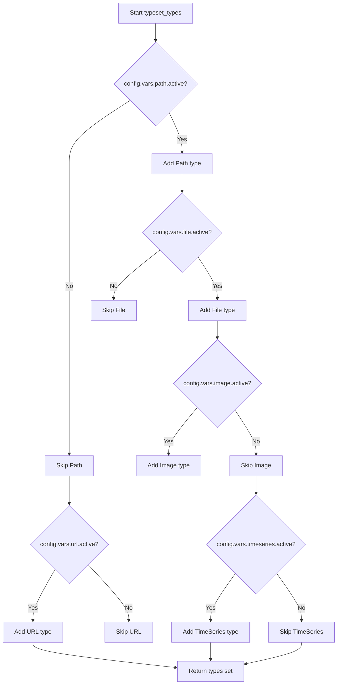
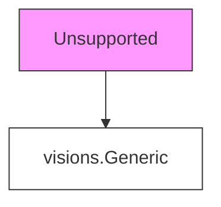
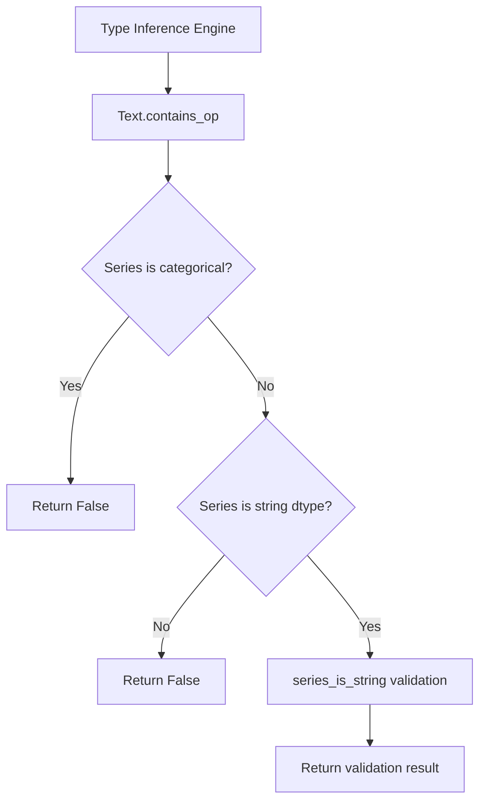
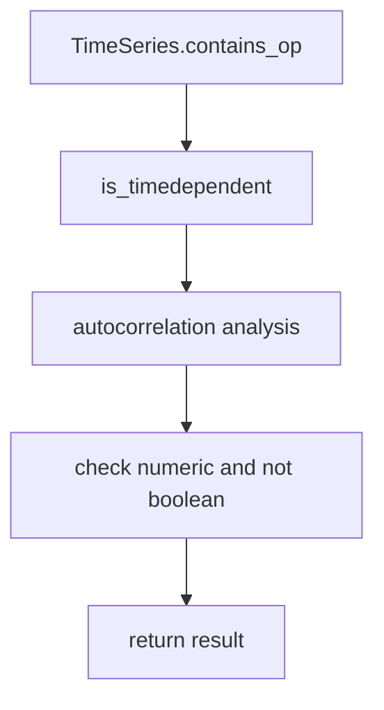

# `typeset.py`

## `src.ydata_profiling.model.typeset.series_handle_nulls` · *function*

## Summary:
Decorator that handles null values in pandas Series for type inference functions by removing NaN values before processing.

## Description:
This decorator standardizes null value handling for type inference functions by automatically dropping NaN values from input Series before type checking. It ensures that downstream type detection functions operate on clean data without null entries, while preserving the original function's behavior and metadata through functools.wraps. This is particularly important in type inference systems where null handling needs to be consistent across different type detection methods.

The decorator checks if the series contains null values and drops them before passing the data to the wrapped function. If the series becomes empty after dropping null values, it returns False to indicate that the type check should not proceed.

## Args:
    fn (Callable[..., bool]): The type inference function to be wrapped. This function should accept a pandas Series, a state dictionary, and optional arguments, and return a boolean indicating whether the series matches the type being checked.

## Returns:
    Callable[..., bool]: A decorated version of the input function that automatically handles null values in the input Series by dropping them before execution.

## Raises:
    None explicitly raised - delegates any exceptions from the wrapped function.

## Constraints:
    Preconditions:
    - Input series must be a valid pandas Series object
    - Function `fn` must accept at least two parameters: pd.Series and dict (state)
    - State dictionary must be mutable and support key assignment
    - Function `fn` must return a boolean value
    
    Postconditions:
    - If input series contains null values, they are removed before calling the wrapped function
    - If input series contains no null values, the series is passed unchanged to the wrapped function
    - If the series becomes empty after dropping null values, False is returned
    - The state dictionary is updated with a "hasnans" key if it doesn't exist

## Side Effects:
    None - This function only modifies the input data by removing null values and doesn't perform any I/O operations or mutate external state beyond updating the state dictionary.

## Control Flow:
```mermaid
flowchart TD
    A[series_handle_nulls decorator] --> B{hasnans in state?}
    B -->|No| C[state["hasnans"] = series.hasnans]
    B -->|Yes| C
    C --> D{state["hasnans"]?}
    D -->|Yes| E[series.dropna()]
    D -->|No| E
    E --> F{series.empty?}
    F -->|Yes| G[return False]
    F -->|No| H[fn(series, state, ...)]
    G --> I[Return False]
    H --> I[Return fn result]
```

## Examples:
```python
# Example usage in type inference
@series_handle_nulls
def is_numeric_type(series: pd.Series, state: dict) -> bool:
    # Type checking logic here
    return True

# When called with a series containing nulls:
# series = pd.Series([1, 2, None, 4])
# The decorator will drop the null value before calling is_numeric_type

# When called with an empty series after null removal:
# series = pd.Series([None, None])
# The decorator will return False without calling is_numeric_type
```

## `src.ydata_profiling.model.typeset.typeset_types` · *function*

## Summary:
Creates and returns a set of VisionsBaseType classes representing data types for profiling, configured based on the provided settings.

## Description:
This function dynamically constructs a collection of VisionsBaseType subclasses that define data type detection and classification logic for the profiling system. Each type class implements `get_relations()` to specify type relationships and `contains_op()` to determine if a pandas Series matches that type. The function conditionally includes specialized types (URL, Path, File, Image, TimeSeries) based on configuration flags, allowing for flexible type detection tailored to specific use cases.

## Args:
    config (Settings): Configuration object containing flags that control which specialized types are included in the returned set.

## Returns:
    Set[visions.VisionsBaseType]: A set of VisionsBaseType classes that define supported data types for profiling, including base types and optionally specialized types based on configuration.

## Raises:
    None explicitly raised

## Constraints:
    Preconditions:
    - The config parameter must be a valid Settings object with properly initialized variables
    - All referenced configuration variables (vars.path.active, vars.file.active, etc.) must be accessible
    
    Postconditions:
    - Always returns the base types: Unsupported, Boolean, Numeric, Text, Categorical, DateTime
    - May include additional types: Path, File, Image, URL, TimeSeries based on config flags

## Side Effects:
    None

## Control Flow:


## Examples:
```python
# Basic usage with default configuration
from ydata_profiling.config import Settings
config = Settings()
typeset = typeset_types(config)
# Returns base types: {Unsupported, Boolean, Numeric, Text, Categorical, DateTime}

# Usage with activated specialized types
config.vars.path.active = True
config.vars.url.active = True
typeset = typeset_types(config)
# Returns: {Unsupported, Boolean, Numeric, Text, Categorical, DateTime, Path, URL}
```

## `src.ydata_profiling.model.typeset.Unsupported` · *class*

## Summary:
Placeholder class for unsupported data types in the type inference system.

## Description:
The Unsupported class serves as a base implementation for data types that cannot be classified by the profiling system's type inference mechanisms. As a subclass of visions.Generic, it provides the foundational interface required for type system integration while acting as a catch-all for unrecognized data patterns. This class ensures that the type inference system can handle any data without throwing errors, maintaining system robustness even when encountering unexpected data formats.

## State:
- Inherits from visions.Generic, implementing the standard type interface
- No custom instance variables or methods defined
- Minimal implementation that delegates to parent class functionality
- Acts as a terminal node in the type hierarchy for unrecognized data

## Lifecycle:
- Creation: Instantiated automatically by the type inference system when no other type class matches the data characteristics
- Usage: Called during type classification when data doesn't conform to known patterns (numeric, string, boolean, datetime, etc.)
- Destruction: Managed by Python's garbage collection when no longer referenced

## Method Map:


## Raises:
- No explicit exceptions defined in the class implementation
- Any exceptions would originate from the parent visions.Generic class or type inference process

## Example:
```python
# This class is used internally by the profiling system
# when data cannot be categorized into standard types
# Example scenario: Data with unusual format that doesn't match 
# numeric/string/boolean/datetime patterns
```

## `src.ydata_profiling.model.typeset.Numeric` · *class*

## Summary:
Numeric represents a numeric data type in the ydata-profiling type system, used to identify and validate numeric data within pandas Series.

## Description:
The Numeric class is part of the ydata-profiling type system that extends the visions library for data type detection. It serves as a type classifier that identifies numeric data in pandas Series and defines how it relates to other data types in the system. This class is used during automated data profiling to categorize columns based on their underlying data types.

The class implements two core methods required by the visions framework:
1. `get_relations()` - Defines how this numeric type relates to other types in the system
2. `contains_op()` - Determines whether a given pandas Series contains numeric data

## State:
- Inherits from visions.VisionsBaseType, providing type detection capabilities
- Contains no instance attributes beyond those inherited from the parent class
- The `get_relations()` method defines type relationships with other types in the system:
  - IdentityRelation with Unsupported type
  - InferenceRelation with Text type for converting strings to numeric values
- The `contains_op()` method evaluates whether a Series contains numeric data using pandas type checking utilities

## Lifecycle:
- Creation: Instantiated automatically by the visions type system when building type hierarchies
- Usage: Called internally by the type inference engine during data profiling to validate if a Series matches the numeric type
- Destruction: Managed by Python's garbage collection; no explicit cleanup required

## Method Map:
```mermaid
flowchart TD
    A[Numeric.get_relations()] --> B[Returns TypeRelations]
    A --> C[IdentityRelation(Unsupported)]
    A --> D[InferenceRelation(Text)]
    B --> E[Defines identity relationship]
    C --> F[Defines inference relationship]
    D --> G[Uses string_is_numeric relationship]
    D --> H[Uses string_to_numeric transformer]
    
    subgraph contains_op
        I[Numeric.contains_op(series, state)] --> J[pdt.is_numeric_dtype(series)]
        I --> K[not pdt.is_bool_dtype(series)]
        J --> L[Returns boolean result]
        K --> L
    end
```

## Raises:
- No explicit exceptions raised by the constructor
- Exceptions may be raised by underlying type checking functions during runtime evaluation
- The `@series_handle_nulls` decorator may affect behavior when dealing with null values

## Example:
```python
# The Numeric class is typically used internally by the profiling system
# Example of how it might be invoked during type inference:
# numeric_type = Numeric()
# is_numeric = numeric_type.contains_op(series, {})

# Typical usage in type inference context:
# During profiling, the system will call contains_op to determine
# if a column should be classified as numeric type
```

### `src.ydata_profiling.model.typeset.Numeric.contains_op` · *method*

## Summary:
Determines whether a pandas Series contains numeric data while excluding boolean data types.

## Description:
This method performs a type check on a pandas Series to identify if it contains numeric data. It specifically excludes boolean data types from being classified as numeric, which is important for proper data type inference in profiling systems. The method is typically used during type inference operations to distinguish between numeric and boolean data.

## Args:
    series (pd.Series): A pandas Series to check for numeric data type
    state (dict): A dictionary containing processing state information (unused in current implementation)

## Returns:
    bool: True if the series has a numeric dtype and is not boolean dtype, False otherwise

## Raises:
    None explicitly raised

## State Changes:
    Attributes READ: None
    Attributes WRITTEN: None

## Constraints:
    Preconditions: 
    - The series parameter must be a valid pandas Series object
    - The state parameter must be a dictionary (though currently unused)
    
    Postconditions:
    - Returns a boolean value indicating the numeric nature of the series
    - Does not modify the input series or state

## Side Effects:
    None

## `src.ydata_profiling.model.typeset.Text` · *class*

## Summary:
Text is a type classification class that identifies string data types in pandas Series for automated data profiling.

## Description:
The Text class implements a type detection mechanism within the ydata-profiling framework's type inference system. It specifically identifies string-based data types by validating that a pandas Series contains string data while excluding categorical and non-string dtypes. This class is part of the visions type system integration and works alongside other type classifiers to automatically determine data characteristics during profiling.

The class is designed to be used internally by the type inference engine and is typically instantiated automatically when the profiling system encounters string-like data that needs classification.

## State:
- Inherits all state from visions.VisionsBaseType parent class
- No additional instance attributes defined
- The contains_op method operates on series data and state dictionary parameters
- The get_relations method defines type relationships with the Unsupported type

## Lifecycle:
- Creation: Automatically instantiated by the type inference system when needed
- Usage: Invoked by the type detection framework during data profiling to validate string data types
- Destruction: Managed by Python's garbage collection after use

## Method Map:


## Raises:
- No explicit exceptions raised by __init__
- Exceptions may propagate from underlying validation functions (series_is_string, type checking operations)
- Potential TypeError or ValueError from pandas operations or type conversions

## Example:
```python
# Used internally by the profiling system
# Typical usage pattern:
# result = Text.contains_op(series, state_dict)
# Where series is a pandas Series and state_dict contains processing metadata
```

### `src.ydata_profiling.model.typeset.Text.get_relations` · *method*

## Summary:
Returns the type relations for the Text type, specifically identifying it as an identity relation with the Unsupported type.

## Description:
This static method defines the type relationship for the Text class within the ydata-profiling typeset system. It establishes that Text types are identity-related to the Unsupported type, indicating that Text types cannot be converted to or from other types in the system. This method is part of the type inference system that determines how different data types relate to each other in the profiling process.

## Args:
    None

## Returns:
    Sequence[TypeRelation]: A sequence containing a single IdentityRelation that maps the Text type to the Unsupported type.

## Raises:
    None

## State Changes:
    Attributes READ: None
    Attributes WRITTEN: None

## Constraints:
    Preconditions: None
    Postconditions: The returned sequence always contains exactly one IdentityRelation with Unsupported as the target type.

## Side Effects:
    None

### `src.ydata_profiling.model.typeset.Text.contains_op` · *method*

## Summary:
Determines whether a pandas Series should be treated as containing string data based on dtype and content validation.

## Description:
This method evaluates if a pandas Series meets the criteria for being classified as string data. It performs a three-part check: first ensuring the series is not categorical, then confirming it has a string dtype, and finally validating that the series content conforms to string expectations using the series_is_string helper function. This method is typically used in type inference systems to determine appropriate data classification.

## Args:
    series (pd.Series): The pandas Series to evaluate for string data characteristics
    state (dict): A state dictionary containing metadata or configuration for type inference

## Returns:
    bool: True if the series should be treated as string data, False otherwise

## Raises:
    None explicitly raised - though underlying operations may raise TypeError or ValueError when processing the series

## State Changes:
    Attributes READ: None
    Attributes WRITTEN: None

## Constraints:
    Preconditions: 
    - series must be a valid pandas Series object
    - state must be a dictionary (can be empty)
    
    Postconditions:
    - Returns a boolean value indicating string data classification
    - Does not modify the input series or state

## Side Effects:
    None

## `src.ydata_profiling.model.typeset.DateTime` · *class*

## Summary:
DateTime represents a datetime data type in the ydata-profiling type inference system, enabling detection and conversion of datetime values from various formats.

## Description:
The DateTime class is a specialized type implementation within the visions type inference framework that identifies and validates datetime data. It serves as a core component in the data profiling pipeline by detecting datetime values in pandas Series and supporting conversions from string representations to proper datetime objects. This class is particularly important for automated data type inference in datasets where datetime information might be stored in various formats, including pandas datetime64 dtypes, Python datetime objects, or string representations.

## State:
- Inherits from visions.VisionsBaseType, providing standard type inference capabilities
- Contains no instance attributes beyond those inherited from the parent class
- The contains_op method operates on pandas Series and a state dictionary for tracking processing information
- Uses pandas.api.types (pdt) for datetime dtype checking

## Lifecycle:
- Creation: Instantiated automatically by the visions type inference system when type detection is performed
- Usage: Called internally by the type inference engine during data profiling to detect datetime values
- Destruction: Managed by Python's garbage collection; no explicit cleanup required

## Method Map:
```mermaid
flowchart TD
    A[get_relations] --> B[Returns TypeRelations]
    A --> C[IdentityRelation(Unsupported)]
    A --> D[InferenceRelation(Text)]
    D --> E[string_is_datetime relationship]
    D --> F[string_to_datetime transformer]
    
    G[contains_op] --> H[pdt.is_datetime64_any_dtype check]
    G --> I[Series type checking for datetime objects]
    G --> J[Returns boolean indicating datetime presence]
```

## Raises:
- No explicit exceptions raised by the DateTime class itself
- Exceptions may occur during type conversion operations in underlying functions (string_to_datetime, etc.)

## Example:
```python
import pandas as pd
from ydata_profiling.model.typeset import DateTime

# Create a datetime series
series = pd.Series(['2023-01-01', '2023-02-01', '2023-03-01'])
state = {}

# Check if series contains datetime data
result = DateTime.contains_op(series, state)
print(result)  # True

# Get type relations for datetime
relations = DateTime.get_relations()
print(relations)  # List of TypeRelation objects
```

### `src.ydata_profiling.model.typeset.DateTime.get_relations` · *method*

## Summary:
Defines the type relationships for DateTime objects, specifying how DateTime can be identified and converted from other types.

## Description:
Returns a sequence of type relations that describe how the DateTime type interacts with other types in the type system. This method is crucial for type inference and identification within the profiling framework. The returned relations enable the system to recognize DateTime instances and convert them from textual representations.

## Returns:
    Sequence[TypeRelation]: A list containing two type relations:
        1. IdentityRelation(Unsupported) - Indicates that DateTime is considered identical to the Unsupported type
        2. InferenceRelation(Text) - Specifies that DateTime can be inferred from Text type using string_is_datetime and string_to_datetime transformers

## State Changes:
    Attributes READ: None
    Attributes WRITTEN: None

## Constraints:
    Preconditions: None
    Postconditions: The returned sequence always contains exactly two TypeRelation objects in the specified order

## Side Effects:
    None

### `src.ydata_profiling.model.typeset.DateTime.contains_op` · *method*

## Summary:
Determines whether a pandas Series contains datetime data by checking both pandas datetime dtypes and builtin Python datetime types.

## Description:
This static method implements the contains operation for the DateTime type in the ydata-profiling typeset system. It evaluates whether a given pandas Series contains datetime-compatible data by first checking for native pandas datetime64 dtypes using `pdt.is_datetime64_any_dtype()`, and if that fails, by examining the types of non-null values in the series to detect Python datetime.date and datetime objects.

The method is part of the multimethod dispatch system used in the type inference framework to identify datetime data types in datasets for profiling purposes. It is decorated with `@series_not_empty` and `@series_handle_nulls` which handle edge cases around empty series and null values before the main validation logic executes. The `@multimethod` decorator indicates this method participates in a polymorphic dispatch system for type checking.

## Args:
    series (pd.Series): The pandas Series to evaluate for datetime content
    state (dict): A dictionary containing metadata about the series, including null value status

## Returns:
    bool: True if the series contains datetime data (either pandas datetime64 dtype or builtin datetime objects), False otherwise

## Raises:
    None explicitly raised - though underlying pandas operations may raise exceptions for invalid inputs

## State Changes:
    Attributes READ: None - this method only reads from the input parameters
    Attributes WRITTEN: None - this method is stateless and doesn't modify any object attributes

## Constraints:
    Preconditions:
    - The series parameter must be a valid pandas Series object
    - The state parameter must be a dictionary (can be empty)
    
    Postconditions:
    - Returns a boolean value indicating whether the series contains datetime data
    - The method handles both native pandas datetime dtypes and Python builtin datetime objects

## Side Effects:
    None - This method is pure and doesn't perform any I/O operations or mutate external state

## `src.ydata_profiling.model.typeset.Categorical` · *class*

## Summary
Represents a categorical data type in the ydata-profiling type inference system, enabling identification and conversion of categorical data from numeric and text types.

## Description
The `Categorical` class is a specialized type implementation within the ydata-profiling framework that extends `visions.VisionsBaseType`. It defines how categorical data is recognized and handled during automated type inference processes. This class enables the system to identify when numeric or text data should be treated as categorical based on configurable thresholds.

The class provides two key methods:
1. `get_relations()` - Defines type relationships that allow categorical inference from other data types
2. `contains_op()` - Validates whether a pandas Series qualifies as categorical data

This class is part of a larger type system that helps ydata-profiling automatically detect and categorize data types in datasets, making it easier to generate meaningful statistical summaries and visualizations.

## State
The class is stateless and operates purely on input parameters. It does not maintain any instance attributes.

## Lifecycle
**Creation**: The class is instantiated automatically by the type inference system when needed. It does not require explicit instantiation by users.

**Usage**: The class methods are invoked internally by the type inference engine during data profiling. The `get_relations()` method is called once during initialization to set up type relationships, while `contains_op()` is called repeatedly during type checking operations.

**Destruction**: No explicit cleanup is required as the class is stateless and designed to be used as a static type definition.

## Method Map
```mermaid
flowchart TD
    A[Categorical.get_relations()] --> B[Type inference setup]
    A --> C[Defines relationships with Unsupported, Numeric, Text]
    B --> D[Called once during system initialization]
    
    E[Categorical.contains_op()] --> F[Series validation]
    E --> G[Checks categorical dtype and excludes booleans]
    F --> H[Used during type checking operations]
    
    C --> I[Inference relationships configured]
    I --> J[Enables numeric→categorical conversion]
    I --> K[Enables text→categorical conversion]
```

## Raises
The class itself does not raise exceptions directly. However, underlying pandas operations in `contains_op()` may raise exceptions for invalid inputs, and the `get_relations()` method depends on a globally available `config` object with proper threshold settings.

## Example
```python
# This class is used internally by the profiling system
# Example of how it would be used in type inference:

# During type inference setup:
# relations = Categorical.get_relations()

# During type checking:
# is_categorical = Categorical.contains_op(series, state_dict)
```

### `src.ydata_profiling.model.typeset.Categorical.get_relations` · *method*

## Summary
Defines type relationships that enable categorical type inference from numeric and text data types.

## Description
This static method establishes the type inference relationships for the Categorical type within the ydata-profiling framework. It specifies how categorical values can be identified and converted from other data types during automated type detection. The method returns three TypeRelation objects that define:
1. An identity relationship with Unsupported types (allowing unsupported data to be treated as categorical)
2. An inference relationship with Numeric types (enabling numeric data to be inferred as categorical when it meets cardinality thresholds)
3. An inference relationship with Text types (enabling text data to be inferred as categorical when it meets cardinality and uniqueness thresholds)

This method is called during the type inference process to configure how the Categorical type recognizes and transforms data from other types. It leverages helper functions `numeric_is_category` and `string_is_category` to determine when numeric and text series should be treated as categorical, respectively. The method expects a global `config` object to be available in its scope containing threshold configurations.

## Args
    None

## Returns
    Sequence[TypeRelation]: A sequence of three TypeRelation objects:
        - IdentityRelation(Unsupported): Allows unsupported types to be treated as categorical
        - InferenceRelation(Numeric, ...): Enables numeric data to be inferred as categorical using numeric_is_category logic
        - InferenceRelation(Text, ...): Enables text data to be inferred as categorical using string_is_category logic

## Raises
    None explicitly raised

## State Changes
    Attributes READ: config.vars.num.low_categorical_threshold, config.vars.cat.percentage_cat_threshold, config.vars.cat.cardinality_threshold
    Attributes WRITTEN: None

## Constraints
    Preconditions:
        - The config object must be properly initialized with required threshold configurations
        - The numeric_is_category and string_is_category helper functions must be available
        - The to_category transformer function must be available
        - A global config object must be accessible in the method's scope
    Postconditions:
        - Returns a sequence of exactly three TypeRelation objects
        - The returned relations properly define categorical type inference behavior

## Side Effects
    None

### `src.ydata_profiling.model.typeset.Categorical.contains_op` · *method*

## Summary:
Determines whether a pandas Series has a valid categorical data type that can be processed by the categorical type system.

## Description:
This static method serves as a type validation operation for the Categorical class. It evaluates whether a given pandas Series meets the criteria for being classified as a categorical type, specifically excluding boolean data types. This method is part of the multimethod dispatch system used in the typeset inference framework to determine type compatibility.

The method is decorated with `@series_not_empty` and `@series_handle_nulls` which handle edge cases around empty series and null values before the main validation logic executes. The `@multimethod` decorator indicates this method participates in a polymorphic dispatch system for type checking.

## Args:
    series (pd.Series): The pandas Series to validate for categorical type compatibility
    state (dict): A dictionary containing processing state information used by the type inference system

## Returns:
    bool: True if the series has a categorical dtype and is not a boolean dtype, False otherwise

## Raises:
    None explicitly raised - however, underlying pandas operations may raise exceptions for invalid inputs

## State Changes:
    Attributes READ: None - this method only reads input parameters
    Attributes WRITTEN: None - this method is static and doesn't modify instance state

## Constraints:
    Preconditions:
        - The series parameter must be a valid pandas Series object
        - The state parameter must be a dictionary (or None)
    Postconditions:
        - Returns a boolean value indicating type compatibility
        - The returned value is determined solely by the dtype characteristics of the series

## Side Effects:
    None - this method performs only local computations and does not cause I/O operations or external service calls

## `src.ydata_profiling.model.typeset.Boolean` · *class*

## Summary:
Represents the Boolean type for data profiling, implementing type detection and conversion logic for boolean values.

## Description:
The Boolean class is a type specification within the ydata-profiling framework that identifies and validates boolean data types. It extends visions.VisionsBaseType to integrate with the type inference system and provides mechanisms for detecting boolean values in pandas Series, including conversion from string representations.

This class serves as a specialized type handler that enables the profiling system to recognize boolean data regardless of its original representation (boolean literals, string representations like "true"/"false", etc.) and provides appropriate transformation capabilities. It is used internally by the type inference system during data profiling operations.

## State:
- Inherits all state from visions.VisionsBaseType parent class
- No additional instance attributes defined
- Configuration dependency on config.vars.bool.mappings for string-to-boolean conversion
- Uses pandas type checking utilities (pdt.is_object_dtype, pdt.is_bool_dtype)

## Lifecycle:
- Creation: Instantiated automatically by the visions type system when type inference is performed
- Usage: Called internally by the type inference engine during data profiling for type validation and conversion
- Destruction: Managed by Python garbage collection

## Method Map:
```mermaid
flowchart TD
    A[get_relations] --> B[Returns TypeRelations]
    A --> C[IdentityRelation(Unsupported)]
    A --> D[InferenceRelation(Text)]
    D --> E[string_is_bool]
    D --> F[string_to_bool]
    D --> G[to_bool]
    B --> H[TypeRelation]
    C --> H
    D --> H
    contains_op --> I[pdt.is_object_dtype]
    contains_op --> J[series.isin({True, False})]
    contains_op --> K[pdt.is_bool_dtype]
```

## Raises:
- No explicit exceptions raised by the Boolean class itself
- Exceptions may be raised by underlying functions (string_is_bool, string_to_bool, to_bool) during type conversion operations
- May raise exceptions from pandas type checking operations

## Example:
```python
# The Boolean class is typically used internally by the profiling system
# Example of how it might be invoked during type inference:
# boolean_type = Boolean()
# is_boolean = boolean_type.contains_op(series, state_dict)
# relations = boolean_type.get_relations()
```

### `src.ydata_profiling.model.typeset.Boolean.get_relations` · *method*

## Summary:
Returns type relationship definitions that enable boolean type inference from unsupported and text data types.

## Description:
This static method defines the type inference relationships for the Boolean type within the ydata-profiling framework. It specifies how boolean values can be identified and converted from other data types during automated type detection. The method returns two TypeRelation objects that establish:
1. An identity relationship with Unsupported types (allowing unsupported data to be treated as boolean)
2. An inference relationship with Text types (enabling text representations to be converted to boolean values using configured mappings)

This method is called during the type inference process to configure how the Boolean type recognizes and transforms data from other types.

## Args:
    None

## Returns:
    Sequence[TypeRelation]: A sequence of two TypeRelation objects:
        - IdentityRelation(Unsupported): Allows unsupported types to be treated as boolean
        - InferenceRelation(Text, ...): Enables text data to be inferred as boolean using configured mappings

## Raises:
    None explicitly raised

## State Changes:
    Attributes READ: config.vars.bool.mappings
    Attributes WRITTEN: None

## Constraints:
    Preconditions:
        - The config object must be properly initialized with a vars.bool.mappings attribute
        - The mappings dictionary must contain appropriate key-value pairs for boolean conversion
    Postconditions:
        - Returns a sequence of exactly two TypeRelation objects
        - The returned relations properly define boolean type inference behavior

## Side Effects:
    None

### `src.ydata_profiling.model.typeset.Boolean.contains_op` · *method*

## Summary:
Determines whether a pandas Series contains boolean values by checking data type and value consistency.

## Description:
This static method implements the contains operation for the Boolean type in the ydata-profiling typeset system. It evaluates whether a given pandas Series contains exclusively boolean values (True/False). The method handles both object dtype series (where boolean values might be stored as strings or mixed types) and native boolean dtypes. It's part of the type inference system that identifies data types in datasets for profiling purposes.

The method is decorated with `@series_handle_nulls` which automatically removes null values from the series before processing, ensuring consistent behavior when dealing with missing data.

## Args:
    series (pd.Series): The pandas Series to evaluate for boolean content
    state (dict): A dictionary containing metadata about the series, including null value status

## Returns:
    bool: True if the series contains only boolean values, False otherwise

## Raises:
    None explicitly raised - though underlying pandas operations may raise exceptions that are caught

## State Changes:
    Attributes READ: None - this method only reads from the input parameters
    Attributes WRITTEN: None - this method is stateless and doesn't modify any object attributes

## Constraints:
    Preconditions:
    - The series parameter must be a valid pandas Series object
    - The state parameter must be a dictionary (can be empty)
    
    Postconditions:
    - Returns a boolean value indicating whether the series contains boolean data
    - The method handles both native boolean dtypes and object dtypes containing boolean values

## Side Effects:
    None - This method is pure and doesn't perform any I/O operations or mutate external state

## `src.ydata_profiling.model.typeset.URL` · *class*

## Summary:
URL is a type classification class that identifies URL data types in pandas Series for automated data profiling, treating URLs as a specialized form of text data.

## Description:
The URL class implements a type detection mechanism within the ydata-profiling framework's type inference system. It specifically identifies string data that conforms to URL format by validating that each element in a pandas Series contains both a scheme (like http, https) and network location (netloc). This class treats URLs as a subtype of Text, meaning all valid URLs are also valid text data, but not all text data is necessarily a URL.

The class is designed to be used internally by the type inference engine and is typically instantiated automatically when the profiling system encounters string-like data that needs URL validation. It integrates with the visions type system to provide accurate data type classification during automated profiling.

## State:
- Inherits all state from visions.VisionsBaseType parent class
- No additional instance attributes defined
- The contains_op method operates on series data and state dictionary parameters
- The get_relations method defines type relationships with the Text type

## Lifecycle:
- Creation: Automatically instantiated by the type inference system when needed
- Usage: Invoked by the type detection framework during data profiling to validate URL data types
- Destruction: Managed by Python's garbage collection after use

## Method Map:
```mermaid
flowchart TD
    A[Type Inference Engine] --> B[URL.contains_op]
    B --> C{Series has nulls?}
    C -->|Yes| D[Drop nulls using series_handle_nulls]
    C -->|No| D
    D --> E{Series parsing successful?}
    E -->|Yes| F[Validate URL components (scheme + netloc)]
    E -->|No| G[Return False]
    F --> H[Return boolean result]
```

## Raises:
- No explicit exceptions raised by __init__
- The contains_op method handles AttributeError internally by catching it and returning False when URL parsing fails
- Potential TypeError or ValueError from pandas operations or type conversions (propagated from underlying functions)

## Example:
```python
# Used internally by the profiling system
# Typical usage pattern:
# result = URL.contains_op(series, state_dict)
# Where series is a pandas Series and state_dict contains processing metadata

# Example of valid URL series:
# series = pd.Series(['https://www.example.com', 'http://api.service.org/path'])
# result = URL.contains_op(series, {})
# Returns True if all elements are valid URLs

# Example of invalid URL series:
# series = pd.Series(['not a url', 'http://valid.com', 'also not valid'])
# result = URL.contains_op(series, {})
# Returns False because first element is not a valid URL
```

### `src.ydata_profiling.model.typeset.URL.get_relations` · *method*

## Summary:
Returns the type relationship configuration that establishes URL type as identical to Text type in the profiling system.

## Description:
This static method defines the type relationship for the URL class within the ydata-profiling type system. It establishes that URL types are considered identical to Text types through an IdentityRelation, meaning values classified as URL can be treated interchangeably with Text values in type inference and analysis operations. This relationship is fundamental to how the profiling system handles URL data, allowing URL-type data to be processed using the same mechanisms as text data while maintaining its distinct identification.

The method is called during the type inference initialization process to configure how URL-type data should be recognized and processed within the profiling framework. This approach follows the established pattern of other type classes in the system, such as Path which also identifies as identical to Text.

## Args:
    None

## Returns:
    Sequence[TypeRelation]: A sequence containing a single IdentityRelation that maps the URL type to the Text type.

## Raises:
    None explicitly raised

## State Changes:
    Attributes READ: None
    Attributes WRITTEN: None

## Constraints:
    Preconditions:
        - The Text type must be properly defined and accessible in the current namespace
        - The IdentityRelation class must be available from visions.relations
    Postconditions:
        - Always returns a sequence containing exactly one IdentityRelation element
        - The returned relation properly establishes the URL ↔ Text identity relationship

## Side Effects:
    None

### `src.ydata_profiling.model.typeset.URL.contains_op` · *method*

## Summary:
Checks if all elements in a pandas Series appear to be valid URLs by parsing each element with urlparse and verifying presence of scheme and network location components.

## Description:
This static method serves as a type detection operation for the URL data type within the visions type system. It determines whether a given pandas Series contains exclusively URL-like strings by attempting to parse each element using urllib.parse.urlparse and verifying that each parsed URL has both a scheme (e.g., 'http', 'https') and a network location (netloc).

The method is designed to work within a type inference pipeline where it helps classify data as URL type. It's decorated with @multimethod and @series_handle_nulls, indicating it's part of a polymorphic dispatch system for handling different data types and null value scenarios.

## Args:
    series (pd.Series): A pandas Series containing string data to be checked for URL validity
    state (dict): A dictionary containing processing state information, likely used by the type inference system

## Returns:
    bool: True if all elements in the series are valid URLs (have both scheme and netloc), False otherwise

## Raises:
    None explicitly raised - handles AttributeError internally by returning False

## State Changes:
    Attributes READ: None - this method only reads input parameters
    Attributes WRITTEN: None - this method is stateless

## Constraints:
    Preconditions:
        - Input series should contain string-like data for meaningful URL validation
        - The series should not be empty for meaningful results (though empty series return True)
    Postconditions:
        - Returns boolean value indicating URL validity of entire series
        - Method is idempotent and has no side effects

## Side Effects:
    None - this method performs no I/O operations or external service calls

## `src.ydata_profiling.model.typeset.Path` · *class*

## Summary:
Represents a file path data type in the ydata-profiling type system, treating paths as equivalent to text types.

## Description:
The Path class is a specialized data type implementation within the ydata-profiling framework that identifies and validates absolute file paths. It serves as part of the type inference system that categorizes data based on its semantic meaning rather than just its raw representation. This class is designed to work with pandas Series containing path-like strings and determines whether all entries represent absolute paths.

The class follows the visions type system pattern where it inherits from VisionsBaseType and implements the required interface for type detection and validation. It's particularly useful in data profiling scenarios where identifying file path columns can enable specialized analysis and validation.

## State:
- Inherits all state from visions.VisionsBaseType parent class
- No additional instance attributes beyond those inherited
- The contains_op method operates on a pandas Series and state dictionary

## Lifecycle:
- Creation: Instantiated automatically by the type inference system when a column matches path characteristics
- Usage: Called internally by the type inference engine during data profiling to validate path data
- Destruction: Managed automatically by Python's garbage collection

## Method Map:
```mermaid
flowchart TD
    A[Path.get_relations] --> B[Returns IdentityRelation(Text)]
    A --> C[Path.contains_op]
    C --> D{series_handle_nulls}
    D --> E{os.path.isabs check}
    E --> F{All paths absolute?}
    F --> G[Return boolean result]
```

## Raises:
- No explicit exceptions raised by Path class itself
- Exceptions may occur during internal operations like os.path.isabs() or series operations, but are handled gracefully by decorators

## Example:
```python
# Typical usage would be internal to the profiling system
# When a column contains file paths, the system would identify it as Path type

# Example of what the contains_op method validates:
path_series = pd.Series(['/home/user/file.txt', '/var/log/app.log'])
# This would return True as both paths are absolute

relative_path_series = pd.Series(['./file.txt', '../config.yaml'])  
# This would return False as paths are relative
```

### `src.ydata_profiling.model.typeset.Path.get_relations` · *method*

## Summary:
Returns the type relations for the Path type, indicating it is identically typed as Text.

## Description:
This static method defines the type relationships for the Path type within the ydata-profiling type system. It establishes that Path is considered identical to Text type through an IdentityRelation, meaning values classified as Path can be treated interchangeably with Text values in type inference and analysis operations.

## Args:
    None

## Returns:
    Sequence[TypeRelation]: A sequence containing a single IdentityRelation that maps Path to Text type.

## Raises:
    None

## State Changes:
    Attributes READ: None
    Attributes WRITTEN: None

## Constraints:
    Preconditions: None
    Postconditions: The returned sequence always contains exactly one IdentityRelation mapping Path to Text.

## Side Effects:
    None

### `src.ydata_profiling.model.typeset.Path.contains_op` · *method*

## Summary:
Checks whether all elements in a pandas Series represent absolute file paths.

## Description:
Determines if every path in the provided pandas Series is an absolute path using `os.path.isabs()`. This method is part of the Path type validation system and is used during data type inference to identify columns containing absolute file paths.

## Args:
    series (pd.Series): A pandas Series containing path-like strings to validate.
    state (dict): A dictionary containing metadata about the series, including null value tracking.

## Returns:
    bool: True if all elements in the series are absolute paths, False otherwise. Returns False when a TypeError occurs during path validation (e.g., when non-string values are encountered).

## Raises:
    None explicitly raised - handles TypeError internally by returning False.

## State Changes:
    Attributes READ: None
    Attributes WRITTEN: None

## Constraints:
    Preconditions:
    - The series parameter must be a valid pandas Series object
    - The state parameter must be a dictionary (can be empty)
    
    Postconditions:
    - Returns a boolean value indicating whether all paths are absolute
    - Handles non-string values gracefully by catching TypeError

## Side Effects:
    None - This method performs no I/O operations or external service calls. It only operates on the input data and returns a computed boolean value.

## `src.ydata_profiling.model.typeset.File` · *class*

## Summary
Represents a file type in the data profiling system, implementing type checking operations for file paths.

## Description
The File class is a type representation within the ydata-profiling framework that identifies and validates file path data. It serves as part of the visions type system for data profiling, specifically designed to recognize data that represents file paths. The class implements the necessary methods to determine if a pandas Series contains valid file paths that exist on the filesystem.

This class is typically instantiated indirectly through the visions type inference system rather than directly by user code. It works alongside the Path class in the same module, with both representing the same conceptual type but with different validation criteria.

## State
- `None` - This is a static class with no instance state. All methods are static and operate purely on input parameters.

## Lifecycle
- Creation: Automatically instantiated by the visions type system during type inference processes
- Usage: Called internally by the profiling framework when determining column data types
- Destruction: No explicit cleanup required as it's a static class with no persistent state

## Method Map
```mermaid
flowchart TD
    A[File.get_relations] --> B[Returns IdentityRelation(Path)]
    A --> C[Called during type initialization]
    B --> D[Establishes File ↔ Path relationship]
    C --> E[Type inference process]
    F[File.contains_op] --> G[Checks os.path.exists() for all paths]
    F --> H[Uses @series_handle_nulls decorator]
    F --> I[Applied during type validation]
```

## Raises
- No explicit exceptions raised by the File class itself
- Exceptions may occur internally from `os.path.exists()` or `all()` operations when processing invalid data types

## Example
```python
# This class is typically used internally by the profiling system
# Example of how it would be invoked during type inference:
# series = pd.Series(['/path/to/file1.txt', '/path/to/file2.txt'])
# result = File.contains_op(series, {})
# Returns True if both files exist, False otherwise
```

### `src.ydata_profiling.model.typeset.File.get_relations` · *method*

## Summary:
Returns the type relations configuration for file type handling in data profiling.

## Description:
This method provides the type relationship definitions used by the profiling system to handle file types. It establishes an identity relation that maps the file type to itself, enabling proper type inference and validation during data analysis. This method is called during the initialization of the type set processing pipeline to configure how file types should be recognized and processed.

## Args:
    None

## Returns:
    Sequence[TypeRelation]: A sequence containing a single IdentityRelation that defines the relationship for the file type.

## Raises:
    None explicitly raised

## State Changes:
    Attributes READ: None
    Attributes WRITTEN: None

## Constraints:
    Preconditions: None
    Postconditions: Always returns a sequence containing exactly one IdentityRelation element

## Side Effects:
    None

### `src.ydata_profiling.model.typeset.File.contains_op` · *method*

## Summary:
Checks whether all file paths in a pandas Series exist on the filesystem.

## Description:
Determines if every string path in the input Series corresponds to an existing file or directory on the filesystem. This method is part of the File type inference system and is used to validate that a series of strings represents actual file paths.

The method is decorated with `series_handle_nulls` which automatically removes null values from the input series before processing, ensuring robust handling of missing data.

## Args:
    series (pd.Series): A pandas Series containing string representations of file paths to check.
    state (dict): A dictionary containing processing state information, including null value tracking.

## Returns:
    bool: True if all paths in the series exist on the filesystem, False otherwise. Returns False if the series becomes empty after null value removal.

## Raises:
    None explicitly raised - the underlying `os.path.exists()` may raise OSError for invalid paths, but this is handled by the decorator and normal Python behavior.

## State Changes:
    Attributes READ: None - this method only reads from the input parameters
    Attributes WRITTEN: None - this method does not modify any instance attributes

## Constraints:
    Preconditions:
    - Input series must be a valid pandas Series containing string values representing file paths
    - The state dictionary should be properly initialized with null value tracking information
    
    Postconditions:
    - Returns a boolean value indicating existence of all paths
    - If the series contains null values, they are automatically filtered out before checking

## Side Effects:
    I/O operations: Makes filesystem calls via `os.path.exists()` for each path in the series
    External service calls: None - only uses standard OS filesystem operations
    Mutations to objects outside self: None - operates purely on input parameters

## `src.ydata_profiling.model.typeset.Image` · *class*

## Summary
Represents an image data type in the ydata-profiling framework, identifying and validating image file paths or data.

## Description
The Image class is a type representation within the ydata-profiling framework that identifies and validates image data. It serves as part of the visions type system for data profiling, specifically designed to recognize data that represents image files. This class is typically instantiated indirectly through the visions type inference system rather than directly by user code.

The class establishes an identity relationship with the File type, indicating that image data is a specialized form of file data. It implements the necessary operations to determine if a pandas Series contains valid image file paths or data by checking each element with the imghdr.what() function.

## State
- Inherits all state from visions.VisionsBaseType parent class
- No additional instance attributes defined in this class

## Lifecycle
- Creation: Automatically instantiated by the visions type system during type inference processes when image data is detected
- Usage: Called internally by the profiling framework when determining column data types and validating image data
- Destruction: No explicit cleanup required as it's a static class with no persistent state

## Method Map
```mermaid
flowchart TD
    A[Image.get_relations] --> B[Returns IdentityRelation(File)]
    A --> C[Called during type initialization]
    B --> D[Establishes Image ↔ File relationship]
    C --> E[Type inference process]
    F[Image.contains_op] --> G[Checks imghdr.what() for all elements]
    F --> H[Uses @series_handle_nulls decorator]
    F --> I[Applied during type validation]
```

## Raises
- No explicit exceptions raised by the Image class itself
- Exceptions may occur internally from imghdr.what() or other operations when processing invalid data types

## Example
```python
# This class is typically used internally by the profiling system
# Example of how it would be invoked during type inference:
# series = pd.Series(['/path/to/image1.jpg', '/path/to/image2.png'])
# result = Image.contains_op(series, {})
# Returns True if both files are valid images, False otherwise
```

### `src.ydata_profiling.model.typeset.Image.get_relations` · *method*

## Summary:
Defines the type relationship between Image and File types in the profiling system.

## Description:
This static method returns the type relationship configuration that establishes how the Image type relates to other types during automated type inference. Specifically, it defines that the Image type is identical to the File type through an IdentityRelation, which is essential for proper type recognition in the ydata-profiling framework.

The method is called during the initialization of type inference processes to configure how Image-type data should be handled. This relationship allows the profiling system to treat image-related file paths as equivalent to general file paths during type detection and validation.

## Args:
    None

## Returns:
    Sequence[TypeRelation]: A sequence containing exactly one TypeRelation object:
        - IdentityRelation(File): Indicates that Image type is identical to File type in the type system

## Raises:
    None explicitly raised

## State Changes:
    Attributes READ: None
    Attributes WRITTEN: None

## Constraints:
    Preconditions:
        - The File class must be properly defined and accessible in the module scope
        - The IdentityRelation class must be available from visions.relations
    Postconditions:
        - Always returns a sequence containing exactly one IdentityRelation element
        - The returned relation properly establishes the Image ↔ File identity relationship

## Side Effects:
    None

### `src.ydata_profiling.model.typeset.Image.contains_op` · *method*

## Summary:
Checks whether all elements in a pandas Series represent valid image files.

## Description:
Determines if every element in the input Series contains valid image file data by using the imghdr.what() function. This method is part of the Image type detection system and is used to validate that a series contains only image file paths or data.

## Args:
    series (pd.Series): A pandas Series containing potential image file paths or data
    state (dict): A dictionary containing state information, including null value tracking

## Returns:
    bool: True if all elements in the series represent valid image files, False otherwise

## Raises:
    None explicitly raised - the underlying imghdr.what() may raise exceptions for invalid inputs, but these are handled by the decorator

## State Changes:
    Attributes READ: None
    Attributes WRITTEN: None

## Constraints:
    Preconditions:
    - Input series must be a valid pandas Series object
    - Each element in the series should be a valid file path or file-like object that imghdr.can identify as an image
    - The state dictionary should be properly initialized with null tracking information
    
    Postconditions:
    - Returns False if any element fails image validation
    - Returns True only if all elements pass image validation
    - The method handles null values through the @series_handle_nulls decorator

## Side Effects:
    None - This function performs no I/O operations or external service calls

## `src.ydata_profiling.model.typeset.TimeSeries` · *class*

## Summary
TimeSeries type detector that identifies numeric pandas Series with temporal dependencies using autocorrelation analysis.

## Description
The TimeSeries class is a type inference component that detects whether a pandas Series represents time series data. It extends visions.VisionsBaseType and implements the necessary methods to integrate with the type inference system. This class specifically identifies numeric data that exhibits temporal dependencies through autocorrelation analysis, making it suitable for time series analysis workflows.

The class is designed to be used within the ydata-profiling type inference framework where it helps categorize data columns as time series when appropriate. It's particularly useful for identifying numeric sequences that show temporal patterns or dependencies over time.

## State
- Inherits from visions.VisionsBaseType
- Has no instance attributes beyond those inherited from the parent class
- The `get_relations()` method establishes an identity relationship with Numeric type
- Uses configuration from `config.vars.timeseries` for autocorrelation thresholds and lags

## Lifecycle
Creation: Instantiated automatically by the visions type inference system when building type relationships. No direct instantiation is expected by users.

Usage: Called internally by the type inference engine when determining column data types. The contains_op method is invoked with a pandas Series and state dictionary to make type decisions.

Destruction: Managed automatically by Python's garbage collection; no explicit cleanup required.

## Method Map


## Raises
- RuntimeWarning: May be raised during autocorrelation computation when dealing with insufficient data or edge cases, though these are suppressed by the decorator.

## Example
```python
# This class is used internally by the type inference system
# Typical usage scenario:
# When profiling a DataFrame with time series data, this class
# will be invoked to determine if a numeric column represents time series

# The detection logic checks:
# 1. Series is numeric (but not boolean)
# 2. Series shows temporal dependencies via autocorrelation analysis
#    - Uses config.vars.timeseries.autocorrelation threshold
#    - Tests multiple lags defined in config.vars.timeseries.lags
```

### `src.ydata_profiling.model.typeset.TimeSeries.get_relations` · *method*

## Summary:
Returns the type relations for the TimeSeries type, specifically identifying it as an identity relation with the Numeric type.

## Description:
This static method defines the type relationship for the TimeSeries class, indicating that TimeSeries values are fundamentally equivalent to Numeric values in the type system. This method is part of the type inference mechanism that determines how data should be classified and processed within the profiling framework.

The method is called during type resolution operations to establish the inheritance or equivalence relationships for TimeSeries data types.

## Args:
    None

## Returns:
    Sequence[TypeRelation]: A sequence containing a single IdentityRelation that establishes the TimeSeries type as equivalent to Numeric type.

## Raises:
    None explicitly raised

## State Changes:
    Attributes READ: None
    Attributes WRITTEN: None

## Constraints:
    Preconditions: The method assumes that the Numeric type is properly defined and available in the current namespace.
    Postconditions: The returned sequence always contains exactly one IdentityRelation(Numeric) object.

## Side Effects:
    None

### `src.ydata_profiling.model.typeset.TimeSeries.contains_op` · *method*

## Summary:
Determines whether a pandas Series contains time series data by checking if it's numeric and exhibits time-dependent patterns through autocorrelation analysis.

## Description:
This static method evaluates whether a given pandas Series represents time series data. It performs two key checks: first, it verifies that the series contains numeric data (excluding boolean data); second, it analyzes the series for temporal dependencies using autocorrelation at various lags. The method is used during type inference to identify time series patterns in data.

The method specifically examines autocorrelation values at multiple lags against a configured threshold to detect temporal dependencies that characterize time series data.

## Args:
    series (pd.Series): The pandas Series to evaluate for time series characteristics
    state (dict): A dictionary containing processing state information (not directly used in current implementation)

## Returns:
    bool: True if the series is numeric and exhibits time-dependent patterns with autocorrelation exceeding the threshold, False otherwise

## Raises:
    None explicitly raised - though underlying pandas operations may raise exceptions such as ValueError or RuntimeError during autocorrelation calculation

## State Changes:
    Attributes READ: config.vars.timeseries.autocorrelation, config.vars.timeseries.lags
    Attributes WRITTEN: None

## Constraints:
    Preconditions:
        - The series parameter must be a valid pandas Series object
        - The config.vars.timeseries configuration must be properly initialized with autocorrelation threshold and lags
        - The series should contain sufficient data points for autocorrelation calculation
    Postconditions:
        - Returns a boolean value indicating time series characteristics
        - The method does not modify the input series or state
        - The method suppresses RuntimeWarnings during autocorrelation computation

## Side Effects:
    - Accesses global configuration settings (config.vars.timeseries)
    - Performs autocorrelation calculations on the series data
    - Suppresses RuntimeWarnings during autocorrelation computation using warnings.catch_warnings()

## `src.ydata_profiling.model.typeset.ProfilingTypeSet` · *class*

## Summary:
A specialized VisionsTypeset implementation for data profiling that manages data type detection and classification based on configuration settings.

## Description:
The ProfilingTypeSet class extends visions.VisionsTypeset to provide a customized type system specifically designed for data profiling operations. It dynamically configures supported data types based on the provided Settings configuration, enabling flexible type detection that can include specialized types like Path, File, Image, URL, and TimeSeries based on configuration flags. This class serves as the core type management system for the profiling framework, determining how different data columns should be interpreted and analyzed.

## State:
- config: Settings - The configuration object that determines which specialized types are enabled
- type_schema: dict - A mapping of keys to type objects, initialized from the type_schema parameter
- types: Set[visions.VisionsBaseType] - Inherited from parent class, contains the configured type definitions

## Lifecycle:
- Creation: Instantiate with a Settings object and optional type_schema dictionary
- Usage: Used primarily for type detection and classification during data profiling operations
- Destruction: Managed automatically by Python's garbage collector

## Method Map:
```mermaid
graph TD
    A[ProfilingTypeSet.__init__] --> B[typeset_types(config)]
    B --> C[super().__init__(types)]
    C --> D[_init_type_schema(type_schema)]
    D --> E[return type_schema dict]
    
    A --> F[Store config reference]
```

## Raises:
- ValueError: When a type name specified in type_schema is not found among the available types

## Example:
```python
from ydata_profiling.config import Settings
from ydata_profiling.model.typeset import ProfilingTypeSet

# Create configuration with specialized types enabled
config = Settings()
config.vars.path.active = True
config.vars.url.active = True

# Initialize the type set
type_set = ProfilingTypeSet(config)

# Use with a type schema
schema = {"column1": "numeric", "column2": "text"}
typed_schema = ProfilingTypeSet(config, schema)
```

### `src.ydata_profiling.model.typeset.ProfilingTypeSet.__init__` · *method*

## Summary:
Initializes a ProfilingTypeSet object with configuration settings and optional type schema mapping.

## Description:
Configures the profiling type system by setting up data type detection rules based on the provided configuration and initializing an optional type schema mapping. This method establishes the foundation for type detection and classification during data profiling operations.

## Args:
    config (Settings): Configuration object that determines which specialized data types (Path, File, Image, URL, TimeSeries) are enabled for type detection.
    type_schema (dict, optional): Dictionary mapping keys to type names that will be converted to actual type objects. Defaults to None.

## Returns:
    None: This method initializes instance attributes and does not return a value.

## Raises:
    ValueError: When a type name specified in type_schema is not found among the available types.

## State Changes:
    Attributes READ: None
    Attributes WRITTEN: 
    - self.config: Stores the provided configuration object
    - self.type_schema: Stores the initialized type schema dictionary

## Constraints:
    Preconditions:
    - The config parameter must be a valid Settings object with properly initialized variables
    - If type_schema is provided, all type names must correspond to valid types in the type set
    
    Postconditions:
    - self.config is assigned the provided configuration object
    - self.type_schema is initialized as a dictionary mapping keys to type objects
    - The parent VisionsTypeset is properly initialized with configured types

## Side Effects:
    - Suppresses UserWarning messages during parent class initialization
    - May raise ValueError if type_schema contains invalid type names

### `src.ydata_profiling.model.typeset.ProfilingTypeSet._init_type_schema` · *method*

## Summary:
Initializes a type schema dictionary by converting string type names to actual type objects.

## Description:
Processes a dictionary mapping keys to type names and converts each type name to its corresponding type object using the `_get_type` method. This method is called during the initialization of the `ProfilingTypeSet` to transform a schema defined by string names into a schema of actual type objects.

## Args:
    type_schema (dict): A dictionary mapping keys to string type names that need to be converted to type objects.

## Returns:
    dict: A dictionary with the same keys but with values replaced by actual type objects instead of string names.

## Raises:
    ValueError: When any type name in the schema cannot be found in the available type set.

## State Changes:
    Attributes READ: self.types
    Attributes WRITTEN: None

## Constraints:
    Preconditions: The `type_schema` dictionary should contain valid type names that exist in `self.types`.
    Postconditions: All type names in the returned dictionary are converted to actual type objects.

## Side Effects:
    None

### `src.ydata_profiling.model.typeset.ProfilingTypeSet._get_type` · *method*

## Summary:
Retrieves a type class from the available type set by its string name.

## Description:
Searches through the collection of available type classes (`self.types`) to find and return the type class that matches the specified name. This method is used internally to resolve type names to actual type objects, particularly during schema initialization.

## Args:
    type_name (str): The name of the type to retrieve (case-insensitive).

## Returns:
    visions.VisionsBaseType: The matching type class from the type set.

## Raises:
    ValueError: When no type with the specified name is found in the type set.

## State Changes:
    Attributes READ: self.types
    Attributes WRITTEN: None

## Constraints:
    Preconditions: The `type_name` must correspond to one of the type names in `self.types`.
    Postconditions: Returns a valid `visions.VisionsBaseType` instance or raises `ValueError`.

## Side Effects:
    None

