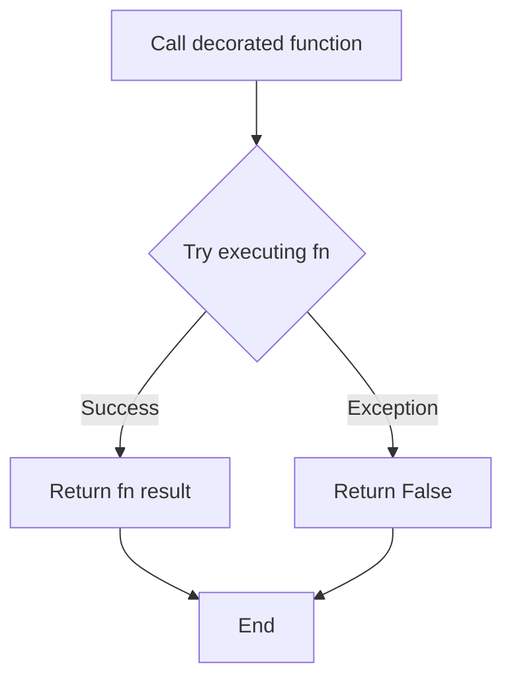
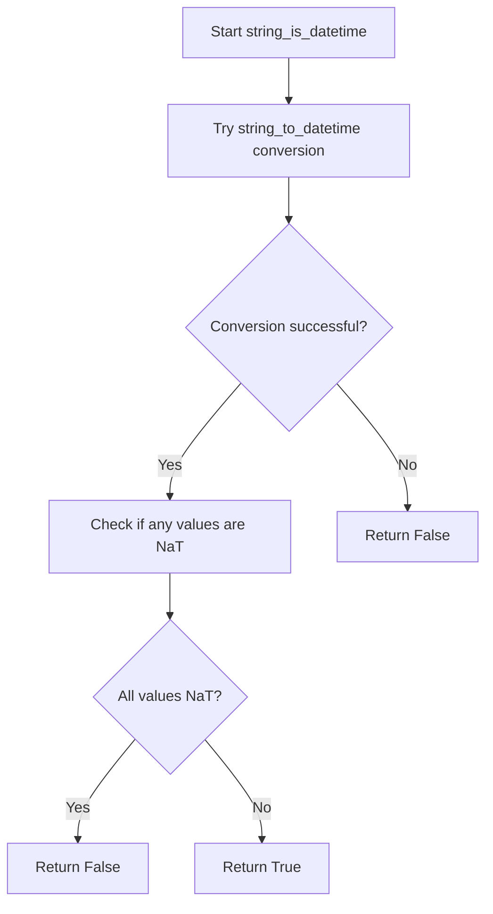

# `typeset_relations.py`

## `src.ydata_profiling.model.typeset_relations.is_nullable` · *function*

## Summary:
Checks if a pandas Series contains any non-null values.

## Description:
Determines whether the given pandas Series has at least one non-null value. This function is part of the typeset relations module in ydata-profiling, which handles type detection and relationship analysis for data profiling. Despite the function name suggesting a "nullability" check, the implementation actually verifies if the series contains any non-null values.

## Args:
    series (pandas.Series): A pandas Series object to check for non-null values
    state (dict): A state dictionary containing contextual information for type checking

## Returns:
    bool: True if the series contains at least one non-null value, False otherwise

## Raises:
    None explicitly raised

## Constraints:
    Preconditions:
    - The series parameter must be a valid pandas Series object
    - The state parameter must be a dictionary (can be empty)
    
    Postconditions:
    - Returns a boolean value indicating presence of non-null values
    - Does not modify the input series or state

## Side Effects:
    None

## Control Flow:
```mermaid
flowchart TD
    A[Start is_nullable] --> B{series.count() > 0?}
    B -->|True| C[Return True]
    B -->|False| D[Return False]
```

## Examples:
    # Check if a series with values has non-null entries
    series_with_values = pd.Series([1, 2, 3])
    result = is_nullable(series_with_values, {})
    # result = True
    
    # Check if a series with all nulls has non-null entries  
    series_all_nulls = pd.Series([None, None, None])
    result = is_nullable(series_all_nulls, {})
    # result = False
    
    # Check if an empty series has non-null entries
    empty_series = pd.Series([])
    result = is_nullable(empty_series, {})
    # result = False

## `src.ydata_profiling.model.typeset_relations.try_func` · *function*

## Summary:
Decorator that wraps a function to catch all exceptions and return False instead of propagating errors.

## Description:
A decorator that transforms a function into a "safe" version that will never raise exceptions. When the wrapped function encounters any exception during execution, it silently returns False instead of propagating the error. This is particularly useful for type checking functions that may encounter unexpected data formats or edge cases in pandas Series.

## Args:
    fn (Callable): The function to wrap with exception handling. This function should accept a pandas Series as its first argument, followed by optional positional and keyword arguments.

## Returns:
    Callable: A new function that behaves identically to the input function, except that it will never raise exceptions. Instead, any exception will cause it to return False.

## Raises:
    None: This decorator catches all exceptions and prevents them from propagating.

## Constraints:
    Preconditions:
    - The input function `fn` must accept a pandas Series as its first parameter
    - The input function may accept additional arguments and keyword arguments
    - The function should logically return a boolean value (though this isn't enforced)
    
    Postconditions:
    - The returned function will always return a boolean value (True or False)
    - No exceptions will be raised from the decorated function

## Side Effects:
    None: This function does not perform any I/O operations or mutate external state.

## Control Flow:


## Examples:
```python
# Example usage for type checking
@try_func
def is_integer_type(series: pd.Series) -> bool:
    return pd.api.types.is_integer_dtype(series)

# Safe type checking that won't crash on malformed data
result = is_integer_type(malformed_series)  # Returns False instead of raising exception
```

## `src.ydata_profiling.model.typeset_relations.string_is_bool` · *function*

## Summary:
Determines whether all string values in a pandas Series can be classified as boolean-like values based on a provided mapping.

## Description:
This function evaluates whether all non-null values in a pandas Series are boolean-like strings (case-insensitive) according to a provided dictionary mapping. It safely handles various edge cases including null values, categorical data types, and malformed data by returning False when appropriate. This function is part of the type detection system for profiling data.

## Args:
    series (pandas.Series): A pandas Series containing string values to evaluate
    state (dict): A state dictionary that may contain contextual information for type checking (usage context unclear from function)
    k (Dict[str, bool]): A dictionary mapping string representations of boolean values to their corresponding boolean values

## Returns:
    bool: True if all non-null values in the series are present as keys in the dictionary k and are convertible to boolean values, False otherwise

## Raises:
    None: This function does not raise exceptions due to the @try_func decorator

## Constraints:
    Preconditions:
    - The series parameter must be a valid pandas Series object
    - The k parameter must be a dictionary with string keys
    
    Postconditions:
    - Always returns a boolean value (True or False)
    - Does not modify the input series or state parameters

## Side Effects:
    None: This function performs no I/O operations or external state mutations

## Control Flow:
```mermaid
flowchart TD
    A[Start string_is_bool] --> B{Is categorical dtype?}
    B -->|Yes| C[Return False]
    B -->|No| D[Call tester function]
    D --> E{Series handle nulls decorator}
    E --> F{Try function wrapper}
    F --> G[Convert to lowercase]
    G --> H[Check membership in k.keys()]
    H --> I[Apply .all() to result]
    I --> J[Return result]
```

## Examples:
```python
# Example usage with boolean-like strings
k = {"true": True, "false": False, "yes": True, "no": False}
series = pandas.Series(["True", "False", "YES"])
result = string_is_bool(series, {}, k)  # Returns True

# Example with mixed data (will return False due to non-matching values)
series = pandas.Series(["True", "Maybe", "False"])
result = string_is_bool(series, {}, k)  # Returns False

# Example with categorical data (returns False immediately)
series = pandas.Series(pandas.Categorical(["True", "False"]))
result = string_is_bool(series, {}, k)  # Returns False
```

## `src.ydata_profiling.model.typeset_relations.string_to_bool` · *function*

## Summary:
Converts string representations of boolean values to actual boolean objects using a provided mapping dictionary.

## Description:
This function transforms a pandas Series containing string values into a Series of boolean values by applying a lowercase transformation followed by a dictionary-based mapping. It's designed to handle common string representations of boolean values like "true"/"false", "yes"/"no", etc. The function is typically used in data profiling pipelines to standardize string representations of boolean values.

## Args:
    series (pandas.Series): Input pandas Series containing string values to be converted to booleans
    state (dict): State dictionary (currently unused in implementation, likely for future extensibility)
    k (Dict[str, bool]): Mapping dictionary that maps string keys (in lowercase) to boolean values

## Returns:
    pandas.Series: A pandas Series with the same index as input but with string values converted to boolean values according to the mapping dictionary. Values not found in the mapping dictionary will become NaN.

## Raises:
    None explicitly raised in current implementation

## Constraints:
    Preconditions:
    - The input series should contain string values that can be converted to lowercase
    - The mapping dictionary `k` should contain string keys that match the lowercase versions of the input strings
    - The input series should not contain null values that would cause issues with str.lower() operation
    
    Postconditions:
    - Output series has the same length and index as input series
    - All values in output series that are successfully mapped are boolean type (True or False)
    - Values not found in mapping dictionary become NaN

## Side Effects:
    None

## Control Flow:
```mermaid
flowchart TD
    A[Input Series] --> B[series.str.lower()]
    B --> C{Map with k}
    C --> D[Output Boolean Series]
    C --> E[NaN for unmapped values]
```

## Examples:
    # Example 1: Basic usage with standard boolean strings
    mapping = {"true": True, "false": False}
    series = pandas.Series(["True", "FALSE", "true"])
    result = string_to_bool(series, {}, mapping)
    # Result: [True, False, True]
    
    # Example 2: Custom mapping with missing values
    mapping = {"yes": True, "no": False}
    series = pandas.Series(["YES", "NO", "maybe", "unknown"])
    result = string_to_bool(series, {}, mapping)
    # Result: [True, False, nan, nan]
    
    # Example 3: Numeric string mapping
    mapping = {"1": True, "0": False, "on": True, "off": False}
    series = pandas.Series(["1", "0", "ON", "OFF"])
    result = string_to_bool(series, {}, mapping)
    # Result: [True, False, True, False]
    
    # Example 4: Handling of empty strings
    mapping = {"true": True, "false": False}
    series = pandas.Series(["", "true", "false"])
    result = string_to_bool(series, {}, mapping)
    # Result: [nan, True, False]
```

## `src.ydata_profiling.model.typeset_relations.numeric_is_category` · *function*

## Summary:
Determines whether a numeric series should be treated as categorical based on unique value count compared to a configured threshold.

## Description:
This function evaluates if a numeric variable contains sufficiently few unique values to be considered categorical for data profiling purposes. It's part of the type inference system that decides how to categorize variables during automated data analysis.

The function is typically called during the variable type detection phase of data profiling, where numeric variables with very few distinct values are often better represented as categorical variables for more meaningful statistical analysis and visualization.

## Args:
    series (pandas.Series): The numeric pandas Series to evaluate
    state (dict): A dictionary containing processing state information (currently unused in implementation)
    k (Settings): Configuration settings object containing the low_categorical_threshold parameter

## Returns:
    bool: True if the series has between 1 and the configured low_categorical_threshold unique values (inclusive), False otherwise

## Raises:
    None explicitly raised

## Constraints:
    Preconditions:
    - The series parameter must be a valid pandas Series
    - The settings parameter must contain vars.num.low_categorical_threshold attribute
    
    Postconditions:
    - Returns a boolean value indicating whether the numeric series should be treated as categorical

## Side Effects:
    None

## Control Flow:
```mermaid
flowchart TD
    A[Start numeric_is_category] --> B{series.nunique()}
    B --> C{1 <= n_unique <= threshold?}
    C -->|Yes| D[Return True]
    C -->|No| E[Return False]
```

## Examples:
```python
# Example 1: Numeric series with few unique values (treated as categorical)
series = pd.Series([1, 2, 2, 3, 3, 3])
settings = Settings()
settings.vars.num.low_categorical_threshold = 5
result = numeric_is_category(series, {}, settings)  # Returns True

# Example 2: Numeric series with many unique values (not treated as categorical)
series = pd.Series([1.1, 2.2, 3.3, 4.4, 5.5, 6.6])
settings = Settings()
settings.vars.num.low_categorical_threshold = 5
result = numeric_is_category(series, {}, settings)  # Returns False

# Example 3: Single unique value (treated as categorical)
series = pd.Series([5, 5, 5, 5])
settings = Settings()
settings.vars.num.low_categorical_threshold = 10
result = numeric_is_category(series, {}, settings)  # Returns True
```

## `src.ydata_profiling.model.typeset_relations.to_category` · *function*

## Summary:
Converts a pandas Series to pandas string dtype while normalizing special null representations to standard NaN values.

## Description:
Transforms a pandas Series into pandas string dtype, specifically handling conversion of special string representations of null values ("nan" and "<NA>") to proper pandas NaN values. This function ensures consistent string representation in data profiling workflows where null values need to be properly handled.

The function is typically invoked during type conversion processes where data needs to be standardized to string representation while maintaining proper null semantics.

## Args:
    series (pandas.Series): Input pandas Series to be converted to string type
    state (dict): Processing state dictionary (parameter not used in current implementation)

## Returns:
    pandas.Series: A pandas Series with pandas string dtype where:
        - Original NaN values remain as NaN
        - String representations "nan" are converted to pandas NaN
        - String representations "<NA>" are converted to pandas NaN

## Raises:
    None explicitly raised in the function body

## Constraints:
    Preconditions:
    - Input series must be a valid pandas Series object
    - Input state parameter should be a dictionary (though unused in current implementation)
    
    Postconditions:
    - Output series will have pandas string dtype (not numpy string dtype)
    - All string values that were originally "nan" become pandas.NA
    - All string values that were originally "<NA>" become pandas.NA
    - Existing pandas.NA or numpy.nan values remain unchanged

## Side Effects:
    None

## Control Flow:
```mermaid
flowchart TD
    A[Start to_category] --> B{series.hasnans}
    B -- True --> C[series.astype(str)]
    C --> D[val.replace("nan", np.nan)]
    D --> E[val.replace("<NA>", np.nan)]
    E --> F[val.astype("string")]
    B -- False --> G[series.astype(str)]
    G --> H[val.astype("string")]
    F --> I[Return result]
    H --> I
```

## Examples:
```python
import pandas as pd
import numpy as np

# Basic usage with regular data
series = pd.Series(['a', 'b', None])
result = to_category(series, {})
# Returns: Series with pandas string dtype and proper NaN handling

# Usage with special null representations
series = pd.Series(['a', 'nan', '<NA>', 'b'])
result = to_category(series, {})
# Returns: Series with pandas string dtype where 'nan' and '<NA>' become pd.NA
```

## `src.ydata_profiling.model.typeset_relations.series_is_string` · *function*

## Summary:
Determines whether a pandas Series should be classified as a string type by validating its values and attempting type conversion.

## Description:
This function serves as a type checker that validates whether a given pandas Series contains string data. It performs two validation steps: first checking if the initial values are strings, then attempting to convert the entire series to string type and comparing it with the original. This approach helps handle mixed-type data gracefully while maintaining robustness against conversion errors.

The function is designed to be used in a type inference system where data types need to be determined automatically. It's particularly useful for handling edge cases where data might appear to be string-like but contains non-string values that could cause conversion issues.

## Args:
    series (pd.Series): The pandas Series to validate as string type
    state (dict): A state dictionary containing contextual information for type checking (usage context not clearly defined from this function alone)

## Returns:
    bool: True if the series contains string data and can be successfully converted to string type, False otherwise

## Raises:
    None explicitly raised - catches and handles TypeError and ValueError internally

## Constraints:
    Preconditions:
    - The series parameter must be a valid pandas Series object
    - The state parameter must be a dictionary (though not actively used in this function's logic)
    
    Postconditions:
    - Returns a boolean value indicating string type classification
    - Does not modify the input series or state

## Side Effects:
    None - This function is pure and has no side effects

## Control Flow:
```mermaid
flowchart TD
    A[Start series_is_string] --> B{First 5 values all strings?}
    B -- No --> C[Return False]
    B -- Yes --> D[Attempt series.astype(str)]
    D --> E{Conversion successful?}
    E -- No --> F[Return False]
    E -- Yes --> G[Compare converted vs original]
    G --> H[Return comparison result]
```

## Examples:
```python
# Valid string series
series = pd.Series(['a', 'b', 'c'])
result = series_is_string(series, {})  # Returns True

# Mixed type series
series = pd.Series(['a', 'b', 1])
result = series_is_string(series, {})  # Returns False due to mixed types

# Numeric series
series = pd.Series([1, 2, 3])
result = series_is_string(series, {})  # Returns False
```

## `src.ydata_profiling.model.typeset_relations.string_is_category` · *function*

## Summary
Determines whether a pandas Series should be classified as a categorical variable based on cardinality and uniqueness thresholds.

## Description
This function evaluates whether a pandas Series should be treated as a categorical variable by examining the number of unique values relative to configured thresholds. It ensures that the series is not already classified as boolean-like and applies both absolute cardinality limits and relative percentage thresholds to make the determination. This function is part of the type detection system used in data profiling to automatically assign appropriate data types to variables.

The function is called during the automatic type inference phase of data profiling to help determine whether a string column should be treated as categorical rather than textual data.

## Args
- series (pandas.Series): A pandas Series containing data to evaluate for categorical classification
- state (dict): A state dictionary that may contain contextual information for type checking (usage context unclear from function)
- k (Settings): Configuration object containing categorical variable thresholds including cardinality_threshold and percentage_cat_threshold

## Returns
- bool: True if the series should be classified as categorical, False otherwise. The decision is based on:
  - Having between 1 and cardinality_threshold unique values (inclusive)
  - Having fewer than percentage_cat_threshold proportion of unique values relative to total size (when threshold <= 1) or at most percentage_cat_threshold proportion (when threshold > 1)
  - Not being classified as boolean-like (via string_is_bool check)

## Raises
- None: This function does not explicitly raise exceptions

## Constraints
- Preconditions:
  - The series parameter must be a valid pandas Series object
  - The k parameter must be a valid Settings object with properly initialized categorical configuration
  - The k.vars.cat.cardinality_threshold and k.vars.cat.percentage_cat_threshold must be properly configured
- Postconditions:
  - Always returns a boolean value (True or False)
  - Does not modify the input series or state parameters

## Side Effects
- None: This function performs no I/O operations or external state mutations

## Control Flow
```mermaid
flowchart TD
    A[Start string_is_category] --> B[Calculate n_unique]
    B --> C[Get threshold values from k.vars.cat]
    C --> D{1 <= n_unique <= threshold?}
    D -->|No| E[Return False]
    D -->|Yes| F{unique_threshold <= 1?}
    F -->|Yes| G[n_unique / series.size < unique_threshold?]
    F -->|No| H[n_unique / series.size <= unique_threshold?]
    G -->|No| I[Return False]
    G -->|Yes| J[Continue to boolean check]
    H -->|No| I
    H -->|Yes| J
    J --> K{string_is_bool(series, state, k.vars.bool.mappings)?}
    K -->|Yes| L[Return False]
    K -->|No| M[Return True]
```

## Examples
```python
import pandas as pd
from ydata_profiling.config import Settings

# Example 1: Series with low cardinality and percentage
settings = Settings()
series = pd.Series(['A', 'B', 'C', 'A', 'B'])
result = string_is_category(series, {}, settings)  # Returns True

# Example 2: Series with too many unique values
settings = Settings()
series = pd.Series([f'item_{i}' for i in range(100)])
result = string_is_category(series, {}, settings)  # Returns False

# Example 3: Series that would be boolean-like (returns False)
settings = Settings()
series = pd.Series(['True', 'False', 'True'])
result = string_is_category(series, {}, settings)  # Returns False (due to boolean check)
```

## `src.ydata_profiling.model.typeset_relations.string_is_datetime` · *function*

## Summary:
Determines whether a pandas Series contains string values that can be converted to datetime objects.

## Description:
This function evaluates whether a given pandas Series of string values contains at least one valid datetime representation. It leverages the `string_to_datetime` utility function to attempt conversion to datetime format, then checks if any values were successfully converted (i.e., not all values resulted in NaT/NaN). This function is part of the type detection system in ydata-profiling, specifically used to identify when string data might represent datetime information.

The function is extracted into its own component to encapsulate the logic for determining datetime string validity, separating this concern from the actual conversion process. This allows for efficient type inference without performing full conversion when only validation is needed.

## Args:
    series (pd.Series): A pandas Series containing string values to test for datetime compatibility
    state (dict): A dictionary containing processing state information used by the type conversion system. The contents are implementation-dependent and not validated by this function.

## Returns:
    bool: True if at least one value in the series can be converted to a datetime object, False otherwise

## Raises:
    None explicitly raised - the function catches all exceptions and returns False

## Constraints:
    Preconditions:
    - The input series should contain string values that could potentially represent dates/times
    - The state parameter should be a valid dictionary (though its contents are not validated in this function)
    
    Postconditions:
    - The function returns a boolean value indicating datetime compatibility
    - No modifications are made to the input series or state

## Side Effects:
    None - This function is pure and doesn't modify external state or perform I/O operations

## Control Flow:


## Examples:
```python
import pandas as pd

# Series with valid datetime strings
series_valid = pd.Series(['2023-01-01', '2023-01-02', 'invalid'])
result = string_is_datetime(series_valid, {})
# Returns: True (because first two values are valid dates)

# Series with no valid datetime strings
series_invalid = pd.Series(['not_a_date', 'also_not_date', 'another_invalid'])
result = string_is_datetime(series_invalid, {})
# Returns: False (no valid dates found)

# Empty series
series_empty = pd.Series([], dtype='object')
result = string_is_datetime(series_empty, {})
# Returns: False (no values to check)
```

## `src.ydata_profiling.model.typeset_relations.string_is_numeric` · *function*

## Summary:
Determines whether a pandas Series should be classified as numeric when it's currently stored as a string type.

## Description:
This function evaluates if a pandas Series containing string data should be treated as numeric for profiling purposes. It serves as part of the type inference system that determines how to categorize variables during automated data analysis. The function specifically excludes boolean-like data and handles edge cases such as all-NaN series.

The logic is extracted into its own function to encapsulate the complex decision-making process for string-to-numeric type conversion, separating concerns from the main type detection logic and making the code more testable and maintainable.

## Args:
    series (pd.Series): A pandas Series to evaluate for numeric compatibility
    state (dict): A dictionary containing processing state information (purpose not clearly defined from this function alone)
    k (Settings): Configuration settings object containing profiling configuration parameters

## Returns:
    bool: True if the series should be treated as numeric, False otherwise

## Raises:
    None explicitly raised - though the try/except block may catch and suppress exceptions internally

## Constraints:
    Preconditions:
        - The series parameter must be a valid pandas Series object
        - The state parameter must be a dictionary (though its contents are not validated)
        - The k parameter must be a valid Settings object
    
    Postconditions:
        - Returns a boolean value indicating whether the series should be treated as numeric
        - Does not modify the input series or state

## Side Effects:
    None - This function performs no I/O operations or external state mutations

## Control Flow:
```mermaid
flowchart TD
    A[Start string_is_numeric] --> B{is_bool_dtype(series) OR object_is_bool(series,state)?}
    B -- Yes --> C[Return False]
    B -- No --> D[try: Convert to float]
    D --> E{Conversion successful?}
    E -- No --> F[Return False]
    E -- Yes --> G[Convert with pd.to_numeric]
    G --> H{r.hasnans AND r.count() == 0?}
    H -- Yes --> I[Return False]
    H -- No --> J[Return NOT numeric_is_category(series,state,k)]
```

## Examples:
    # Example 1: String series that can be converted to numeric
    series = pd.Series(['1', '2', '3'])
    result = string_is_numeric(series, {}, Settings())  # Returns True
    
    # Example 2: String series with boolean-like values
    series = pd.Series(['True', 'False', 'True'])
    result = string_is_numeric(series, {}, Settings())  # Returns False
    
    # Example 3: String series with NaN values
    series = pd.Series(['1', '2', np.nan, '4'])
    result = string_is_numeric(series, {}, Settings())  # Returns True (unless all-NaN)
    
    # Example 4: String series that cannot be converted to numeric
    series = pd.Series(['hello', 'world'])
    result = string_is_numeric(series, {}, Settings())  # Returns False
```

## `src.ydata_profiling.model.typeset_relations.string_to_datetime` · *function*

## Summary:
Converts a pandas Series of string values to datetime format, with version-specific handling for pandas compatibility.

## Description:
This function transforms a pandas Series containing string representations of dates into proper datetime objects. It implements version-specific logic to handle differences in pandas' `to_datetime` function behavior between pandas 1.x and later versions. The function is designed to be used within the ydata-profiling library's type detection and conversion system, specifically as part of the typeset relations processing pipeline.

## Args:
    series (pd.Series): A pandas Series containing string values that represent dates or times
    state (dict): A dictionary containing processing state information used by the type conversion system. The contents are implementation-dependent and not validated by this function.

## Returns:
    pd.Series: A pandas Series with the same index as the input but with values converted to datetime objects. Invalid date strings will result in NaT (Not a Time) values.

## Raises:
    None explicitly raised in the function body, though underlying pd.to_datetime may raise exceptions for severely malformed inputs or unsupported formats

## Constraints:
    Preconditions:
    - The input series should contain string representations of dates/times that can be parsed by pandas
    - The state parameter should be a valid dictionary (though its contents are not validated in this function)
    
    Postconditions:
    - The returned Series will have the same length and index as the input Series
    - All valid string date representations will be properly converted to datetime objects
    - Invalid date strings will be converted to pandas NaT values

## Side Effects:
    None - This function is pure and doesn't modify external state or perform I/O operations

## Control Flow:
```mermaid
flowchart TD
    A[Start string_to_datetime] --> B{is_pandas_1()}
    B -- True --> C[pd.to_datetime(series)]
    B -- False --> D[pd.to_datetime(series, format="mixed")]
    C --> E[Return datetime Series]
    D --> E
```

## Examples:
```python
import pandas as pd

# Basic usage with valid dates
series = pd.Series(['2023-01-01', '2023-01-02', '2023-01-03'])
result = string_to_datetime(series, {})
# Returns: DatetimeIndex(['2023-01-01', '2023-01-02', '2023-01-03'])

# With mixed date formats
series_mixed = pd.Series(['2023-01-01', '01/02/2023', '2023.01.03'])
result = string_to_datetime(series_mixed, {})
# Returns: DatetimeIndex with properly parsed dates

# With invalid dates
series_invalid = pd.Series(['2023-01-01', 'invalid_date', '2023-01-03'])
result = string_to_datetime(series_invalid, {})
# Returns: DatetimeIndex with NaT for the invalid date
```

## `src.ydata_profiling.model.typeset_relations.string_to_numeric` · *function*

## Summary:
Converts a pandas Series containing string representations of numbers into numeric data types, safely handling invalid entries by coercing them to NaN.

## Description:
This function transforms string data that represents numeric values into appropriate numeric data types (integers or floats). It is designed to handle mixed-type data where some entries may not be convertible to numbers. The function leverages pandas' built-in conversion capabilities with error coercion to ensure robust processing. This utility function is typically used during data profiling to standardize string columns that contain numeric data.

## Args:
    series (pd.Series): A pandas Series containing string data that may represent numeric values
    state (dict): A dictionary containing processing state information (currently unused in implementation)

## Returns:
    pd.Series: A pandas Series with converted numeric data types, where non-numeric strings are replaced with NaN values. The returned series maintains the same index as the input series.

## Raises:
    None explicitly raised - relies on pandas.to_numeric behavior

## Constraints:
    Preconditions:
        - Input series should be a valid pandas Series object
        - The series should contain elements that can be interpreted as numeric strings or null values
    
    Postconditions:
        - Output series maintains the same length as input series
        - Non-convertible string entries become NaN values
        - Numeric entries are converted to appropriate numeric data types (int/float)
        - The resulting series preserves the original index

## Side Effects:
    None - This function is pure and does not modify external state or perform I/O operations

## Control Flow:
```mermaid
flowchart TD
    A[Start string_to_numeric] --> B{Input validation}
    B --> C[Call pd.to_numeric(series, errors="coerce")]
    C --> D[Return converted Series]
```

## Examples:
    # Basic usage with valid numeric strings
    >>> import pandas as pd
    >>> series = pd.Series(['1', '2', '3'])
    >>> result = string_to_numeric(series, {})
    >>> print(result)
    0    1.0
    1    2.0
    2    3.0
    dtype: float64
    
    # Usage with mixed valid/invalid strings
    >>> series = pd.Series(['1', '2.5', 'abc', '4'])
    >>> result = string_to_numeric(series, {})
    >>> print(result)
    0    1.0
    1    2.5
    2    NaN
    3    4.0
    dtype: float64
    
    # Usage with integer-like strings
    >>> series = pd.Series(['100', '200', '300'])
    >>> result = string_to_numeric(series, {})
    >>> print(result.dtype)
    int64

## `src.ydata_profiling.model.typeset_relations.to_bool` · *function*

## Summary:
Converts a pandas Series to boolean type, using appropriate nullable boolean dtype when missing values are present.

## Description:
This function converts a pandas Series to boolean type, selecting between standard and nullable boolean dtypes based on the presence of missing values. When the input series contains NaN values, it applies a nullable boolean dtype (identified by `hasnan_bool_name`); otherwise, it uses the standard Python boolean type. This ensures proper handling of missing data in boolean contexts while maintaining compatibility with pandas' type system.

## Args:
    series (pd.Series): Input pandas Series containing boolean-like data to convert

## Returns:
    pd.Series: A pandas Series with boolean dtype, automatically selecting between standard bool and nullable boolean types

## Raises:
    None explicitly raised in the function body

## Constraints:
    Preconditions:
    - Input must be a valid pandas Series object
    - The series should contain data compatible with boolean conversion
    
    Postconditions:
    - Output series will have boolean dtype
    - If input series contained missing values, output will use pandas nullable boolean dtype
    - If input series did not contain missing values, output will use standard Python bool dtype

## Side Effects:
    None

## Control Flow:
```mermaid
flowchart TD
    A[Input Series] --> B{Has Missing Values?}
    B -->|Yes| C[Use hasnan_bool_name]
    B -->|No| D[Use bool]
    C --> E[Convert with astype()]
    D --> E
    E --> F[Return Series]
```

## Examples:
```python
import pandas as pd

# Example with no missing values
series1 = pd.Series([True, False, True])
result1 = to_bool(series1)
# Returns Series with bool dtype

# Example with missing values  
series2 = pd.Series([True, False, None])
result2 = to_bool(series2)
# Returns Series with nullable boolean dtype
```

## `src.ydata_profiling.model.typeset_relations.object_is_bool` · *function*

## Summary:
Determines whether a pandas Series contains only boolean values when it has an object data type.

## Description:
This function checks if a pandas Series with object dtype contains exclusively boolean values (True or False). It's designed to identify when an object-type column should be treated as a boolean type for profiling purposes. The function handles potential exceptions during the validation process by returning False if any issues occur.

## Args:
    series (pd.Series): A pandas Series to check for boolean content
    state (dict): A dictionary containing processing state information (purpose not clearly defined from this function alone)

## Returns:
    bool: True if the series has object dtype and all non-null values are either True or False, False otherwise

## Raises:
    None explicitly raised - though the try/except block may catch and suppress exceptions internally

## Constraints:
    Preconditions:
        - The series parameter must be a valid pandas Series object
        - The state parameter must be a dictionary (though its contents are not validated)
    
    Postconditions:
        - Returns a boolean value indicating whether the series contains only boolean values
        - Does not modify the input series or state

## Side Effects:
    None - This function performs no I/O operations or external state mutations

## Control Flow:
```mermaid
flowchart TD
    A[Start object_is_bool] --> B{Is object dtype?}
    B -- Yes --> C[Create bool_set = {True, False}]
    C --> D[Check all items in series]
    D --> E{All items in bool_set?}
    E -- Yes --> F[Return True]
    E -- No --> G[Return False]
    B -- No --> H[Return False]
```

## Examples:
    # Example 1: Series with boolean values
    series = pd.Series([True, False, True])
    result = object_is_bool(series, {})  # Returns True
    
    # Example 2: Series with mixed types
    series = pd.Series([True, "yes", False])
    result = object_is_bool(series, {})  # Returns False
    
    # Example 3: Series with non-object dtype
    series = pd.Series([1, 0, 1])
    result = object_is_bool(series, {})  # Returns False
```

