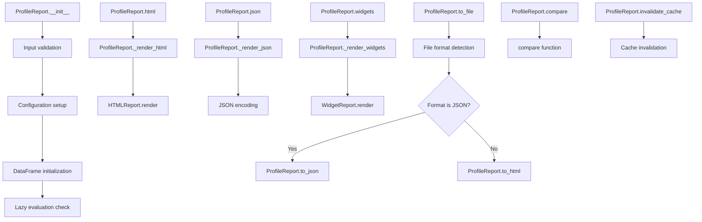

# `profile_report.py`

## `src.ydata_profiling.profile_report.ProfileReport` · *class*

## Summary
A comprehensive data profiling report generator that creates detailed statistical summaries, visualizations, and quality assessments of pandas DataFrames or Spark DataFrames.

## Description
The ProfileReport class serves as the primary interface for generating data profiling reports in the ydata-profiling library. It provides a unified abstraction for analyzing datasets and producing comprehensive reports in multiple formats including HTML, JSON, and interactive widgets. The class supports both lazy and eager evaluation modes, caching mechanisms, and extensive customization through configuration options.

This class is designed to be the main entry point for data profiling workflows, offering a complete solution for understanding dataset characteristics, identifying data quality issues, and generating actionable insights. It integrates with various subsystems including type inference, statistical summarization, visualization rendering, and data validation.

The class supports different data sources including pandas DataFrames and Spark DataFrames, with appropriate configuration adjustments for each. It provides methods for exporting reports to various formats, comparing datasets, and accessing specific analysis components.

## State
- _description_set: BaseDescription or None - Cached result of the data description computation, computed on first access
- _report: Root or None - Cached result of the report structure generation, computed on first access
- _html: str or None - Cached HTML representation of the report, computed on first access
- _widgets: Any or None - Cached widget representation of the report, computed on first access
- _json: str or None - Cached JSON representation of the report, computed on first access
- config: Settings - Configuration object controlling report generation behavior
- df: Optional[Union[pd.DataFrame, sDataFrame]] - The input DataFrame being profiled
- _df_hash: Optional[str] - Hash of the DataFrame for cache invalidation
- _sample: Optional[dict] - Custom sample data to use instead of generating a random sample
- _type_schema: Optional[dict] - Schema defining data types for specific columns
- _typeset: Optional[VisionsTypeset] - Type set for data type detection
- _summarizer: Optional[BaseSummarizer] - Summarizer for generating statistical summaries

## Lifecycle
**Creation:** Instantiate with a DataFrame and optional configuration parameters. The constructor accepts various parameters for customization including minimal mode, time-series analysis, and styling options. The class supports lazy initialization by default, where heavy computations are deferred until properties are accessed.

**Usage:** Access properties like `.html`, `.json`, or `.widgets` to generate report representations on-demand. Use methods like `.to_file()`, `.to_html()`, `.to_json()`, `.to_widgets()`, and `.compare()` to export or manipulate reports. The class implements caching to avoid recomputation of expensive operations.

**Destruction:** Managed automatically by Python's garbage collection; no explicit cleanup required.

## Method Map


## Raises
- ValueError: Raised during initialization when DataFrame is None and lazy=False, or when config_file and minimal are both specified, or when an empty DataFrame is provided
- NotImplementedError: Raised when time-series mode is enabled with Spark DataFrames
- RuntimeError: Raised when trying to access widgets for comparing reports
- TypeError: Raised when invalid types are passed to methods or during configuration updates

## Example
```python
import pandas as pd
from ydata_profiling import ProfileReport

# Create a sample DataFrame
df = pd.DataFrame({
    'name': ['Alice', 'Bob', 'Charlie'],
    'age': [25, 30, 35],
    'salary': [50000, 60000, 70000]
})

# Create a profile report
report = ProfileReport(df, title="Employee Data Analysis")

# Generate HTML report (lazy evaluation - computed on first access)
html_content = report.to_html()

# Export to file
report.to_file("employee_report.html")

# Get JSON representation (lazy evaluation - computed on first access)
json_content = report.to_json()

# Compare with another dataset
other_report = ProfileReport(other_df)
comparison = report.compare(other_report)

# Access specific analysis components
alerts = report.get_rejected_variables()
sample = report.get_sample()
duplicates = report.get_duplicates()
```

### `src.ydata_profiling.profile_report.ProfileReport.__init__` · *method*

## Summary:
Initializes a ProfileReport object with configuration parameters and prepares the profiling environment for data analysis.

## Description:
The constructor method sets up the profiling report configuration based on provided parameters, validates inputs, and initializes core instance attributes. It handles various configuration modes including minimal, time-series, and custom settings while preparing the underlying DataFrame for analysis. The method supports lazy evaluation by default, deferring heavy computations until report properties are accessed.

## Args:
    df (Optional[Union[pd.DataFrame, sDataFrame]]): Input DataFrame to profile, or None for lazy initialization. Must not be empty when provided.
    minimal (bool): Flag indicating minimal configuration mode. When True, uses a predefined minimal configuration file. Mutually exclusive with config_file.
    tsmode (bool): Flag indicating time-series analysis mode. Enables time-series specific configurations and processing.
    sortby (Optional[str]): Column name to sort DataFrame by when time-series mode is enabled. Required when tsmode=True.
    sensitive (bool): Flag to enable sensitive data handling mode, which applies privacy-preserving configurations.
    explorative (bool): Flag to enable explorative analysis mode, which applies exploratory data analysis configurations.
    dark_mode (bool): Flag to enable dark theme for report visualization.
    orange_mode (bool): Flag to enable orange theme for report visualization.
    sample (Optional[dict]): Custom sample data to use instead of generating a random sample.
    config_file (Optional[Union[Path, str]]): Path to YAML configuration file. Mutually exclusive with minimal=True.
    lazy (bool): Flag indicating lazy evaluation mode. When False, computes the report immediately.
    typeset (Optional[VisionsTypeset]): Custom typeset for data type detection.
    summarizer (Optional[BaseSummarizer]): Custom summarizer for statistical summaries.
    config (Optional[Settings]): Direct Settings object for configuration. Takes precedence over other config options.
    type_schema (Optional[dict]): Schema defining data types for specific columns.
    **kwargs: Additional configuration parameters that override default settings.

## Returns:
    None: This method initializes instance attributes and does not return any value.

## Raises:
    ValueError: Raised when df is None and lazy=False, when config_file and minimal are both specified, or when an empty DataFrame is provided.
    NotImplementedError: Raised when tsmode is True with Spark DataFrames.
    TypeError: Raised when invalid types are passed to parameters.

## State Changes:
    Attributes READ: None
    Attributes WRITTEN: 
    - self.df: The initialized DataFrame (or None if lazy)
    - self.config: The final configuration object
    - self._df_hash: Set to None initially
    - self._sample: Set to provided sample parameter
    - self._type_schema: Set to provided type_schema parameter
    - self._typeset: Set to provided typeset parameter
    - self._summarizer: Set to provided summarizer parameter

## Constraints:
    Preconditions:
        - When lazy=False, df must not be None
        - config_file and minimal cannot both be specified
        - df must not be empty when provided
        - tsmode cannot be used with Spark DataFrames
        - sortby must be specified when tsmode=True
        
    Postconditions:
        - All validation checks pass before initialization continues
        - Instance attributes are properly initialized
        - Configuration is correctly applied based on provided parameters
        - Time-series settings are properly configured when tsmode=True

## Side Effects:
    - May perform I/O operations when loading configuration files
    - May compute the report immediately if lazy=False
    - May raise validation errors during initialization

### `src.ydata_profiling.profile_report.ProfileReport.__validate_inputs` · *method*

## Summary:
Validates initialization parameters for ProfileReport to ensure proper configuration and non-empty DataFrames.

## Description:
This static method performs input validation for the ProfileReport class constructor. It ensures that required parameters are properly configured and that DataFrames are not empty. The validation occurs during object initialization before any profiling operations begin.

## Args:
    df (Optional[Union[pd.DataFrame, sDataFrame]]): Input DataFrame to profile, or None for lazy initialization
    minimal (bool): Flag indicating minimal configuration mode
    tsmode (bool): Flag indicating time-series analysis mode
    config_file (Optional[Union[Path, str]]): Path to configuration file, or None
    lazy (bool): Flag indicating lazy evaluation mode

## Returns:
    None: This method does not return any value

## Raises:
    ValueError: Raised when:
        - df is None and lazy is False (required DataFrame for non-lazy initialization)
        - config_file and minimal are both specified (mutually exclusive arguments)
        - DataFrame is empty (pandas or Spark)
    NotImplementedError: Raised when tsmode is True with Spark DataFrames

## State Changes:
    None: This method does not modify any instance attributes

## Constraints:
    Preconditions:
        - When lazy=False, df must not be None
        - config_file and minimal cannot both be specified
        - df must not be empty when provided
        - tsmode cannot be used with Spark DataFrames

    Postconditions:
        - All validation checks pass before ProfileReport initialization continues
        - Appropriate error messages are provided for invalid configurations

## Side Effects:
    None: This method performs no I/O operations or external service calls

### `src.ydata_profiling.profile_report.ProfileReport.__initialize_dataframe` · *method*

## Summary:
Initializes and processes a DataFrame for time series analysis by sorting and setting index based on configuration settings.

## Description:
This private method prepares a DataFrame for time series profiling by applying sorting and indexing operations according to the report configuration. It only processes pandas DataFrames when time series analysis is enabled in the configuration. The method ensures that time series data is properly ordered and indexed for subsequent analysis steps.

## Args:
    df (Optional[Union[pd.DataFrame, sDataFrame]]): Input DataFrame to initialize, or None
    report_config (Settings): Configuration settings that determine processing behavior

## Returns:
    Optional[Union[pd.DataFrame, sDataFrame]]: The processed DataFrame with appropriate sorting and indexing, or None if input was None

## Raises:
    None explicitly raised

## State Changes:
    Attributes READ: self.vars.timeseries.active, self.vars.timeseries.sortby
    Attributes WRITTEN: None (method is pure transformation)

## Constraints:
    Preconditions:
        - df must be either None, a pandas DataFrame, or a spark DataFrame
        - report_config must be a valid Settings object
        - When timeseries.active is True, sortby configuration must be valid if specified
    
    Postconditions:
        - If df is None, returns None unchanged
        - If df is a pandas DataFrame and timeseries.active is True, returns a sorted DataFrame
        - If sortby is specified, DataFrame is sorted by that column
        - If sortby is not specified, DataFrame is sorted by index
        - Index is set appropriately and index name is cleared

## Side Effects:
    None

### `src.ydata_profiling.profile_report.ProfileReport.invalidate_cache` · *method*

## Summary:
Invalidates cached representations of the profiling report, clearing specific subsets of computed data to force recomputation on next access.

## Description:
This method provides controlled cache invalidation for different aspects of the profiling report. When called, it clears cached versions of the report's widget, JSON, HTML, and structural representations. This ensures that subsequent accesses to these representations will trigger recomputation rather than returning stale cached data.

The method supports selective invalidation by specifying which subset of cached data to clear, allowing efficient updates when only specific parts of the report need regeneration.

## Args:
    subset (Optional[str]): Specifies which cached data to invalidate. Can be None (clear all caches), "rendering" (clear rendering-related caches), or "report" (clear report structure cache). Defaults to None.

## Returns:
    None: This method does not return any value.

## Raises:
    ValueError: Raised when the subset parameter is provided but not one of the allowed values: None, "rendering", or "report".

## State Changes:
    Attributes READ: None
    Attributes WRITTEN: 
        - self._widgets: Set to None to invalidate widget representation cache
        - self._json: Set to None to invalidate JSON representation cache  
        - self._html: Set to None to invalidate HTML representation cache
        - self._report: Set to None to invalidate report structure cache
        - self._description_set: Set to None to invalidate description set cache

## Constraints:
    Preconditions: The method assumes the ProfileReport instance has been properly initialized with the cached attributes.
    Postconditions: After execution, the specified cached attributes will be None, forcing recomputation on next access.

## Side Effects:
    None: This method only modifies internal state and does not perform I/O operations or external service calls.

### `src.ydata_profiling.profile_report.ProfileReport.typeset` · *method*

## Summary:
Returns the profiling typeset instance, creating it lazily if needed for data type detection and classification.

## Description:
Provides access to the profiling typeset used for detecting and classifying data types within the dataset. This property implements lazy initialization to defer creation of the typeset object until it's actually needed, improving performance by avoiding unnecessary instantiation. The typeset is essential for determining how different data columns should be interpreted and analyzed during the profiling process.

The typeset is created using `ProfilingTypeSet` with the current configuration and type schema, making it customizable based on the profiling settings. Once created, the typeset is cached in `self._typeset` for reuse across multiple accesses.

Known callers and contexts:
- `summarizer` property: Uses the typeset to initialize the PandasProfilingSummarizer
- `description_set` property: Requires the typeset for generating comprehensive data descriptions
- `report` property: Depends on description_set which depends on the typeset for report structure generation

This logic is implemented as a separate property rather than being inlined because:
1. It follows the lazy initialization pattern for performance optimization
2. It centralizes type set creation logic for consistency
3. It enables caching of the expensive typeset creation process
4. It decouples type detection from other profiling operations

## Returns:
Optional[VisionsTypeset]: A VisionsTypeset instance configured for profiling purposes, or None if no typeset was explicitly provided during initialization.

## State Changes:
Attributes READ: self._typeset, self.config, self._type_schema
Attributes WRITTEN: self._typeset (only when first initialized)

## Constraints:
Preconditions: The ProfileReport instance must be properly initialized with valid config and type_schema attributes
Postconditions: Returns a valid VisionsTypeset instance that can be used for type detection and classification

## Side Effects:
None

### `src.ydata_profiling.profile_report.ProfileReport.summarizer` · *method*

## Summary:
Returns the profiling summarizer instance, creating it lazily if needed.

## Description:
Provides access to the profiling summarizer used for generating statistical summaries of the data. Implements lazy initialization to defer creation of the summarizer object until it's actually needed, improving performance by avoiding unnecessary instantiation.

## Args:
    None

## Returns:
    BaseSummarizer: An instance of PandasProfilingSummarizer configured with the current typeset.

## Raises:
    None explicitly raised

## State Changes:
    Attributes READ: self._summarizer, self.typeset
    Attributes WRITTEN: self._summarizer (only when initialized)

## Constraints:
    Preconditions: The ProfileReport instance must be properly initialized with a valid config and typeset
    Postconditions: Returns a valid BaseSummarizer instance that can be used for summarizing data

## Side Effects:
    None

### `src.ydata_profiling.profile_report.ProfileReport.description_set` · *method*

## Summary
Returns the cached data description for the profile report, computing it once if not already available.

## Description
Provides access to the comprehensive data profiling results for the dataset. This property implements a lazy-loading pattern that computes the full data description only when first accessed, then caches the result for subsequent accesses. The computed description includes statistical summaries, variable types, correlations, missing value patterns, and data quality alerts.

The method is called internally by various properties and methods throughout the ProfileReport class to access the core profiling data, such as:
- `get_duplicates()` to retrieve duplicate records
- `get_sample()` to access sample data points
- `get_rejected_variables()` to identify rejected columns
- `widgets`, `html`, and `json` properties to render reports
- Various rendering methods that require analysis metadata

This approach avoids recomputing expensive profiling operations multiple times during report generation and provides efficient access to the profiling results.

## Returns
BaseDescription: A structured object containing all profiling results including:
- analysis: Metadata about the analysis including title, start/end timestamps
- table: Table-level statistics including row count, column count, missing values, duplicates
- variables: Per-variable descriptions including type, statistics, and distribution information
- correlations: Correlation matrices for enabled correlation methods
- missing: Missing value diagram results
- alerts: List of Alert objects identifying data quality issues
- package: Package version and configuration information
- sample: Sample data points from the dataset
- duplicates: Duplicate records identified in the dataset

## State Changes
- Attributes READ: self._description_set, self.config, self.df, self.summarizer, self.typeset, self._sample
- Attributes WRITTEN: self._description_set (only when initially computed)

## Constraints
- Preconditions: The ProfileReport instance must have been properly initialized with a valid DataFrame and configuration
- Postconditions: Returns a complete BaseDescription object with all analysis components populated

## Side Effects
- Computes and caches the full data description on first access (expensive operation)
- May create progress bars during computation if enabled in configuration
- Calls external functions that may perform their own side effects (file I/O, network calls, etc.)

### `src.ydata_profiling.profile_report.ProfileReport.df_hash` · *method*

## Summary:
Returns a cached hash of the profiled dataframe for identification purposes.

## Description:
This property computes and caches a SHA256 hash of the underlying dataframe to uniquely identify its content. The hash is computed only once and stored for subsequent accesses. This is useful for detecting changes in the dataframe or for caching mechanisms that depend on dataframe content.

## Args:
    None

## Returns:
    Optional[str]: A hexadecimal string prefixed with a hash prefix, or None if no dataframe is available.

## Raises:
    None

## State Changes:
    Attributes READ: self._df_hash, self.df
    Attributes WRITTEN: self._df_hash (only on first access)

## Constraints:
    Preconditions: The method assumes that if `self.df` is not None, it contains a valid pandas DataFrame.
    Postconditions: On first access, `self._df_hash` will contain the computed hash value.

## Side Effects:
    None

### `src.ydata_profiling.profile_report.ProfileReport.report` · *method*

## Summary
Returns the cached report structure for the profile report, generating it once if not already available.

## Description
Provides access to the structured report representation that organizes all profiling results into a hierarchical presentation format. This property implements a lazy-loading pattern that computes the full report structure only when first accessed, then caches the result for subsequent accesses.

The method is called internally by various rendering properties (`html`, `json`, `widgets`) and report generation methods to access the core report structure. It serves as the central point for report creation, aggregating all profiling components (overview, variables, interactions, correlations, missing values, samples, duplicates) into a unified structure.

This approach avoids recomputing expensive report generation operations multiple times during different rendering formats and provides efficient access to the complete report structure.

## Returns
Root: A hierarchical report structure containing all sections and components of the profiling report, including:
- Overview section with dataset-level statistics
- Variables section with detailed per-variable analysis  
- Interactions section with pairwise variable relationships
- Correlations section with correlation matrices
- Missing values section with visualization of missing data patterns
- Sample section with sample data points
- Duplicate rows section with duplicate record identification

## State Changes
- Attributes READ: self._report, self.config, self.description_set
- Attributes WRITTEN: self._report (only when initially computed)

## Constraints
- Preconditions: The ProfileReport instance must have been properly initialized with a valid DataFrame and configuration
- Postconditions: Returns a complete Root object representing the full report structure

## Side Effects
- Computes and caches the full report structure on first access (expensive operation involving multiple sub-components)
- May create progress bars during report generation if enabled in configuration
- Calls external functions that may perform their own side effects (file I/O, network calls, etc.)

### `src.ydata_profiling.profile_report.ProfileReport.html` · *method*

## Summary:
Returns the HTML representation of the profiling report, generating it once and caching the result for subsequent accesses.

## Description:
Provides access to the HTML-formatted profiling report by either returning a cached version or generating a new one. This property implements a lazy evaluation pattern where the HTML content is only rendered when first accessed and then stored for future use. The method is commonly called during report generation, export operations, or notebook display.

## Args:
    None

## Returns:
    str: A complete HTML document string representing the data profiling report

## Raises:
    None explicitly raised

## State Changes:
    Attributes READ: 
    - self._html: Checks if HTML content is already cached
    - self._render_html(): Called to generate HTML when not cached
    
    Attributes WRITTEN: 
    - self._html: Set with generated HTML content upon first access

## Constraints:
    Preconditions:
    - The report structure must be properly initialized (via self.report property)
    - Configuration settings must be valid
    - Description set must be available (via self.description_set property)
    
    Postconditions:
    - Returns a valid HTML string
    - HTML content is cached in self._html for subsequent accesses
    - Progress bar is updated once during HTML generation

## Side Effects:
    - Generates HTML content through _render_html() method
    - May perform HTML minification if enabled in configuration
    - Updates progress bar status during HTML generation
    - Imports htmlmin module conditionally when minification is enabled

### `src.ydata_profiling.profile_report.ProfileReport.json` · *method*

## Summary:
Returns a cached JSON representation of the profiling report, generating it on first access.

## Description:
Provides access to the JSON-formatted profiling report data. This property implements a lazy evaluation pattern where the JSON representation is computed only when first accessed and then cached in `self._json` for subsequent accesses. This approach optimizes performance by avoiding redundant computation when the same report data is requested multiple times.

The method is typically called during report generation workflows when exporting or serializing profiling results to JSON format. It serves as the primary interface for retrieving JSON output from a `ProfileReport` instance.

## Args:
    None

## Returns:
    str: A JSON-formatted string representing the profiling report with all data types properly encoded for serialization.

## Raises:
    None

## State Changes:
    Attributes READ:
    - self._json: Checks if cached JSON exists
    - self._render_json: Called when cache miss occurs
    
    Attributes WRITTEN:
    - self._json: Stores the computed JSON string for future access

## Constraints:
    Preconditions:
    - `self._render_json()` must be callable and return a valid JSON string
    - The underlying `description_set` must be available and properly formatted
    
    Postconditions:
    - On first access, `self._json` is populated with the JSON string
    - Subsequent accesses return the cached value without recomputation
    - The returned JSON string is properly formatted with 4-space indentation

## Side Effects:
    - May trigger computation of the JSON representation on first access
    - Modifies the internal cache state (`self._json`)
    - Invokes `self._render_json()` which performs type encoding and serialization
    - Uses tqdm progress bar for reporting progress ("Render JSON")

### `src.ydata_profiling.profile_report.ProfileReport.widgets` · *method*

## Summary:
Returns the widget-based representation of the profiling report, lazily generating it if not already created.

## Description:
This method provides access to the interactive widget-based visualization of the profiling report. It implements a lazy loading pattern where the widget representation is only generated once and cached for subsequent accesses. The method also prevents widget rendering for comparison reports, which are not yet supported in the widget interface.

The widget interface is particularly useful in Jupyter notebooks for interactive exploration of data profiling results. When the report is a comparison between multiple datasets, widget rendering is disabled to avoid unsupported behavior.

## Args:
    None

## Returns:
    Any: The widget-based representation of the profiling report, typically an interactive Jupyter widget object such as ipywidgets.

## Raises:
    RuntimeError: When attempting to render widgets for a comparison report (when description_set.table["n"] is a list with more than one element), with the message "Widgets interface not (yet) supported for comparing reports, please use the HTML rendering."

## State Changes:
    Attributes READ: 
    - self.description_set
    - self._widgets
    
    Attributes WRITTEN:
    - self._widgets (only when initially None, sets it to the rendered widgets)

## Constraints:
    Preconditions:
    - The ProfileReport instance must have been initialized with data
    - The description_set must be available (will be computed if not already present)
    
    Postconditions:
    - If called multiple times, returns the same cached widget object
    - If the report is a comparison report, raises RuntimeError before any caching occurs

## Side Effects:
    None

### `src.ydata_profiling.profile_report.ProfileReport.get_duplicates` · *method*

## Summary:
Returns the duplicate rows detected in the dataset as a pandas DataFrame, or None if no duplicates were found.

## Description:
This method provides access to the duplicate detection results from the data profiling analysis. It retrieves the duplicates attribute from the profile's description set, which contains information about duplicate rows in the dataset. The method is designed to be a clean accessor for this specific analytical result.

The method is typically called during report generation or when users want to programmatically inspect duplicate records in their dataset. It's separated from inline logic to provide a clear interface for accessing duplicate detection results.

## Args:
    None

## Returns:
    Optional[pd.DataFrame]: A pandas DataFrame containing the duplicate rows if duplicates exist, or None if no duplicates were detected in the dataset.

## Raises:
    None

## State Changes:
    Attributes READ: 
    - self.description_set (accessed via property)
    - self.description_set.duplicates (attribute access)

## Constraints:
    Preconditions:
    - The ProfileReport instance must have been initialized with a DataFrame
    - The description_set must have been computed (either lazily or explicitly)

    Postconditions:
    - The returned DataFrame (if not None) contains rows that appear more than once in the original dataset
    - The method does not modify any state of the ProfileReport object

## Side Effects:
    None

### `src.ydata_profiling.profile_report.ProfileReport.get_sample` · *method*

## Summary:
Retrieves the sample data dictionary from the profiling report's description set.

## Description:
This method provides access to the sample data that was collected and processed during the profiling analysis. The sample data represents a subset of the original dataset that was analyzed to generate the profiling report. This method serves as a convenient accessor for retrieving the sample information without having to navigate through the full description set structure.

The sample data is typically used for displaying representative rows from the dataset in the profiling report, providing users with a quick glimpse of their data structure and content. This method is commonly called during report rendering and visualization processes when sample data needs to be accessed for display purposes.

## Args:
    None

## Returns:
    dict: A dictionary containing the sample data and associated metadata from the profiling analysis. Based on the underlying Sample class structure, this typically contains the actual sampled data along with metadata about the sampling process. The exact structure depends on how the sample was processed by the describe_df function.

## Raises:
    None

## State Changes:
    Attributes READ: self.description_set
    Attributes WRITTEN: None

## Constraints:
    Preconditions: The ProfileReport instance must have been initialized with a DataFrame or the sample data must be available in the description_set. The description_set property must have been computed (either lazily or explicitly).
    Postconditions: The returned dictionary is a copy of the sample data stored in the description_set, so modifications to the returned dictionary won't affect the internal state.

## Side Effects:
    None

### `src.ydata_profiling.profile_report.ProfileReport.get_description` · *method*

## Summary:
Returns the cached data profiling description object containing all analysis results.

## Description:
Provides access to the comprehensive data profiling results that were previously computed and cached. This method serves as a clean interface to retrieve the complete analysis description without recomputing it, leveraging the caching mechanism established in the `description_set` property.

The method is used to access the profiling results for further processing, analysis, or integration with other systems that require the raw descriptive data structure.

## Args:
    None

## Returns:
    BaseDescription: A structured object containing all profiling results including statistical summaries, variable information, correlation matrices, missing data patterns, alerts, and sample data.

## Raises:
    None

## State Changes:
    Attributes READ: self.description_set
    Attributes WRITTEN: None

## Constraints:
    Preconditions:
    - The ProfileReport instance must have been initialized with a DataFrame or be in a lazy state
    - The description_set property must be accessible (not None)
    
    Postconditions:
    - Returns a valid BaseDescription object with all analysis components populated
    - The returned object is the same instance that would be obtained by accessing self.description_set directly

## Side Effects:
    None

### `src.ydata_profiling.profile_report.ProfileReport.get_rejected_variables` · *method*

## Summary:
Returns a set of column names that were flagged with REJECTED alerts during data profiling.

## Description:
This method extracts all column names from the profiling alerts that have been categorized as REJECTED. These alerts typically indicate columns that failed certain quality checks or validation criteria during the profiling process. The method filters the alerts collection to only include those with AlertType.REJECTED and collects the associated column names into a set.

The method is called during the profiling workflow to identify problematic columns that should be excluded from further analysis or processing. This allows users to quickly identify which variables failed quality checks.

## Args:
    None

## Returns:
    set: A set of strings representing column names that triggered REJECTED alerts during profiling.

## Raises:
    None explicitly raised

## State Changes:
    Attributes READ: self.description_set.alerts
    Attributes WRITTEN: None

## Constraints:
    Preconditions: 
    - self.description_set must be initialized (not None)
    - self.description_set.alerts must be iterable
    - Each alert in self.description_set.alerts must have column_name and alert_type attributes
    
    Postconditions:
    - Returns a set containing unique column names
    - The returned set is empty if no REJECTED alerts exist

## Side Effects:
    None

### `src.ydata_profiling.profile_report.ProfileReport.to_file` · *method*

## Summary:
Writes the profiling report to a file in either HTML or JSON format, with optional automatic download/opening in browser.

## Description:
This method serializes the profiling report to disk in either HTML or JSON format based on the file extension. It handles both inline and non-inline HTML rendering modes, manages asset creation for HTML reports, and provides options for silent operation (no automatic download/browser opening). The method is designed to be the primary interface for exporting profiling results to persistent storage.

## Args:
    output_file (Union[str, Path]): Path to the output file. Extension determines format (.html or .json).
    silent (bool): If True, suppresses automatic download/opening in browser/Colab. Defaults to True.

## Returns:
    None: This method doesn't return anything.

## Raises:
    None explicitly raised, but may raise exceptions from underlying operations like file I/O or HTML rendering.

## State Changes:
    Attributes READ: 
        - self.config: Used to determine HTML rendering settings and progress bar status
        - self._html: Accessed via self.to_html() property when generating HTML reports
        - self._json: Accessed via self.to_json() property when generating JSON reports
    
    Attributes WRITTEN: 
        - self.config.html.assets_path: Modified when creating HTML assets
        - self.config.html.assets_prefix: Modified when creating HTML assets

## Constraints:
    Preconditions:
        - The ProfileReport instance must be properly initialized with data
        - The output_file path must be writable
        - If using non-inline HTML mode, proper configuration for assets is required
        
    Postconditions:
        - The specified file will contain the serialized report data
        - For HTML reports, assets directory will be created if needed
        - Progress bar will be displayed during export process

## Side Effects:
    - File I/O operations to write the report to disk
    - Creation of asset directories and files when using non-inline HTML mode
    - Potential network activity when downloading in Colab or opening browser
    - Display of warnings when unsupported file extensions are used
    - Progress bar display during export process

### `src.ydata_profiling.profile_report.ProfileReport._render_html` · *method*

## Summary:
Renders the profiling report as an HTML string with configurable styling and formatting options.

## Description:
Generates a complete HTML representation of the data profiling report by processing the internal report structure through the HTML presentation layer. This method handles the conversion of structured data into a formatted HTML document with optional minification and styling configuration.

## Args:
    None

## Returns:
    str: A complete HTML document string representing the profiling report

## Raises:
    None explicitly raised

## State Changes:
    Attributes READ: 
    - self.report (accessed via property)
    - self.config (accessed via property)
    - self.description_set (accessed via property)
    
    Attributes WRITTEN: 
    - None

## Constraints:
    Preconditions:
    - The report structure must be properly initialized (via self.report property)
    - Configuration settings must be valid
    - Description set must be available (via self.description_set property)
    
    Postconditions:
    - Returns a valid HTML string
    - Progress bar is updated once

## Side Effects:
    - Creates a deep copy of the report structure to avoid modification
    - May perform HTML minification if enabled in configuration
    - Updates progress bar status
    - Imports htmlmin module conditionally when minification is enabled

### `src.ydata_profiling.profile_report.ProfileReport._render_widgets` · *method*

## Summary
Creates and returns a widget-based representation of the profiling report for interactive visualization in Jupyter notebooks.

## Description
This method generates interactive widgets from the profiling report structure. It's designed to provide an interactive, widget-based interface for exploring data profiling results in Jupyter environments. The method is called internally by the `widgets` property when cached widget data is not available.

The method creates a deep copy of the report structure and processes it through the WidgetReport renderer to produce interactive widgets that can be displayed in Jupyter notebooks.

## Args
    None

## Returns
    Any: An object containing the rendered widget representation of the profiling report. The exact type depends on the widget framework being used (typically ipywidgets).

## Raises
    RuntimeError: When attempting to render widgets for comparing reports (multiple dataframes), as widget interface is not supported for comparisons.

## State Changes
    Attributes READ: 
        - self.report: The report structure to be converted to widgets
        - self.config.progress_bar: Controls whether progress bar is shown
    
    Attributes WRITTEN: 
        - self._widgets: Cached widget representation (set by the widgets property)

## Constraints
    Preconditions:
        - The report structure (`self.report`) must be available
        - The configuration (`self.config`) must be properly initialized
        - Not called when comparing reports (handled by the widgets property)
    
    Postconditions:
        - Returns a widget object suitable for Jupyter notebook display
        - The widget representation is cached in `self._widgets` for future access

## Side Effects
    - Creates a deep copy of the report structure (memory overhead)
    - Displays a progress bar if enabled via configuration
    - May trigger widget rendering libraries (ipywidgets) to process the report

### `src.ydata_profiling.profile_report.ProfileReport._render_json` · *method*

## Summary:
Serializes the profiling report data into a JSON-formatted string with proper type encoding and redaction.

## Description:
The `_render_json` method transforms the internal profiling report data structure into a JSON-serializable string representation. This method serves as the core implementation for generating JSON output of profiling results, handling complex data type conversions and applying security redactions as configured.

The method is invoked internally when accessing the `json` property of a `ProfileReport` instance, making it part of the report generation pipeline that supports JSON export functionality. It processes the profiling data through multiple stages: format summary, type encoding, and redaction before producing the final JSON string.

## Args:
    None explicitly taken as arguments (uses self)

## Returns:
    str: A JSON-formatted string representing the profiling report with all data types properly encoded for serialization.

## Raises:
    None explicitly raised by this method

## State Changes:
    Attributes READ:
    - self.description_set: Provides the raw profiling data to be serialized (via `describe_df` function)
    - self.config: Used for progress bar control and redaction configuration
    
    Attributes WRITTEN:
    - None (method is read-only)

## Constraints:
    Preconditions:
    - `self.description_set` must be a valid `BaseDescription` object or compatible dictionary structure
    - `self.config` must be a properly initialized `Settings` object
    - Progress bar configuration must be valid
    
    Postconditions:
    - The returned string is a valid JSON representation of the profiling data
    - All complex data types are converted to JSON-serializable formats through the `encode_it` helper function
    - Sensitive data is redacted according to configuration settings (`config.vars.cat.redact` and `config.vars.text.redact`)
    - The final output is indented JSON with 4-space indentation

## Side Effects:
    - Uses tqdm progress bar for reporting progress ("Render JSON")
    - Performs JSON serialization using `json.dumps()` with indent=4
    - Reads from self.description_set and self.config
    - Calls external functions: `format_summary`, `redact_summary`, and `encode_it`
    - The `encode_it` helper function handles conversion of:
      * dataclass objects to dictionaries using `asdict()`
      * pandas DataFrames and Series to dictionaries via `.to_dict(orient="records")`
      * numpy arrays to lists via `.tolist()`
      * numpy scalars to Python native types via `.item()`
      * Sample objects to dictionaries via `.dict()`
      * Sets to sets (preserving structure)
      * Other objects to strings via `str()`

### `src.ydata_profiling.profile_report.ProfileReport.to_html` · *method*

## Summary:
Returns the HTML representation of the profiling report, generating it on first access if not already cached.

## Description:
Provides access to the HTML-formatted data profiling report. This method acts as a getter for the cached HTML content, automatically generating the HTML representation through the `html` property when first accessed. The generated HTML is cached in memory to avoid recomputation on subsequent calls.

## Args:
    None

## Returns:
    str: A complete HTML document string representing the data profiling report

## Raises:
    None

## State Changes:
    Attributes READ: 
    - self.html (property that may trigger _render_html() generation)

    Attributes WRITTEN: 
    - None

## Constraints:
    Preconditions:
    - The ProfileReport instance must be properly initialized
    - The underlying report structure must be available
    
    Postconditions:
    - Returns a valid HTML string containing the profiling report
    - The HTML content is cached in self._html after first generation

## Side Effects:
    - May trigger generation of HTML content through the html property on first access
    - Accesses and potentially updates internal caching mechanism through the html property

### `src.ydata_profiling.profile_report.ProfileReport.to_json` · *method*

## Summary:
Returns the JSON representation of the profiling report as a string.

## Description:
Provides access to the JSON-formatted profiling report data. This method serves as a getter for the cached JSON representation that is generated on-demand when first accessed. The JSON contains all statistical summaries, variable descriptions, and analysis results from the profiling process.

This method is typically called internally by other methods like `to_file()` when exporting reports in JSON format, or directly by users who want to access the raw JSON data for further processing or integration with other systems.

## Args:
    None

## Returns:
    str: A JSON-formatted string containing the complete profiling report data structure.

## Raises:
    None

## State Changes:
    Attributes READ: 
        - self._json: The cached JSON data (generated on first access if None)
    
    Attributes WRITTEN: 
        - None

## Constraints:
    Preconditions:
        - The ProfileReport instance must be properly initialized with data
        - The report must have been generated (either lazily or explicitly)
        
    Postconditions:
        - The returned string contains valid JSON data representing the full profiling report
        - The JSON data is cached in self._json for subsequent accesses

## Side Effects:
    - Generates JSON data on first access if not already cached
    - May trigger computation of the report structure if not previously computed

### `src.ydata_profiling.profile_report.ProfileReport.to_notebook_iframe` · *method*

## Summary:
Displays the profiling report as an interactive HTML iframe within a Jupyter notebook environment.

## Description:
This method generates and displays an HTML iframe representation of the profiling report directly in a Jupyter notebook cell. It is primarily used internally by the Jupyter notebook display protocol (`_repr_html_`) when a ProfileReport object is evaluated in a notebook cell, but can also be called directly to manually display the report iframe.

The method leverages the widget-based notebook presentation system to create an interactive visualization of the profiling results. It suppresses warnings that might occur during iframe generation to ensure clean notebook output.

## Args:
    None

## Returns:
    None

## Raises:
    None

## State Changes:
    Attributes READ: 
    - self.config (used to configure the iframe generation)
    - self (the ProfileReport instance containing the data to be visualized)

## Constraints:
    Preconditions:
    - Must be executed in a Jupyter notebook environment
    - The IPython display system must be available
    - The report data must be properly initialized in the ProfileReport instance
    
    Postconditions:
    - The report is rendered as an interactive iframe in the notebook cell output
    - No return value is produced (returns None)

## Side Effects:
    - Displays HTML content in the Jupyter notebook cell output via IPython.display
    - Calls external functions from IPython.core.display and ydata_profiling.report.presentation.flavours.widget.notebook
    - Suppresses warnings during iframe generation to prevent notebook clutter

### `src.ydata_profiling.profile_report.ProfileReport.to_widgets` · *method*

## Summary:
Displays the profiling report as interactive widgets within a Jupyter notebook environment.

## Description:
This method renders and displays the profiling report using interactive widgets in Jupyter notebooks. It provides an alternative to the HTML report view for users who prefer interactive exploration of data profiling results. The method handles special cases for Google Colab environments where ipywidgets support is limited.

The method internally accesses the `self.widgets` property which ensures the widget representation is created and cached if not already available. It then uses IPython's display functionality to render the widgets directly in the notebook cell output.

This method is typically called automatically by Jupyter notebook's display system when a ProfileReport object is evaluated in a cell, but can also be called directly for manual display.

## Args:
    None

## Returns:
    None

## Raises:
    RuntimeError: When attempting to display widgets for comparing reports (multiple dataframes), as widget interface is not supported for comparisons. This is handled by the `widgets` property.

## State Changes:
    Attributes READ: 
    - self.widgets: Accesses the widget representation of the report (triggers widget creation if not cached)
    
    Attributes WRITTEN: 
    - None

## Constraints:
    Preconditions:
    - Must be executed in a Jupyter notebook environment
    - The IPython display system must be available
    - The report data must be properly initialized in the ProfileReport instance
    - Cannot be used with comparison reports (multiple dataframes)
    
    Postconditions:
    - The report is rendered as interactive widgets in the notebook cell output
    - No return value is produced (returns None)

## Side Effects:
    - Displays interactive widget content in the Jupyter notebook cell output via IPython.display
    - Issues a warning about ipywidgets limitations in Google Colab environments
    - May trigger widget rendering libraries (ipywidgets) to process the report

### `src.ydata_profiling.profile_report.ProfileReport._repr_html_` · *method*

## Summary:
Displays the profiling report as an interactive HTML iframe within a Jupyter notebook environment.

## Description:
This method implements the Jupyter notebook display protocol (`_repr_html_`) to automatically render the profiling report when a ProfileReport object is evaluated in a notebook cell. It delegates to the `to_notebook_iframe()` method which creates and displays an appropriate HTML iframe representation of the report.

## Args:
    None

## Returns:
    None

## Raises:
    None

## State Changes:
    Attributes READ: 
    - self.config (used by to_notebook_iframe)
    - self (passed to get_notebook_iframe)

## Constraints:
    Preconditions:
    - The method assumes the object is being used in a Jupyter notebook environment
    - The `to_notebook_iframe` method must be properly implemented
    
    Postconditions:
    - The report is displayed in the notebook cell output
    - No return value is produced (returns None)

## Side Effects:
    - Displays HTML content in the Jupyter notebook cell output via IPython.display
    - Calls external functions from IPython.core.display and ydata_profiling.report.presentation.flavours.widget.notebook

### `src.ydata_profiling.profile_report.ProfileReport.__repr__` · *method*

## Summary:
Returns a concise string representation of the ProfileReport instance showing key data and configuration information.

## Description:
The `__repr__` method provides a string representation of the ProfileReport object that displays essential information about the underlying dataset and profiling configuration. This representation is intended to help users quickly identify and distinguish different ProfileReport instances, especially in interactive environments.

The method reads the DataFrame shape (if available) and configuration settings to construct a meaningful representation that follows Python's `__repr__` convention of returning a string that ideally could be used to recreate the object.

## Args:
    None: This method takes no arguments beyond the implicit `self` parameter.

## Returns:
    str: A string representation of the ProfileReport instance in the format "ProfileReport(shape=(rows, cols), config=<config_info>)". If the DataFrame is None, returns "ProfileReport(shape=None, config=<config_info>)".

## Raises:
    None: This method does not explicitly raise exceptions.

## State Changes:
    Attributes READ: 
    - self.df: Reads the DataFrame to determine its shape for representation
    - self.config: Reads configuration settings for representation
    Attributes WRITTEN: None

## Constraints:
    Preconditions:
    - The ProfileReport instance must be properly initialized
    - The `df` attribute should either be a valid pandas DataFrame or None
    
    Postconditions:
    - The method returns a descriptive string representation
    - No modifications are made to the instance state

## Side Effects:
    None: This method performs no I/O operations or external service calls. It only reads instance attributes to construct the representation string.

### `src.ydata_profiling.profile_report.ProfileReport.compare` · *method*

## Summary:
Creates a comparative profile report by merging this report with another ProfileReport object.

## Description:
This method enables side-by-side comparison of two dataset profiling reports. It constructs a unified comparison report that aligns data structures, synchronizes configurations, and presents insights from both datasets simultaneously. The method acts as a convenient wrapper around the core comparison functionality in ydata_profiling.compare_reports.compare.

The comparison process validates both ProfileReport objects, ensures compatibility of their underlying DataFrames, synchronizes column structures, and applies consistent formatting across both datasets. This allows users to easily identify differences and similarities between datasets in terms of data types, distributions, missing values, and other statistical properties.

## Args:
    other (ProfileReport): Another ProfileReport instance to compare against this one.
    config (Optional[Settings], optional): Configuration settings to apply to the comparison output. If None, uses the configuration from this report (self.config). Defaults to None.

## Returns:
    ProfileReport: A new ProfileReport object containing the comparison results with synchronized data structures, aligned configurations, and unified presentation.

## Raises:
    ValueError: Raised when either report lacks an associated DataFrame or when no reports are provided.
    TypeError: Raised when reports contain mixed types or when report types are inconsistent.

## State Changes:
    Attributes READ: 
    - self.config: Used as fallback configuration when no explicit config is provided
    - self.df: Accessed indirectly through the comparison process to validate report compatibility
    
    Attributes WRITTEN: 
    - None: This method doesn't modify the state of either self or other ProfileReport objects directly

## Constraints:
    Preconditions:
    - Both ProfileReport objects must have valid DataFrames attached
    - The other parameter must be a ProfileReport instance
    - At least one report must be provided for comparison
    
    Postconditions:
    - A new ProfileReport object is created containing the comparison results
    - Both input reports remain unchanged
    - The returned report contains synchronized data structures and consistent formatting

## Side Effects:
    - Calls the compare function from ydata_profiling.compare_reports which may modify internal state of input ProfileReport objects during preprocessing
    - May update configuration settings of input ProfileReport objects when config parameter is provided
    - Creates new ProfileReport objects with merged configurations and descriptions

