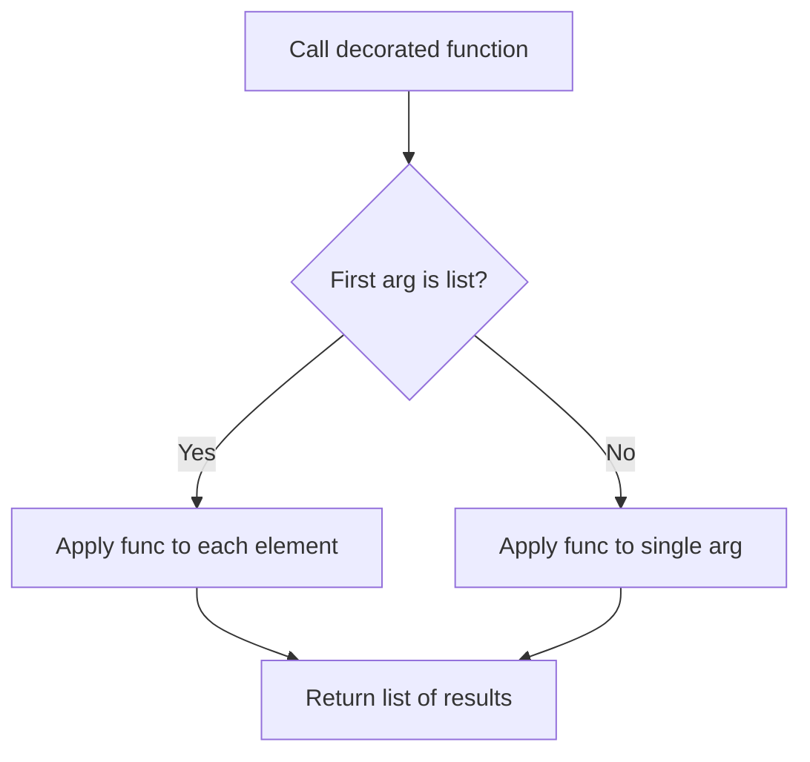
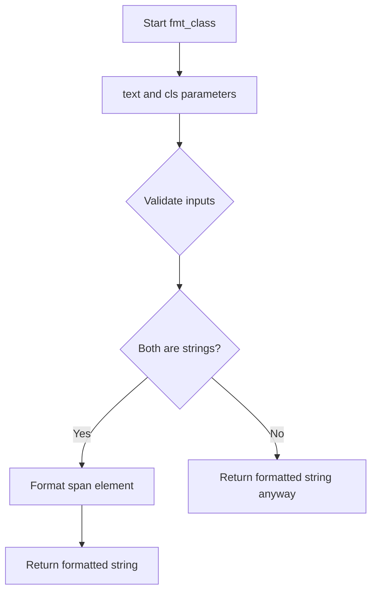
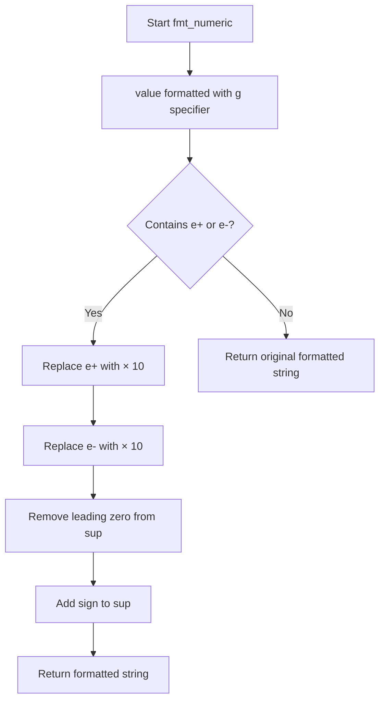
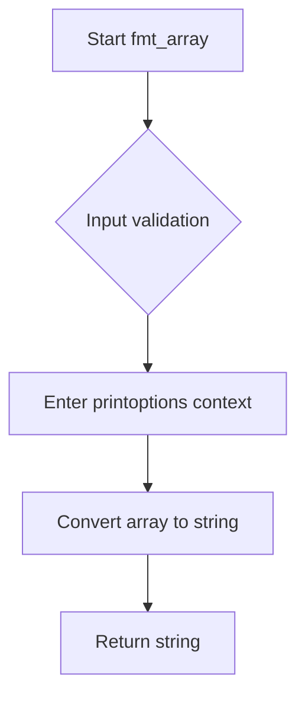

# `formatters.py`

## `src.ydata_profiling.report.formatters.list_args` · *function*

## Summary:
Decorator that enables a function to process both single values and lists of values uniformly.

## Description:
The `list_args` decorator transforms a function to automatically handle both single arguments and lists of arguments by applying the function to each element in the list when a list is provided. This eliminates the need to write separate logic for handling single vs. multiple values.

## Args:
    func (Callable): The function to be decorated, which will be applied to individual elements when the first argument is a list.

## Returns:
    Callable: A wrapped version of the input function that can handle both single values and lists of values.

## Raises:
    None explicitly raised - any exceptions will propagate from the decorated function.

## Constraints:
    Preconditions:
    - The decorated function must be able to accept the same arguments (including *args and **kwargs) that are passed to the wrapper.
    - The first argument to the decorated function determines whether it's treated as a single value or list of values.
    
    Postconditions:
    - When the first argument is a list, the result is a list of the function applied to each element.
    - When the first argument is not a list, the result is the direct application of the function to that argument.

## Side Effects:
    None - the decorator itself doesn't cause any I/O or state changes, though the decorated function might.

## Control Flow:


## Examples:
```python
# Example usage:
@list_args
def square(x):
    return x * x

# Works with single values
result1 = square(5)  # Returns 25

# Works with lists
result2 = square([1, 2, 3])  # Returns [1, 4, 9]
```

## `src.ydata_profiling.report.formatters.fmt_color` · *function*

## Summary:
Wraps text in HTML span tags with specified color styling for report formatting.

## Description:
This function applies HTML color styling to text by wrapping it in a span element with a color CSS property. It serves as a utility for generating colored text in HTML reports within the ydata-profiling library.

## Args:
    text (str): The text content to be colored
    color (str): The CSS color value to apply to the text

## Returns:
    str: HTML formatted string with the text wrapped in a span element having the specified color style

## Raises:
    None: This function does not raise any exceptions

## Constraints:
    Preconditions:
    - Both `text` and `color` parameters must be strings
    - The `color` parameter should contain a valid CSS color specification
    
    Postconditions:
    - The returned string is always a properly formatted HTML span element
    - The text content remains unchanged except for HTML wrapping

## Side Effects:
    None: This function has no side effects beyond returning a formatted string

## Control Flow:
```mermaid
flowchart TD
    A[fmt_color called] --> B{Parameters valid?}
    B -->|Yes| C[Format text with color]
    C --> D[Return HTML span]
    B -->|No| E[Proceed anyway (no validation)]
    E --> D
```

## Examples:
    >>> fmt_color("Error message", "red")
    '<span style="color:red">Error message</span>'
    
    >>> fmt_color("Success", "green")
    '<span style="color:green">Success</span>'

## `src.ydata_profiling.report.formatters.fmt_class` · *function*

## Summary:
Wraps text content in an HTML span element with a specified CSS class attribute.

## Description:
Formats input text by wrapping it in an HTML span tag with the provided CSS class. This utility function is used to apply styling to text elements within generated reports or web interfaces.

## Args:
    text (str): The text content to be wrapped in HTML span tags
    cls (str): The CSS class name to apply to the span element

## Returns:
    str: An HTML string containing the text wrapped in a span element with the specified class

## Raises:
    None: This function does not raise any exceptions

## Constraints:
    Preconditions: Both arguments must be strings
    Postconditions: The returned string will always be a valid HTML span element with the specified class

## Side Effects:
    None: This function has no side effects beyond returning a formatted string

## Control Flow:


## Examples:
    >>> fmt_class("Hello World", "highlight")
    '<span class="highlight">Hello World</span>'
    
    >>> fmt_class("Error message", "error")
    '<span class="error">Error message</span>'

## `src.ydata_profiling.report.formatters.fmt_bytesize` · *function*

## Summary:
Formats numeric byte values into human-readable strings with appropriate binary prefixes.

## Description:
Converts a numeric byte value into a human-readable string representation using binary prefixes (Ki, Mi, Gi, etc.) with one decimal place precision. This utility function is designed to make byte measurements more understandable by automatically selecting the most appropriate unit.

## Args:
    num (float): The numeric byte value to format. Can be any positive or negative floating-point number.
    suffix (str): Optional suffix to append to the unit (default: "B"). Typically "B" for bytes.

## Returns:
    str: A formatted string representing the byte size with appropriate binary prefix and one decimal place precision. Examples include "1.0 KiB", "2.5 MiB", "1023.0 B".

## Raises:
    None: This function does not raise any exceptions under normal operation.

## Constraints:
    Preconditions:
        - Input `num` should be a valid numeric value (float or int)
        - Input `suffix` should be a string
    
    Postconditions:
        - Output string always contains exactly one decimal place
        - Output string includes appropriate binary prefix (Ki, Mi, Gi, Ti, Pi, Ei, Zi, Yi)
        - Output string is always formatted with 3-character width for the numeric part

## Side Effects:
    None: This function has no side effects and is purely a formatting utility.

## Control Flow:
```mermaid
flowchart TD
    A[Start fmt_bytesize] --> B{abs(num) < 1024.0?}
    B -- Yes --> C[Return f"{num:3.1f} {unit}{suffix}"]
    B -- No --> D[num /= 1024.0]
    D --> E[Unit increment]
    E --> F{abs(num) < 1024.0?}
    F -- Yes --> C
    F -- No --> G[Loop back to E]
    G --> H[Return f"{num:.1f} Yi{suffix}"]
```

## Examples:
    >>> fmt_bytesize(1024)
    '1.0 KiB'
    
    >>> fmt_bytesize(1048576)
    '1.0 MiB'
    
    >>> fmt_bytesize(1073741824)
    '1.0 GiB'
    
    >>> fmt_bytesize(512, "B")
    '512.0 B'
    
    >>> fmt_bytesize(-2048)
    '-2.0 KiB'

## `src.ydata_profiling.report.formatters.fmt_percent` · *function*

## Summary:
Formats a floating-point value as a percentage string with special handling for values near 0% and 100%.

## Description:
Converts a decimal value (typically between 0 and 1) into a human-readable percentage string. This function specifically handles edge cases where values are extremely close to 0 or 1 to provide more meaningful display representations rather than showing misleading precision like "0.0%" or "100.0%".

## Args:
    value (float): The decimal value to format as a percentage (typically between 0 and 1)
    edge_cases (bool): Whether to apply special formatting for edge cases near 0% and 100%. Defaults to True.

## Returns:
    str: A formatted percentage string. Returns "< 0.1%" for values that round to 0 but are greater than 0, "> 99.9%" for values that round to 1 but are less than 1, and standard formatted percentage otherwise.

## Raises:
    None explicitly raised

## Constraints:
    Preconditions:
    - Input value should be a valid float between 0 and 1 (inclusive)
    - When edge_cases=True, the function applies special rounding logic using round(value, 3)
    
    Postconditions:
    - Output is always a string ending with "%"
    - Special edge case handling only applies when edge_cases=True
    - Values that are exactly 0 or 1 will be formatted normally unless edge_cases=False

## Side Effects:
    None

## Control Flow:
```mermaid
flowchart TD
    A[Start fmt_percent] --> B{edge_cases is True?}
    B -- No --> C[Format as {value*100:2.1f}%]
    B -- Yes --> D{round(value,3) == 0 AND value > 0?}
    D -- Yes --> E[Return "< 0.1%"]
    D -- No --> F{round(value,3) == 1 AND value < 1?}
    F -- Yes --> G[Return "> 99.9%"]
    F -- No --> C
    C --> H[End]
    E --> H
    G --> H
```

## Examples:
    >>> fmt_percent(0.0005)
    '< 0.1%'
    >>> fmt_percent(0.9995)
    '> 99.9%'
    >>> fmt_percent(0.5)
    '50.0%'
    >>> fmt_percent(0.0001, edge_cases=False)
    '0.0%'
    >>> fmt_percent(0.0)
    '0.0%'
    >>> fmt_percent(1.0)
    '100.0%'
```

## `src.ydata_profiling.report.formatters.fmt_timespan` · *function*

## Summary:
Formats numeric time values into human-readable string representations with appropriate time units.

## Description:
Converts a time duration expressed in seconds (or timedelta objects) into a readable string format using appropriate time units like seconds, minutes, hours, days, etc. The function automatically selects the most suitable time units based on the magnitude of the input value and can provide either concise or detailed representations.

## Args:
    num_seconds (Any): Time duration in seconds or timedelta object to format. Can be int, float, or timedelta.
    detailed (bool): If True, includes all applicable time units. If False, only includes the most significant units. Defaults to False.
    max_units (int): Maximum number of time units to display when not in detailed mode. Defaults to 3.

## Returns:
    str: Human-readable time duration string with appropriate units. Examples include "5 seconds", "2 minutes and 30 seconds", or "1 day, 2 hours and 30 minutes".

## Raises:
    None explicitly raised, though conversion errors may occur if num_seconds cannot be converted to float.

## Constraints:
    Preconditions:
    - num_seconds must be convertible to a numeric value (int, float, or timedelta)
    - max_units must be a positive integer
    
    Postconditions:
    - Returns a properly formatted string with correct pluralization
    - All returned strings are human-readable and grammatically correct

## Side Effects:
    None

## Control Flow:
```mermaid
flowchart TD
    A[Start fmt_timespan] --> B{num_seconds < 60 AND not detailed?}
    B -- Yes --> C[round_number(num_seconds)]
    C --> D[pluralize(count, "second")]
    B -- No --> E[num_seconds = coerce_seconds(num_seconds)]
    E --> F[num_seconds = decimal.Decimal(str(num_seconds))]
    F --> G{detailed?}
    G -- Yes --> H[relevant_units = reversed(time_units[0:])]
    G -- No --> I[relevant_units = reversed(time_units[3:])]
    H --> J[Iterate through relevant_units]
    I --> J
    J --> K{unit != last_unit?}
    K -- Yes --> L[count = int(num_seconds / divider)]
    K -- No --> M[count = round_number(num_seconds / divider)]
    L --> N{count not in (0, "0")?}
    M --> N
    N -- Yes --> O[Append pluralize(count, singular, plural) to result]
    N -- No --> P[Continue loop]
    J --> Q{len(result) == 1?}
    Q -- Yes --> R[Return result[0]]
    Q -- No --> S{not detailed?}
    S -- Yes --> T[result = result[:max_units]]
    S -- No --> U[result unchanged]
    T --> V[concatenate(result)]
    U --> V
    V --> W[End]
```

## Examples:
    >>> fmt_timespan(30)
    '30 seconds'
    
    >>> fmt_timespan(125)
    '2 minutes and 5 seconds'
    
    >>> fmt_timespan(3661, detailed=True)
    '1 hour, 1 minute and 1 second'
    
    >>> fmt_timespan(3661, max_units=2)
    '1 hour and 1 minute'
```

## `src.ydata_profiling.report.formatters.fmt_timespan_timedelta` · *function*

## Summary:
Formats time span values represented as pandas Timedelta objects or numeric values into human-readable string representations.

## Description:
This function serves as a type-aware formatter that processes time span values. When given a pandas Timedelta object, it converts the duration to seconds and applies time unit formatting. For other numeric values, it applies general numeric formatting with scientific notation support. This extraction provides a unified interface for formatting time spans regardless of their input representation.

## Args:
    delta (Any): Input time span value that can be either a pandas Timedelta object or a numeric value (int, float).
    detailed (bool): If True, includes all applicable time units in the output. If False, only includes the most significant units. Defaults to False.
    max_units (int): Maximum number of time units to display when not in detailed mode. Defaults to 3.
    precision (int): Number of significant digits to display for numeric values. Defaults to 10.

## Returns:
    str: Human-readable string representation of the time span. For Timedelta inputs, returns formatted time units (e.g., "2 minutes and 30 seconds"). For numeric inputs, returns formatted numeric values with scientific notation support.

## Raises:
    None explicitly raised.

## Constraints:
    Preconditions:
    - The delta parameter must be either a pandas Timedelta object or a numeric type that can be processed by the underlying formatting functions
    - When delta is a Timedelta, it must be a valid pandas Timedelta object
    - When delta is numeric, it must be convertible to a numeric type
    
    Postconditions:
    - Returns a properly formatted string representation of the time span
    - For Timedelta inputs, the result follows standard time unit formatting conventions
    - For numeric inputs, the result follows standard numeric formatting conventions

## Side Effects:
    None

## Control Flow:
```mermaid
flowchart TD
    A[Start fmt_timespan_timedelta] --> B{isinstance(delta, pd.Timedelta)?}
    B -- Yes --> C[num_seconds = delta.total_seconds()]
    C --> D{delta.microseconds > 0?}
    D -- Yes --> E[num_seconds += delta.microseconds * 1e-6]
    E --> F{delta.nanoseconds > 0?}
    F -- Yes --> G[num_seconds += delta.nanoseconds * 1e-9]
    G --> H[fmt_timespan(num_seconds, detailed, max_units)]
    B -- No --> I[fmt_numeric(delta, precision)]
    H --> J[Return formatted timespan]
    I --> J
```

## Examples:
    >>> fmt_timespan_timedelta(pd.Timedelta('2 minutes 30 seconds'))
    '2 minutes and 30 seconds'
    
    >>> fmt_timespan_timedelta(pd.Timedelta('1 day 2 hours 30 minutes'), detailed=True)
    '1 day, 2 hours and 30 minutes'
    
    >>> fmt_timespan_timedelta(123.456)
    '123.456'
    
    >>> fmt_timespan_timedelta(1.23e-4)
    '1.23 × 10<sup>-4</sup>'

## `src.ydata_profiling.report.formatters.fmt_numeric` · *function*

## Summary:
Formats numeric values with scientific notation support and HTML superscript formatting.

## Description:
Converts floating-point numbers into human-readable string representations, with special handling for scientific notation by converting it to HTML superscript format. This function is designed to produce clean, readable numeric output suitable for reports and displays.

## Args:
    value (float): The numeric value to format.
    precision (int): Number of significant digits to display. Defaults to 10.

## Returns:
    str: Formatted string representation of the numeric value. Scientific notation is converted to HTML format with superscript exponents.

## Raises:
    None explicitly raised.

## Constraints:
    Preconditions:
    - The value parameter must be a numeric type that can be formatted with Python's 'g' format specifier
    - Precision must be a non-negative integer
    
    Postconditions:
    - Returns a string representation of the input value
    - Scientific notation is converted to HTML format with proper superscript handling

## Side Effects:
    None.

## Control Flow:


## Examples:
    >>> fmt_numeric(123.456)
    '123.456'
    
    >>> fmt_numeric(1.23e-4)
    '1.23 × 10<sup>-4</sup>'
    
    >>> fmt_numeric(1.23e5, precision=3)
    '1.23 × 10<sup>5</sup>'
```

## `src.ydata_profiling.report.formatters.fmt_number` · *function*

## Summary:
Formats an integer value with locale-aware number grouping.

## Description:
The `fmt_number` function applies locale-specific number formatting to integer values using Python's built-in f-string formatting with the 'n' format specifier. This ensures proper display with thousands separators according to the system's locale settings.

## Args:
    value (int): The integer value to be formatted with locale-aware grouping.

## Returns:
    str: A string representation of the integer with appropriate thousands separators based on the system locale.

## Raises:
    None explicitly raised - the function relies on Python's built-in formatting which handles basic integer conversion errors internally.

## Constraints:
    Preconditions:
    - The input value must be an integer type (or convertible to integer)
    - The function expects an integer argument as specified in the type hint
    
    Postconditions:
    - The returned string will contain the integer value with locale-appropriate grouping separators
    - The function will not modify any global state or external resources

## Side Effects:
    None - the function is pure and has no side effects.

## Control Flow:
```mermaid
flowchart TD
    A[Call fmt_number] --> B{Input validation}
    B --> C[Format using f"{value:n}"]
    C --> D[Return formatted string]
```

## Examples:
```python
# Basic usage
formatted = fmt_number(1234567)
# Returns "1,234,567" in US locale or "1.234.567" in European locale

# With negative numbers
formatted = fmt_number(-987654321)
# Returns "-987,654,321" in US locale

# With zero
formatted = fmt_number(0)
# Returns "0"
```

## `src.ydata_profiling.report.formatters.fmt_array` · *function*

## Summary:
Formats a numpy array with controlled display options for concise representation.

## Description:
Converts a numpy array to a string representation with limited display of array elements. This function uses numpy's printoptions context manager to control how arrays are displayed, particularly limiting the number of items shown in the middle of large arrays while maintaining readability.

## Args:
    value (np.ndarray): The numpy array to format as a string
    threshold (Any, optional): Controls the number of array items displayed at the edges. Defaults to np.nan which typically means use numpy's default behavior.

## Returns:
    str: String representation of the formatted numpy array with controlled element display

## Raises:
    None explicitly raised by this function

## Constraints:
    Preconditions:
    - The input `value` must be a valid numpy ndarray
    - The `threshold` parameter should be compatible with numpy's printoptions
    
    Postconditions:
    - Returns a string representation of the input array
    - The formatting is temporary and doesn't affect global numpy settings

## Side Effects:
    None

## Control Flow:


## Examples:
    >>> import numpy as np
    >>> arr = np.array([1, 2, 3, 4, 5, 6, 7, 8, 9, 10])
    >>> fmt_array(arr)
    '[1 2 3 ... 8 9 10]'
    
    >>> arr = np.array([[1, 2, 3], [4, 5, 6], [7, 8, 9]])
    >>> fmt_array(arr)
    '[[1 2 3]\n [4 5 6]\n [7 8 9]]'

## `src.ydata_profiling.report.formatters.fmt` · *function*

## Summary:
Formats values for display by applying appropriate formatting based on value type, with special handling for numeric values and HTML escaping for non-numeric values.

## Description:
This function provides a unified interface for formatting values for display in reports or user interfaces. It applies different formatting strategies depending on whether the input value is numeric (float or int) or other types. For numeric values, it delegates to `fmt_numeric` which handles scientific notation and HTML formatting. For non-numeric values, it applies HTML escaping to prevent XSS vulnerabilities while converting to string representation.

The function is designed to be used in report generation contexts where values need safe, readable formatting for display purposes.

## Args:
    value (Any): The value to format for display. Can be of any type.

## Returns:
    str: A formatted string representation of the input value. Numeric values are formatted with scientific notation support, while other values are HTML-escaped and converted to strings.

## Raises:
    None explicitly raised.

## Constraints:
    Preconditions:
    - Input value can be of any type
    - The `fmt_numeric` function must handle the numeric formatting properly
    - The `escape` function from markupsafe must properly escape HTML characters
    
    Postconditions:
    - Returns a string representation of the input value
    - Numeric values are formatted with scientific notation support
    - Non-numeric values are HTML-escaped to prevent XSS vulnerabilities

## Side Effects:
    None.

## Control Flow:
```mermaid
flowchart TD
    A[Start fmt] --> B{Value type is float or int?}
    B -->|Yes| C[Call fmt_numeric(value)]
    B -->|No| D[Call escape(value) then str()]
    C --> E[Return formatted numeric string]
    D --> E
```

## Examples:
    >>> fmt(123.456)
    '123.456'
    
    >>> fmt(1.23e-4)
    '1.23 × 10<sup>-4</sup>'
    
    >>> fmt("hello <script>")
    'hello &lt;script&gt;'
    
    >>> fmt(True)
    'True'
```

## `src.ydata_profiling.report.formatters.fmt_monotonic` · *function*

## Summary:
Converts integer monotonicity codes into human-readable descriptive strings.

## Description:
Maps integer values representing different monotonicity types to their corresponding textual descriptions. This function serves as a formatter to translate numerical monotonicity indicators into meaningful labels for display purposes.

## Args:
    value (int): Integer code representing monotonicity type, ranging from -2 to 2 inclusive.
        - -2: Strictly decreasing
        - -1: Decreasing  
        - 0: Not monotonic
        - 1: Increasing
        - 2: Strictly increasing

## Returns:
    str: Human-readable description of the monotonicity type:
        - "Strictly increasing" for value = 2
        - "Increasing" for value = 1
        - "Not monotonic" for value = 0
        - "Decreasing" for value = -1
        - "Strictly decreasing" for value = -2

## Raises:
    ValueError: When the input value is not an integer in the range [-2, 2].

## Constraints:
    Preconditions:
        - Input must be an integer
        - Input must be within the range [-2, 2]
    Postconditions:
        - Always returns a string matching one of the predefined monotonicity descriptions

## Side Effects:
    None

## Control Flow:
```mermaid
flowchart TD
    A[Start fmt_monotonic] --> B{value == 2?}
    B -- Yes --> C[Return "Strictly increasing"]
    B -- No --> D{value == 1?}
    D -- Yes --> E[Return "Increasing"]
    D -- No --> F{value == 0?}
    F -- Yes --> G[Return "Not monotonic"]
    F -- No --> H{value == -1?}
    H -- Yes --> I[Return "Decreasing"]
    H -- No --> J{value == -2?}
    J -- Yes --> K[Return "Strictly decreasing"]
    J -- No --> L[Raise ValueError]
```

## Examples:
```python
# Basic usage
fmt_monotonic(2)    # Returns "Strictly increasing"
fmt_monotonic(1)    # Returns "Increasing"
fmt_monotonic(0)    # Returns "Not monotonic"
fmt_monotonic(-1)   # Returns "Decreasing"
fmt_monotonic(-2)   # Returns "Strictly decreasing"

# Error case
fmt_monotonic(5)    # Raises ValueError: Value should be integer ranging from -2 to 2.
```

## `src.ydata_profiling.report.formatters.help` · *function*

## Summary:
Generates HTML markup for a help badge that displays a question mark icon with tooltip functionality.

## Description:
Creates an HTML element that displays a blue question mark badge with a tooltip showing the provided title. When a URL is provided, the badge becomes a clickable link that opens the URL in a new tab. This function is used to add contextual help elements to reports and dashboards.

## Args:
    title (str): Text to display in the tooltip when hovering over the help badge.
    url (Optional[str]): URL to link the help badge to. If None, creates a static badge without hyperlink functionality.

## Returns:
    str: HTML string containing the help badge element. Returns a link element when URL is provided, otherwise returns a span element.

## Raises:
    No exceptions are raised by this function.

## Constraints:
    Preconditions:
    - The title parameter must be a string
    - The url parameter, if provided, must be a valid URL string or None
    
    Postconditions:
    - Always returns a valid HTML string
    - The returned HTML follows Bootstrap styling conventions

## Side Effects:
    None - This function has no side effects as it only performs string formatting and returns HTML.

## Control Flow:
```mermaid
flowchart TD
    A[Start help()] --> B{url is not None?}
    B -- Yes --> C[Create anchor tag with href]
    B -- No --> D[Create span tag only]
    C --> E[Return HTML string]
    D --> E
```

## Examples:
    >>> help("Column statistics")
    '<span class="badge pull-right" style="color:#fff;background-color:#337ab7;" title="Column statistics">?</span>'
    
    >>> help("Data quality report", "https://example.com/docs")
    '<a title="Data quality report" href="https://example.com/docs"><span class="badge pull-right" style="color:#fff;background-color:#337ab7;" title="Data quality report">?</span></a>'

## `src.ydata_profiling.report.formatters.fmt_badge` · *function*

## Summary:
Converts parenthetical numeric values in a string into HTML badge elements.

## Description:
Formats a string by replacing patterns matching "(number)" with "<span class=\"badge\">number</span>" HTML elements. This function is used to enhance report output by visually highlighting numeric counts or statistics within text.

## Args:
    value (str): Input string that may contain parenthetical numeric values to be converted into badges.

## Returns:
    str: The formatted string with parenthetical numbers replaced by HTML badge elements.

## Raises:
    None

## Constraints:
    Preconditions:
        - Input value must be a string
    Postconditions:
        - All occurrences of "(number)" patterns are replaced with badge HTML elements
        - Non-matching text remains unchanged

## Side Effects:
    None

## Control Flow:
```mermaid
flowchart TD
    A[Input String] --> B{Contains "(\\d+)" pattern?}
    B -- Yes --> C[Replace with <span class="badge">\\1</span>]
    B -- No --> D[Return original string]
    C --> E[Output formatted string]
    D --> E
```

## Examples:
    >>> fmt_badge("Items (5)")
    'Items <span class="badge">5</span>'
    
    >>> fmt_badge("Errors (12) and Warnings (3)")
    'Errors <span class="badge">12</span> and Warnings <span class="badge">3</span>'
    
    >>> fmt_badge("No numbers here")
    'No numbers here'

