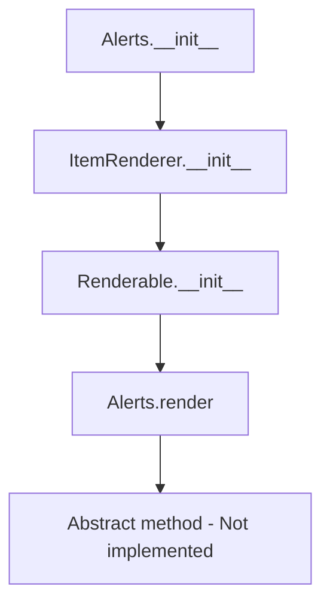

# `alerts.py`

## `src.ydata_profiling.report.presentation.core.alerts.Alerts` · *class*

## Summary:
Represents a container for displaying data quality alerts in profiling reports, inheriting from ItemRenderer for presentation layer integration.

## Description:
The Alerts class serves as a presentation layer component that encapsulates and renders data quality alerts generated during the profiling process. It inherits from ItemRenderer, making it part of the report's hierarchical structure for rendering UI components. This class is responsible for managing collections of Alert objects and their associated styling configuration for display purposes.

The Alerts class is typically instantiated by profiling components when data quality issues are detected and needs to be presented in the final report. It accepts either a list of alerts or a dictionary mapping categories to lists of alerts, along with styling configuration.

## State:
- alerts: Union[List[Alert], Dict[str, List[Alert]]] - Collection of alert objects to be displayed, either as a flat list or categorized by type
- style: Style - Configuration object containing visual styling parameters for the alerts display
- item_type: str - Set to "alerts" by constructor, identifies this component type in the rendering hierarchy
- content: dict - Dictionary containing the alerts and style configuration, inherited from Renderable base class

## Lifecycle:
- Creation: Instantiate with alerts collection and style configuration; accepts optional keyword arguments for additional rendering parameters
- Usage: Typically rendered by the report generation system through the abstract render() method, which must be implemented by subclasses
- Destruction: Managed automatically by Python's garbage collection

## Method Map:


## Raises:
- No explicit exceptions raised in __init__ method
- NotImplementedError raised by render() method (must be implemented by subclasses)

## Example:
```python
from ydata_profiling.model.alerts import Alert, AlertType
from ydata_profiling.config import Style
from ydata_profiling.report.presentation.core.alerts import Alerts

# Create sample alerts
alert1 = Alert(alert_type=AlertType.MISSING_VALUES, column_name="column1")
alert2 = Alert(alert_type=AlertType.HIGH_CORRELATION, column_name="column2")

# Create style configuration
style = Style(primary_colors=["#ff0000"])

# Create Alerts instance with list of alerts
alerts_container = Alerts(alerts=[alert1, alert2], style=style)

# Create Alerts instance with categorized alerts
categorized_alerts = {
    "missing_values": [alert1],
    "correlations": [alert2]
}
alerts_container = Alerts(alerts=categorized_alerts, style=style)
```

### `src.ydata_profiling.report.presentation.core.alerts.Alerts.__init__` · *method*

## Summary:
Initializes an Alerts object with a collection of data quality alerts and styling configuration for report presentation.

## Description:
Constructs an Alerts instance that encapsulates data quality alerts for display in profiling reports. This method sets up the presentation layer component by storing the alerts collection and styling information, making it ready for rendering in the final report output.

The Alerts class is typically instantiated by profiling components when data quality issues are detected and need to be presented in the final report. This constructor accepts either a flat list of alerts or a dictionary mapping categories to lists of alerts, along with styling configuration.

## Args:
    alerts (Union[List[Alert], Dict[str, List[Alert]]]): Collection of alert objects to be displayed, either as a flat list or categorized by type (e.g., by alert type or column).
    style (Style): Configuration object containing visual styling parameters for the alerts display.
    **kwargs: Additional keyword arguments passed to the parent ItemRenderer constructor for optional rendering parameters like name, anchor_id, and classes.

## Returns:
    None: This method initializes the object's state but does not return a value.

## Raises:
    No explicit exceptions raised by this method. However, the parent ItemRenderer.__init__ may raise exceptions if invalid parameters are passed through **kwargs.

## State Changes:
    Attributes READ: None
    Attributes WRITTEN: 
    - self.item_type: Set to "alerts" string identifier
    - self.content: Dictionary containing the alerts and style configuration
    - Other attributes inherited from parent classes (name, anchor_id, classes) via **kwargs

## Constraints:
    Preconditions:
    - alerts parameter must be either a List[Alert] or Dict[str, List[Alert]]
    - style parameter must be a valid Style configuration object
    - All Alert objects in the alerts collection must be properly initialized
    
    Postconditions:
    - The object is initialized with item_type set to "alerts"
    - The content dictionary contains both alerts and style keys
    - The object is ready for rendering by the report generation system

## Side Effects:
    None: This method performs no I/O operations, external service calls, or mutations to objects outside self.

### `src.ydata_profiling.report.presentation.core.alerts.Alerts.__repr__` · *method*

## Summary:
Returns a string representation of the Alerts object, indicating its type as "Alerts".

## Description:
Provides a simple string representation for Alerts objects, returning the literal string "Alerts". This method is typically used for debugging and logging purposes to quickly identify the type of object being displayed.

## Args:
    None: This method takes no arguments beyond the implicit self parameter.

## Returns:
    str: The string "Alerts" that identifies this object type.

## Raises:
    None: This method does not raise any exceptions.

## State Changes:
    Attributes READ: None - This method does not read any instance attributes.
    Attributes WRITTEN: None - This method does not modify any instance attributes.

## Constraints:
    Preconditions: None - There are no requirements for the object state before calling this method.
    Postconditions: None - The method does not guarantee any specific post-state for the object.

## Side Effects:
    None: This method performs no I/O operations, external service calls, or mutations to objects outside self.

### `src.ydata_profiling.report.presentation.core.alerts.Alerts.render` · *method*

## Summary:
Renders the collection of alerts into a presentation-ready format for display in reports.

## Description:
This method is responsible for converting the stored collection of alerts into a format suitable for presentation in profiling reports. As an abstract method inherited from the Renderable base class, it must be implemented by concrete subclasses to define how alerts should be rendered. Currently, this implementation raises NotImplementedError, indicating that a concrete implementation is expected in derived classes.

The method operates on the alerts collection stored in the instance's content dictionary, which contains both the alert objects and styling information. This method is typically called during report generation when the presentation layer needs to render alert information to the user interface.

## Args:
    None

## Returns:
    Any: The rendered representation of the alerts, typically HTML or another presentation format, though the exact return type depends on the implementing subclass.

## Raises:
    NotImplementedError: Always raised by this base implementation, indicating that concrete subclasses must override this method with their own rendering logic.

## State Changes:
    Attributes READ: 
    - self.content (accesses the 'alerts' and 'style' keys)
    - self.item_type (inherited from parent class)
    
    Attributes WRITTEN: None

## Constraints:
    Preconditions:
    - The instance must have been properly initialized with valid alert data and style configuration
    - The alerts collection in self.content['alerts'] must be either a List[Alert] or Dict[str, List[Alert]]
    - The style parameter in self.content['style'] must be a valid Style object
    
    Postconditions:
    - The method will raise NotImplementedError unless overridden by a concrete implementation
    - If implemented, the returned value should be presentation-ready format appropriate for the target output medium

## Side Effects:
    None

