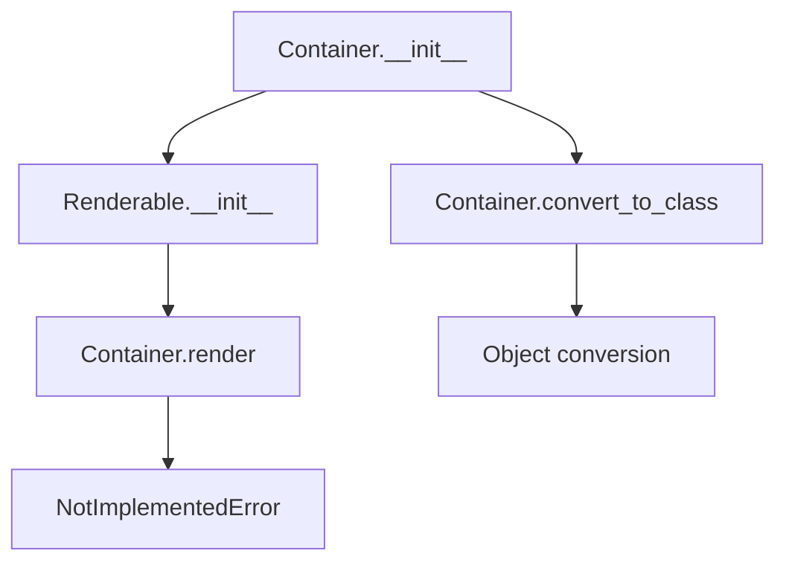

# `container.py`

## `src.ydata_profiling.report.presentation.core.container.Container` · *class*

## Summary:
A Container is a renderable component that holds a sequence of other renderable items and defines their presentation structure.

## Description:
The Container class serves as a structural element in the report presentation layer, grouping multiple renderable components together. It acts as a container for organizing and presenting collections of UI elements such as charts, tables, or text components. Container instances are typically created by presentation layer components when building hierarchical report structures.

The motivation for this abstraction is to provide a standardized way to group related renderable components while maintaining their individual presentation properties. It enforces a clear boundary between the structural organization of report elements and their individual rendering behavior.

## State:
- items: Sequence[Renderable] - A collection of renderable components stored in this container
- sequence_type: str - Defines the type or category of sequence being represented (e.g., "row", "column", "grid")
- nested: bool - Flag indicating whether this container is nested within another container
- name: Optional[str] - An optional identifier for the container
- anchor_id: Optional[str] - An optional anchor identifier for HTML linking
- classes: Optional[str] - CSS classes to apply to the rendered container
- content: Dict[str, Any] - Inherited from Renderable, contains all configuration data

## Lifecycle:
- Creation: Instantiate with a sequence of Renderable items, a sequence_type string, and optional metadata parameters
- Usage: Containers are part of a hierarchy where each container implements the abstract render() method to define how its contents should be rendered
- Destruction: No explicit cleanup required; relies on Python garbage collection

## Method Map:


## Raises:
- NotImplementedError: Raised by the render() method, which must be implemented by subclasses

## Example:
```python
from ydata_profiling.report.presentation.core.container import Container
from ydata_profiling.report.presentation.core.renderable import Renderable

# Create a container with items
items = [some_renderable_item1, some_renderable_item2]
container = Container(
    items=items,
    sequence_type="row",
    name="my_container",
    anchor_id="container_1"
)

# Convert existing object to container type
Container.convert_to_class(existing_object, lambda x: x)
```

### `src.ydata_profiling.report.presentation.core.container.Container.__init__` · *method*

## Summary:
Initializes a Container instance with renderable items and structural metadata, setting up its internal content dictionary and sequence type.

## Description:
The Container.__init__ method constructs a container object that groups multiple renderable components together. It initializes the container's internal state by storing the provided items, sequence type, and optional metadata while delegating the core initialization to its parent Renderable class.

This method establishes the foundational structure of a container in the report presentation hierarchy by ensuring all renderable items are properly encapsulated within a container with defined presentation characteristics. The method prepares the container's content dictionary with the items and nested flags, and stores the sequence type for later rendering decisions.

## Args:
    items (Sequence[Renderable]): A sequence of renderable components to be contained within this container
    sequence_type (str): Defines the type or category of sequence being represented (e.g., "row", "column", "grid")
    nested (bool): Flag indicating whether this container is nested within another container. Defaults to False
    name (Optional[str]): An optional identifier for the container. Defaults to None
    anchor_id (Optional[str]): An optional anchor identifier for HTML linking. Defaults to None
    classes (Optional[str]): CSS classes to apply to the rendered container. Defaults to None
    **kwargs: Additional keyword arguments that are merged into the internal arguments dictionary

## Returns:
    None: This method initializes the object state and does not return a value

## Raises:
    None: This method does not explicitly raise exceptions, though parent class initialization may raise exceptions

## State Changes:
    Attributes READ: None
    Attributes WRITTEN: 
    - self.sequence_type: Set to the provided sequence_type parameter
    - self.content: Modified through parent Renderable.__init__ call, containing "items" and "nested" keys

## Constraints:
    Preconditions:
    - items must be a sequence of Renderable objects
    - sequence_type must be a string defining the container's structural type
    - All arguments must be compatible with the parent Renderable.__init__ method signature
    
    Postconditions:
    - self.sequence_type is set to the provided sequence_type value
    - The container's content dictionary is properly initialized with items and nested flag
    - All metadata parameters (name, anchor_id, classes) are stored in the content dictionary via parent initialization

## Side Effects:
    None: This method performs no I/O operations or external service calls. It only manipulates internal object state.

### `src.ydata_profiling.report.presentation.core.container.Container.__str__` · *method*

## Summary:
Returns a formatted string representation of the Container and its contained items.

## Description:
This method provides a human-readable string representation of the Container object, displaying the container type followed by a list of its items with proper indentation. It's primarily used for debugging and logging purposes to visualize the structure of containers in the report presentation layer.

## Args:
    None

## Returns:
    str: A formatted string showing "Container" followed by numbered items, each indented on new lines if they contain newlines themselves.

## Raises:
    None

## State Changes:
    Attributes READ: self.content
    Attributes WRITTEN: None

## Constraints:
    Preconditions: The Container instance must have a content attribute that is a dictionary containing an "items" key if items are to be displayed.
    Postconditions: The returned string is always a properly formatted representation of the container structure.

## Side Effects:
    None

### `src.ydata_profiling.report.presentation.core.container.Container.__repr__` · *method*

## Summary:
Returns a string representation of the Container object that includes its name when available.

## Description:
This special method provides a string representation of the Container instance for debugging and logging purposes. It checks if the container has a name attribute in its content dictionary and formats the output accordingly.

## Args:
    None

## Returns:
    str: A string representation of the container. If the container has a name, returns "Container(name=<name>)", otherwise returns "Container".

## Raises:
    None

## State Changes:
    Attributes READ: self.content
    Attributes WRITTEN: None

## Constraints:
    Preconditions: The object must be an instance of Container class
    Postconditions: Returns a string representation that can be used for debugging

## Side Effects:
    None

### `src.ydata_profiling.report.presentation.core.container.Container.render` · *method*

## Summary:
Renders the container's collection of child renderable elements into a structured output representation.

## Description:
This abstract method defines the interface for rendering a container of renderable items. As a subclass of Renderable, Container must implement this method to define how its contained items should be processed and presented. The method is intended to be overridden by concrete container implementations that specify how to aggregate or format the rendered output of child elements.

## Args:
    None

## Returns:
    Any: The rendered representation of the container and its children, typically a structured format suitable for report generation (HTML, JSON, etc.)

## Raises:
    NotImplementedError: Always raised by the base Container class implementation, indicating that subclasses must override this method with their specific rendering logic.

## State Changes:
    Attributes READ: 
    - self.content["items"]: The sequence of Renderable objects stored in the container
    - self.sequence_type: The type identifier for the container's sequence structure
    
    Attributes WRITTEN: None

## Constraints:
    Preconditions:
    - The container must have been properly initialized with items and sequence_type
    - Child items in self.content["items"] must be valid Renderable objects
    
    Postconditions:
    - Must return a valid rendering representation when implemented
    - Should handle empty containers gracefully

## Side Effects:
    None

### `src.ydata_profiling.report.presentation.core.container.Container.convert_to_class` · *method*

## Summary:
Changes the class of a Renderable object to the specified class and processes contained items with a callback function.

## Description:
This classmethod transforms a Renderable object by changing its class to the specified class, effectively converting its type while preserving its content structure. When the object contains items (as indicated by the presence of "items" in its content dictionary), it applies the provided callback function to each item in the collection.

## Args:
    cls: The target class to convert the object to
    obj: A Renderable object whose class will be changed
    flv: A callable function that will be applied to each item in obj.content["items"] if present

## Returns:
    None: This method modifies the object in-place and does not return anything

## Raises:
    None explicitly raised: The method assumes the provided arguments are valid and doesn't raise explicit exceptions

## State Changes:
    Attributes READ: obj.content
    Attributes WRITTEN: obj.__class__ (modified in-place)

## Constraints:
    Preconditions:
    - obj must be an instance of Renderable or a subclass
    - obj.content must be a dictionary-like object
    - flv must be callable if "items" key exists in obj.content
    
    Postconditions:
    - obj.__class__ will be set to cls
    - If items exist, flv will be called once for each item in obj.content["items"]

## Side Effects:
    None: The method only modifies the object's class and applies a callback function to items, but doesn't perform I/O operations or mutate external state

