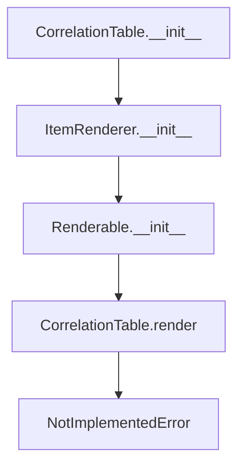

# `correlation_table.py`

## `src.ydata_profiling.report.presentation.core.correlation_table.CorrelationTable` · *class*

## Summary:
Represents a correlation table visualization component for data profiling reports.

## Description:
The CorrelationTable class is a presentation layer component that encapsulates correlation matrix data for visualization in profiling reports. It inherits from ItemRenderer and serves as a container for correlation matrix data that will be rendered in a specific format. This class is part of the report presentation core components and is designed to be used in data profiling dashboards to display correlation relationships between variables.

## State:
- `item_type`: str, set to "correlation_table" by constructor, identifies the type of presentation item
- `content`: dict, contains the correlation_matrix DataFrame under the key "correlation_matrix"
- `name`: str, optional name identifier for the correlation table
- `anchor_id`: str, optional anchor identifier for HTML linking
- `classes`: str, optional CSS classes for styling

The constructor parameters:
- `name` (str): Required name for identifying the correlation table
- `correlation_matrix` (pd.DataFrame): Required DataFrame containing correlation coefficients
- `**kwargs`: Additional optional parameters for styling and identification

## Lifecycle:
Creation: Instantiate with a name string and correlation_matrix DataFrame
Usage: Typically used as part of a report generation pipeline where render() would be called
Destruction: No special cleanup required; relies on Python garbage collection

## Method Map:


## Raises:
- NotImplementedError: When the render() method is called (as it's abstract in the base class)

## Example:
```python
import pandas as pd
from ydata_profiling.report.presentation.core.correlation_table import CorrelationTable

# Create a correlation matrix
corr_matrix = pd.DataFrame({
    'A': [1.0, 0.5, -0.3],
    'B': [0.5, 1.0, 0.2],
    'C': [-0.3, 0.2, 1.0]
})

# Create correlation table component
corr_table = CorrelationTable("My Correlation Table", corr_matrix)

# The component can be added to a report structure
# Note: render() raises NotImplementedError and needs to be implemented
```

### `src.ydata_profiling.report.presentation.core.correlation_table.CorrelationTable.__init__` · *method*

## Summary:
Initializes a correlation table presentation component with a correlation matrix and associated metadata.

## Description:
Constructs a CorrelationTable object that encapsulates a correlation matrix for visualization in report presentations. This method sets up the internal state with the provided correlation matrix and configuration parameters, preparing it for rendering in report templates. The correlation table is designed to display relationships between variables in a structured format.

## Args:
    name (str): Unique identifier for this correlation table component
    correlation_matrix (pd.DataFrame): A pandas DataFrame containing correlation coefficients between variables, typically ranging from -1 to 1
    **kwargs: Additional keyword arguments passed to the parent ItemRenderer class for optional configuration

## Returns:
    None: This method initializes the object state and does not return a value

## Raises:
    TypeError: May be raised by the parent ItemRenderer class if invalid parameter types are provided
    ValueError: May be raised by the parent ItemRenderer class if invalid parameter values are provided

## State Changes:
    Attributes READ: None
    Attributes WRITTEN: 
    - self.item_type: Set to "correlation_table" 
    - Content dictionary populated with "correlation_matrix" key
    - Other attributes inherited from ItemRenderer parent class

## Constraints:
    Preconditions:
    - correlation_matrix must be a valid pandas DataFrame containing numeric correlation values
    - name must be a string or None
    - All kwargs must be valid parameters for the parent ItemRenderer class
    
    Postconditions:
    - The object is initialized with item_type set to "correlation_table"
    - The correlation_matrix is stored in the content dictionary under the key "correlation_matrix"
    - The object maintains compatibility with the report presentation framework

## Side Effects:
    None: This method performs no I/O operations or external service calls

### `src.ydata_profiling.report.presentation.core.correlation_table.CorrelationTable.__repr__` · *method*

## Summary:
Returns a string representation of the CorrelationTable instance, identifying it as a correlation table renderer.

## Description:
This method provides a human-readable string representation of the CorrelationTable object. It is part of the standard Python object protocol and is called by built-in functions like `repr()` and when the object is displayed in interactive environments. The method returns a constant string "CorrelationTable" that identifies the type of object without including detailed internal state information.

This method is particularly useful for debugging and logging purposes, allowing developers to quickly identify CorrelationTable instances in console output or error messages. The method is intentionally simple and lightweight, as it doesn't need to access or process the internal state of the object.

## Args:
    None

## Returns:
    str: The string "CorrelationTable" that uniquely identifies this class type.

## Raises:
    None

## State Changes:
    Attributes READ: None
    Attributes WRITTEN: None

## Constraints:
    Preconditions:
    - The CorrelationTable instance must be properly initialized
    - No specific preconditions beyond normal object initialization
    
    Postconditions:
    - The method always returns the same constant string "CorrelationTable"
    - The method does not modify the object's state

## Side Effects:
    None

### `src.ydata_profiling.report.presentation.core.correlation_table.CorrelationTable.render` · *method*

## Summary:
Renders the correlation matrix as an HTML table representation for report presentation.

## Description:
This method converts the stored correlation matrix DataFrame into an HTML table format suitable for inclusion in data profiling reports. It implements the abstract render method required by the Renderable base class and is responsible for transforming numerical correlation data into a visually appealing tabular format.

The method is called during the report generation phase when correlation table visualizations need to be displayed. It accesses the correlation_matrix stored in self.content and formats it into HTML that can be embedded in web-based reports.

## Args:
    None

## Returns:
    Any: An HTML representation of the correlation matrix, typically as a string or HTML element containing the formatted table structure.

## Raises:
    NotImplementedError: Raised by the base implementation to indicate that subclasses must provide concrete rendering logic.

## State Changes:
    Attributes READ: 
    - self.content (reads the correlation_matrix from the content dictionary)
    - self.item_type (inherited from parent class)
    
    Attributes WRITTEN: None

## Constraints:
    Preconditions:
    - The CorrelationTable instance must be properly initialized with a valid pandas DataFrame as correlation_matrix
    - The correlation_matrix should contain numeric correlation values typically ranging from -1 to 1
    - The render method should only be called after successful object construction
    
    Postconditions:
    - The method returns a valid HTML representation suitable for web display
    - The returned content maintains the structure and data integrity of the original correlation matrix
    - The method does not modify the internal state of the CorrelationTable object

## Side Effects:
    None

