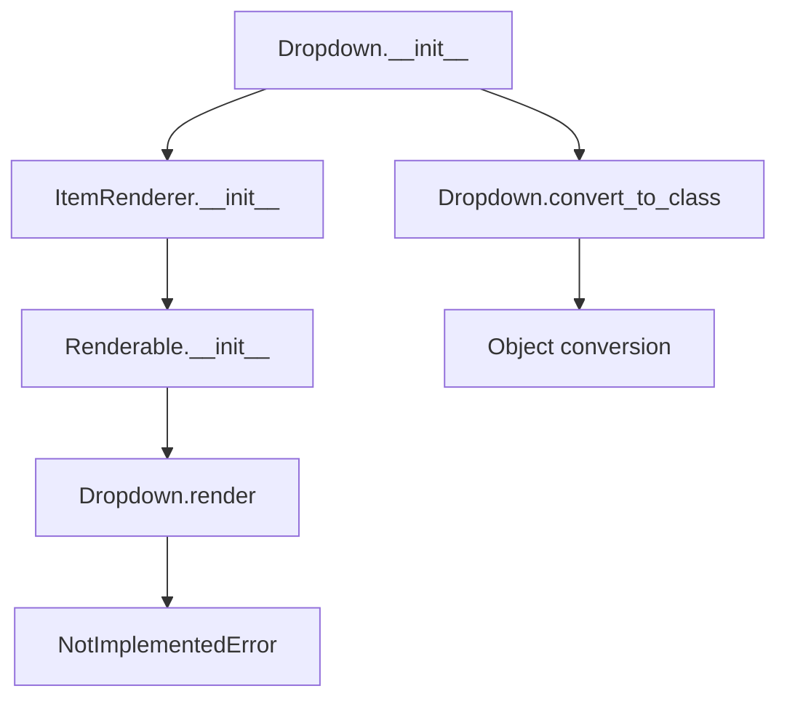

# `dropdown.py`

## `src.ydata_profiling.report.presentation.core.dropdown.Dropdown` · *class*

## Summary:
Dropdown is a renderable component that represents a dropdown menu interface element in the report presentation layer.

## Description:
The Dropdown class implements a dropdown menu UI component that allows users to toggle visibility of contained content. It inherits from ItemRenderer, which itself extends Renderable, making it part of the presentation layer's component hierarchy. This class is designed to be used in report generation systems where interactive UI elements are needed.

The motivation for this distinct abstraction is to provide a standardized dropdown interface element that can contain other renderable components (like containers or items) and manage their visibility through the dropdown mechanism. It enforces a clear boundary between the dropdown's structural representation and its rendering behavior.

## State:
- name: str - Unique identifier for the dropdown component
- id: str - HTML ID attribute for the dropdown element
- items: list - Collection of items to display in the dropdown menu
- item: Container - The container holding the content to be shown/hidden
- anchor_id: str - Anchor identifier for HTML linking
- classes: str - CSS classes to apply to the dropdown element (joined from list input)
- is_row: bool - Flag indicating if the dropdown content should be displayed in row orientation
- content: dict - Inherited from Renderable, contains all configuration data including the above fields

## Lifecycle:
- Creation: Instantiate with required parameters including name, id, items, item (Container), anchor_id, classes (list), and is_row boolean
- Usage: The render() method must be implemented by subclasses to define how the dropdown is visually presented
- Destruction: No explicit cleanup required; relies on Python garbage collection

## Method Map:


## Raises:
- NotImplementedError: Raised by the render() method, which must be implemented by subclasses

## Example:
```python
from ydata_profiling.report.presentation.core.dropdown import Dropdown
from ydata_profiling.report.presentation.core.container import Container

# Create a container with content to be shown in dropdown
dropdown_content = Container(items=[], sequence_type="column")

# Create a dropdown instance
dropdown = Dropdown(
    name="example_dropdown",
    id="dropdown_1",
    items=["option1", "option2"],
    item=dropdown_content,
    anchor_id="dropdown_anchor",
    classes=["dropdown-class"],
    is_row=False
)

# Convert an existing renderable object to dropdown type
# Dropdown.convert_to_class(existing_object, lambda x: x)
```

### `src.ydata_profiling.report.presentation.core.dropdown.Dropdown.__init__` · *method*

## Summary:
Initializes a dropdown component with configuration parameters for rendering in report presentations, establishing its structural properties and content configuration.

## Description:
Configures a dropdown UI element by setting up its structural properties and content configuration. This method establishes the foundational state for a dropdown presentation component, defining its identification, content structure, and display characteristics within the report presentation layer.

The dropdown component is designed to be part of a hierarchical report presentation structure, where it can contain multiple items and be rendered as an interactive dropdown element in the final report interface. It inherits from the ItemRenderer class, which itself extends Renderable, making it part of the standard presentation component hierarchy.

## Args:
    name (str): Unique identifier for the dropdown component
    id (str): HTML ID attribute for the dropdown element  
    items (list): Collection of items to be displayed in the dropdown
    item (Container): Template container for individual dropdown items
    anchor_id (str): Anchor identifier for HTML linking within the report
    classes (list): List of CSS class names to apply to the dropdown element
    is_row (bool): Flag indicating whether the dropdown items should be arranged horizontally
    **kwargs: Additional keyword arguments passed to the parent Renderable initializer

## Returns:
    None: This method initializes the object's state and does not return a value

## Raises:
    None: This method does not explicitly raise exceptions

## State Changes:
    Attributes READ: None
    Attributes WRITTEN: 
    - self.content: Dictionary containing all dropdown configuration parameters including name, id, items, item, anchor_id, classes, and is_row
    - self.item_type: Set to "dropdown" string

## Constraints:
    Preconditions:
    - The `items` parameter must be a list-like object
    - The `item` parameter must be a Container instance
    - The `classes` parameter must be iterable (list/tuple) that can be joined with spaces
    - All string parameters should be properly formatted identifiers
    
    Postconditions:
    - The object's content dictionary will contain all provided parameters
    - The item_type attribute will be set to "dropdown"
    - The classes parameter will be converted to a space-separated string via " ".join(classes)

## Side Effects:
    None: This method performs no I/O operations or external service calls

### `src.ydata_profiling.report.presentation.core.dropdown.Dropdown.__repr__` · *method*

## Summary:
Returns a string representation of the Dropdown instance, identifying it as a Dropdown object.

## Description:
This method provides a standard string representation for Dropdown instances, returning the literal string "Dropdown". It is used primarily for debugging and development purposes to quickly identify Dropdown objects in logs, console output, or interactive sessions. The method follows Python conventions for __repr__ methods by providing an unambiguous string representation that ideally could be used to recreate the object (though this particular implementation does not support recreation).

## Args:
    None

## Returns:
    str: The string "Dropdown" that identifies this object type.

## Raises:
    None

## State Changes:
    Attributes READ: None
    Attributes WRITTEN: None

## Constraints:
    Preconditions: None
    Postconditions: None

## Side Effects:
    None

### `src.ydata_profiling.report.presentation.core.dropdown.Dropdown.render` · *method*

## Summary:
Renders the dropdown component into a presentation-ready format for report generation.

## Description:
This method converts the dropdown component into its final rendered representation, which is typically a structured format suitable for inclusion in reports. The dropdown component represents a selection interface with associated items, and this method transforms the component's internal state into a presentation format.

As an abstract method inherited from the Renderable base class, this implementation raises NotImplementedError to indicate that subclasses must override this method with their specific rendering logic. The method is part of the presentation layer's rendering pipeline and is called during report generation to transform component state into visual representation.

## Args:
    None

## Returns:
    Any: The rendered representation of the dropdown component, which is typically HTML or a structured format suitable for report generation. The exact return type depends on the specific implementation in subclasses.

## Raises:
    NotImplementedError: Always raised by this base implementation, indicating that subclasses must provide their own rendering logic.

## State Changes:
    Attributes READ: 
    - self.content["name"]: The name identifier for the dropdown
    - self.content["id"]: Unique identifier for the dropdown element
    - self.content["items"]: Collection of items to be displayed in the dropdown
    - self.content["item"]: The selected item or template for the dropdown
    - self.content["anchor_id"]: Anchor identifier for HTML linking
    - self.content["classes"]: CSS classes to apply to the rendered dropdown
    - self.content["is_row"]: Boolean flag indicating row orientation
    
    Attributes WRITTEN: None

## Constraints:
    Preconditions:
    - The Dropdown instance must be properly initialized with all required content
    - All referenced items in self.content["items"] must be valid Renderable objects
    - The component must have been constructed with appropriate parameters
    
    Postconditions:
    - Must return a valid rendering representation when implemented by subclasses
    - Should handle edge cases like empty items gracefully

## Side Effects:
    None

### `src.ydata_profiling.report.presentation.core.dropdown.Dropdown.convert_to_class` · *method*

## Summary:
Converts a renderable object to a Dropdown class instance and processes its item content if present.

## Description:
This classmethod transforms a given renderable object into an instance of the Dropdown class. It changes the object's class type and optionally processes the object's item content through a provided callback function. This method is typically used during report generation to dynamically convert renderable components into dropdown-specific representations.

The method is particularly useful in the presentation layer where objects need to be converted to specific types while preserving their content structure and applying transformations to nested elements.

## Args:
    cls: The target class to convert the object to (should be Dropdown or subclass)
    obj: Renderable object to be converted to the target class
    flv: Callable function that processes the object's item content if present

## Returns:
    None: This method modifies the object in-place and doesn't return anything

## Raises:
    None: This method doesn't explicitly raise exceptions, though the flv function may raise exceptions if it fails to process the item content

## State Changes:
    Attributes READ: 
    - obj.content (accessed to check for "item" key)
    
    Attributes WRITTEN:
    - obj.__class__ (modified to change the object's class type)

## Constraints:
    Preconditions:
    - obj must be an instance of Renderable or subclass
    - cls must be a valid class that can accept the obj's content
    - flv must be callable if "item" key exists in obj.content
    
    Postconditions:
    - obj.__class__ will be set to cls
    - If obj.content contains "item", flv will be called with obj.content["item"] as argument

## Side Effects:
    - Modifies the class type of the input object in-place
    - Calls the provided flv function if item content exists
    - May cause unexpected behavior if flv function mutates the item content in ways that break object invariants

