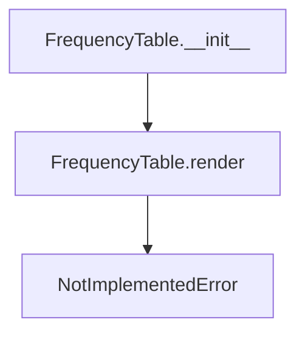

# `frequency_table.py`

## `src.ydata_profiling.report.presentation.core.frequency_table.FrequencyTable` · *class*

## Summary:
Represents a frequency table element in the report presentation layer, used to display categorical data frequencies.

## Description:
The FrequencyTable class is a specialized renderer for displaying frequency distributions of categorical data in reports. It serves as a container for frequency data that will be rendered in various output formats (HTML, JSON, etc.). This class is part of the presentation layer of the ydata-profiling library, responsible for structuring and formatting frequency table data for visualization purposes.

The class is designed to be extended by concrete implementations that provide actual rendering logic, as the base render() method raises NotImplementedError.

## State:
- rows: list - A list of frequency table rows containing categorical values and their counts
- redact: bool - Flag indicating whether sensitive data should be redacted in the output
- item_type: str - Set to "frequency_table" by the constructor, identifying this element type
- content: dict - Dictionary containing the configuration data (rows, redact) and inherited properties

## Lifecycle:
- Creation: Instantiate with rows (list of frequency data) and redact (bool) parameters
- Usage: Typically used within report generation pipelines where render() would be called to generate output
- Destruction: No special cleanup required; relies on Python's garbage collection

## Method Map:


## Raises:
- NotImplementedError: Raised by the render() method, indicating that concrete implementations must override this method

## Example:
```python
# Create a frequency table with sample data
rows = [
    {"value": "Category A", "count": 15},
    {"value": "Category B", "count": 8}
]
table = FrequencyTable(rows, redact=False)

# Note: render() method must be implemented in subclasses to produce output
```

### `src.ydata_profiling.report.presentation.core.frequency_table.FrequencyTable.__init__` · *method*

## Summary:
Initializes a frequency table element with rows of categorical data and redaction settings.

## Description:
Constructs a FrequencyTable instance by calling the parent ItemRenderer constructor with the item type "frequency_table" and configuration data containing the rows and redact flag. This method sets up the basic structure for a frequency table presentation element that will contain categorical data frequencies.

## Args:
    rows (list): A list of dictionaries representing frequency table rows, each containing categorical values and their counts.
    redact (bool): Boolean flag indicating whether sensitive data should be redacted in the output.
    **kwargs: Additional keyword arguments passed to the parent constructor for name, anchor_id, and classes.

## Returns:
    None: This method initializes the object state but does not return a value.

## Raises:
    None: This method does not raise exceptions directly, though the parent constructors may raise exceptions for invalid arguments.

## State Changes:
    Attributes READ: None
    Attributes WRITTEN: 
    - self.item_type: Set to "frequency_table"
    - self.content: Initialized with rows and redact configuration data

## Constraints:
    Preconditions:
    - rows parameter must be a list of dictionaries containing frequency data
    - redact parameter must be a boolean value
    - All parent class constraints for content, name, anchor_id, and classes must be satisfied
    
    Postconditions:
    - The object is properly initialized with item_type set to "frequency_table"
    - The content dictionary contains the rows and redact configuration
    - The object inherits all properties from Renderable and ItemRenderer classes

## Side Effects:
    None: This method performs no I/O operations or external service calls. It only initializes internal object state.

### `src.ydata_profiling.report.presentation.core.frequency_table.FrequencyTable.__repr__` · *method*

## Summary:
Returns a string representation of the FrequencyTable object for debugging and identification purposes.

## Description:
This method implements the Python `__repr__` magic method to provide a standardized string representation of FrequencyTable instances. It returns the literal string "FrequencyTable" which serves to uniquely identify instances of this class during debugging sessions or when printing objects.

The method is part of the presentation layer in the ydata-profiling library, specifically designed to help developers quickly identify FrequencyTable objects in logs, debuggers, or console output.

## Args:
    self: The FrequencyTable instance being represented

## Returns:
    str: The string "FrequencyTable" that uniquely identifies this class type

## Raises:
    None: This method does not raise any exceptions

## State Changes:
    Attributes READ: None - this method only reads the object's type information
    Attributes WRITTEN: None - this method does not modify any instance attributes

## Constraints:
    Preconditions: None - any FrequencyTable instance can invoke this method
    Postconditions: Always returns the string "FrequencyTable"

## Side Effects:
    None: This method performs no I/O operations or external service calls

### `src.ydata_profiling.report.presentation.core.frequency_table.FrequencyTable.render` · *method*

## Summary:
Renders the frequency table content into a presentation-ready format for report generation.

## Description:
This method is responsible for converting the frequency table data stored in the instance into a format suitable for presentation in reports. As an abstract method inherited from the base Renderable class, it must be implemented by subclasses to define the specific rendering behavior for frequency tables.

The method is part of the report presentation layer and is called during the report generation pipeline when the frequency table needs to be displayed in the final output.

## Args:
    None

## Returns:
    Any: The rendered representation of the frequency table, typically a string or HTML fragment that can be embedded in reports.

## Raises:
    NotImplementedError: This method is not implemented in the base FrequencyTable class and must be overridden by subclasses.

## State Changes:
    Attributes READ: 
    - self.content (accessed via parent class properties)
    - self.content["rows"] (the frequency table data)
    - self.content["redact"] (redaction flag for sensitive data)
    
    Attributes WRITTEN: None

## Constraints:
    Preconditions:
    - The instance must be properly initialized with rows and redact parameters
    - The content dictionary must contain "rows" and "redact" keys
    
    Postconditions:
    - The method must return a valid presentation format (typically string or HTML)
    - The returned value should be suitable for embedding in report templates

## Side Effects:
    None

