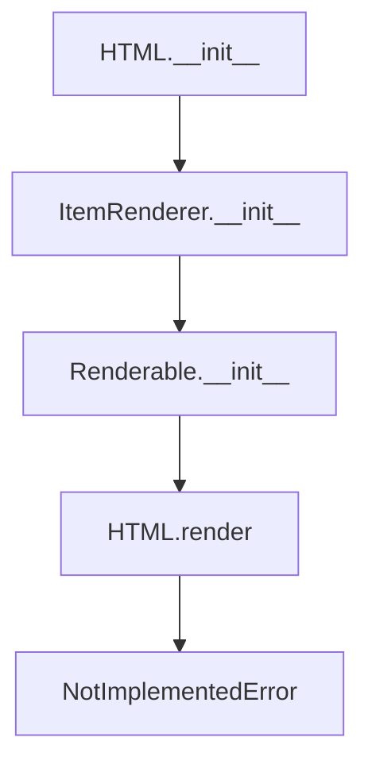

# `html.py`

## `src.ydata_profiling.report.presentation.core.html.HTML` · *class*

## Summary:
Represents an HTML content element that can be rendered in report presentations.

## Description:
The HTML class is a specialized renderer for HTML content within the ydata-profiling report presentation framework. It extends ItemRenderer to provide a mechanism for embedding raw HTML content into reports. This class serves as a container for HTML strings that will be rendered in the final report output.

## State:
- content (str): The HTML string content to be rendered. This is the primary data stored in the instance.
- item_type (str): Set to "html" by constructor, identifying this as an HTML item type.
- content (dict): Inherited from Renderable, contains the HTML content under the "html" key along with optional metadata like name, anchor_id, and classes.

## Lifecycle:
- Creation: Instantiate with a content string and optional keyword arguments for name, anchor_id, and classes
- Usage: Typically used as part of a report structure where render() method would be called to generate the final output
- Destruction: No special cleanup required; relies on Python's garbage collection

## Method Map:


## Raises:
- NotImplementedError: When the render() method is called, as it must be implemented by subclasses

## Example:
```python
# Create an HTML element with content
html_element = HTML("<h1>Hello World</h1>")

# The element can be used in a report structure
# Note: render() method raises NotImplementedError and must be overridden
```

### `src.ydata_profiling.report.presentation.core.html.HTML.__init__` · *method*

## Summary:
Initializes an HTML content element with the specified HTML string content and optional metadata.

## Description:
Constructs an HTML element that can be embedded in report presentations. This method sets up the internal representation of HTML content by storing the HTML string and any associated metadata such as name, anchor ID, or CSS classes.

## Args:
    content (str): The HTML string content to be stored and rendered.
    **kwargs: Additional optional metadata including:
        - name (str, optional): Name identifier for the HTML element
        - anchor_id (str, optional): Anchor identifier for linking within reports
        - classes (str, optional): CSS classes to apply to the HTML element

## Returns:
    None: This method initializes the object state and does not return a value.

## Raises:
    None: This method does not explicitly raise exceptions, though underlying initialization may raise exceptions from parent classes.

## State Changes:
    Attributes READ: None
    Attributes WRITTEN: 
        - self.item_type: Set to "html"
        - self.content: Dictionary containing {"html": content} plus any metadata from kwargs

## Constraints:
    Preconditions:
        - content must be a string containing valid HTML markup
        - All kwargs must be valid parameter names for the parent Renderable class
    Postconditions:
        - The object is properly initialized with item_type set to "html"
        - The content dictionary contains the HTML content under the "html" key
        - Any provided metadata (name, anchor_id, classes) is stored in the content dictionary

## Side Effects:
    None: This method performs no I/O operations or external service calls. It only initializes internal object state.

### `src.ydata_profiling.report.presentation.core.html.HTML.__repr__` · *method*

## Summary:
Returns a string representation of the HTML object indicating its type.

## Description:
This method provides a string representation of the HTML object, returning "HTML" to identify the object type. It is called by Python's built-in repr() function and is primarily used for debugging and logging purposes to quickly identify HTML objects in the presentation layer.

## Args:
    None

## Returns:
    str: The string "HTML" that identifies this object as an HTML instance.

## Raises:
    None

## State Changes:
    Attributes READ: None - This method does not read any instance attributes.
    Attributes WRITTEN: None - This method does not modify any instance attributes.

## Constraints:
    Preconditions: None - The method can be called on any valid HTML instance.
    Postconditions: Always returns the string "HTML".

## Side Effects:
    None - This method has no side effects and is purely informational.

### `src.ydata_profiling.report.presentation.core.html.HTML.render` · *method*

## Summary:
Abstract render method that raises NotImplementedError to enforce concrete implementation in subclasses.

## Description:
This abstract method defines the rendering interface for HTML-based presentation components. As part of the abstract base class hierarchy (HTML → ItemRenderer → Renderable), it establishes the contract that all concrete HTML implementations must fulfill. When invoked directly on an HTML instance, it raises NotImplementedError to prevent instantiation of abstract components.

During report generation, this method is called by the presentation layer to transform HTML content into rendered output. Concrete subclasses such as HTMLString, HTMLDiv, etc. must override this method to provide specific rendering logic for their content types.

## Args:
    None

## Returns:
    Any: This method never returns normally due to the NotImplementedError exception being raised.

## Raises:
    NotImplementedError: Always raised by this base implementation, requiring subclasses to provide concrete rendering logic.

## State Changes:
    Attributes READ: 
    - self.content: Content dictionary inherited from parent Renderable class
    - self.item_type: Item type string set during HTML initialization
    
    Attributes WRITTEN: None

## Constraints:
    Preconditions:
    - This method should only be called on concrete subclasses that implement the render logic
    - The HTML instance must be properly initialized with content
    
    Postconditions:
    - This method always raises NotImplementedError (by design)
    - No state changes occur on the instance

## Side Effects:
    None: This method performs no I/O operations or external state mutations.

