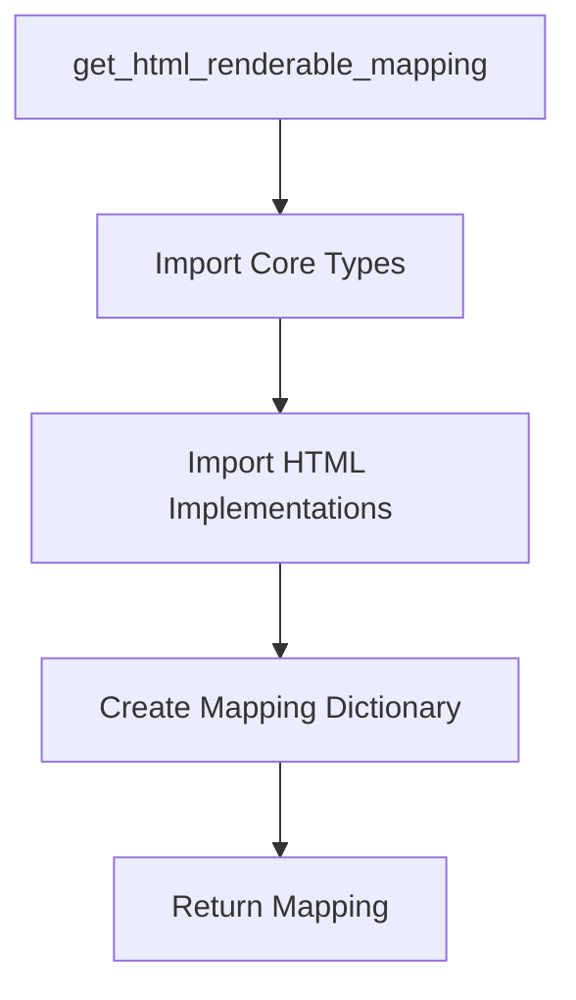
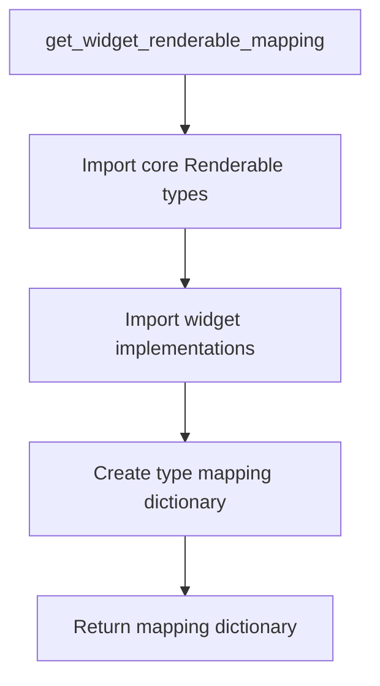

# `flavours.py`

## `src.ydata_profiling.report.presentation.flavours.flavours.apply_renderable_mapping` · *function*

## Summary:
Applies a type mapping to convert a renderable structure to its flavour-specific representation.

## Description:
This function serves as a dispatcher that uses a predefined mapping dictionary to convert a renderable structure into its flavour-specific equivalent. It retrieves the appropriate target class from the mapping based on the type of the input structure and invokes the convert_to_class method on that target class to perform the actual conversion.

The function is part of a larger system that supports multiple presentation flavours (HTML, widget) for report generation, where different renderable types need to be transformed into their respective flavour-specific implementations. This allows for dynamic type conversion during report rendering while preserving content structure.

## Args:
    mapping: A dictionary mapping Renderable types to their flavour-specific counterparts
    structure: The renderable object to be converted (will be modified in-place)
    flavour: A callable function that processes content elements during conversion

## Returns:
    None: This function modifies the input structure in-place and does not return a value

## Raises:
    KeyError: If the type of the structure is not found in the mapping dictionary
    AttributeError: If the mapped class does not have a convert_to_class method

## Constraints:
    Preconditions:
    - mapping must be a dictionary with Renderable types as keys and Renderable subclasses as values
    - structure must be an instance of a Renderable subclass
    - flavour must be callable
    
    Postconditions:
    - The structure object's class will be changed to the mapped flavour-specific class
    - The structure will be modified in-place to reflect the new flavour representation

## Side Effects:
    None: This function only modifies the class of the input structure object in-place

## Control Flow:
```mermaid
flowchart TD
    A[apply_renderable_mapping] --> B{Get type(structure)}
    B --> C{type(structure) in mapping?}
    C -->|Yes| D[Get target class mapping[type(structure)]]
    D --> E[Call target_class.convert_to_class(structure, flavour)]
    E --> F[structure class changed in-place]
    C -->|No| G[KeyError raised]
```

## Examples:
```python
# Basic usage in report generation pipeline
mapping = {
    Root: HTMLRoot,
    Container: HTMLContainer,
    # ... other mappings
}
structure = Root({"title": "Report"})
apply_renderable_mapping(mapping, structure, html_flavour)
# structure is now an HTMLRoot instance with the same content
```

## `src.ydata_profiling.report.presentation.flavours.flavours.get_html_renderable_mapping` · *function*

## Summary:
Creates a mapping from core renderable types to their HTML implementation types for presentation rendering.

## Description:
Returns a dictionary that maps core renderable component types to their corresponding HTML implementation types. This mapping is used by the HTML presentation flavour to convert core renderable objects into their HTML-specific representations during report generation.

## Args:
    None

## Returns:
    Dict[Type[Renderable], Type[Renderable]]: A dictionary mapping core renderable types to their HTML implementation types, enabling type-based conversion during HTML report generation.

## Raises:
    None

## Constraints:
    Preconditions:
    - All core renderable types referenced in the mapping must be properly imported and defined
    - All HTML implementation types must be properly imported and defined
    
    Postconditions:
    - The returned dictionary contains exactly 13 key-value pairs
    - All keys are core Renderable types
    - All values are HTML Renderable types

## Side Effects:
    None

## Control Flow:


## Examples:
```python
# Typical usage in HTML presentation flavour
html_mapping = get_html_renderable_mapping()
# Result: {Container: HTMLContainer, Variable: HTMLVariable, ...}
```

## `src.ydata_profiling.report.presentation.flavours.flavours.HTMLReport` · *function*

## Summary:
Converts a generic report structure into its HTML-specific representation by applying the HTML renderable mapping.

## Description:
The HTMLReport function serves as the primary entry point for transforming a generic report structure (Root) into its HTML presentation form. It applies a predefined mapping from core renderable types to their HTML implementations, effectively converting all components in the report structure to their HTML-specific equivalents. This function is part of the HTML presentation flavour system that enables the generation of web-based profiling reports.

The function is typically called during the report generation pipeline when transitioning from a generic structure to a flavour-specific representation. It leverages helper functions to perform the actual conversion process, ensuring that all components in the report are properly transformed for HTML rendering.

## Args:
    structure (Root): The root-level report structure containing all report components that need to be converted to HTML representation. This is typically a Root object that contains body, footer, and style components.

## Returns:
    Root: The same Root structure object, but with all its components converted to their HTML-specific implementations. The object is modified in-place and returned for chaining purposes.

## Raises:
    KeyError: If any component in the structure does not have a corresponding HTML implementation in the mapping dictionary.
    AttributeError: If any mapped HTML class does not have a convert_to_class method required for the conversion process.

## Constraints:
    Preconditions:
    - The structure parameter must be an instance of the Root class or its subclass
    - All components within the structure must be of types that have corresponding HTML implementations in the mapping
    - The get_html_renderable_mapping() function must return a valid mapping dictionary
    
    Postconditions:
    - The structure object's class will be changed to its HTML-specific equivalent (e.g., Root becomes HTMLRoot)
    - All child components within the structure will also be recursively converted to their HTML representations
    - The structure maintains all original content and metadata but with HTML-specific implementations

## Side Effects:
    None: This function only modifies the class types of the input structure and its components in-place, without performing any I/O operations or external state changes.

## Control Flow:
```mermaid
flowchart TD
    A[HTMLReport(structure)] --> B[get_html_renderable_mapping()]
    B --> C[mapping = {...}]
    C --> D[apply_renderable_mapping(mapping, structure, HTMLReport)]
    D --> E{Structure type in mapping?}
    E -->|Yes| F[Convert structure to HTML equivalent]
    F --> G[Apply conversion to children recursively]
    G --> H[Return modified structure]
    E -->|No| I[KeyError raised]
```

## Examples:
```python
# Typical usage in report generation pipeline
from ydata_profiling.report.presentation.flavours.flavours import HTMLReport
from ydata_profiling.report.presentation.core.root import Root
from ydata_profiling.report.presentation.core.html import HTML

# Create a basic report structure
body_content = HTML("Report Body Content")
footer_content = HTML("Report Footer")
root_structure = Root(
    name="my_report",
    body=body_content,
    footer=footer_content,
    style=style_config
)

# Convert to HTML representation
html_structure = HTMLReport(root_structure)
# The root_structure is now converted to HTMLRoot with all components HTML-specific
```

## `src.ydata_profiling.report.presentation.flavours.flavours.get_widget_renderable_mapping` · *function*

## Summary:
Returns a dictionary mapping core Renderable types to their widget-based implementations for report presentation.

## Description:
This function creates and returns a type mapping registry that associates core Renderable classes with their corresponding widget implementations. It serves as a centralized configuration point for the widget presentation flavour, enabling dynamic selection of appropriate renderable implementations based on type.

The mapping facilitates the presentation layer's ability to convert abstract core renderable elements into their concrete widget representations. This design promotes loose coupling between presentation logic and specific renderable implementations, allowing for flexible rendering strategies while maintaining type safety.

## Args:
    None

## Returns:
    Dict[Type[Renderable], Type[Renderable]]: A dictionary where keys are core Renderable types (like Container, Variable, Table, etc.) and values are their corresponding widget implementations (WidgetContainer, WidgetVariable, WidgetTable, etc.). This mapping enables runtime selection of appropriate renderable classes for widget-based presentation.

## Raises:
    None

## Constraints:
    Preconditions:
    - All core Renderable types referenced in the mapping must be properly imported and defined
    - All widget implementations must be properly imported and available
    - The function assumes that widget implementations are compatible with their core counterparts
    
    Postconditions:
    - The returned dictionary contains exactly one entry for each core Renderable type in the mapping
    - All mapped types are valid Renderable subclasses
    - The mapping is immutable once created (though the dict object itself is mutable)

## Side Effects:
    None

## Control Flow:


## Examples:
```python
# Typical usage in presentation layer
mapping = get_widget_renderable_mapping()

# Get widget implementation for a specific core type
widget_container_class = mapping[Container]  # Returns WidgetContainer
widget_variable_class = mapping[Variable]    # Returns WidgetVariable

# Usage in rendering pipeline
renderable_type = type(renderable_element)
widget_class = mapping.get(renderable_type, None)
if widget_class:
    widget_instance = widget_class(renderable_element.content)
```

## `src.ydata_profiling.report.presentation.flavours.flavours.WidgetReport` · *function*

## Summary:
Converts a report structure from core Renderable types to their widget-based implementations for interactive report presentation.

## Description:
Transforms a Root report structure by applying a widget-specific renderable mapping that converts core Renderable types into their corresponding widget-based implementations. This function serves as the entry point for converting abstract report structures into interactive widget-based representations suitable for Jupyter notebook environments or web applications with widget support.

The function leverages two helper functions: `get_widget_renderable_mapping()` to obtain the type mapping and `apply_renderable_mapping()` to perform the actual conversion. It operates in-place on the input structure, modifying its class types to reflect the widget presentation flavour.

## Args:
    structure (Root): The root report structure containing all report elements that need to be converted to widget representations. This is typically a Root instance created during report generation that contains body, footer, and style configurations.

## Returns:
    Root: The same Root structure object, but with all contained renderable elements converted to their widget-based equivalents. The structure is modified in-place, and the returned reference points to the same object with updated class types.

## Raises:
    KeyError: If any renderable type in the structure is not found in the widget renderable mapping dictionary
    AttributeError: If any mapped widget class lacks the required convert_to_class method

## Constraints:
    Preconditions:
    - The input structure must be a valid Root instance with properly initialized content
    - All renderable elements within the structure must be compatible with widget implementations
    - The widget renderable mapping must be properly configured with all required type mappings
    
    Postconditions:
    - The structure object's class types will be updated to their widget-based equivalents
    - All nested renderable elements within the structure will also be converted recursively
    - The structure maintains its original content and configuration while changing presentation flavour

## Side Effects:
    - Modifies the input structure in-place by changing the class types of all contained renderable elements
    - No external I/O operations or state mutations beyond the modification of the input structure

## Control Flow:
```mermaid
flowchart TD
    A[WidgetReport] --> B[get_widget_renderable_mapping()]
    B --> C[mapping = {core_type: widget_type, ...}]
    C --> D[apply_renderable_mapping(mapping, structure, flavour=WidgetReport)]
    D --> E[Structure elements converted to widget types]
    E --> F[Return modified structure]
```

## Examples:
```python
# Typical usage in report generation pipeline
from ydata_profiling.report.presentation.flavours.flavours import WidgetReport
from ydata_profiling.report.presentation.core.root import Root

# Assuming we have a populated Root structure
report_structure = Root(
    name="sample_report",
    body=some_body_renderable,
    footer=some_footer_renderable,
    style=style_config
)

# Convert to widget-based presentation
widget_report = WidgetReport(report_structure)

# The widget_report now contains all elements in widget form
# suitable for display in Jupyter notebooks or widget-enabled environments
```

