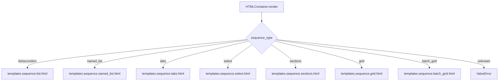

# `container.py`

## `src.ydata_profiling.report.presentation.flavours.html.container.HTMLContainer` · *class*

## Summary:
HTMLContainer is a presentation layer component that renders structured content using HTML templates based on sequence type.

## Description:
HTMLContainer extends the base Container class to provide HTML-specific rendering capabilities. It serves as a bridge between structured data containers and their HTML representation, supporting various sequence types like lists, accordions, tabs, grids, and more. This class is instantiated by the report generation system when creating HTML-based report presentations.

The motivation for this distinct abstraction is to separate the structural organization of report elements (handled by Container) from their HTML rendering specifics. It enforces a clear boundary between data structure and presentation format while providing a flexible templating system for different UI patterns.

## State:
- sequence_type: str - Defines the HTML template type to use (e.g., "list", "accordion", "tabs", "grid", "sections", "batch_grid")
- content: dict - Contains rendering configuration data including:
  - anchor_id: str - HTML anchor identifier for linking
  - items: Sequence[Renderable] - Collection of renderable components to display
  - nested: bool - Indicates if container is nested within another container
  - full_width: bool - For sections, indicates if content should span full width
  - batch_size: int - For batch_grid, specifies number of items per batch
  - titles: bool - For batch_grid, controls title display
  - subtitles: bool - For batch_grid, controls subtitle display

## Lifecycle:
- Creation: Instantiate with items, sequence_type, and optional content parameters inherited from Container parent
- Usage: Call render() method to generate HTML string representation
- Destruction: No explicit cleanup required; relies on Python garbage collection

## Method Map:


## Raises:
- ValueError: Raised when sequence_type is not recognized or supported by any available template

## Example:
```python
from ydata_profiling.report.presentation.flavours.html.container import HTMLContainer

# Create a container with list sequence type
container = HTMLContainer(
    items=[item1, item2, item3],
    sequence_type="list",
    content={
        "anchor_id": "my-list",
        "items": [item1, item2, item3]
    }
)

# Render to HTML
html_output = container.render()
```

### `src.ydata_profiling.report.presentation.flavours.html.container.HTMLContainer.render` · *method*

## Summary:
Renders HTML content using template files based on the container's sequence type and content configuration.

## Description:
This method implements the rendering logic for HTML containers by selecting and rendering appropriate HTML templates based on the container's sequence_type attribute. It serves as the core rendering mechanism for structured report components in the HTML presentation flavour.

The method delegates to Jinja2 template rendering engine to generate HTML output, passing relevant content data from the container's content dictionary. Different sequence types map to different template structures, enabling flexible presentation of grouped report elements.

## Args:
    None - This is a method that operates on instance attributes

## Returns:
    str - HTML string representation of the rendered container content

## Raises:
    ValueError: When the sequence_type is not recognized or supported by any of the available templates

## State Changes:
    Attributes READ: 
    - self.sequence_type: Determines which template to render
    - self.content: Provides data for template rendering including anchor_id, items, tabs, nested, full_width, batch_size, titles, subtitles
    
    Attributes WRITTEN: None

## Constraints:
    Preconditions:
    - self.sequence_type must be one of the supported types: "list", "accordion", "named_list", "tabs", "select", "sections", "grid", "batch_grid"
    - self.content must be a dictionary containing required keys for the selected template type:
      * For "list" and "accordion": requires "anchor_id" and "items" keys
      * For "named_list": requires "anchor_id" and "items" keys  
      * For "tabs" and "select": requires "tabs", "anchor_id", and "nested" keys
      * For "sections": requires "items" and "full_width" keys
      * For "grid": requires "items" key
      * For "batch_grid": requires "items" and "batch_size" keys, with optional "titles" and "subtitles" keys
    - All required template variables must be present in self.content for successful rendering
    
    Postconditions:
    - Returns properly formatted HTML string matching the specified sequence type
    - Raises ValueError for unsupported sequence types

## Side Effects:
    None - This method is pure and does not cause any external I/O or state changes beyond returning the rendered HTML string

