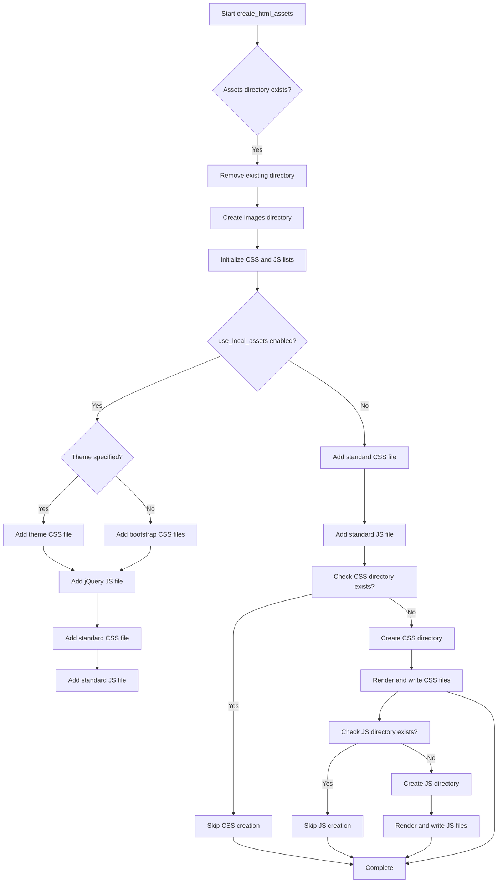

# `templates.py`

## `src.ydata_profiling.report.presentation.flavours.html.templates.template` · *function*

## Summary:
Retrieves a Jinja2 template from the global template environment by name.

## Description:
This function serves as a convenience wrapper for accessing Jinja2 templates within the HTML report generation system. It provides a standardized way to fetch templates from the global `jinja2_env` environment, ensuring consistent template loading throughout the reporting module.

## Args:
    template_name (str): The name of the template to retrieve from the Jinja2 environment. This corresponds to a template file in the template directory.

## Returns:
    jinja2.Template: A Jinja2 Template object that can be used to render HTML content with provided context data.

## Raises:
    jinja2.TemplateNotFound: When the specified template_name does not exist in the Jinja2 environment.

## Constraints:
    Preconditions:
    - The global `jinja2_env` must be properly initialized before calling this function
    - The `template_name` parameter must correspond to an existing template in the environment
    
    Postconditions:
    - Returns a valid Jinja2 Template object
    - Does not modify any global state

## Side Effects:
    None - This function is pure and has no side effects beyond accessing the global template environment.

## Control Flow:
```mermaid
flowchart TD
    A[Call template()] --> B{Validate template_name}
    B -- Valid --> C[Access jinja2_env]
    C --> D[Get template by name]
    D --> E[Return jinja2.Template]
    B -- Invalid --> F[Throw TemplateNotFound]
```

## `src.ydata_profiling.report.presentation.flavours.html.templates.create_html_assets` · *function*

## Summary:
Creates and organizes HTML report assets including CSS and JavaScript files by rendering templates with configuration-specific values.

## Description:
This function generates the necessary static assets (CSS and JavaScript files) for HTML reports by rendering Jinja2 templates with configuration-specific parameters. It manages the directory structure for assets and ensures that required files are created with appropriate content based on the report configuration settings.

The function prepares the asset directory structure and ensures that CSS and JavaScript files are available for HTML report rendering. It handles both local asset loading (when configured) and standard asset inclusion, ensuring that all required resources are prepared for report generation.

## Args:
    config (Settings): Configuration object containing HTML report settings including asset preferences, themes, and styling options.
    output_file (Path): Path to the output file location, used to determine the base directory for asset placement.

## Returns:
    None: This function performs file I/O operations and does not return any value.

## Raises:
    jinja2.TemplateNotFound: When a requested template file cannot be found in the Jinja2 environment.
    PermissionError: When the function lacks permissions to create directories or write files.
    OSError: When there are general file system errors during directory creation or file writing.

## Constraints:
    Preconditions:
    - The global `jinja2_env` must be initialized before calling this function
    - The `config` parameter must be a valid Settings object with properly configured HTML settings
    - The `output_file` parameter must be a valid Path object
    
    Postconditions:
    - Asset directory structure is created at the specified location
    - CSS and JavaScript files are written to their respective directories
    - Template rendering completes successfully with appropriate configuration values

## Side Effects:
    - Creates directories for assets (css, js, images) under the configured assets prefix
    - Removes existing asset directory if it already exists (using shutil.rmtree)
    - Modifies filesystem by creating directories and writing files

## Control Flow:


## Examples:
    >>> from pathlib import Path
    >>> from ydata_profiling.config import Settings
    >>> config = Settings()
    >>> output_file = Path("report.html")
    >>> create_html_assets(config, output_file)
    # Creates assets directory with rendered CSS and JS files

