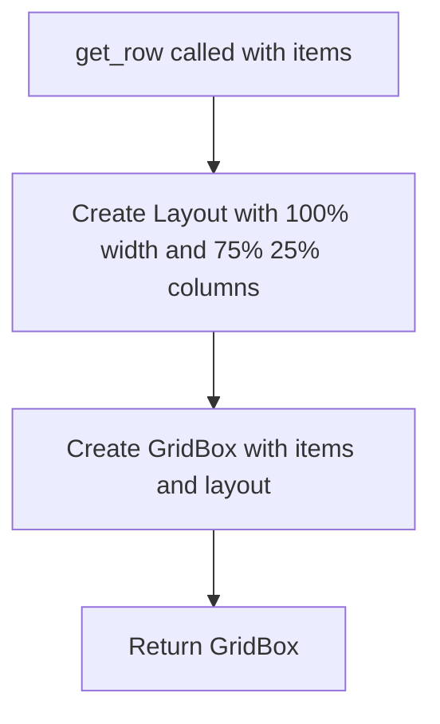

# `alerts.py`

## `src.ydata_profiling.report.presentation.flavours.widget.alerts.get_row` · *function*

## Summary:
Creates a grid layout widget with 75%/25% column distribution for displaying alert items in a report.

## Description:
This function constructs a GridBox widget with a fixed 75% to 25% column width ratio, designed to display alert items in a structured layout. It serves as a reusable component for organizing alert content in the widget-based report presentation. The function is typically used to create consistent row layouts for alert displays.

## Args:
    items (List[widgets.Widget]): A list of ipywidgets.Widget objects to be arranged in the grid layout.

## Returns:
    widgets.GridBox: A GridBox widget instance configured with a 100% width and 75%/25% column template.

## Raises:
    None explicitly raised.

## Constraints:
    Preconditions:
    - The input list must contain valid ipywidgets.Widget objects
    - The function assumes the caller will provide appropriate widget items for the 2-column layout
    
    Postconditions:
    - The returned GridBox will have a width of 100% and specified column template
    - The widgets will be arranged according to the grid template columns specification

## Side Effects:
    None.

## Control Flow:


## Examples:
```python
from ipywidgets import HTML, Button
from ydata_profiling.report.presentation.flavours.widget.alerts import get_row

# Create alert items
alert_text = HTML("Warning: Data quality issue detected")
alert_button = Button(description="View Details")

# Create row layout
row_layout = get_row([alert_text, alert_button])
```

## `src.ydata_profiling.report.presentation.flavours.widget.alerts.WidgetAlerts` · *class*

## Summary:
WidgetAlerts is a presentation layer component that renders data quality alerts using ipywidgets for interactive display in Jupyter environments.

## Description:
WidgetAlerts implements the render method for displaying data quality alerts in a widget-based interface. It inherits from the Alerts base class and transforms alert data into interactive HTML content and button widgets. This component is specifically designed for use in Jupyter notebooks and other widget-enabled environments, providing visual feedback about data quality issues detected during profiling.

The class processes alerts from the parent's content dictionary, skipping "rejected" alerts, and creates pairs of HTML content and styled buttons for each alert. It leverages the HTML templates system for rendering alert-specific content and applies appropriate CSS styling based on alert severity levels.

## State:
- Inherits all state from Alerts parent class including:
  - alerts: Collection of alert objects to be displayed
  - style: Configuration object for visual styling
  - item_type: String identifier set to "alerts"
  - content: Dictionary containing alerts and style configuration
- No additional instance attributes beyond those inherited from parent

## Lifecycle:
- Creation: Instantiated with alerts collection and style configuration, inheriting from Alerts parent class
- Usage: Called by the report generation system through the render() method, which returns a widgets.GridBox
- Destruction: Managed automatically by Python's garbage collection

## Method Map:
```mermaid
graph TD
    A[WidgetAlerts.render] --> B[Process alerts from self.content["alerts"]]
    B --> C[Skip "rejected" alerts]
    C --> D[For each alert, create HTML content]
    D --> E[For each alert, create styled Button widget]
    E --> F[Call get_row(items) to arrange widgets]
    F --> G[Return widgets.GridBox]
```

## Raises:
- No explicit exceptions raised by __init__ (inherits from Alerts)
- NotImplementedError may be raised by parent class render() if not properly overridden (though this is implemented here)
- Potential exceptions from HTML template rendering or widget creation if invalid alert data is provided

## Example:
```python
from ydata_profiling.report.presentation.flavours.widget.alerts import WidgetAlerts
from ydata_profiling.model.alerts import Alert, AlertType
from ydata_profiling.config import Style

# Create sample alerts
alert1 = Alert(alert_type=AlertType.MISSING_VALUES, column_name="column1")
alert2 = Alert(alert_type=AlertType.HIGH_CARDINALITY, column_name="column2")

# Create style configuration
style = Style(primary_colors=["#ff0000"])

# Create WidgetAlerts instance
widget_alerts = WidgetAlerts(alerts=[alert1, alert2], style=style)

# Render the alerts as widgets
grid_box = widget_alerts.render()
```

### `src.ydata_profiling.report.presentation.flavours.widget.alerts.WidgetAlerts.render` · *method*

## Summary
Renders data quality alerts as interactive widgets in a grid layout, displaying HTML content and styled buttons for each alert.

## Description
Transforms alert objects stored in `self.content["alerts"]` into a visual representation using ipywidgets. This method creates a GridBox layout containing HTML content and disabled Button widgets for each alert, with appropriate styling based on alert severity levels. The method filters out "rejected" alerts and organizes the remaining alerts in a 2-column grid layout where each row contains an HTML content widget followed by a styled button.

This logic is separated into its own method to encapsulate the widget creation and layout logic, allowing for clean separation between data processing and UI rendering. The method leverages the parent class's content structure while implementing widget-specific rendering behavior.

## Args
None

## Returns
widgets.GridBox: A grid layout widget containing pairs of HTML content and styled buttons for each alert, arranged in rows with 75%/25% column distribution.

## Raises
None explicitly raised

## State Changes
Attributes READ:
- self.content["alerts"]: Collection of alert objects to be rendered
- self.content["alerts"][i].alert_type.name: Used to determine alert type and styling

Attributes WRITTEN:
None

## Constraints
Preconditions:
- self.content["alerts"] must be a list or iterable containing alert objects with alert_type attribute
- Each alert object must have an alert_type attribute with a name property
- The alert_type.name must be a string that matches available HTML templates

Postconditions:
- Returns a valid widgets.GridBox instance
- All non-rejected alerts are processed and displayed
- The returned GridBox follows the 75%/25% column layout pattern

## Side Effects
- Creates HTML and Button widgets using ipywidgets library
- Renders HTML templates using the templates module
- Calls get_row() function to create the final GridBox layout

