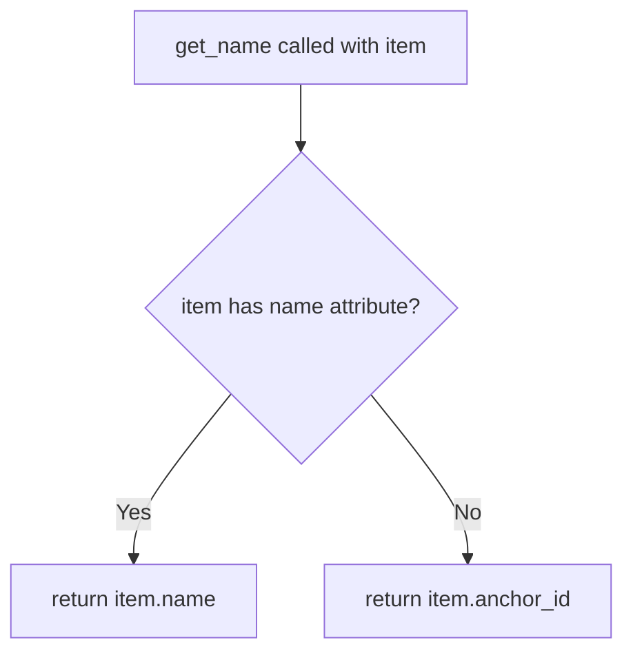
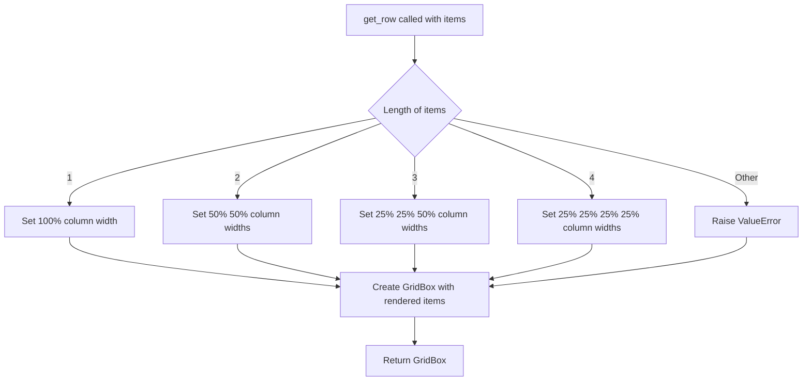

# `container.py`

## `src.ydata_profiling.report.presentation.flavours.widget.container.get_name` · *function*

## Summary:
Retrieves a human-readable identifier from a renderable item by prioritizing the name attribute over the anchor_id.

## Description:
This utility function extracts a meaningful identifier from a Renderable object. It attempts to access the `name` attribute first, falling back to the `anchor_id` attribute if the name is not available. This provides a consistent way to obtain identifiers for presentation elements in the widget-based report rendering system.

The function is extracted into its own utility to avoid duplication of the name/anchor_id selection logic throughout the widget presentation components, enforcing a clear responsibility boundary for identifier retrieval.

## Args:
    item (Renderable): A renderable presentation element that may have either a `name` or `anchor_id` attribute

## Returns:
    str: The name of the renderable item if it has a name attribute, otherwise the anchor_id

## Raises:
    None explicitly raised

## Constraints:
    Preconditions:
    - The input `item` must be a Renderable instance
    - The item must have either a `name` attribute or an `anchor_id` attribute (or both)
    
    Postconditions:
    - Returns a string identifier for the renderable item
    - The returned value is either the item's name or anchor_id

## Side Effects:
    None

## Control Flow:


## Examples:
```python
# Example 1: Item with name attribute
from ydata_profiling.report.presentation.core.renderable import Renderable
item_with_name = Renderable({"title": "Chart"}, name="sales_chart")
name = get_name(item_with_name)  # Returns "sales_chart"

# Example 2: Item with anchor_id but no name
item_with_anchor = Renderable({"title": "Table"}, anchor_id="table-123")
name = get_name(item_with_anchor)  # Returns "table-123"

# Example 3: Item with both name and anchor_id
item_with_both = Renderable({"title": "Dashboard"}, name="dashboard", anchor_id="dash-456")
name = get_name(item_with_both)  # Returns "dashboard" (prioritizes name)
```

## `src.ydata_profiling.report.presentation.flavours.widget.container.get_tabs` · *function*

## Summary:
Creates a tabbed widget interface from a list of renderable components.

## Description:
Constructs an ipywidgets.Tab instance containing multiple rendered components as tabs. Each tab displays a rendered representation of a renderable item with a corresponding title derived from the item's identifier.

This function is used in the widget-based presentation layer to organize multiple report components into a tabbed interface, improving navigation and presentation of complex reports. The function extracts both the rendered widget content and human-readable titles from each renderable item to populate the tab structure.

Known callers within the codebase:
- This function is likely called by container presentation components that need to display grouped renderable items in a tabbed format
- Specifically used when creating tabbed containers in the widget-based report generation pipeline

The logic is extracted into its own function rather than inlined because:
- It encapsulates the specific widget creation and configuration logic for tabbed interfaces
- It provides a reusable component for creating tabbed presentations across different container types
- It separates concerns between the data processing (rendering items) and widget construction (creating Tab structure)

## Args:
    items (List[Renderable]): A list of renderable presentation elements to be displayed as tabs. Each item must be a Renderable instance that supports the render() and get_name() operations.

## Returns:
    widgets.Tab: A configured ipywidgets.Tab instance containing all the provided renderable items as tab children with appropriate titles.

## Raises:
    None explicitly raised

## Constraints:
    Preconditions:
    - The input `items` must be a list of Renderable instances
    - Each item in the list must support the `render()` method that returns a valid widget
    - Each item in the list must support the `get_name()` function that returns a string title
    
    Postconditions:
    - Returns a properly configured widgets.Tab instance
    - The tab children are populated with rendered representations of the input items
    - Tab titles are set according to the get_name() results for each item

## Side Effects:
    None

## Control Flow:
```mermaid
flowchart TD
    A[get_tabs called with items list] --> B{items list empty?}
    B -->|Yes| C[Create empty Tab]
    B -->|No| D[Initialize children and titles lists]
    D --> E[For each item in items]
    E --> F[item.render() to get child widget]
    F --> G[get_name(item) to get title]
    G --> H[Add child to children list]
    H --> I[Add title to titles list]
    I --> J[Create widgets.Tab()]
    J --> K[Set tab.children = children]
    K --> L[For each title in titles]
    L --> M[tab.set_title(id, title)]
    M --> N[Return tab]
```

## Examples:
```python
# Basic usage with multiple renderable items
from ydata_profiling.report.presentation.core.renderable import Renderable
from ydata_profiling.report.presentation.flavours.widget.container import get_tabs

# Create sample renderable items
item1 = Renderable({"title": "Chart Data"}, name="Sales Chart")
item2 = Renderable({"title": "Table Data"}, name="Summary Table")

# Create tabbed interface
tabs_widget = get_tabs([item1, item2])

# The resulting widget will have two tabs:
# - Tab 1 titled "Sales Chart" showing rendered chart data
# - Tab 2 titled "Summary Table" showing rendered table data
```

## `src.ydata_profiling.report.presentation.flavours.widget.container.get_list` · *function*

## Summary:
Creates a vertical box widget containing rendered representations of multiple renderable elements.

## Description:
Transforms a list of renderable presentation elements into a vertically stacked ipywidgets.VBox container. This function serves as a utility for organizing multiple renderable components into a single widget container suitable for display in Jupyter environments.

The function is typically called when constructing widget-based report presentations where multiple components need to be displayed in a vertical stack. It encapsulates the common pattern of rendering individual elements and combining them into a cohesive widget structure.

## Args:
    items (List[Renderable]): A list of renderable presentation elements that implement the Renderable abstract base class interface

## Returns:
    widgets.VBox: A vertical box widget containing the rendered representations of all input items, displayed in the same order as the input list

## Raises:
    None explicitly raised - however, underlying render() calls on individual items may raise exceptions if those items are improperly configured or if rendering fails

## Constraints:
    Preconditions:
    - All items in the input list must be instances of Renderable or its subclasses
    - Each item's render() method must be callable and return a valid widget object
    
    Postconditions:
    - The returned widgets.VBox will contain exactly one child widget for each input Renderable
    - The order of children in the VBox matches the order of items in the input list

## Side Effects:
    None - this function is pure and does not modify external state or perform I/O operations

## Control Flow:
```mermaid
flowchart TD
    A[get_list called with items] --> B{items list empty?}
    B -- Yes --> C[Return empty VBox]
    B -- No --> D[Iterate through items]
    D --> E[Call item.render() for each item]
    E --> F[Collect rendered widgets]
    F --> G[Create VBox with rendered widgets]
    G --> H[Return VBox]
```

## Examples:
```python
# Basic usage with multiple renderable items
from ydata_profiling.report.presentation.core.renderable import Renderable
from ydata_profiling.report.presentation.flavours.widget.container import get_list

# Assuming we have renderable objects
renderable_items = [item1, item2, item3]
widget_container = get_list(renderable_items)

# The result is a VBox containing all rendered items stacked vertically
```

## `src.ydata_profiling.report.presentation.flavours.widget.container.get_named_list` · *function*

*No documentation generated.*

## `src.ydata_profiling.report.presentation.flavours.widget.container.get_row` · *function*

## Summary:
Creates a grid-based row layout containing multiple renderable components using ipywidgets.

## Description:
This function generates a widgets.GridBox layout that organizes a list of renderable components into a horizontal row. The layout automatically adjusts column widths based on the number of items: single item spans full width, two items split 50/50, three items use 25%/25%/50% distribution, and four items use equal 25% columns. This function abstracts the complexity of creating appropriate grid layouts for different column counts.

The function is extracted into its own utility to separate layout concerns from the core container logic, allowing the Container class to focus on structural organization while delegating presentation-specific layout decisions to this helper function.

## Args:
    items (List[Renderable]): A list of renderable components to display in a grid row. Must contain between 1 and 4 items inclusive.

## Returns:
    widgets.GridBox: A grid box widget containing the rendered items arranged in a row with appropriate column widths.

## Raises:
    ValueError: When the number of items is not 1, 2, 3, or 4, as layouts are only defined for these column counts.

## Constraints:
    Preconditions:
    - Items must be a list of Renderable objects that support the .render() method
    - List length must be between 1 and 4 (inclusive)
    
    Postconditions:
    - Returns a valid widgets.GridBox instance
    - All items in the input list are rendered and included in the returned GridBox

## Side Effects:
    None

## Control Flow:


## Examples:
```python
# Create a single item row
from ydata_profiling.report.presentation.core.renderable import Renderable
from ipywidgets import widgets

items = [some_renderable_item]
grid_box = get_row(items)

# Create a two-item row
items = [item1, item2]
grid_box = get_row(items)

# Create a three-item row
items = [item1, item2, item3]
grid_box = get_row(items)

# Create a four-item row
items = [item1, item2, item3, item4]
grid_box = get_row(items)

# This would raise ValueError
try:
    items = [item1, item2, item3, item4, item5]  # 5 items
    grid_box = get_row(items)
except ValueError as e:
    print(f"Unsupported column count: {e}")
```

## `src.ydata_profiling.report.presentation.flavours.widget.container.get_batch_grid` · *function*

## Summary:
Creates a grid layout container for rendering multiple renderable items in a tabular format with optional headers.

## Description:
Generates a GridBox widget arrangement that displays a list of renderable components in a grid pattern. Each item can optionally be displayed with a title or subtitle header based on boolean flags. This function abstracts the complexity of creating grid layouts with proper column sizing and conditional header rendering.

The function is designed to be used within the widget-based presentation layer of the ydata-profiling report system to organize renderable components in a visually structured manner.

## Args:
    items (List[Renderable]): A list of renderable components to display in the grid
    batch_size (int): Number of columns in the resulting grid layout
    titles (bool): If True, displays each item with an h4 title header
    subtitles (bool): If True, displays each item with an h5 subtitle header (takes precedence over titles)

## Returns:
    widgets.GridBox: A grid container widget with the specified items arranged in a grid pattern

## Raises:
    None explicitly raised

## Constraints:
    Preconditions:
    - items must be a list of objects implementing the Renderable interface
    - batch_size must be a positive integer
    - items list can be empty
    
    Postconditions:
    - Returns a valid ipywidgets.GridBox instance
    - All items are properly wrapped in VBox containers when headers are enabled
    - GridBox layout uses 100% width with equal column widths

## Side Effects:
    None

## Control Flow:
```mermaid
flowchart TD
    A[Start get_batch_grid] --> B{subtitles?}
    B -- Yes --> C[Create VBox with h5 subtitle]
    B -- No --> D{titles?}
    D -- Yes --> E[Create VBox with h4 title]
    D -- No --> F[Use item.render() directly]
    C --> G[Add to output list]
    E --> G
    F --> G
    G --> H[Create GridBox with layout]
    H --> I[Return GridBox]
```

## Examples:
```python
# Basic usage with no headers
items = [chart1, table1, text1]
grid = get_batch_grid(items, batch_size=2, titles=False, subtitles=False)

# Usage with subtitles
items = [chart1, table1, text1]
grid = get_batch_grid(items, batch_size=3, titles=False, subtitles=True)

# Usage with titles
items = [chart1, table1, text1]
grid = get_batch_grid(items, batch_size=2, titles=True, subtitles=False)
```

## `src.ydata_profiling.report.presentation.flavours.widget.container.get_accordion` · *function*

## Summary:
Creates an interactive accordion widget from a list of renderable presentation elements.

## Description:
Constructs an ipywidgets Accordion component by rendering a collection of renderable items and assigning appropriate titles to each accordion panel. This function serves as a factory method for creating accordion-based UI containers in the widget presentation flavour of the ydata-profiling report system.

The function is extracted into its own utility to encapsulate the logic for converting a list of renderable components into a structured accordion widget, separating the concerns of rendering individual items from assembling them into a cohesive UI component.

## Args:
    items (List[Renderable]): A list of renderable presentation elements that will become the panels of the accordion. Each item must be a Renderable instance that can be rendered to produce widget content.

## Returns:
    widgets.Accordion: A configured ipywidgets Accordion instance where each panel contains the rendered content of the corresponding input item, with properly set titles.

## Raises:
    None explicitly raised

## Constraints:
    Preconditions:
    - The input `items` must be a list of Renderable instances
    - Each item in the list must be capable of being rendered (i.e., have a valid render() method)
    - Each item must be compatible with the get_name() utility function (have either name or anchor_id attributes)
    
    Postconditions:
    - Returns a fully configured widgets.Accordion instance
    - The accordion contains exactly as many panels as there are input items
    - Each panel's content is the rendered version of the corresponding input item
    - Each panel has a title derived from the item's name or anchor_id

## Side Effects:
    None

## Control Flow:
```mermaid
flowchart TD
    A[get_accordion called with items] --> B{items empty?}
    B -->|Yes| C[Create empty Accordion]
    B -->|No| D[Initialize children and titles lists]
    D --> E[For each item in items]
    E --> F[item.render() → children]
    E --> G[get_name(item) → titles]
    F,G --> H[Create Accordion with children]
    H --> I[Set titles for each panel]
    I --> J[Return accordion]
```

## Examples:
```python
from ydata_profiling.report.presentation.flavours.widget.container import get_accordion
from ydata_profiling.report.presentation.core.renderable import Renderable

# Create sample renderable items
item1 = Renderable({"title": "Summary Statistics"}, name="summary")
item2 = Renderable({"title": "Data Distribution"}, anchor_id="distribution")

# Create accordion
accordion = get_accordion([item1, item2])

# The resulting accordion will have two panels:
# Panel 1 titled "summary" with rendered content from item1
# Panel 2 titled "distribution" with rendered content from item2
```

## `src.ydata_profiling.report.presentation.flavours.widget.container.WidgetContainer` · *class*

## Summary:
WidgetContainer is a presentation layer component that renders containerized collections of renderable items as interactive ipywidgets.

## Description:
WidgetContainer serves as a specialized implementation of the abstract Container class within the widget-based presentation flavour of the ydata-profiling report system. It transforms structured collections of renderable components into interactive ipywidgets containers, enabling rich visual presentation in Jupyter environments.

This class is instantiated by the presentation layer when building widget-based reports that require organized grouping of multiple UI elements. The container's behavior is determined by its sequence_type attribute, which dictates how the contained renderable items should be visually organized.

The motivation for this distinct abstraction is to provide a clean separation between the logical organization of report components (handled by the base Container) and their specific widget-based visual representation (handled by WidgetContainer). This allows the same logical container structure to be rendered differently across various presentation flavours (widget, html, etc.).

## State:
- sequence_type: str - Defines the widget presentation style (e.g., "list", "tabs", "accordion"). Valid values include "list", "named_list", "tabs", "sections", "select", "accordion", "grid", "batch_grid".
- content: dict - Contains configuration data including "items" (list of Renderable objects) and potentially "batch_size", "titles", and "subtitles" for batch_grid type containers.
- items: Sequence[Renderable] - Inherited from Container, a collection of renderable components stored in this container.
- nested: bool - Inherited from Container, flag indicating whether this container is nested within another container.
- name: Optional[str] - Inherited from Container, an optional identifier for the container.
- anchor_id: Optional[str] - Inherited from Container, an optional anchor identifier for HTML linking.
- classes: Optional[str] - Inherited from Container, CSS classes to apply to the rendered container.

## Lifecycle:
- Creation: Instantiate with a sequence of Renderable items, a sequence_type string, and optional metadata parameters. The sequence_type determines the widget rendering approach.
- Usage: Call the render() method to obtain a widgets.Widget instance representing the container's contents in widget form.
- Destruction: No explicit cleanup required; relies on Python garbage collection.

## Method Map:
```mermaid
graph TD
    A[WidgetContainer.render()] --> B{sequence_type}
    B -->|list| C[get_list(content["items"])]
    B -->|named_list| D[get_named_list(content["items"])]
    B -->|tabs| E[get_tabs(content["items"])]
    B -->|sections| E
    B -->|select| E
    B -->|accordion| F[get_accordion(content["items"])]
    B -->|grid| G[get_row(content["items"])]
    B -->|batch_grid| H[get_batch_grid(content["items"], content["batch_size"], content.get("titles", True), content.get("subtitles", False))]
    B -->|other| I[ValueError("widget type not understood")]
    C --> J[Return widgets.Widget]
    D --> J
    E --> J
    F --> J
    G --> J
    H --> J
    I --> J
```

## Raises:
- ValueError: Raised when the sequence_type is not recognized, with the problematic sequence_type as part of the error message.

## Example:
```python
from ydata_profiling.report.presentation.flavours.widget.container import WidgetContainer
from ydata_profiling.report.presentation.core.renderable import Renderable
from ipywidgets import widgets

# Create some renderable items
item1 = Renderable({"title": "Chart Data"}, name="Sales Chart")
item2 = Renderable({"title": "Table Data"}, name="Summary Table")

# Create a tabbed container
container = WidgetContainer(
    items=[item1, item2],
    sequence_type="tabs",
    name="report_section"
)

# Render to widget
widget = container.render()

# The result is a widgets.Tab containing the rendered items as tabs
```

### `src.ydata_profiling.report.presentation.flavours.widget.container.WidgetContainer.render` · *method*

## Summary:
Renders the container's content as a specific type of ipywidgets.Widget based on the sequence type configuration.

## Description:
This method transforms the container's content into an appropriate ipywidgets.Widget instance based on the sequence_type attribute. It delegates to specialized widget creation functions depending on the container's configuration, enabling flexible presentation of grouped renderable components in Jupyter environments.

The method serves as the primary rendering entry point for WidgetContainer instances, determining the appropriate widget structure based on the container's sequence_type. It encapsulates the logic for mapping different presentation requirements (lists, tabs, accordions, grids) to their respective widget implementations.

Known callers:
- Called by the presentation layer when rendering widget-based reports
- Invoked during report generation pipeline when converting Container instances to their widget representations
- Triggered by the parent Renderable class's rendering mechanism when processing container hierarchies

This logic is extracted into its own method rather than being inlined because:
- It centralizes the widget selection and creation logic for different container types
- It maintains clean separation between container structure definition and widget presentation
- It allows for easy extension with new widget types without modifying the core Container class
- It enables testing of widget creation logic independently from container structure

## Args:
    None - This is a method of the WidgetContainer class and operates on self

## Returns:
    widgets.Widget: A rendered ipywidgets.Widget instance representing the container's content in the appropriate format

## Raises:
    ValueError: When the sequence_type is not recognized or supported, with details about the unrecognized type

## State Changes:
    Attributes READ: 
    - self.sequence_type: Determines which widget creation function to call
    - self.content: Provides the items and configuration parameters for widget creation
    - self.content["items"]: Contains the list of renderable components to render
    - self.content["batch_size"]: Used specifically for batch_grid sequence type
    - self.content.get("titles", True): Used specifically for batch_grid sequence type
    - self.content.get("subtitles", False): Used specifically for batch_grid sequence type

    Attributes WRITTEN: None - This method is read-only and doesn't modify any instance attributes

## Constraints:
    Preconditions:
    - self.sequence_type must be one of the supported types: "list", "named_list", "tabs", "sections", "select", "accordion", "grid", "batch_grid"
    - self.content must be a dictionary containing the required keys for the selected sequence type
    - For "batch_grid" sequence type, self.content must contain "batch_size" key
    - All items in self.content["items"] must be valid Renderable instances

    Postconditions:
    - Returns a valid ipywidgets.Widget instance
    - The returned widget accurately represents the container's content according to the sequence_type
    - The widget structure matches the intended presentation format (list, tabs, accordion, etc.)

## Side Effects:
    None - This method is pure and doesn't perform I/O operations or modify external state

