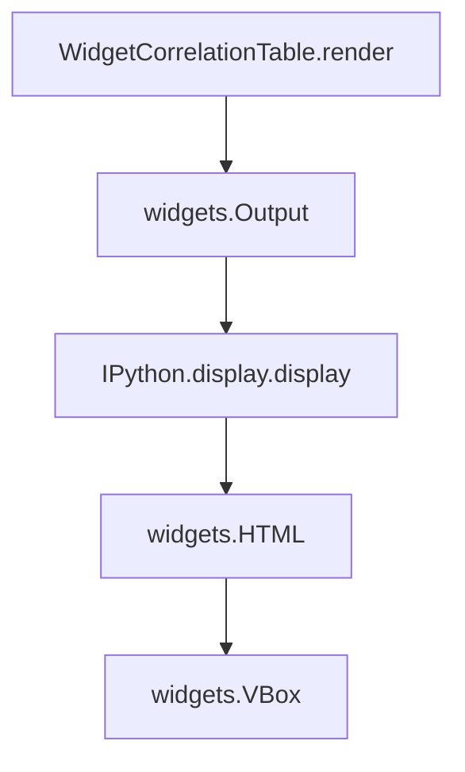

# `correlation_table.py`

## `src.ydata_profiling.report.presentation.flavours.widget.correlation_table.WidgetCorrelationTable` · *class*

## Summary:
WidgetCorrelationTable renders correlation matrices as interactive widgets in Jupyter environments.

## Description:
WidgetCorrelationTable is a presentation layer component that transforms correlation matrix data into interactive ipywidgets for display in Jupyter notebooks. It inherits from CorrelationTable and provides a concrete implementation of the render method specifically designed for widget-based environments.

This class serves as a bridge between correlation matrix data and interactive visualization in Jupyter environments, allowing users to view correlation relationships in a structured, scrollable widget interface. It's particularly useful for exploratory data analysis within notebook environments where interactive widgets enhance user experience.

## State:
- `content`: dict, contains the correlation matrix DataFrame under the key "correlation_matrix" and a string name under the key "name"
- `item_type`: str, inherited from parent class CorrelationTable, set to "correlation_table"
- `name`: str, inherited from parent class CorrelationTable, identifies the correlation table
- `anchor_id`: str, inherited from parent class CorrelationTable, optional HTML anchor identifier
- `classes`: str, inherited from parent class CorrelationTable, optional CSS classes for styling

## Lifecycle:
Creation: Instantiate with a name string and correlation_matrix DataFrame, typically through the parent class constructor
Usage: Call render() method to obtain a widgets.VBox containing the formatted correlation matrix
Destruction: No special cleanup required; relies on Python garbage collection

## Method Map:


## Raises:
- None explicitly raised by __init__ (inherits from parent class)
- May raise exceptions from ipywidgets or display functions if invalid data is provided

## Example:
```python
import pandas as pd
from ydata_profiling.report.presentation.flavours.widget.correlation_table import WidgetCorrelationTable

# Create a correlation matrix
corr_matrix = pd.DataFrame({
    'A': [1.0, 0.5, -0.3],
    'B': [0.5, 1.0, 0.2],
    'C': [-0.3, 0.2, 1.0]
})

# Create widget correlation table component
widget_corr_table = WidgetCorrelationTable("My Correlation Table", corr_matrix)

# Render the widget for display in Jupyter
widget = widget_corr_table.render()

# The widget can now be displayed in a Jupyter cell
# widget  # This would show the rendered widget
```

### `src.ydata_profiling.report.presentation.flavours.widget.correlation_table.WidgetCorrelationTable.render` · *method*

## Summary:
Renders a correlation table as a widget-based UI component containing a styled header and correlation matrix display.

## Description:
Creates a widget-based representation of a correlation table by combining a styled header with an interactive correlation matrix display. This method implements the rendering logic for the WidgetCorrelationTable presentation component, specifically designed for Jupyter notebook environments using ipywidgets.

The render method is called during the report generation pipeline when the correlation table needs to be displayed in a widget interface. It leverages the IPython display system to show correlation matrices within widget containers.

## Args:
    None (implicit self parameter)

## Returns:
    widgets.VBox: A vertical box container widget containing:
        - An HTML widget displaying the correlation table name as a heading
        - An Output widget that displays the correlation matrix DataFrame

## Raises:
    None explicitly raised

## State Changes:
    Attributes READ:
        - self.content: Dictionary containing "correlation_matrix" (DataFrame) and "name" (str) keys
    Attributes WRITTEN:
        - None

## Constraints:
    Preconditions:
        - self.content must contain a dictionary with "correlation_matrix" key mapping to a pandas DataFrame
        - self.content must contain a dictionary with "name" key mapping to a string
    Postconditions:
        - Returns a properly structured widgets.VBox with two children in order: name header and matrix output

## Side Effects:
    - Displays correlation matrix using IPython.display.display() within the Output widget context
    - Creates widget objects that will be rendered in Jupyter notebooks

