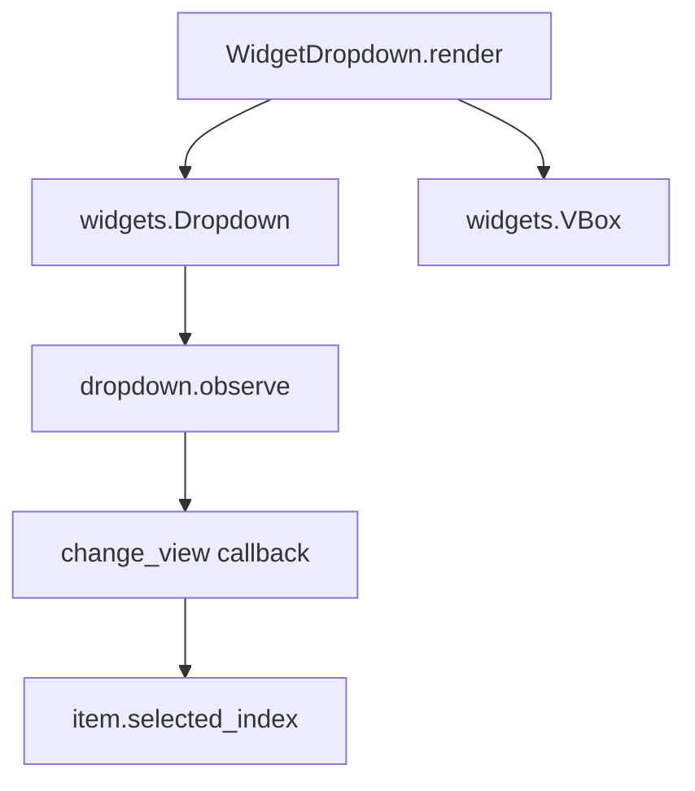

# `dropdown.py`

## `src.ydata_profiling.report.presentation.flavours.widget.dropdown.WidgetDropdown` · *class*

## Summary:
WidgetDropdown is a concrete implementation of the Dropdown component that renders an interactive dropdown menu using ipywidgets, enabling dynamic content switching based on user selection.

## Description:
WidgetDropdown provides a widget-based dropdown interface that integrates with Jupyter notebooks through ipywidgets. It extends the abstract Dropdown class and implements the render method to create an interactive dropdown UI element. This component is specifically designed for use in the ydata-profiling report generation framework, where dropdown menus allow users to toggle visibility of associated content sections.

The class serves as a bridge between the abstract presentation layer and concrete widget implementations, enabling interactive report generation in notebook environments. It manages synchronization between dropdown selections and another widget's content display through event observation.

## State:
- content: dict - Configuration data containing:
  - items: list - Options to display in the dropdown menu
  - name: str - Label/identifier for the dropdown
  - item: Container or None - Associated content container to be shown/hidden
- self.content["items"]: list - List of available dropdown options
- self.content["name"]: str - Display label for the dropdown
- self.content["item"]: Container or None - Content container that gets updated based on selection

## Lifecycle:
- Creation: Instantiated with a content dictionary containing "items", "name", and optional "item" keys, inheriting from Dropdown.__init__
- Usage: Call render() method to generate the ipywidgets.VBox containing the dropdown and associated content
- Destruction: Relies on Python garbage collection; no explicit cleanup needed

## Method Map:


## Raises:
- None explicitly raised by WidgetDropdown.__init__
- May raise exceptions from ipywidgets.Dropdown constructor if invalid parameters are passed
- May raise exceptions from widgets.VBox constructor if invalid parameters are passed

## Example:
```python
from ydata_profiling.report.presentation.flavours.widget.dropdown import WidgetDropdown
from ydata_profiling.report.presentation.core.container import Container

# Create a dropdown with items and associated content
dropdown_content = Container(items=[], sequence_type="column")
dropdown_config = {
    "items": ["Option 1", "Option 2", "Option 3"],
    "name": "Select Option",
    "item": dropdown_content
}

dropdown_widget = WidgetDropdown(content=dropdown_config)
widget_output = dropdown_widget.render()
```

### `src.ydata_profiling.report.presentation.flavours.widget.dropdown.WidgetDropdown.render` · *method*

## Summary:
Renders a dropdown widget that controls the visibility of associated content items.

## Description:
Creates an interactive dropdown widget using ipywidgets that allows users to select from available options. When an option is selected, it updates the associated content item's selected index to display the corresponding content. This method implements the widget-based rendering for dropdown components in the presentation layer.

The render method is responsible for creating the visual representation of a dropdown that can toggle visibility of nested content. It establishes an event listener on the dropdown to synchronize selection changes with the underlying content item's state.

## Args:
    None

## Returns:
    widgets.VBox: A vertical box container holding the dropdown widget and associated content item, or just the dropdown if no content item exists.

## Raises:
    None explicitly raised

## State Changes:
    Attributes READ: self.content
    Attributes WRITTEN: None

## Constraints:
    Preconditions:
    - self.content must contain "items" key with dropdown options
    - self.content must contain "name" key with dropdown description
    - self.content["item"] must be either None or a valid renderable object with content["items"] containing items with .name attributes
    
    Postconditions:
    - Returns a widgets.VBox containing the dropdown and optionally the rendered content item
    - The dropdown observes value changes and updates the content item accordingly

## Side Effects:
    - Creates ipywidgets.Dropdown and widgets.VBox instances
    - Sets up event observation on the dropdown widget
    - May modify the selected_index property of the content item when dropdown value changes

