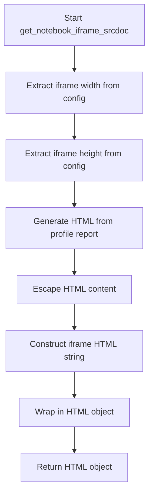
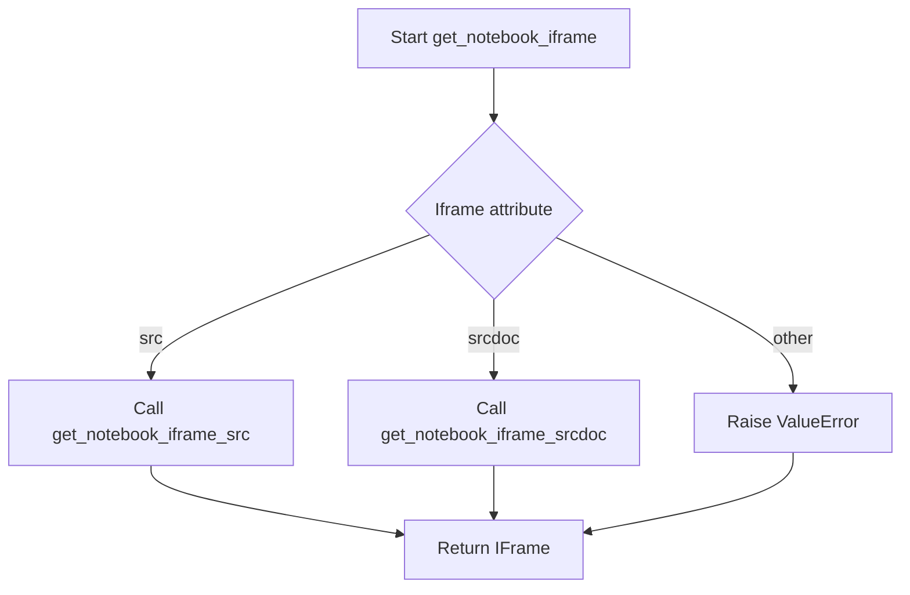

# `notebook.py`

## `src.ydata_profiling.report.presentation.flavours.widget.notebook.get_notebook_iframe_srcdoc` · *function*

## Summary:
Generates an HTML iframe element embedding a profile report for display in Jupyter notebooks.

## Description:
Creates an HTML iframe with embedded profile report content, configured with dimensions from the settings. This function isolates the logic for generating notebook-compatible iframe displays, separating presentation concerns from report generation.

## Args:
    config (Settings): Configuration object containing notebook-specific settings including iframe dimensions
    profile (ProfileReport): The profile report instance to embed in the iframe

## Returns:
    HTML: An IPython HTML object containing the iframe element for notebook display

## Raises:
    None explicitly raised

## Constraints:
    Preconditions:
    - config.notebook.iframe.width and config.notebook.iframe.height must be defined
    - profile.to_html() must return valid HTML string
    - profile must be a valid ProfileReport instance
    
    Postconditions:
    - Returns a properly formatted HTML iframe element
    - The iframe contains the escaped HTML content of the profile report

## Side Effects:
    None

## Control Flow:


## Examples:
```python
# Basic usage in a Jupyter notebook
from ydata_profiling import ProfileReport
from ydata_profiling.config import Settings

config = Settings()
profile = ProfileReport(df)
html_display = get_notebook_iframe_srcdoc(config, profile)
html_display  # This will render the iframe in the notebook cell
```

## `src.ydata_profiling.report.presentation.flavours.widget.notebook.get_notebook_iframe_src` · *function*

## Summary:
Generates an IFrame object for displaying a profile report in Jupyter notebook environments by creating a temporary HTML file.

## Description:
Creates a temporary HTML file from a ProfileReport and returns an IFrame object configured with notebook-specific dimensions. This function abstracts the process of converting a profile report to HTML format and embedding it in a notebook interface, providing a clean separation between report generation and display logic.

## Args:
    config (Settings): Configuration settings containing notebook iframe dimensions (width and height)
    profile (ProfileReport): The profile report to convert to HTML and display

## Returns:
    IFrame: An IPython IFrame object pointing to the temporary HTML file with configured width and height

## Raises:
    None explicitly raised in the function body

## Constraints:
    Preconditions:
    - config must contain valid notebook.iframe.width and notebook.iframe.height attributes
    - profile must be a valid ProfileReport instance with a to_file method
    - Temporary directory path "./ipynb_tmp" must be writable
    
    Postconditions:
    - A temporary HTML file is created in the ipynb_tmp directory with a unique UUID-based filename
    - The temporary file contains the HTML representation of the profile report
    - The returned IFrame points to the created temporary file

## Side Effects:
    - Creates a temporary directory "./ipynb_tmp" if it doesn't exist
    - Writes a temporary HTML file to the filesystem with a UUID-based name
    - The temporary file persists until manually cleaned up or system cleanup

## Control Flow:
```mermaid
flowchart TD
    A[Start get_notebook_iframe_src] --> B[Generate unique filename with UUID]
    B --> C[Ensure temp directory exists]
    C --> D[Save profile to temporary HTML file]
    D --> E[Import IFrame (if not already imported)]
    E --> F[Create IFrame with file path and config dimensions]
    F --> G[Return IFrame object]
```

## Examples:
```python
# Basic usage in Jupyter notebook
from ydata_profiling import ProfileReport
from ydata_profiling.config import Settings

config = Settings()
profile = ProfileReport(df)
iframe = get_notebook_iframe_src(config, profile)
iframe  # This will display the report in the notebook cell
```

## `src.ydata_profiling.report.presentation.flavours.widget.notebook.get_notebook_iframe` · *function*

## Summary:
Selects and generates an appropriate iframe display method for Jupyter notebook environments based on configuration settings.

## Description:
Determines whether to display a profile report in a Jupyter notebook using the "src" or "srcdoc" iframe attribute approach. This function acts as a dispatcher that routes to specialized iframe generation functions based on the configured iframe attribute type. It provides a clean abstraction layer that separates the decision logic from the implementation details of each iframe approach.

## Args:
    config (Settings): Configuration object containing notebook settings including iframe attribute specification
    profile (ProfileReport): The profile report instance to be displayed in the notebook

## Returns:
    Union[IFrame, HTML]: An IPython IFrame or HTML object depending on the configured iframe attribute type

## Raises:
    ValueError: When the iframe attribute configuration is neither "src" nor "srcdoc"

## Constraints:
    Preconditions:
    - config must contain a valid notebook.iframe.attribute setting
    - profile must be a valid ProfileReport instance
    
    Postconditions:
    - Returns either an IFrame or HTML object suitable for Jupyter notebook display
    - The returned object will properly render the profile report in the notebook environment

## Side Effects:
    None

## Control Flow:


## Examples:
```python
# Basic usage in Jupyter notebook
from ydata_profiling import ProfileReport
from ydata_profiling.config import Settings

config = Settings()
profile = ProfileReport(df)
iframe_display = get_notebook_iframe(config, profile)
iframe_display  # This will display the report in the notebook cell
```

