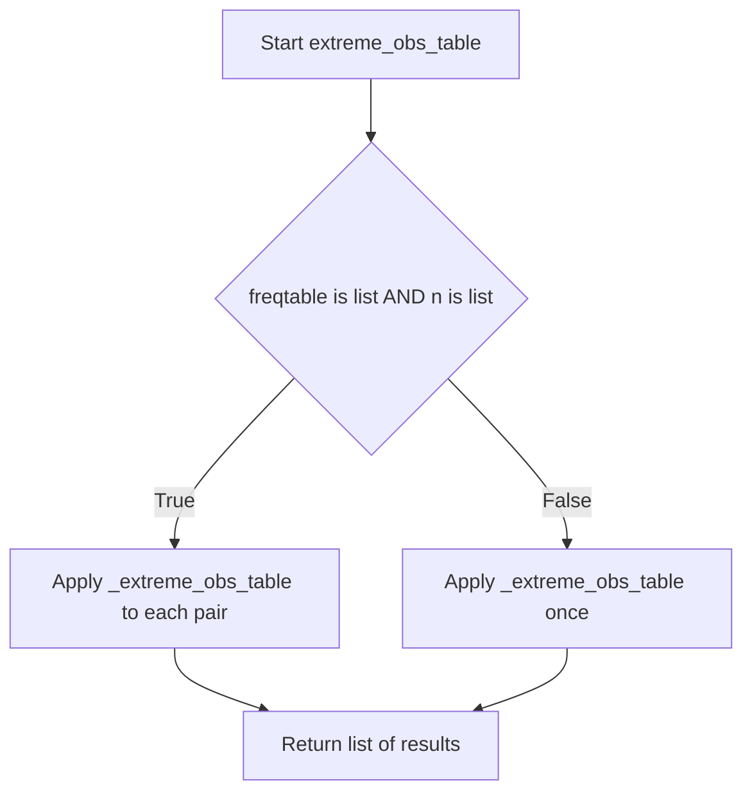

# `frequency_table_utils.py`

## `src.ydata_profiling.report.presentation.frequency_table_utils._frequency_table` · *function*

## Summary:
Formats frequency table data into a standardized list of display records with normalized widths and percentage calculations.

## Description:
Processes a frequency table series to generate a list of dictionaries containing formatted display information for visualization. This utility function handles special cases like "Other values" and "Missing" entries while normalizing all values relative to the maximum frequency for proper visual scaling.

## Args:
    freqtable (pd.Series): Frequency counts for each unique value, indexed by the values themselves
    n (int): Total count of observations in the dataset
    max_number_to_print (int): Maximum number of top-frequency values to display before grouping others into "Other values"

## Returns:
    List[Dict[str, Any]]: List of dictionaries containing display information for each frequency entry with keys:
        - label: Display label for the value
        - width: Normalized width for visualization (relative to max frequency)
        - count: Raw frequency count
        - percentage: Percentage of total observations
        - n: Total observation count
        - extra_class: CSS class identifier for styling ("other" or "missing")

## Raises:
    None explicitly raised

## Constraints:
    Preconditions:
        - freqtable should be a pandas Series with frequency counts
        - n should be a non-negative integer representing total observations
        - max_number_to_print should be a non-negative integer
    
    Postconditions:
        - Returns an empty list if freqtable is empty or all frequencies are zero
        - All returned dictionaries contain the same set of keys
        - Width values are normalized between 0 and 1

## Side Effects:
    None

## Control Flow:
```mermaid
flowchart TD
    A[Start _frequency_table] --> B{max_number_to_print > n?}
    B -- Yes --> C[max_number_to_print = n]
    B -- No --> C
    C --> D{max_number_to_print < len(freqtable)?}
    D -- Yes --> E[freq_other = sum(freqtable[max_number_to_print:])]
    D -- No --> F[freq_other = 0]
    E --> G[min_freq = freqtable.values[max_number_to_print]]
    F --> G
    G --> H[freq_missing = n - sum(freqtable)]
    H --> I{len(freqtable) == 0?}
    I -- Yes --> J[Return []]
    I -- No --> K[max_freq = max(freqtable[0], freq_other, freq_missing)]
    K --> L{max_freq == 0?}
    L -- Yes --> M[Return []]
    L -- No --> N[Initialize rows list]
    N --> O[Process top max_number_to_print entries]
    O --> P[Add each entry to rows dict]
    P --> Q{freq_other > min_freq?}
    Q -- Yes --> R[Add "Other values" entry]
    Q -- No --> S[Skip Other values]
    R --> T[Add "Missing" entry if freq_missing > min_freq]
    S --> T
    T --> U[Return rows]
```

## Examples:
    # Basic usage with frequency data
    freq_data = pd.Series([10, 5, 3, 2], index=['A', 'B', 'C', 'D'])
    result = _frequency_table(freq_data, 20, 3)
    # Returns list of dictionaries with normalized widths for top 3 values
    
    # Usage with missing values
    freq_data = pd.Series([15, 3], index=['X', 'Y'])
    result = _frequency_table(freq_data, 20, 5)
    # Includes missing value entry in results

## `src.ydata_profiling.report.presentation.frequency_table_utils.freq_table` · *function*

## Summary:
Processes frequency table data for visualization by handling both single and multiple frequency table inputs.

## Description:
This function serves as a dispatcher that handles both single frequency table Series and lists of frequency table Series. It determines whether to process a single frequency table or multiple frequency tables based on input types, then delegates to the internal `_frequency_table` function for actual processing. This abstraction allows the presentation layer to handle both simple and complex frequency table scenarios uniformly.

## Args:
    freqtable (Union[pd.Series, List[pd.Series]]): Either a single pandas Series containing frequency counts indexed by values, or a list of such Series for multiple frequency tables
    n (Union[int, List[int]]): Total count of observations in the dataset, either a single integer or a list of integers matching the frequency tables
    max_number_to_print (int): Maximum number of top-frequency values to display before grouping others into "Other values" category

## Returns:
    Union[List[Dict[str, Any]], List[List[Dict[str, Any]]]]: When input is a single frequency table, returns a list of dictionaries containing formatted display information. When input is a list of frequency tables, returns a list of such lists, one for each frequency table.

## Raises:
    None explicitly raised

## Constraints:
    Preconditions:
        - freqtable should be either a pandas Series or a list of pandas Series
        - n should be either an integer or a list of integers with matching length to freqtable when it's a list
        - max_number_to_print should be a non-negative integer
        
    Postconditions:
        - Returns properly formatted display data structures for visualization
        - Handles both single and multiple frequency table scenarios consistently

## Side Effects:
    None

## Control Flow:
```mermaid
flowchart TD
    A[Start freq_table] --> B{isinstance(freqtable, list) AND isinstance(n, list)?}
    B -- Yes --> C[Process multiple frequency tables]
    B -- No --> D[Process single frequency table]
    C --> E[Zip freqtable and n lists]
    E --> F[Call _frequency_table for each pair]
    F --> G[Return list of results]
    D --> H[Call _frequency_table with single inputs]
    H --> G
```

## `src.ydata_profiling.report.presentation.frequency_table_utils._extreme_obs_table` · *function*

## Summary:
Creates a formatted table representation of the most frequent observations from a frequency distribution.

## Description:
Generates a list of dictionaries containing formatted data for displaying the most frequent observations in a frequency table. This utility function processes a frequency series to create structured data suitable for presentation layers, calculating normalized widths and percentages for visualization purposes.

## Args:
    freqtable (pd.Series): A pandas Series containing frequency counts for various categories/labels
    number_to_print (int): The number of top frequency observations to include in the result
    n (int): Total count of observations used to calculate percentages

## Returns:
    List[Dict[str, Any]]: A list of dictionaries, each representing a row in the frequency table with keys:
        - "label": The category/label name
        - "width": Normalized width (frequency divided by maximum frequency in selected items)
        - "count": Raw frequency count
        - "percentage": Percentage of total observations (frequency/n)
        - "extra_class": Empty string placeholder for CSS classes
        - "n": Total observation count

## Raises:
    None explicitly raised in the function body

## Constraints:
    Preconditions:
    - freqtable must be a valid pandas Series
    - number_to_print must be a non-negative integer
    - n must be a positive integer
    
    Postconditions:
    - Returns exactly number_to_print items (or fewer if freqtable has fewer items)
    - All returned dictionaries contain the same set of keys
    - Width values are between 0 and 1 (inclusive)

## Side Effects:
    None

## Control Flow:
```mermaid
flowchart TD
    A[Start _extreme_obs_table] --> B{freqtable.iloc[:number_to_print]}
    B --> C[obs_to_print = top items]
    C --> D[max_freq = max frequency]
    D --> E{max_freq != 0}
    E -->|True| F[width = freq/max_freq]
    E -->|False| G[width = 0]
    F --> H[Create row dict]
    G --> H
    H --> I[Add to rows list]
    I --> J[Return rows list]
```

## Examples:
```python
# Basic usage
freq_series = pd.Series([10, 5, 3, 2], index=['A', 'B', 'C', 'D'])
result = _extreme_obs_table(freq_series, 3, 20)
# Returns list of 3 dictionaries with labels A, B, C
# With widths normalized to max frequency (10), percentages calculated as 10/20, 5/20, 3/20
```

## `src.ydata_profiling.report.presentation.frequency_table_utils.extreme_obs_table` · *function*

## Summary:
Creates formatted table representations of extreme observations from frequency distributions for display purposes.

## Description:
Processes frequency distribution data to generate structured table representations suitable for presentation layers. Handles both single frequency tables and collections of frequency tables, delegating the actual formatting to the internal `_extreme_obs_table` function.

## Args:
    freqtable (Union[pd.Series, List[pd.Series]]): Either a single pandas Series containing frequency counts or a list of such Series objects
    number_to_print (int): The number of top frequency observations to include in each result table
    n (Union[int, List[int]]): Total count of observations (used for percentage calculations) - either a single integer or a list matching the length of freqtable

## Returns:
    List[List[Dict[str, Any]]]: A list of lists of dictionaries, where each inner list represents a formatted frequency table row. Each dictionary contains:
        - "label": Category/label name
        - "width": Normalized width (frequency divided by maximum frequency in selected items)
        - "count": Raw frequency count
        - "percentage": Percentage of total observations (frequency/n)
        - "extra_class": Empty string placeholder for CSS classes
        - "n": Total observation count

## Raises:
    None explicitly raised in the function body

## Constraints:
    Preconditions:
    - freqtable must be either a pandas Series or a list of pandas Series
    - number_to_print must be a non-negative integer
    - n must be either an integer or a list of integers with matching length to freqtable when it's a list
    
    Postconditions:
    - Returns a list of lists of dictionaries with consistent structure
    - Each inner list contains exactly number_to_print items (or fewer if freqtable has fewer items)
    - All returned dictionaries contain the same set of keys

## Side Effects:
    None

## Control Flow:


## Examples:
```python
# Single frequency table usage
import pandas as pd
freq_series = pd.Series([10, 5, 3, 2], index=['A', 'B', 'C', 'D'])
result = extreme_obs_table(freq_series, 3, 20)
# Returns [[{'label': 'A', 'width': 1.0, 'count': 10, 'percentage': 0.5, 'extra_class': '', 'n': 20},
#          {'label': 'B', 'width': 0.5, 'count': 5, 'percentage': 0.25, 'extra_class': '', 'n': 20},
#          {'label': 'C', 'width': 0.3, 'count': 3, 'percentage': 0.15, 'extra_class': '', 'n': 20}]]

# Multiple frequency tables usage
freq_series_list = [pd.Series([10, 5], index=['A', 'B']), pd.Series([8, 4], index=['X', 'Y'])]
result = extreme_obs_table(freq_series_list, 2, [15, 12])
# Returns [[...], [...]] - two formatted tables
```

