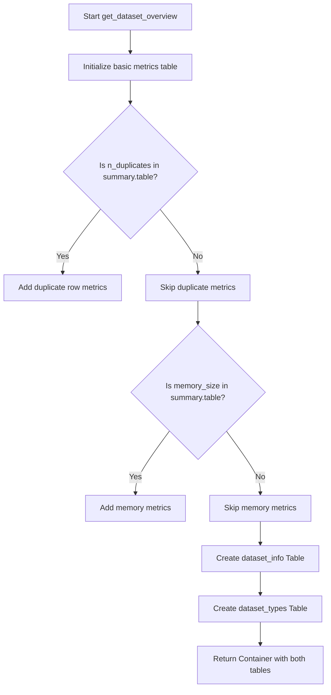
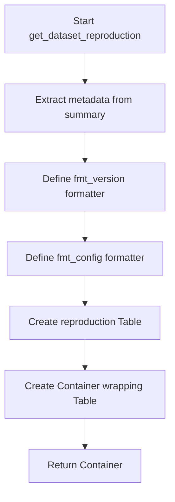
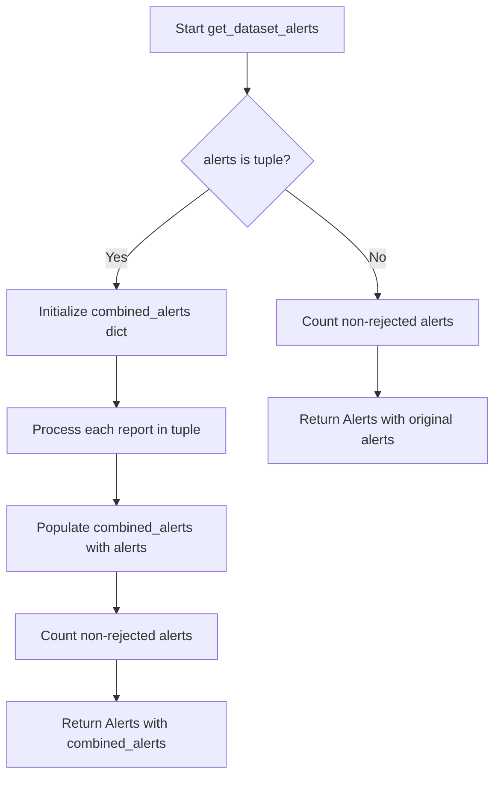
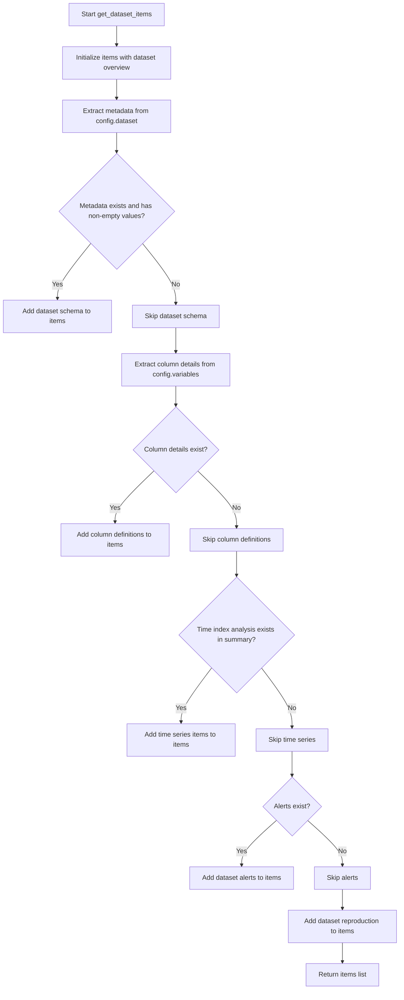

# `overview.py`

## `src.ydata_profiling.report.structure.overview.get_dataset_overview` · *function*

## Summary
Creates a structured overview of dataset statistics and variable types for report generation.

## Description
Generates a renderable dataset overview containing key statistics and variable type distributions. This function extracts fundamental dataset characteristics from the profiling summary and formats them into two structured tables: one for general dataset metrics and another for variable type counts. The function handles conditional inclusion of additional metrics like duplicate rows and memory usage based on availability in the summary data.

The function is designed to be reusable across different report generation contexts and encapsulates the logic for presenting basic dataset information in a standardized format that integrates well with the report presentation layer.

## Args
    config (Settings): Configuration object containing report settings including styling preferences and formatting options
    summary (BaseDescription): Profiling summary containing dataset statistics and variable information with the following required structure:
        - summary.table must contain keys: "n_var", "n", "n_cells_missing", "p_cells_missing"
        - summary.table may optionally contain keys: "n_duplicates", "p_duplicates", "memory_size", "record_size", "types"

## Returns
    Renderable: A Container object containing two Table components arranged in a grid layout:
        - First table: Dataset statistics with basic metrics like number of variables, observations, missing cells
        - Second table: Variable types with counts for each data type

## Raises
    None explicitly raised by this function

## Constraints
    Preconditions:
    - The summary parameter must contain a table attribute with the required keys
    - Required keys in summary.table: "n_var", "n", "n_cells_missing", "p_cells_missing"
    - Optional keys in summary.table: "n_duplicates", "p_duplicates", "memory_size", "record_size", "types"
    
    Postconditions:
    - Returns a Container with exactly two Table components
    - The first table always contains the basic dataset metrics
    - The second table always contains variable type distribution information

## Side Effects
    None - this function is pure and has no side effects

## Control Flow


## Examples
```python
# Basic usage with minimal summary data
from ydata_profiling.config import Settings
from ydata_profiling.model import BaseDescription

# Assuming summary has the required fields
config = Settings()
summary = BaseDescription()
# ... populate summary with profiling data ...

overview = get_dataset_overview(config, summary)
# Returns a Container with dataset statistics and variable types tables
```

## `src.ydata_profiling.report.structure.overview.get_dataset_schema` · *function*

## Summary
Creates a structured dataset metadata container for inclusion in profiling reports.

## Description
Generates a formatted table containing key dataset metadata such as description, creator, author, URL, and copyright information. This function extracts relevant metadata from the provided dictionary and formats it appropriately for display in HTML reports, ensuring proper HTML escaping and formatting for various data types.

The function is designed to be a reusable component for creating consistent dataset metadata presentations across different report sections. It specifically handles the extraction and formatting of common dataset metadata fields while applying appropriate HTML formatting for links and copyright notices. This logic is extracted into its own function to separate concerns between data processing and presentation layer construction.

## Args
- config (Settings): Configuration object containing report settings including HTML styling preferences
- metadata (dict): Dictionary containing dataset metadata fields such as description, creator, author, url, copyright_holder, and copyright_year

## Returns
- Container: A presentation-layer container object containing a formatted Table with dataset metadata. The container is structured as a grid sequence type for proper layout in HTML reports. The table includes rows for each metadata field that exists and has a non-empty value.

## Raises
- None explicitly raised by this function

## Constraints
- Preconditions:
  - config parameter must be a valid Settings object with html.style attribute available
  - metadata parameter must be a dictionary that can be accessed with string keys
- Postconditions:
  - Returns a Container object with properly formatted metadata table
  - Only includes metadata fields that exist and have non-empty values
  - URL field is wrapped in HTML anchor tags when present
  - Copyright information is formatted with year when available

## Side Effects
- None

## Control Flow
```mermaid
flowchart TD
    A[Start get_dataset_schema] --> B[Initialize empty about_dataset list]
    B --> C[Process description, creator, author fields]
    C --> D{Key exists in metadata AND value length > 0?}
    D -- Yes --> E[Format with fmt() and append to about_dataset]
    D -- No --> F[Skip]
    F --> G[Process URL field]
    G --> H{URL key exists in metadata?}
    H -- Yes --> I[Create HTML anchor tag and append to about_dataset]
    H -- No --> J[Skip]
    J --> K[Process copyright information]
    K --> L{copyright_holder exists AND length > 0?}
    L -- Yes --> M[Check for copyright_year]
    M --> N{copyright_year not in metadata?}
    N -- Yes --> O[Format copyright without year]
    N -- No --> P[Format copyright with year]
    O --> Q[Append copyright to about_dataset]
    P --> Q
    Q --> R[Create Table with about_dataset rows]
    R --> S[Create Container with Table]
    S --> T[Return Container]
```

## Examples
```python
from ydata_profiling.config import Settings
from ydata_profiling.report.structure.overview import get_dataset_schema

# Example usage with minimal metadata
config = Settings()
metadata = {
    "description": "Sample dataset for testing",
    "creator": "John Doe",
    "url": "https://example.com/dataset"
}

container = get_dataset_schema(config, metadata)
# Returns a Container with a Table containing description, creator, and URL

# Example usage with copyright information
metadata_with_copyright = {
    "description": "Financial data",
    "copyright_holder": "Acme Corp",
    "copyright_year": "2023"
}

container = get_dataset_schema(config, metadata_with_copyright)
# Returns a Container with a Table containing copyright information
```

## `src.ydata_profiling.report.structure.overview.get_dataset_reproduction` · *function*

## Summary:
Creates a reproducibility section for dataset profiling reports containing analysis metadata and configuration information.

## Description:
Generates a structured table displaying key metadata about the dataset analysis run, including timestamps, duration, software version, and downloadable configuration. This function extracts information from the analysis summary and formats it appropriately for display in HTML reports.

This logic is extracted into its own function to separate the concerns of data extraction and formatting from the report generation process, making the code more modular and testable.

## Args:
    config (Settings): Configuration settings for report generation, used to access HTML styling options
    summary (BaseDescription): Analysis summary containing metadata about the profiling run including package info, analysis timestamps, and duration

## Returns:
    Renderable: A Container object containing a Table with reproduction metadata that can be rendered in HTML reports

## Raises:
    None explicitly raised - relies on underlying formatters and data access patterns

## Constraints:
    Preconditions:
    - summary must contain package dictionary with "ydata_profiling_version" and "ydata_profiling_config" keys
    - summary must contain analysis object with date_start, date_end, and duration attributes
    - config must be a valid Settings object with html.style attribute

    Postconditions:
    - Returns a properly formatted Container with embedded Table
    - All timestamp values are formatted using the fmt function
    - Duration is formatted using fmt_timespan function
    - Version and config are formatted using custom inner functions

## Side Effects:
    None - this function is pure and doesn't perform any I/O operations or mutate external state

## Control Flow:


## Examples:
```python
# Typical usage in report generation
config = Settings()
summary = BaseDescription()
reproduction_section = get_dataset_reproduction(config, summary)
# Returns a Renderable that can be added to report structure
```

## `src.ydata_profiling.report.structure.overview.get_dataset_column_definitions` · *function*

## Summary
Creates a structured table presentation of dataset column definitions for inclusion in profiling reports.

## Description
Generates a formatted table displaying variable/column definitions from a dataset, wrapped in a container for proper report organization. This function extracts column metadata from the definitions dictionary and presents it in a standardized table format suitable for HTML reports.

The function is designed to separate the logic of formatting column definitions from the report generation pipeline, allowing for consistent presentation of variable metadata across different report sections. It leverages the existing formatting infrastructure (`fmt`) to ensure proper display of various data types and integrates with the HTML styling configuration.

This function is typically called during report generation when variable descriptions need to be displayed in a structured format. It enables clean separation of concerns by encapsulating the presentation logic for column definitions.

## Args
- config (Settings): Configuration object containing report settings including HTML styling preferences
- definitions (dict): Dictionary mapping column names to their descriptive values

## Returns
- Container: A container object holding the formatted column definitions table, ready for report rendering

## Raises
- None explicitly raised

## Constraints
- Preconditions:
  - config parameter must be a valid Settings instance
  - definitions parameter must be a dictionary with string keys and any value types
- Postconditions:
  - Returns a Container instance containing exactly one Table
  - The returned Container has predefined name "Variables" and anchor_id "variable_descriptions"
  - The Table has fixed name "Variable descriptions" and anchor_id "variable_definition_table"

## Side Effects
- None

## Control Flow
```mermaid
flowchart TD
    A[Start get_dataset_column_definitions] --> B[Create variable_descriptions list]
    B --> C[Iterate over definitions.items()]
    C --> D[Format each value with fmt()]
    D --> E[Create Table with formatted data]
    E --> F[Wrap Table in Container]
    F --> G[Return Container]
```

## Examples
```python
from ydata_profiling.config import Settings
from ydata_profiling.report.structure.overview import get_dataset_column_definitions

# Example usage in report generation
config = Settings()
definitions = {
    "age": "Age of the person in years",
    "income": "Annual income in USD",
    "city": "City of residence"
}

container = get_dataset_column_definitions(config, definitions)
# Returns a Container containing a Table with the column definitions
```

## `src.ydata_profiling.report.structure.overview.get_dataset_alerts` · *function*

## Summary
Processes and formats data quality alerts for inclusion in profiling reports, handling both single and multiple report scenarios.

## Description
The `get_dataset_alerts` function transforms raw alert data into a standardized `Alerts` presentation component suitable for display in profiling reports. It handles two distinct input scenarios: when alerts come from a single report (as a list) and when alerts come from multiple reports (as a tuple of alert lists). The function filters out rejected alerts and calculates appropriate counts for display.

This function is extracted from inline logic to provide a centralized location for alert processing and formatting, ensuring consistent presentation of data quality issues across different report sections. It separates the concern of alert aggregation and formatting from the report generation logic, improving maintainability and testability.

## Args
- config (Settings): Configuration object containing HTML styling settings and report preferences
- alerts (list or tuple): Collection of alert objects, either as a single list of Alert objects or tuple of lists for multi-report scenarios

## Returns
- Alerts: A presentation-ready Alerts component containing the processed alerts with appropriate styling and metadata

## Raises
- None explicitly raised by this function

## Constraints
- Preconditions: 
  - `config` must be a valid Settings object with a populated `html.style` attribute
  - `alerts` must be either a list of Alert objects or a tuple of lists of Alert objects
- Postconditions:
  - Returns an Alerts object with properly formatted alert data
  - Rejected alerts (AlertType.REJECTED) are excluded from the displayed count

## Side Effects
- None

## Control Flow


## Examples
```python
from ydata_profiling.config import Settings
from ydata_profiling.model.alerts import Alert, AlertType
from ydata_profiling.report.structure.overview import get_dataset_alerts

# Example 1: Single report alerts
config = Settings()
alert1 = Alert(alert_type=AlertType.MISSING_VALUES, column_name="col1")
alert2 = Alert(alert_type=AlertType.HIGH_CORRELATION, column_name="col2")
alerts_list = [alert1, alert2]

result = get_dataset_alerts(config, alerts_list)
# Returns Alerts object with 2 non-rejected alerts

# Example 2: Multiple report alerts (tuple scenario)
config = Settings()
report1_alerts = [alert1]
report2_alerts = [alert2]
alerts_tuple = (report1_alerts, report2_alerts)

result = get_dataset_alerts(config, alerts_tuple)
# Returns Alerts object with combined alerts from both reports
```

## `src.ydata_profiling.report.structure.overview.get_timeseries_items` · *function*

## Summary:
Generates a comprehensive time series overview report section with statistical summaries and visual plots.

## Description:
Creates a structured report section for time series data analysis, including key statistics and visualizations. This function extracts time series metadata from the summary and formats it into a tabular display alongside two plot variants (original and scaled) of the time series data.

The function is designed to be called during report generation when time series data is detected in the dataset. It encapsulates the logic for formatting time series statistics and generating appropriate visual representations, separating concerns between data processing and presentation layer.

## Args:
    config (Settings): Configuration settings that control report appearance and plotting parameters
    summary (BaseDescription): Dataset summary containing time series analysis results and variable information

## Returns:
    Container: A hierarchical presentation container containing:
        - A Table with time series statistics (number of series, length, start/end points, period)
        - A Container with two tabs showing time series plots (original and scaled)

## Raises:
    AssertionError: When summary.time_index_analysis is not of type TimeIndexAnalysis

## Constraints:
    Preconditions:
        - summary must contain a valid time_index_analysis attribute of type TimeIndexAnalysis
        - summary.variables must contain time series data for plotting
        - config.plot.image_format must be a valid image format string
        - config.plot.dpi must be a numeric value for plotting resolution
    
    Postconditions:
        - The returned Container will contain exactly two child elements: a Table with statistics and a Container with plot tabs
        - The config.plot.dpi setting will be restored to its original value after plotting

## Side Effects:
    - Temporarily modifies config.plot.dpi setting during image generation
    - Calls plot_overview_timeseries function which likely generates matplotlib figures
    - May perform I/O operations when saving generated plots (behavior depends on underlying implementation)

## Control Flow:
```mermaid
flowchart TD
    A[Start get_timeseries_items] --> B{summary.time_index_analysis is TimeIndexAnalysis?}
    B -- No --> C[AssertionError]
    B -- Yes --> D[Format table stats using format_tsindex_limit]
    D --> E[Create ts_info Table with 5 statistics]
    E --> F[Save config.plot.dpi]
    F --> G[Set config.plot.dpi = 300]
    G --> H[Generate timeseries plot (original)]
    H --> I[Generate timeseries plot (scaled)]
    I --> J[Restore config.plot.dpi]
    J --> K[Create ts_tab Container (tabs)]
    K --> L[Create final Container (grid)]
    L --> M[Return Container]
```

## Examples:
```python
# Typical usage in report generation pipeline
from ydata_profiling.config import Settings
from ydata_profiling.model import BaseDescription

# Configure report settings
config = Settings()
config.plot.image_format = "png"
config.plot.dpi = 100

# Process dataset to get summary with time series analysis
summary = process_dataset_with_time_series()

# Generate time series overview section for report
timeseries_section = get_timeseries_items(config, summary)

# The result contains both statistics table and interactive plots
# ready to be embedded in HTML report
```

## `src.ydata_profiling.report.structure.overview.get_dataset_items` · *function*

## Summary
Collects and organizes various dataset-related components for report generation into a structured list of renderable items.

## Description
Assembles a comprehensive collection of dataset overview components by calling specialized helper functions based on available data. This function serves as the central coordinator for building the dataset section of profiling reports, dynamically including relevant information such as dataset metadata, column definitions, time series analysis, alerts, and reproduction information.

The function is designed to be a single entry point for gathering all dataset-related report components, enabling flexible report construction based on the presence of different data types and analysis results. It orchestrates the creation of various report elements while maintaining logical grouping and conditional inclusion based on data availability.

## Args
    config (Settings): Configuration object containing report settings and formatting preferences
    summary (BaseDescription): Profiling summary containing dataset statistics and analysis results
    alerts (list): List of alert objects representing data quality issues detected during profiling

## Returns
    list[Renderable]: A list of renderable components that constitute the dataset overview section of a report, including:
        - Dataset overview table (always included)
        - Dataset schema table (included if metadata exists)
        - Column definitions table (included if column details exist)
        - Time series analysis section (included if time series data exists)
        - Alerts section (included if alerts exist)
        - Reproduction information table (always included)

## Raises
    None explicitly raised by this function

## Constraints
    Preconditions:
    - config must be a valid Settings object
    - summary must be a valid BaseDescription object with required attributes
    - alerts must be a list-like object (can be empty)

    Postconditions:
    - Always returns a list of Renderable objects
    - The first item in the returned list is always the dataset overview
    - The last item in the returned list is always the reproduction information
    - Conditional items are only included when their respective data conditions are met

## Side Effects
    None - this function is pure and has no side effects

## Control Flow


## Examples
```python
# Basic usage in report generation pipeline
from ydata_profiling.config import Settings
from ydata_profiling.model import BaseDescription

config = Settings()
summary = BaseDescription()
alerts = []

dataset_items = get_dataset_items(config, summary, alerts)
# Returns list containing dataset overview and reproduction information

# Usage with additional data
alerts = [alert1, alert2]  # Some alert objects
dataset_items = get_dataset_items(config, summary, alerts)
# Returns list with overview, alerts, and reproduction information
```

