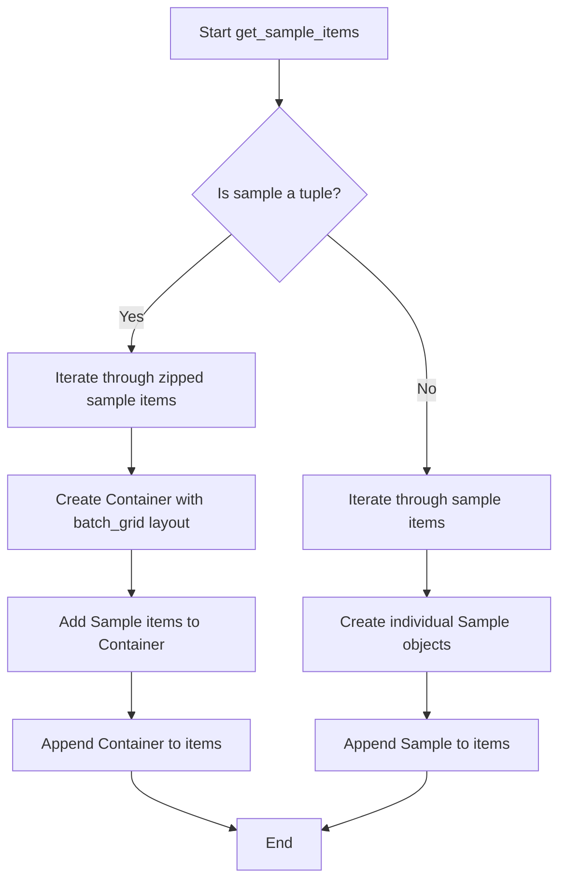
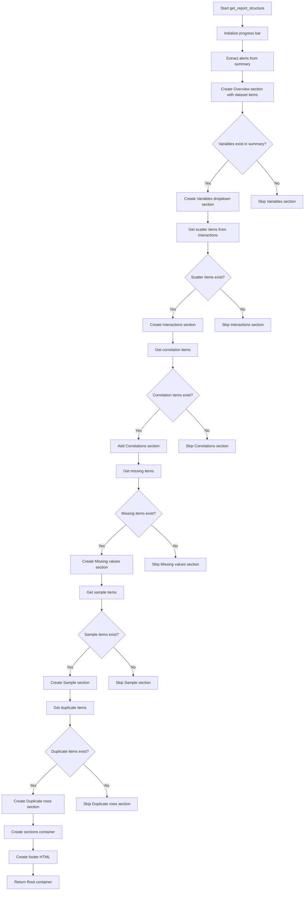

# `report.py`

## `src.ydata_profiling.report.structure.report.get_missing_items` · *function*

## Summary
Transforms missing data summary information into presentation-ready renderable components.

## Description
Processes missing data visualization information from a profiling summary and converts it into renderable components for report presentation. This function handles both single missing data visualizations and batched multi-visualization layouts by examining the structure of item names in the summary's missing data collection.

The function is extracted to separate the concern of transforming missing data summary information into presentation components from the broader report generation logic, enabling cleaner modularization and easier testing.

## Args
    config (Settings): Configuration object containing report settings including plot format and styling preferences
    summary (BaseDescription): Profiling summary containing missing data information in the missing attribute

## Returns
    list: A list of renderable components (ImageWidget or Container objects) representing missing data visualizations

## Raises
    None explicitly raised

## Constraints
    Preconditions:
    - config must be a valid Settings object with proper plot configuration
    - summary must be a valid BaseDescription object containing a missing attribute
    - summary.missing must be a dictionary-like object with iterable key-value pairs
    - Each item in summary.missing must contain the keys: "matrix", "name", "caption"
    
    Postconditions:
    - Always returns a list of renderable objects
    - Each returned item corresponds to a missing data visualization from the summary
    - When item["name"] is a string, returns ImageWidget instances
    - When item["name"] is a list, returns Container instances with batched ImageWidgets

## Side Effects
    None - this function is pure and has no side effects

## Control Flow
```mermaid
flowchart TD
    A[Start get_missing_items] --> B[Iterate over summary.missing.items()]
    B --> C{item["name"] is string?}
    C -->|Yes| D[Create ImageWidget with item["matrix"], item["name"], item["caption"]]
    C -->|No| E[Create Container with batched ImageWidgets]
    D --> F[Add to items list]
    E --> F
    F --> G[Return items list]
```

## Examples
```python
# Basic usage in report generation pipeline
from ydata_profiling.config import Settings
from ydata_profiling.model import BaseDescription

config = Settings()
summary = BaseDescription()
# Assuming summary.missing contains appropriate data structure
missing_items = get_missing_items(config, summary)
# Returns list of renderable missing data visualization components
```

## `src.ydata_profiling.report.structure.report.render_variables_section` · *function*

## Summary
Generates a list of Variable renderable objects for each column in a DataFrame summary, including type-specific rendering and alert handling.

## Description
Processes a DataFrame summary to create individual Variable renderable components for each column. This function orchestrates the creation of report elements by mapping variable types to appropriate rendering functions, handling alerts and descriptions, and constructing the proper UI components for display in profiling reports.

The function is responsible for transforming raw variable analysis data into presentation-ready components that can be rendered in HTML reports. It handles complex logic for determining variable types, managing alerts and their associated metadata, and creating appropriate UI controls like collapsible sections for detailed information.

## Args
- config (Settings): Configuration object containing report settings including variable descriptions, alert handling preferences, and rendering options
- dataframe_summary (BaseDescription): Analysis results containing variable-level data including summaries, alerts, and metadata

## Returns
- list: A list of Variable renderable objects, one for each processed column in the DataFrame summary

## Raises
- ValueError: When a variable has incompatible data types that cannot be resolved to a single type (e.g., conflicting numeric/categorical types)

## Constraints
- Preconditions: 
  - config must be a valid Settings instance with properly initialized configuration attributes
  - dataframe_summary must be a valid BaseDescription instance with populated variables and alerts attributes
  - Each variable in dataframe_summary.variables must have a valid identifier (idx) that can be hashed
- Postconditions:
  - Returns a list of Variable renderable objects with proper alert handling
  - All returned Variable objects have valid anchor IDs and names
  - Variable type resolution follows established compatibility rules

## Side Effects
- No direct I/O operations
- No external state mutations
- No external service calls
- Creates new Variable renderable objects in memory

## Control Flow
```mermaid
flowchart TD
    A[Start render_variables_section] --> B[Initialize empty templs list]
    B --> C[Extract config values: descriptions, show_description, reject_variables]
    C --> D[Get render_map from get_render_map()]
    D --> E[Iterate through dataframe_summary.variables.items()]
    E --> F[Process alerts based on type (list vs single)]
    F --> G[Create template_variables dict with basic info]
    G --> H[Update template_variables with summary data]
    H --> I[Handle variable type resolution]
    I --> J{Is summary['type'] a list?}
    J -->|Yes| K[Resolve compatible types]
    K --> L[Validate type compatibility]
    L --> M{Types compatible?}
    M -->|No| N[Raise ValueError]
    M -->|Yes| O[Set variable_type to resolved type]
    J -->|No| P[Set variable_type to summary['type']]
    P --> Q[Get render_map_type from render_map]
    Q --> R[Update template_variables with render_map_type results]
    R --> S[Check if variable should be ignored due to rejection]
    S --> T{reject_variables enabled?}
    T -->|Yes| U[Check if AlertType.REJECTED in alert_types]
    U --> V{Is REJECTED alert present?}
    V -->|Yes| W[Set ignore=True]
    V -->|No| X[Set ignore=False]
    T -->|No| Y[Set ignore=False]
    Y --> Z{Has bottom content?}
    Z -->|Yes| AA[Create ToggleButton and Collapse]
    AA --> AB[Create Variable with top/bottom/anchor_id/name/ignore]
    Z -->|No| AC[Create Variable with top/anchor_id/name/ignore]
    AC --> AD[Append Variable to templs]
    AD --> AE[Continue to next variable]
    AE --> AF{More variables?}
    AF -->|Yes| E
    AF -->|No| AG[Return templs]
```

## `src.ydata_profiling.report.structure.report.get_duplicates_items` · *function*

## Summary
Processes duplicate data and generates renderable components for inclusion in profiling reports.

## Description
Creates a list of Duplicate renderable objects from duplicate data, handling both single DataFrames and lists of DataFrames. This function serves as a specialized component for rendering duplicate detection results in data profiling reports, separating the logic of duplicate data processing from the broader report generation workflow.

The function is designed to be called during report generation when duplicate data needs to be displayed. It handles edge cases such as empty or None inputs, and properly manages both single and multiple duplicate datasets with appropriate labeling based on configuration settings.

## Args
    config (Settings): Configuration object containing report settings and formatting preferences, specifically accessing `config.html.style._labels` for naming duplicate sections
    duplicates (pd.DataFrame or list): Either a single pandas DataFrame containing duplicate records or a list of DataFrames with duplicate records. Can be None or empty.

## Returns
    list[Renderable]: A list of Duplicate renderable objects that represent the duplicate data findings in the report. Returns an empty list if no duplicate data is provided or if duplicates is None/empty.

## Raises
    None explicitly raised by this function

## Constraints
    Preconditions:
    - config must be a valid Settings object with proper html style configuration
    - duplicates parameter can be None, empty, a single DataFrame, or a list of DataFrames
    - When duplicates is a list, all items should be valid DataFrames or None

    Postconditions:
    - Always returns a list of Renderable objects (possibly empty)
    - If duplicates is None or empty, returns an empty list
    - If duplicates is a list containing any None values, returns an empty list
    - If duplicates is a single DataFrame, returns a list with one Duplicate object
    - If duplicates is a list of DataFrames, returns a list with one Duplicate object per DataFrame

## Side Effects
    None - this function is pure and has no side effects

## Control Flow
```mermaid
flowchart TD
    A[Start get_duplicates_items] --> B{duplicates is not None and len(duplicates) > 0?}
    B -- No --> C[Return empty items list]
    B -- Yes --> D{isinstance(duplicates, list)?}
    D -- Yes --> E{Any None values in duplicates?}
    E -- Yes --> F[Return empty items list]
    E -- No --> G[For each df in duplicates]
    G --> H[Create Duplicate(df, name=config.html.style._labels[idx], anchor_id="duplicates")]
    H --> I[Append to items]
    I --> J[Return items]
    D -- No --> K[Create single Duplicate(duplicates, name="Most frequently occurring", anchor_id="duplicates")]
    K --> L[Append to items]
    L --> J
```

## Examples
```python
# Basic usage with single DataFrame
from ydata_profiling.config import Settings
import pandas as pd

config = Settings()
duplicates_df = pd.DataFrame({'id': [1, 1, 2, 2], 'value': ['a', 'a', 'b', 'b']})
items = get_duplicates_items(config, duplicates_df)
# Returns list with one Duplicate object

# Usage with list of DataFrames
duplicates_list = [df1, df2]  # Two DataFrames with duplicates
items = get_duplicates_items(config, duplicates_list)
# Returns list with two Duplicate objects

# Edge case: empty duplicates
items = get_duplicates_items(config, None)
# Returns empty list

# Edge case: empty DataFrame
empty_df = pd.DataFrame()
items = get_duplicates_items(config, empty_df)
# Returns empty list
```

## `src.ydata_profiling.report.structure.report.get_definition_items` · *function*

## Summary
Creates a renderable item for displaying column definitions in a data profiling report when column definition data is available.

## Description
Generates a presentation-ready component that displays column definitions as a duplicate data structure in the report. This function acts as a conditional wrapper that only creates a display item when column definition data exists, making it suitable for dynamic report generation where column information may or may not be present.

The function is typically called by `get_dataset_items()` as part of the dataset overview section generation process, specifically when column details are available in the configuration variables. This extraction into its own function allows for clean separation of concerns between dataset overview assembly and column definition rendering logic.

## Args
    definitions (pd.DataFrame): A pandas DataFrame containing column definition information. When None or empty, no renderable item is created.

## Returns
    Sequence[Renderable]: A sequence containing a single Duplicate renderable item when definitions are provided, or an empty sequence when no definitions exist.

## Raises
    None explicitly raised by this function

## Constraints
    Preconditions:
    - The definitions parameter should be a pandas DataFrame or None
    - When definitions is provided, it should contain valid column definition data
    
    Postconditions:
    - Always returns a Sequence[Renderable] (empty or populated)
    - The returned sequence contains at most one Duplicate renderable item

## Side Effects
    None - this function is pure and has no side effects

## Control Flow
```mermaid
flowchart TD
    A[Start get_definition_items] --> B{definitions is not None AND len(definitions) > 0?}
    B -- Yes --> C[Create Duplicate renderable with definitions]
    C --> D[Append to items list]
    D --> E[Return items list]
    B -- No --> F[Return empty items list]
```

## Examples
```python
# Example 1: With column definitions
import pandas as pd
from ydata_profiling.report.structure.report import get_definition_items

definitions_df = pd.DataFrame({
    'column_name': ['age', 'income'],
    'description': ['Age of person', 'Annual income']
})

items = get_definition_items(definitions_df)
# Returns a list containing one Duplicate renderable item

# Example 2: Without column definitions  
items = get_definition_items(None)
# Returns an empty list

# Example 3: Empty definitions DataFrame
empty_df = pd.DataFrame()
items = get_definition_items(empty_df)
# Returns an empty list
```

## `src.ydata_profiling.report.structure.report.get_sample_items` · *function*

## Summary
Converts raw sample data into renderable presentation components for report generation.

## Description
Transforms sample data structures into appropriate renderable components that can be included in profiling reports. This function handles two distinct data formats for samples: either a tuple of sample objects (for batch processing) or a direct list of sample objects. The function creates either Container objects with batch_grid layout for tuples or individual Sample objects for direct lists.

The logic is extracted into its own function to separate the concerns of sample data transformation from report generation logic, ensuring clean separation between data processing and presentation layer concerns.

## Args
- config: Settings - Configuration object containing report settings including HTML styling labels
- sample: Sequence - Either a tuple of sample objects or a sequence/list of sample objects to be converted. When sample is a tuple, each element should be a sequence of sample objects with matching indices that will be grouped together.

## Returns
- List[Renderable] - A list of renderable presentation components representing the samples. Each component is either a Sample object or a Container with batch_grid layout containing multiple Sample objects.

## Raises
- None explicitly raised in the function body

## Constraints
- Precondition: config must be a valid Settings object with html.style._labels attribute
- Precondition: sample must be either a tuple or iterable of sample objects with data, name, id, and caption attributes
- Postcondition: All returned items are valid Renderable instances

## Side Effects
- None

## Control Flow


## Examples
```python
# Example with tuple of samples (batch processing)
config = Settings()
sample_tuple = (sample1, sample2)  # Where sample1 and sample2 have data, name, id, caption
result = get_sample_items(config, sample_tuple)
# Creates Container with batch_grid layout containing Sample objects

# Example with list of samples  
config = Settings()
sample_list = [sample1, sample2, sample3]
result = get_sample_items(config, sample_list)
# Creates individual Sample objects
```

## `src.ydata_profiling.report.structure.report.get_interactions` · *function*

## Summary
Converts interaction plot data into renderable components for report generation.

## Description
Processes interaction dictionaries containing plot data and transforms them into hierarchical container structures suitable for report presentation. This function handles both single and multiple interaction plots for variable pairs, creating appropriate UI components with proper navigation and labeling.

## Args
    config (Settings): Configuration object containing report settings including image format and styling options
    interactions (dict): Nested dictionary mapping x-columns to y-columns to plot data, where plot data can be either a single plot or list of plots

## Returns
    list[Renderable]: List of Container components representing interaction plots organized by x-variable with appropriate tab/select navigation

## Raises
    None explicitly raised in the function body

## Constraints
    Preconditions:
    - config must be a valid Settings object with plot.image_format and html.style._labels attributes
    - interactions must be a dictionary with proper nesting structure (x_col -> y_col -> plot_data)
    
    Postconditions:
    - Returns a list of Renderable objects ready for report rendering
    - All returned containers have properly formatted anchor IDs and names

## Side Effects
    None explicitly stated - operates purely on input data to produce output components

## Control Flow
```mermaid
flowchart TD
    A[Start get_interactions] --> B{interactions.items()}
    B --> C[x_col, y_cols = item]
    C --> D{y_cols.items()}
    D --> E[y_col, splot = item]
    E --> F{isinstance(splot, list)}
    F -->|False| G[Create ImageWidget]
    F -->|True| H[Create Container with batch_grid]
    G --> I[Add to items]
    H --> I
    I --> J[Create Container with tabs/select]
    J --> K[Add to titems]
    K --> L{More x_cols?}
    L -->|Yes| B
    L -->|No| M[Return titems]
```

## Examples
```python
# Basic usage with single interaction plots
config = Settings()
interactions = {
    'column_a': {
        'column_b': 'plot_data_1',
        'column_c': 'plot_data_2'
    }
}
renderables = get_interactions(config, interactions)

# Usage with multiple interaction plots
interactions = {
    'column_a': {
        'column_b': ['plot_data_1', 'plot_data_2', 'plot_data_3']
    }
}
renderables = get_interactions(config, interactions)
```

## `src.ydata_profiling.report.structure.report.get_report_structure` · *function*

## Summary
Generates the complete hierarchical structure of a profiling report by assembling various data sections and presentation components.

## Description
Constructs the complete report structure by combining dataset overview, variable analysis, interactions, correlations, missing values, sample data, and duplicate detection sections into a unified presentation hierarchy. This function orchestrates the creation of a Root container that serves as the main entry point for report rendering.

The function is designed to be the central coordination point for report structure generation, dynamically including sections based on available data and configuration settings. It uses progress bars for long-running operations and ensures proper hierarchical organization of all report components.

## Args
- config (Settings): Configuration object containing report settings including progress bar visibility, HTML styling, and feature flags
- summary (BaseDescription): Analysis results containing all profiling data including variables, alerts, correlations, missing values, and sample data

## Returns
- Root: A Root container object representing the complete report structure with all sections properly organized and styled

## Raises
- None explicitly raised in the function body

## Constraints
- Preconditions:
  - config must be a valid Settings object with properly initialized attributes
  - summary must be a valid BaseDescription object with populated attributes including variables, alerts, and other analysis results
  - All referenced helper functions must be properly implemented and available

- Postconditions:
  - Returns a properly constructed Root container with all required sections
  - Progress bar is updated exactly once during execution
  - All sections are properly anchored and named for HTML navigation
  - Report footer contains proper attribution link

## Side Effects
- Creates a progress bar display during execution (visible when progress_bar is enabled)
- Constructs multiple renderable objects including Containers, Dropdowns, HTML elements, and other presentation components
- No external state mutations or I/O operations beyond progress bar display

## Control Flow


## Examples
```python
# Basic usage in report generation pipeline
from ydata_profiling.config import Settings
from ydata_profiling.model import BaseDescription
from ydata_profiling.report.structure.report import get_report_structure

config = Settings()
summary = BaseDescription()

# Generate complete report structure
report_structure = get_report_structure(config, summary)
# Returns Root container with all report sections properly organized

# Usage with configuration that disables progress bar
config.progress_bar = False
report_structure = get_report_structure(config, summary)
# Same result but without progress bar display
```

