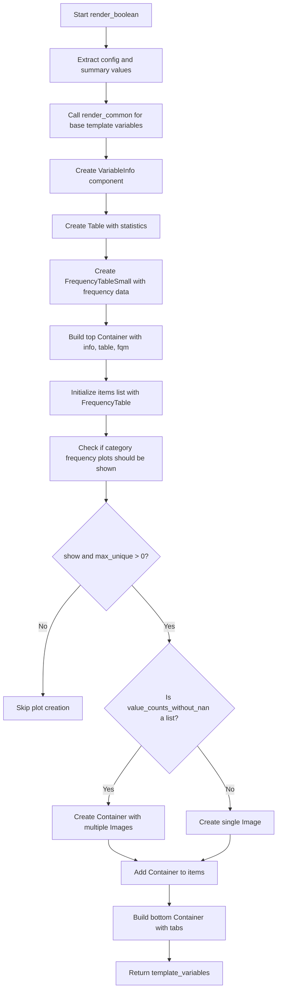

# `render_boolean.py`

## `src.ydata_profiling.report.structure.variables.render_boolean.render_boolean` · *function*

## Summary:
Generates template variables for rendering boolean variable reports with metadata, frequency tables, and optional visualizations.

## Description:
The `render_boolean` function creates a structured set of template variables used to generate HTML reports for boolean-type variables in data profiling. It combines variable metadata, statistical summaries, frequency distributions, and optional categorical visualizations into a standardized format that can be consumed by the report generation pipeline.

This function extracts the logic for boolean variable rendering into a dedicated component to maintain clean separation between data processing and presentation layer concerns. It ensures consistent reporting structure for boolean variables while supporting flexible visualization options through configuration.

Known callers within the codebase:
- Called by the report generation system when processing boolean variables
- Triggered during the variable-specific report rendering phase
- Part of the modular rendering pipeline that handles different data types distinctly

## Args:
    config (Settings): Configuration object containing report settings including plotting options and styling preferences
    summary (dict): Dictionary containing variable summary statistics including counts, frequencies, and metadata

## Returns:
    dict: Template variables dictionary containing 'top' and 'bottom' containers with:
        - 'top': Container holding VariableInfo, Table, and FrequencyTableSmall components
        - 'bottom': Container holding FrequencyTable and optional Image components for visualizations

## Raises:
    None explicitly raised

## Constraints:
    Preconditions:
        - config must be a valid Settings object with proper configuration
        - summary must contain required keys: 'varid', 'alerts', 'varname', 'description', 'n_distinct', 'p_distinct', 'n_missing', 'p_missing', 'memory_size', 'value_counts_without_nan', 'n', 'alert_fields'
        - summary['value_counts_without_nan'] should be either a pandas Series or list of pandas Series
        - config.vars.bool.n_obs should be a valid integer
        - config.plot.image_format should be a valid image format specification
    
    Postconditions:
        - Returns a dictionary with 'top' and 'bottom' keys containing properly structured renderable components
        - All returned components are valid Renderable objects ready for presentation layer consumption

## Side Effects:
    None

## Control Flow:


## Examples:
```python
# Typical usage in report generation pipeline
config = Settings()
summary = {
    "varid": "bool_var_1",
    "alerts": [],
    "varname": "has_pet",
    "description": "Whether the person owns a pet",
    "n_distinct": 2,
    "p_distinct": 1.0,
    "n_missing": 0,
    "p_missing": 0.0,
    "memory_size": 1024,
    "value_counts_without_nan": pd.Series([True: 150, False: 250]),
    "n": 400,
    "alert_fields": []
}

template_vars = render_boolean(config, summary)
# Result contains 'top' and 'bottom' containers ready for rendering
```

