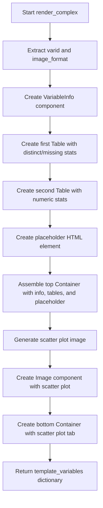

# `render_complex.py`

## `src.ydata_profiling.report.structure.variables.render_complex.render_complex` · *function*

## Summary
Renders the presentation layer for complex number variables in data profiling reports, including metadata, statistical summaries, and scatter plot visualization.

## Description
This function generates a structured presentation for complex number variables by combining metadata information, statistical summaries, and a scatter plot visualization. It serves as a specialized renderer within the ydata-profiling framework for handling complex number data types in automated data profiling reports.

The function orchestrates multiple presentation components including variable information display, statistical tables, and visualization elements to create a comprehensive view of complex number data characteristics. It is designed to be called by the report generation pipeline when processing complex number variables.

## Args
- config (Settings): Configuration object containing report settings including styling and plotting parameters
- summary (dict): Dictionary containing statistical summary data for the complex number variable with the following required keys:
  - varid (str): Unique identifier for the variable
  - varname (str): Human-readable name of the variable
  - alerts (list): List of alert objects indicating issues or notable characteristics
  - description (str): Detailed description of the variable
  - n_distinct (int): Count of distinct values
  - p_distinct (float): Percentage of distinct values
  - n_missing (int): Count of missing values
  - p_missing (float): Percentage of missing values
  - memory_size (int): Memory footprint of the variable
  - mean (float): Mean value of the complex numbers
  - min (float): Minimum value of the complex numbers
  - max (float): Maximum value of the complex numbers
  - n_zeros (int): Count of zero values
  - p_zeros (float): Percentage of zero values
  - scatter_data (pd.Series): Complex number data for scatter plot generation

## Returns
- dict: Template variables dictionary containing two keys:
  - "top" (Container): A grid container holding variable information, distinct/missing statistics, and memory usage information
  - "bottom" (Container): A tab container holding the scatter plot visualization

## Raises
- None explicitly raised by this function

## Constraints
- Preconditions:
  - The summary dictionary must contain all required keys listed in the Args section
  - The config object must have valid plot.image_format and html.style attributes
  - The scatter_data in summary must be compatible with scatter_complex function
- Postconditions:
  - Returns a dictionary with exactly two keys: "top" and "bottom"
  - Both returned containers are properly initialized with their respective content
  - All formatting functions (fmt, fmt_percent, etc.) are applied correctly to data

## Side Effects
- Calls scatter_complex function which may generate temporary plot files
- Uses matplotlib and seaborn for visualization generation
- May create temporary files during plot generation (via plot_360_n0sc0pe)

## Control Flow

