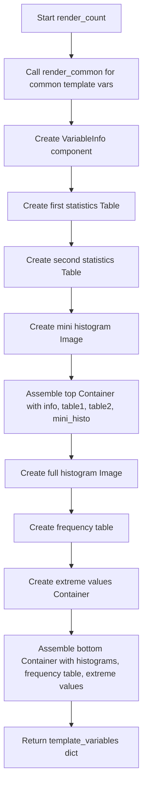

# `render_count.py`

## `src.ydata_profiling.report.structure.variables.render_count.render_count` · *function*

## Summary:
Generates HTML template variables for rendering count-based numerical variable statistics in data profiling reports.

## Description:
Creates a complete set of template variables for displaying detailed statistical information about real number variables (including non-negative real numbers) in data profiling reports. This function orchestrates the presentation of variable metadata, summary statistics, frequency distributions, and visualizations by combining data from the summary dictionary with UI components from the presentation layer.

The function leverages the `render_common` helper to prepare frequency table data and extreme observations, then constructs a hierarchical UI structure using containers, tables, images, and variable information components. It's specifically designed for numerical variables that require count-based statistical analysis.

## Args:
    config (Settings): Configuration object containing report settings including HTML styling, plot image format, and display preferences such as precision and extreme observation limits
    summary (dict): Dictionary containing comprehensive variable statistics with required keys:
        - "varid": Unique identifier for the variable
        - "varname": Human-readable name of the variable
        - "alerts": List of alert objects indicating issues or notable characteristics
        - "description": Detailed description of the variable
        - "n_distinct": Count of distinct values
        - "p_distinct": Percentage of distinct values
        - "n_missing": Count of missing values
        - "p_missing": Percentage of missing values
        - "mean": Arithmetic mean of values
        - "min": Minimum value
        - "max": Maximum value
        - "n_zeros": Count of zero values
        - "p_zeros": Percentage of zero values
        - "memory_size": Memory consumption of the variable
        - "histogram": Tuple containing histogram data (series, bins)
        - "value_counts_without_nan": pandas Series with frequency counts indexed by values
        - "value_counts_index_sorted": pandas Series with frequency counts sorted by index values
        - "n": Total count of observations

## Returns:
    dict: Template variables dictionary containing:
        - "top": Container with variable information, basic statistics table, and mini histogram
        - "bottom": Container with histogram visualization, frequency table, and extreme values tabs
        - All variables from render_common (freq_table_rows, firstn_expanded, lastn_expanded)

## Raises:
    None explicitly raised

## Constraints:
    Preconditions:
        - config must contain valid HTML style configuration and plot image format settings
        - summary must contain all required keys with appropriate data types
        - All referenced keys in summary must map to valid data structures (pandas Series, integers, floats, tuples)
        - The histogram data in summary must be properly formatted as (series, bins) tuple
        - The value_counts_index_sorted series must be properly sorted

    Postconditions:
        - Returns a dictionary with all template variables needed for HTML report rendering
        - All UI components are properly constructed with correct data and styling
        - The returned dictionary includes both "top" and "bottom" containers for report layout

## Side Effects:
    None

## Control Flow:


## Examples:
```python
# Typical usage in variable report generation
config = Settings()
summary = {
    "varid": "var_123",
    "varname": "age",
    "alerts": [],
    "description": "Age of participants",
    "n_distinct": 50,
    "p_distinct": 0.8,
    "n_missing": 5,
    "p_missing": 0.01,
    "mean": 35.2,
    "min": 18,
    "max": 85,
    "n_zeros": 0,
    "p_zeros": 0.0,
    "memory_size": 1024,
    "histogram": (np.array([1,2,3]), np.array([0,10,20,30])),
    "value_counts_without_nan": pd.Series([10, 5, 3], index=['A', 'B', 'C']),
    "value_counts_index_sorted": pd.Series([3, 5, 10], index=['C', 'B', 'A']),
    "n": 18
}

template_vars = render_count(config, summary)
# Returns dict with:
# - "top" container with variable info, stats tables, and mini histogram
# - "bottom" container with full histogram, frequency table, and extreme values
# - All common template variables from render_common
```

