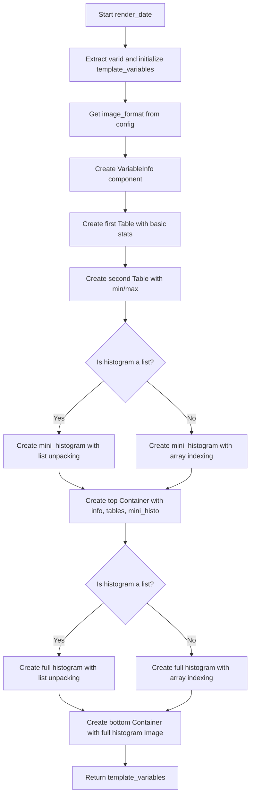

# `render_date.py`

## `src.ydata_profiling.report.structure.variables.render_date.render_date` · *function*

## Summary:
Creates presentation-ready template variables for displaying date variable statistics and visualizations in data profiling reports.

## Description:
The `render_date` function generates a dictionary of UI components that represent date variable information for inclusion in data profiling reports. It constructs various presentation elements including variable metadata, statistical summaries, and histogram visualizations tailored for date data types.

This function is part of the report rendering pipeline and extracts date-specific information from the summary dictionary to create a structured presentation layout. It handles the complexity of different histogram data formats and ensures proper formatting of date-related statistics.

The function separates the presentation into two main sections: 'top' for metadata and basic statistics, and 'bottom' for detailed visualizations. This modular approach allows for flexible report layouts while maintaining consistent formatting.

## Args:
    config (Settings): Configuration object containing report settings including HTML styling and plot image format preferences
    summary (Dict[str, Any]): Dictionary containing date variable statistics and metadata with the following required keys:
        - varid (str): Unique identifier for the variable
        - varname (str): Human-readable name of the variable
        - alerts (List): List of alert objects for the variable
        - description (str): Description of the variable
        - n_distinct (int): Number of distinct values
        - p_distinct (float): Percentage of distinct values
        - n_missing (int): Number of missing values
        - p_missing (float): Percentage of missing values
        - memory_size (int): Memory usage in bytes
        - min (Any): Minimum value in the variable
        - max (Any): Maximum value in the variable
        - histogram (Union[List, Tuple]): Histogram data, either as list of lists/tuples or array-like with two elements

## Returns:
    Dict[str, Any]: Template variables dictionary containing 'top' and 'bottom' keys with Container objects holding the presentation components. The 'top' container includes:
        - VariableInfo component with metadata
        - Table with basic statistics (distinct count, missing count, memory size)
        - Table with min/max values
        - Mini histogram image
    The 'bottom' container includes the full histogram visualization.

## Raises:
    None explicitly raised by this function

## Constraints:
    Preconditions:
    - The summary dictionary must contain all required keys: varid, varname, alerts, description, n_distinct, p_distinct, n_missing, p_missing, memory_size, min, max, and histogram
    - The config object must have valid plot.image_format and html.style attributes
    - The histogram data in summary must be either a list of lists/tuples or a list/array with two elements
    
    Postconditions:
    - Returns a dictionary with exactly two keys: 'top' and 'bottom'
    - Both returned containers are properly initialized with appropriate sequence types
    - All UI components are correctly formatted with the provided configuration

## Side Effects:
    None

## Control Flow:


## Examples:
    >>> from ydata_profiling.config import Settings
    >>> config = Settings()
    >>> summary = {
    ...     "varid": "date_var_1",
    ...     "varname": "purchase_date",
    ...     "alerts": [],
    ...     "description": "Purchase dates",
    ...     "n_distinct": 365,
    ...     "p_distinct": 0.95,
    ...     "n_missing": 10,
    ...     "p_missing": 0.02,
    ...     "memory_size": 1024,
    ...     "min": "2020-01-01",
    ...     "max": "2020-12-31",
    ...     "histogram": [[1, 2, 3], [4, 5, 6]]
    ... }
    >>> result = render_date(config, summary)
    >>> print(list(result.keys()))
    ['top', 'bottom']
    >>> print(type(result['top']))
    <class 'ydata_profiling.report.presentation.core.container.Container'>
```

