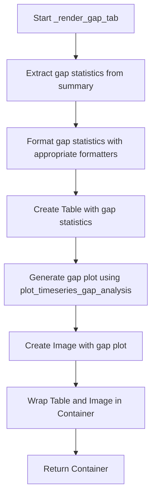
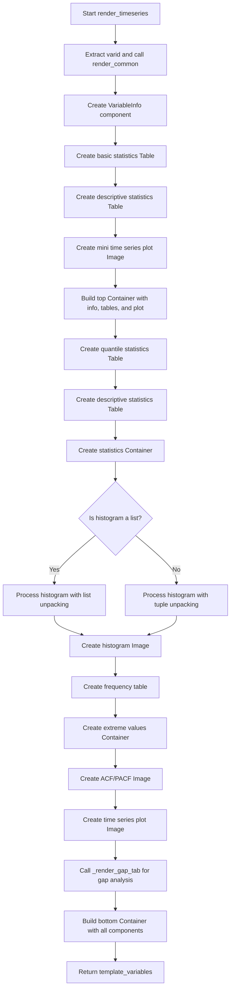

# `render_timeseries.py`

## `src.ydata_profiling.report.structure.variables.render_timeseries._render_gap_tab` · *function*

## Summary:
Renders gap analysis statistics and visualization for time series data variables.

## Description:
Generates a tab containing gap statistics and a visual representation of gaps in time series data. This function extracts gap-related statistics from the summary data and formats them into a table, while also creating a visualization showing the distribution of gaps over time. It is typically called by higher-level time series rendering functions to provide gap analysis as part of a comprehensive time series report.

## Args:
    config (Settings): Configuration object containing rendering parameters such as report precision and plot settings
    summary (dict): Dictionary containing time series gap statistics with the following required structure:
        - "gap_stats": nested dictionary containing:
            - "gaps": list or Series of gap intervals
            - "min": minimum gap duration
            - "max": maximum gap duration
            - "mean": mean gap duration
            - "std": standard deviation of gap durations
            - "series": time series data for plotting
        - "varid": unique identifier for the variable being analyzed

## Returns:
    Container: A container object containing:
        - A Table with formatted gap statistics (count, min, max, mean, std)
        - An Image with the gap analysis visualization
        Both elements are arranged in a grid layout for display in HTML reports

## Raises:
    None explicitly raised

## Constraints:
    Preconditions:
        - summary must contain "gap_stats" key with proper gap statistics structure
        - summary must contain "varid" key for anchor ID generation
        - config must contain report.precision and plot.image_format attributes
        - gap_stats must contain "gaps", "min", "max", "mean", "std", and "series" keys

    Postconditions:
        - Returns a Container with exactly two elements: a Table and an Image
        - All statistical values are properly formatted according to config.report.precision
        - The visualization uses the configured image format and styling

## Side Effects:
    None

## Control Flow:


## Examples:
```python
# Typical usage in time series report generation
config = Settings()
summary = {
    "gap_stats": {
        "gaps": [pd.Timedelta('1 days'), pd.Timedelta('3 days')],
        "min": pd.Timedelta('1 days'),
        "max": pd.Timedelta('3 days'),
        "mean": pd.Timedelta('2 days'),
        "std": pd.Timedelta('1 days'),
        "series": pd.Series([1, 2, 3, 4, 5], index=pd.date_range('2020-01-01', periods=5))
    },
    "varid": "variable_1"
}
container = _render_gap_tab(config, summary)
# Returns Container with gap statistics table and gap visualization
```

## `src.ydata_profiling.report.structure.variables.render_timeseries.render_timeseries` · *function*

## Summary:
Generates HTML template variables for rendering time series variable reports with comprehensive statistical summaries and visualizations.

## Description:
Creates a complete set of template variables for displaying time series data analysis in HTML reports. This function orchestrates the presentation of various statistical measures, visualizations, and data distributions for numeric time series variables. It combines basic statistics, quantile information, descriptive statistics, histograms, time series plots, gap analysis, frequency tables, and extreme value displays into a structured report layout.

The function leverages the `render_common` helper to prepare frequency and extreme observation data, then builds a rich set of UI components including tables, images, and containers to present time series characteristics effectively. It's designed to be called as part of the larger reporting pipeline for time series variables.

## Args:
    config (Settings): Configuration object containing report settings including HTML styling, plot image format, precision requirements, and extreme observation limits.
    summary (dict): Dictionary containing comprehensive time series statistics with the following required structure:
        - "varid" (str): Unique identifier for the variable
        - "varname" (str): Name of the variable
        - "alerts" (list): List of alert identifiers for the variable
        - "description" (str): Variable description text
        - "alert_fields" (list): List of field names that triggered alerts
        - "n_distinct" (int): Count of distinct values
        - "p_distinct" (float): Percentage of distinct values
        - "n_missing" (int): Count of missing values
        - "p_missing" (float): Percentage of missing values
        - "n_infinite" (int): Count of infinite values
        - "p_infinite" (float): Percentage of infinite values
        - "mean" (float): Mean value
        - "min" (float): Minimum value
        - "max" (float): Maximum value
        - "n_zeros" (int): Count of zero values
        - "p_zeros" (float): Percentage of zero values
        - "memory_size" (int): Memory footprint in bytes
        - "std" (float): Standard deviation
        - "cv" (float): Coefficient of variation
        - "kurtosis" (float): Kurtosis measure
        - "mad" (float): Median absolute deviation
        - "skewness" (float): Skewness measure
        - "sum" (float): Sum of all values
        - "variance" (float): Variance
        - "monotonic" (int): Monotonicity indicator (-2 to 2)
        - "addfuller" (float): Augmented Dickey-Fuller test p-value
        - "range" (float): Range of values (max - min)
        - "iqr" (float): Interquartile range
        - "5%" (float): 5th percentile value
        - "25%" (float): 25th percentile value (Q1)
        - "50%" (float): 50th percentile value (median)
        - "75%" (float): 75th percentile value (Q3)
        - "95%" (float): 95th percentile value
        - "series" (Series): Time series data
        - "histogram" (tuple/list): Histogram data structure (either tuple of arrays or list of tuples)
        - "gap_stats" (dict): Gap analysis statistics (when available)

## Returns:
    dict: Template variables dictionary containing:
        - "top" (Container): Top section with variable info, basic stats table, descriptive stats table, and mini time series plot
        - "bottom" (Container): Bottom section with statistics, histogram, time series plot, gap analysis, frequency table, extreme values, and autocorrelation plots

## Raises:
    None explicitly raised

## Constraints:
    Preconditions:
        - config must contain required attributes: plot.image_format, html.style, report.precision, n_extreme_obs
        - summary must contain all required keys with valid data types as specified in Args
        - histogram data in summary must be either a tuple of arrays or list of tuples
        - gap_stats in summary must contain required gap analysis fields when present

    Postconditions:
        - Returns a dictionary with exactly two keys: "top" and "bottom"
        - All statistical values are properly formatted according to config.report.precision
        - All visualizations use the configured image format
        - All container elements are properly structured with correct anchor IDs

## Side Effects:
    None

## Control Flow:


## Examples:
```python
# Typical usage in time series report generation
config = Settings()
summary = {
    "varid": "ts_var_1",
    "varname": "Temperature",
    "alerts": ["HIGH_CORRELATION"],
    "description": "Daily temperature readings",
    "alert_fields": ["correlation"],
    "n_distinct": 365,
    "p_distinct": 1.0,
    "n_missing": 0,
    "p_missing": 0.0,
    "n_infinite": 0,
    "p_infinite": 0.0,
    "mean": 22.5,
    "min": 15.2,
    "max": 30.8,
    "n_zeros": 0,
    "p_zeros": 0.0,
    "memory_size": 2920,
    "std": 4.2,
    "cv": 0.187,
    "kurtosis": -0.5,
    "mad": 3.8,
    "skewness": 0.2,
    "sum": 8212.5,
    "variance": 17.64,
    "monotonic": 1,
    "addfuller": 0.05,
    "range": 15.6,
    "iqr": 5.2,
    "5%": 16.8,
    "25%": 18.9,
    "50%": 22.5,
    "75%": 23.7,
    "95%": 27.8,
    "series": pd.Series([20, 22, 25, 23, 21], index=pd.date_range('2020-01-01', periods=5)),
    "histogram": ([1, 2, 3, 4], [0, 10, 20, 30]),
    "gap_stats": {
        "gaps": [],
        "min": pd.Timedelta('0 days'),
        "max": pd.Timedelta('0 days'),
        "mean": pd.Timedelta('0 days'),
        "std": pd.Timedelta('0 days'),
        "series": pd.Series([1, 2, 3, 4, 5], index=pd.date_range('2020-01-01', periods=5))
    }
}

template_vars = render_timeseries(config, summary)
# Returns dict with "top" and "bottom" containers ready for HTML rendering
```

