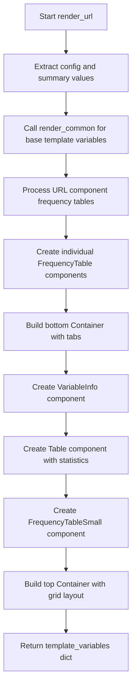

# `render_url.py`

## `src.ydata_profiling.report.structure.variables.render_url.render_url` · *function*

## Summary
Generates presentation-ready template variables for URL variable reports, including frequency distributions and statistical summaries.

## Description
Processes URL variable summary data and constructs a complete set of template variables for rendering URL-specific reports. This function builds upon the common template variables provided by `render_common` and adds URL-specific components including frequency tables for URL components (scheme, netloc, path, query, fragment) and statistical summaries.

The function orchestrates the creation of multiple presentation components including frequency tables, statistical summaries, and tabbed containers to display comprehensive URL analysis information in reports.

## Args
    config (Settings): Configuration object containing rendering parameters such as maximum frequency table entries (n_freq_table_max) and categorical variable settings (n_obs, redact)
    summary (dict): Dictionary containing URL variable summary statistics with required keys:
        - "varid": Variable identifier string
        - "varname": Variable name string
        - "alerts": List of alert objects for the variable
        - "description": Variable description string
        - "n_distinct": Number of distinct values
        - "p_distinct": Percentage of distinct values
        - "n_missing": Number of missing values
        - "p_missing": Percentage of missing values
        - "memory_size": Memory usage in bytes
        - "n": Total count of observations
        - "value_counts_without_nan": pandas Series with frequency counts indexed by values
        - "scheme_counts": pandas Series with scheme frequency counts
        - "netloc_counts": pandas Series with netloc frequency counts
        - "path_counts": pandas Series with path frequency counts
        - "query_counts": pandas Series with query frequency counts
        - "fragment_counts": pandas Series with fragment frequency counts
        - "alert_fields": List of field names that triggered alerts

## Returns
    dict: Template variables dictionary containing:
        - All keys from `render_common` result
        - "freqtable_scheme", "freqtable_netloc", "freqtable_path", "freqtable_query", "freqtable_fragment": Formatted frequency tables for URL components
        - "top": Container with VariableInfo, Table, and FrequencyTableSmall components
        - "bottom": Container with tabbed FrequencyTables for URL components

## Raises
    None explicitly raised

## Constraints
    Preconditions:
        - config must contain n_freq_table_max attribute
        - summary must contain all required keys listed in Args section
        - All referenced keys in summary must map to valid data structures (pandas Series, integers, etc.)
        - The value_counts_without_nan series must be properly formatted

    Postconditions:
        - Returns a dictionary with all required template variables for URL report rendering
        - All frequency tables are properly formatted for display
        - Container components are correctly structured with appropriate sequence types

## Side Effects
    None

## Control Flow


## Examples
```python
# Typical usage in URL report generation
config = Settings()
summary = {
    "varid": "url_var_1",
    "varname": "website_url",
    "alerts": [],
    "description": "URLs of website pages",
    "n_distinct": 150,
    "p_distinct": 0.85,
    "n_missing": 5,
    "p_missing": 0.03,
    "memory_size": 10240,
    "n": 176,
    "value_counts_without_nan": pd.Series([10, 5, 3], index=['A', 'B', 'C']),
    "scheme_counts": pd.Series([15, 8, 2], index=['http', 'https', 'ftp']),
    "netloc_counts": pd.Series([20, 15, 5], index=['example.com', 'test.org', 'demo.net']),
    "path_counts": pd.Series([12, 8, 3], index=['/page1', '/page2', '/page3']),
    "query_counts": pd.Series([5, 3, 1], index=['?param1=value1', '?param2=value2', '?param3=value3']),
    "fragment_counts": pd.Series([2, 1, 0], index=['#section1', '#section2', '']),
    "alert_fields": []
}

template_vars = render_url(config, summary)
# Returns complete template variables for URL report rendering
```

