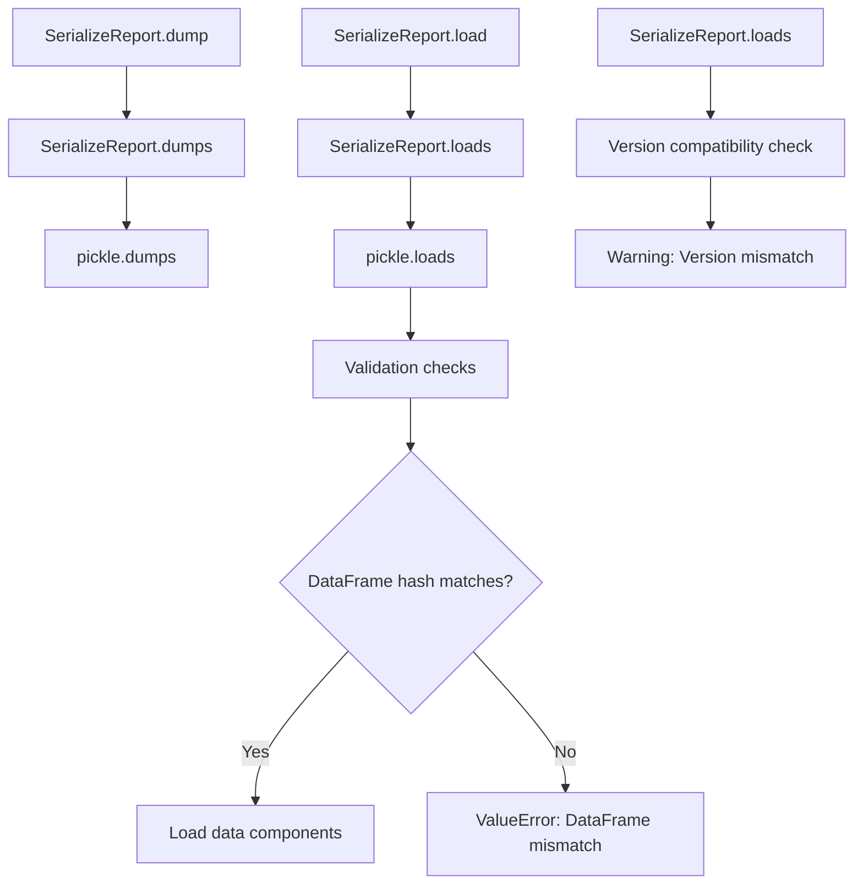

# `serialize_report.py`

## `src.ydata_profiling.serialize_report.SerializeReport` · *class*

## Summary
SerializeReport is a utility class that provides serialization and deserialization capabilities for ProfileReport objects, enabling persistent storage and loading of data profiling results.

## Description
The SerializeReport class facilitates the persistence of ProfileReport objects by serializing their internal state to bytes or files, and deserializing them back into usable objects. It is designed to work with ProfileReport instances and handles the complex serialization of various components including configuration, data descriptions, and report structures. The class ensures data integrity by validating version compatibility and handling potential mismatches gracefully.

This class serves as a bridge between in-memory ProfileReport objects and persistent storage, allowing users to save profiling results for later analysis or transfer between environments. It's particularly useful for caching expensive profiling operations or sharing reports across different sessions.

## State
- df: Any - Reference to the underlying DataFrame being profiled (initially None)
- config: Settings - Configuration object controlling report generation behavior (initially None)
- _df_hash: Optional[str] - Hash of the DataFrame for cache invalidation (initially None)
- _report: Root or None - Cached report structure generated during profiling (initially None)
- _description_set: BaseDescription or None - Cached description of the data analysis (initially None)

## Lifecycle
**Creation:** Instantiate with a ProfileReport object or initialize with default values. The class is typically used as a wrapper around ProfileReport objects for serialization purposes.

**Usage:** Call `dump()` or `dumps()` to serialize the object to bytes or file, and `load()` or `loads()` to deserialize from bytes or file. The serialization preserves the internal state including configuration, data descriptions, and report structures.

**Destruction:** Managed automatically by Python's garbage collection; no explicit cleanup required.

## Method Map


## Raises
- ValueError: Raised when deserialization fails due to corrupted data, incompatible versions, or DataFrame hash mismatches
- TypeError: May be raised during pickle operations if objects are not serializable

## Example
```python
from ydata_profiling import ProfileReport
from ydata_profiling.serialize_report import SerializeReport
from pathlib import Path

# Create a ProfileReport
df = pd.DataFrame({'col1': [1, 2, 3], 'col2': [4, 5, 6]})
report = ProfileReport(df)

# Serialize to bytes
serialized_data = report.serialize.dumps()

# Serialize to file
report.serialize.dump("my_report.pp")

# Deserialize from bytes
new_report = SerializeReport()
new_report.loads(serialized_data)

# Deserialize from file
new_report = SerializeReport()
new_report.load("my_report.pp")
```

### `src.ydata_profiling.serialize_report.SerializeReport.df_hash` · *method*

## Summary:
Computes and returns a hash of the DataFrame for serialization validation.

## Description:
Returns a hash of the DataFrame stored in `self.df` to enable serialization integrity checking. When the DataFrame is present, this hash ensures that serialized reports can be validated against the original data. This method is called during serialization and deserialization operations to prevent loading reports into mismatched DataFrames.

## Args:
    None

## Returns:
    Optional[str]: A string hash of the DataFrame when `self.df` is not None, otherwise None.

## Raises:
    None explicitly raised

## State Changes:
    Attributes READ: self.df, self._df_hash
    Attributes WRITTEN: self._df_hash (when recomputing hash)

## Constraints:
    Preconditions: The method assumes `self.df` contains a valid DataFrame or is None
    Postconditions: Returns either a string hash or None, and caches the result in `self._df_hash`

## Side Effects:
    None

### `src.ydata_profiling.serialize_report.SerializeReport.dumps` · *method*

## Summary:
Serializes the core profiling report components into a pickled byte stream for storage or transmission.

## Description:
Converts the essential profiling report data (hash, configuration, description set, and report structure) into a compact binary representation using Python's pickle module. This method enables persistence of profiling results by creating a serialized snapshot that can be stored to disk or transmitted over networks.

## Args:
    None

## Returns:
    bytes: A pickled byte stream containing the serialized profiling report data in the order: [df_hash, config, _description_set, _report]

## Raises:
    None explicitly raised, though pickle operations may raise PicklingError or other serialization-related exceptions internally

## State Changes:
    - Attributes READ: self.df_hash, self.config, self._description_set, self._report

## Constraints:
    - Preconditions: All referenced attributes (df_hash, config, _description_set, _report) must be accessible and serializable by pickle
    - Postconditions: The returned bytes can be deserialized using the corresponding loads() method

## Side Effects:
    - Uses pickle serialization which may involve I/O operations during the serialization process
    - No external service calls or mutations to objects outside this instance

### `src.ydata_profiling.serialize_report.SerializeReport.loads` · *method*

## Summary:
Deserializes binary data and loads profiling report components into the current instance, validating compatibility and handling version mismatches.

## Description:
Restores profiling report state from a pickled byte stream by deserializing the data and merging it into the current instance's attributes. This method validates the integrity of the serialized data structure and ensures compatibility with the current DataFrame and package version. It's typically called internally by the `load()` method when restoring a report from a file.

## Args:
    data (bytes): Serialized binary data containing the profiling report components in the format: [df_hash, config, _description_set, _report]

## Returns:
    Union["ProfileReport", "SerializeReport"]: Returns self to enable method chaining, with the instance updated to reflect the loaded report state.

## Raises:
    ValueError: If the data cannot be unpickled, contains invalid structure, or if the DataFrame hash doesn't match the current instance's DataFrame.

## State Changes:
    Attributes READ: self.df_hash, self.df, self._description_set, self._report, self.config, self._df_hash
    Attributes WRITTEN: self._description_set, self._report, self.config, self._df_hash

## Constraints:
    Preconditions: The data parameter must contain valid pickled data matching the expected structure [df_hash, config, _description_set, _report].
    Postconditions: If successful, the instance's internal state will be updated with the loaded data, subject to validation checks and warnings for conflicts.

## Side Effects:
    I/O: Uses pickle deserialization which may involve internal processing of the byte stream.
    Warnings: Issues warnings when existing attributes are not None (conflict resolution) or when version mismatches occur.

### `src.ydata_profiling.serialize_report.SerializeReport.dump` · *method*

## Summary:
Serializes and saves the report data to a file with .pp extension.

## Description:
Writes the serialized representation of the report data to the specified output file. This method is part of the serialization workflow that allows saving and loading profile reports. The serialization includes the DataFrame hash, configuration, description set, and report structure using pickle serialization.

## Args:
    output_file (Union[Path, str]): Path to the output file where the serialized data will be written. If a string is provided, it will be converted to a Path object. The file extension will be automatically changed to ".pp".

## Returns:
    None: This method does not return any value.

## Raises:
    OSError: If there are issues writing to the specified file path.
    PickleError: If there are issues during pickle serialization.

## State Changes:
    Attributes READ: self.df_hash, self.config, self._description_set, self._report
    Attributes WRITTEN: None (this method doesn't modify instance attributes)

## Constraints:
    Preconditions: The object must have valid data in self.df_hash, self.config, self._description_set, and self._report attributes.
    Postconditions: The output file will contain pickled binary data representing the serialized report with .pp extension.

## Side Effects:
    I/O operation: Writes binary data to the filesystem at the specified output_file location.

### `src.ydata_profiling.serialize_report.SerializeReport.load` · *method*

## Summary:
Loads serialized report data from a file into the current instance, updating its internal state with the deserialized content.

## Description:
Reads binary data from a specified file and deserializes it using the instance's `loads` method. This method enables restoring a previously saved report state from disk. The loaded data is merged into the current instance's attributes, with appropriate validation checks to ensure compatibility with existing data.

## Args:
    load_file (Union[Path, str]): Path to the serialized file (.pp extension) containing the report data. Can be provided as a string or pathlib.Path object.

## Returns:
    Union["ProfileReport", "SerializeReport"]: Returns self, allowing for method chaining. The returned instance will have its internal state updated with the loaded data.

## Raises:
    ValueError: If the loaded data is corrupted, incompatible with the current version, or if the DataFrame hash doesn't match the current instance's DataFrame.

## State Changes:
    Attributes READ: self.df_hash, self._description_set, self._report, self.config
    Attributes WRITTEN: self._description_set, self._report, self.config, self._df_hash

## Constraints:
    Preconditions: The load_file must exist and contain valid serialized data in the expected format.
    Postconditions: The instance's internal state will be updated with data from the loaded file, subject to validation checks.

## Side Effects:
    I/O operation: Reads binary data from the filesystem at the specified load_file location.
    Potential warnings: May issue warnings if existing attributes are not None or if version mismatches occur.

