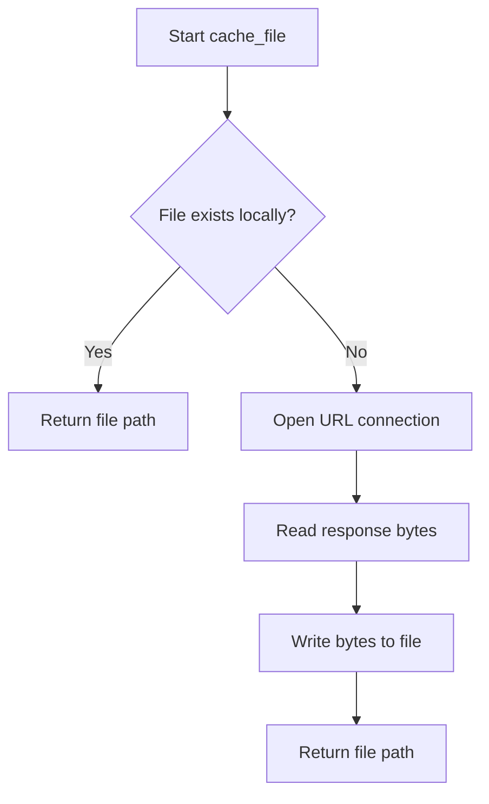
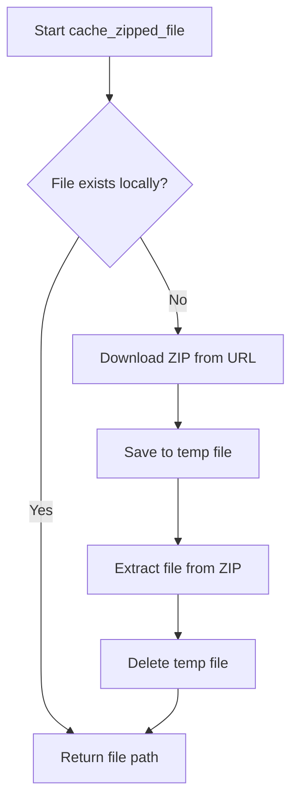

# `cache.py`

## `src.ydata_profiling.utils.cache.cache_file` · *function*

## Summary:
Downloads and caches a file from a URL to a local data directory, returning the path to the cached file.

## Description:
Retrieves a file from the specified URL and stores it in the project's data directory with the given filename. If the file already exists in the cache, it skips the download and returns the existing file path. This function provides a convenient way to manage cached datasets or resources that should only be downloaded once.

## Args:
    file_name (str): The name to give the cached file in the data directory
    url (str): The URL from which to download the file if it doesn't exist in cache

## Returns:
    Path: A pathlib.Path object pointing to the cached file location (either existing or newly downloaded)

## Raises:
    urllib.error.URLError: When the URL cannot be accessed or the download fails due to network issues
    urllib.error.HTTPError: When the HTTP request returns an error status code (e.g., 404, 500)

## Constraints:
    Preconditions:
        - Valid string arguments for file_name and url
        - Network connectivity to access the URL
        - Write permissions to the project's data directory
    
    Postconditions:
        - The data directory exists
        - The file is either downloaded or already exists at the expected location

## Side Effects:
    - Creates the project data directory if it doesn't exist
    - Downloads and writes file content to disk
    - May perform network I/O to fetch content from the provided URL

## Control Flow:


## Examples:
```python
# Cache a dataset file
dataset_path = cache_file("iris.csv", "https://example.com/datasets/iris.csv")
# Returns Path object to cached file

# Cache a model file
model_path = cache_file("model.pkl", "https://example.com/models/my_model.pkl")
# Returns Path object to cached file
```

## `src.ydata_profiling.utils.cache.cache_zipped_file` · *function*

## Summary:
Downloads and caches a file from a ZIP archive URL, extracting it to the local data directory.

## Description:
This function retrieves a file from a remote ZIP archive URL and caches it locally in the project's data directory. If the file already exists locally, it skips the download and returns the existing file path. The function handles the entire process of downloading the ZIP file, extracting the requested file, and cleaning up temporary files.

## Args:
    file_name (str): Name of the file to extract from the ZIP archive
    url (str): URL of the ZIP archive containing the target file

## Returns:
    Path: Path object pointing to the cached file in the local data directory

## Raises:
    URLError: When the URL cannot be accessed or the HTTP request fails
    zipfile.BadZipFile: When the downloaded content is not a valid ZIP file
    PermissionError: When unable to write to the data directory or temporary files

## Constraints:
    Preconditions:
        - Valid URL string must be provided
        - Valid file_name string must be provided
        - Network connectivity must be available for URL access
    Postconditions:
        - The file will be present in the local data directory
        - Temporary files will be cleaned up after processing
        - Returned Path object will reference an existing file

## Side Effects:
    - Creates directory structure in project data directory if it doesn't exist
    - Downloads data from remote URL
    - Writes temporary file to disk during processing
    - Extracts files to local data directory
    - Removes temporary zip file after extraction

## Control Flow:


## Examples:
```python
# Cache a CSV file from a remote ZIP archive
file_path = cache_zipped_file("dataset.csv", "https://example.com/data.zip")
# Returns Path object to cached dataset.csv file

# Subsequent calls will return the cached file without re-downloading
cached_path = cache_zipped_file("dataset.csv", "https://example.com/data.zip")
# Returns same Path object without network access
```

