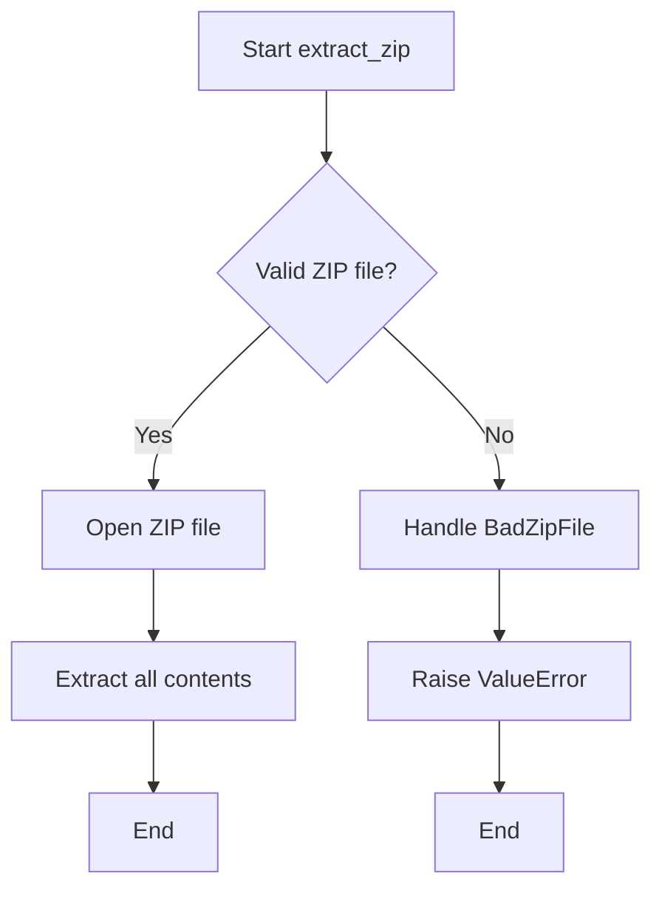

# `common.py`

## `src.ydata_profiling.utils.common.update` · *function*

## Summary:
Recursively updates a dictionary with values from another mapping, merging nested dictionaries instead of replacing them.

## Description:
This function performs a deep update operation on dictionaries, where nested dictionaries are merged rather than replaced. When a key exists in both dictionaries and the value in the second dictionary is itself a mapping, the function recursively updates the nested dictionary. This is commonly used for configuration merging, where partial configurations should be merged with defaults rather than completely replacing them.

## Args:
    d (dict): The dictionary to be updated with values from the second mapping
    u (Mapping): The mapping containing update values

## Returns:
    dict: The updated dictionary `d` with values from `u` merged in

## Raises:
    None

## Constraints:
    Preconditions:
    - `d` must be a dictionary
    - `u` must be a mapping (dict-like object)
    
    Postconditions:
    - The original dictionary `d` is modified in-place
    - All keys from `u` are present in the returned dictionary
    - Nested dictionaries are merged recursively

## Side Effects:
    None

## Control Flow:
```mermaid
flowchart TD
    A[Start update(d, u)] --> B{u.items() iterate}
    B --> C{v isinstance collections.abc.Mapping}
    C -->|True| D[update(d.get(k, {}), v)]
    C -->|False| E[d[k] = v]
    D --> F[Return updated d]
    E --> F
    F --> G[End]
```

## Examples:
```python
# Basic usage
base_config = {'a': 1, 'b': {'c': 2}}
update(base_config, {'b': {'d': 3}})
# Result: {'a': 1, 'b': {'c': 2, 'd': 3}}

# Deep merge
config1 = {'database': {'host': 'localhost', 'port': 5432}}
config2 = {'database': {'port': 3306, 'username': 'admin'}}
update(config1, config2)
# Result: {'database': {'host': 'localhost', 'port': 3306, 'username': 'admin'}}
```

## `src.ydata_profiling.utils.common._copy` · *function*

## Summary:
Copies a file from the current path to a specified target location.

## Description:
This method copies the file represented by the current path object to a target destination. It is designed to work with file paths that support the `is_file()` method and can be converted to string representation. The method ensures the current path refers to an actual file before attempting the copy operation.

## Args:
    target (str or Path): The destination path where the file should be copied. This can be a string path or another Path-like object.

## Returns:
    None: This method does not return any value.

## Raises:
    AssertionError: When the current path does not represent a file (i.e., when `self.is_file()` returns False).

## Constraints:
    Preconditions:
        - The current object (`self`) must represent a file (checked via `self.is_file()`)
        - The parent directory of the target must exist and be writable
        - The source file must be readable
    
    Postconditions:
        - A copy of the file exists at the target location
        - The original file remains unchanged

## Side Effects:
    - File system I/O operations: Creates a copy of a file at the target location
    - May raise OSError if file permissions or disk space prevent the copy operation

## Control Flow:
```mermaid
flowchart TD
    A[Start _copy] --> B{self.is_file()?}
    B -- No --> C[AssertionError]
    B -- Yes --> D[Convert self to str]
    D --> E[shutil.copy(str(self), target)]
    E --> F[End]
```

## Examples:
```python
# Assuming a custom Path class with _copy method
from pathlib import Path

# Copy a file to a new location
source_path = Path("data/input.csv")
source_path._copy("data/output.csv")

# Copy to a different directory
source_path._copy(Path("/tmp/backup.csv"))
```

## `src.ydata_profiling.utils.common.extract_zip` · *function*

## Summary:
Extracts all contents from a ZIP archive file to a specified directory.

## Description:
This function provides a standardized way to extract ZIP archive contents to a target directory. It handles the low-level zipfile operations and provides clear error handling for malformed ZIP files. The function is designed to be a reusable utility for decompressing archived data within the ydata-profiling framework.

## Args:
    outfile (str): Path to the ZIP file to be extracted
    effective_path (str): Destination directory where ZIP contents will be extracted

## Returns:
    None: This function does not return any value

## Raises:
    ValueError: Raised when the specified file is not a valid ZIP archive

## Constraints:
    Preconditions:
    - The `outfile` parameter must point to a valid file path that exists
    - The `effective_path` parameter must be a valid directory path that exists
    - The user must have appropriate read permissions for the ZIP file
    - The user must have appropriate write permissions for the destination directory
    
    Postconditions:
    - All contents of the ZIP file are extracted to the specified directory
    - No files are left in an incomplete extraction state

## Side Effects:
    - Creates files and directories in the filesystem at the location specified by `effective_path`
    - May overwrite existing files with the same names during extraction
    - Reads from the file system at the location specified by `outfile`

## Control Flow:


## Examples:
    # Basic usage
    extract_zip("/path/to/archive.zip", "/destination/directory")
    
    # With error handling
    try:
        extract_zip("data.zip", "extracted_data/")
    except ValueError as e:
        print(f"Failed to extract ZIP file: {e}")
```

## `src.ydata_profiling.utils.common.test_jpeg1` · *function*

## Summary:
Detects JPEG image files by checking for the JFIF signature in the file header.

## Description:
This function implements a basic JPEG file type detection algorithm by examining the first 23 bytes of a file's header for the presence of the "JFIF" byte sequence. It's designed to identify JPEG files according to the JFIF (JPEG File Interchange Format) standard.

The function is typically used as part of a broader image file type detection system, likely in conjunction with other similar test functions for different file formats. It's extracted into its own function to provide a clean, reusable interface for JPEG detection logic while maintaining consistency with the standard Python imghdr module approach.

## Args:
    h (bytes): The first 23 bytes of a file's header data to examine for JPEG signature
    f (file-like object or None): A file handle or reference (unused in this implementation)

## Returns:
    str: Returns "jpeg" if the JFIF signature is detected in the header bytes, otherwise returns None or falls through to other detection methods

## Raises:
    None explicitly raised

## Constraints:
    Preconditions:
    - Parameter `h` must be bytes or a byte-like object with at least 23 bytes available
    - Parameter `f` can be any type but is not used in this implementation
    
    Postconditions:
    - Function returns either "jpeg" or continues execution to other detection logic

## Side Effects:
    None

## Control Flow:
```mermaid
flowchart TD
    A[Start test_jpeg1] --> B{b"JFIF" in h[:23]?}
    B -- Yes --> C[Return "jpeg"]
    B -- No --> D[Continue with other detection]
    C --> E[End]
    D --> E
```

## Examples:
    # Basic usage for JPEG detection
    header_bytes = open('image.jpg', 'rb').read(23)
    result = test_jpeg1(header_bytes, None)
    if result == "jpeg":
        print("File is JPEG")
```

## `src.ydata_profiling.utils.common.test_jpeg2` · *function*

## Summary
Tests if a given byte sequence represents a JPEG image file by examining its header signature.

## Description
This function implements JPEG file type detection logic by analyzing the first 32 bytes of a file's header. It serves as a replacement or extension to Python's standard `imghdr` module's JPEG detection capabilities. The function is typically called during file type inference processes when determining image formats.

## Args
    h (bytes): First few bytes of a file, typically the file header used for MIME type detection
    f (str or Path): File path or name, used for additional context in file type detection

## Returns
    str or None: Returns "jpeg" if the header matches JPEG signature, otherwise returns None (implicitly)

## Raises
    None explicitly raised

## Constraints
    Preconditions:
    - Parameter `h` must be a bytes-like object with at least 32 bytes available
    - Parameter `f` should be a string or Path object representing a file path
    
    Postconditions:
    - Function returns either "jpeg" or None (no other return values possible)
    - No side effects occur during execution

## Side Effects
    None

## Control Flow
```mermaid
flowchart TD
    A[Start test_jpeg2] --> B{len(h) ≥ 32?}
    B -- No --> C[Return None]
    B -- Yes --> D{h[5] == 67?}
    D -- No --> C
    D -- Yes --> E{h[:32] == JPEG_MARK?}
    E -- No --> C
    E -- Yes --> F[Return "jpeg"]
```

## Examples
    # Typical usage in file type detection
    header = b'\xff\xd8\xff\xe0\x00\x10JFIF\x00\x01\x01\x01\x00H\x00H\x00\x00...'
    result = test_jpeg2(header, "/path/to/image.jpg")
    # Returns "jpeg" if header matches JPEG signature, None otherwise

## `src.ydata_profiling.utils.common.test_jpeg3` · *function*

## Summary:
Determines if a file header represents a JPEG image format by checking for JPEG-specific byte patterns.

## Description:
This function implements JPEG file format detection by examining the initial bytes of a file header. It serves as a lightweight alternative to standard image header detection methods, specifically identifying JPEG files based on characteristic byte sequences. The function is designed to be called as part of a broader file type identification system, potentially as a custom implementation within the ydata-profiling library's utility functions.

## Args:
    h (bytes): File header bytes to analyze for JPEG format identification
    f (Any): Additional file context parameter, likely representing file metadata or handle (usage context unclear from code alone)

## Returns:
    str: Returns "jpeg" if the header matches JPEG format indicators, None otherwise

## Raises:
    None explicitly raised

## Constraints:
    Preconditions:
    - Parameter `h` must be a bytes-like object with sufficient length for indexing operations
    - Parameter `f` can be any type but is typically used for file context in broader systems
    
    Postconditions:
    - Function returns either "jpeg" string or None
    - No side effects occur during execution

## Side Effects:
    None

## Control Flow:
```mermaid
flowchart TD
    A[Start test_jpeg3] --> B{h[6:10] in (b"JFIF", b"Exif") OR h[:2] == b"\\xff\\xd8"?}
    B -->|True| C[Return "jpeg"]
    B -->|False| D[Implicit None return]
    C --> E[End]
    D --> E
```

## Examples:
    # Basic usage with valid JPEG header
    header = b"\x89PNG\r\n\x1a\n\x00\x00\x00\rIHDR" + b"JFIF" + b"..."
    result = test_jpeg3(header, "some_file.jpg")
    # Returns "jpeg"
    
    # Usage with different header pattern
    header = b"\xff\xd8\xff\xe0\x00\x10JFIF" + b"..."
    result = test_jpeg3(header, "another_file.jpg")
    # Returns "jpeg"
    
    # Usage with non-JPEG header
    header = b"\x89PNG\r\n\x1a\n\x00\x00\x00\rIHDR" + b"..."
    result = test_jpeg3(header, "image.png")
    # Returns None
```

## `src.ydata_profiling.utils.common.convert_timestamp_to_datetime` · *function*

## Summary:
Converts a Unix timestamp to a datetime object, handling both positive and negative timestamp values.

## Description:
This function transforms a Unix timestamp (seconds since January 1, 1970) into a Python datetime object. It handles two cases: positive timestamps which are converted using standard timestamp conversion, and negative timestamps which are interpreted as seconds before the Unix epoch.

## Args:
    timestamp (int): Unix timestamp in seconds. Can be positive (indicating time after Unix epoch) or negative (indicating time before Unix epoch).

## Returns:
    datetime: A datetime object representing the converted timestamp. For positive timestamps, this is the standard conversion. For negative timestamps, it's the Unix epoch plus the negative seconds.

## Raises:
    None explicitly raised. However, the function may raise ValueError from datetime.fromtimestamp() if the timestamp is invalid on the underlying platform.

## Constraints:
    Precondition: The input must be an integer representing a valid Unix timestamp.
    Postcondition: The returned datetime object accurately represents the timestamp value.

## Side Effects:
    None

## Control Flow:
```mermaid
flowchart TD
    A[Start:convert_timestamp_to_datetime] --> B{timestamp >= 0?}
    B -- Yes --> C[datetime.fromtimestamp(timestamp)]
    B -- No --> D[datetime(1970,1,1) + timedelta(seconds=int(timestamp))]
    C --> E[Return datetime]
    D --> E
```

## Examples:
    # Convert positive timestamp (e.g., 1609459200 = 2021-01-01 00:00:00 UTC)
    result = convert_timestamp_to_datetime(1609459200)
    # Returns: datetime.datetime(2021, 1, 1, 0, 0)
    
    # Convert negative timestamp (e.g., -86400 = 1 day before Unix epoch)
    result = convert_timestamp_to_datetime(-86400)
    # Returns: datetime.datetime(1969, 12, 31, 0, 0)
```

