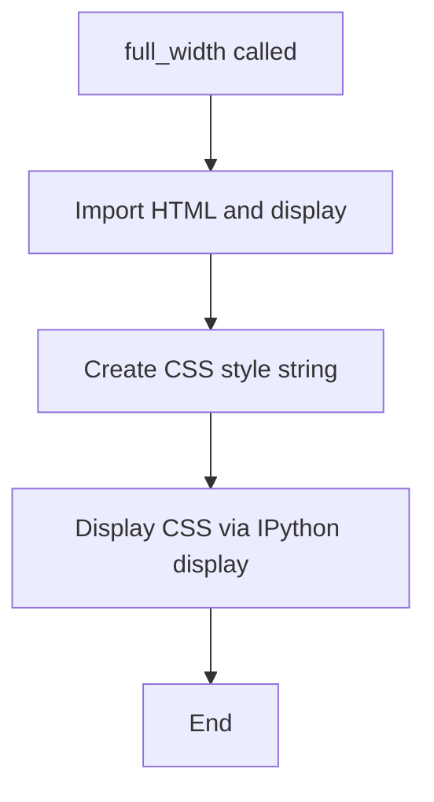

# `notebook.py`

## `src.ydata_profiling.utils.notebook.full_width` · *function*

## Summary:
Applies CSS styling to make Jupyter notebook containers use full width.

## Description:
This function displays a CSS style that overrides the default container width in Jupyter notebooks, making the container span the full width of the available space. It's typically used in notebook environments to improve the visual presentation of profiling reports.

## Args:
    None

## Returns:
    None

## Raises:
    None

## Constraints:
    Preconditions:
    - Must be run in a Jupyter notebook environment with IPython
    - IPython.core.display module must be available
    
    Postconditions:
    - The CSS style is displayed in the notebook output
    - The container width is set to 100% important

## Side Effects:
    - Displays HTML CSS styling to the Jupyter notebook output
    - No external state mutations or I/O operations beyond notebook display

## Control Flow:


## Examples:
```python
# Typical usage in a Jupyter notebook
from ydata_profiling.utils.notebook import full_width
full_width()  # Applies full-width styling to the notebook container
```

