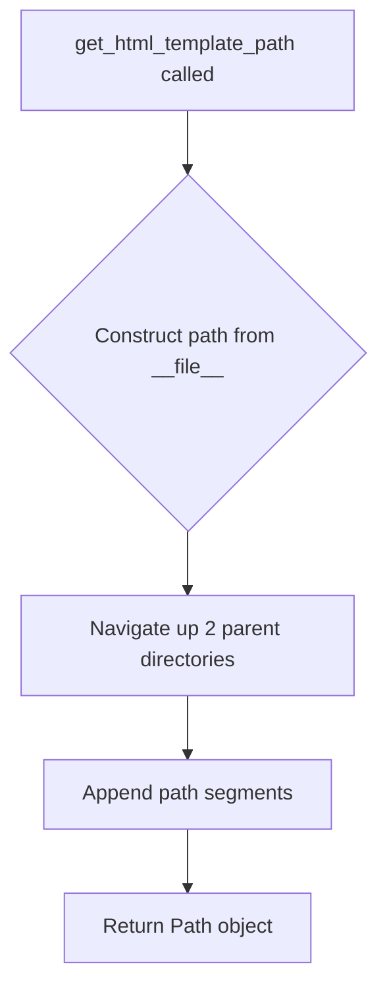

# `paths.py`

## `src.ydata_profiling.utils.paths.get_project_root` · *function*

## Summary:
Returns the absolute path to the project root directory by navigating up four directory levels from the current file location.

## Description:
This function provides a consistent way to locate the project root directory regardless of where it's called from within the codebase. It leverages the `__file__` variable to determine the current file's location and traverses up four parent directories to reach the project root.

The function is extracted into its own utility to avoid hardcoding directory paths throughout the codebase and to ensure consistent project root resolution across different execution contexts.

## Args:
    None

## Returns:
    Path: An absolute Path object pointing to the project root directory.

## Raises:
    None

## Constraints:
    Preconditions:
    - The function assumes the file structure follows a pattern where the current file (`paths.py`) is located in a nested directory structure within the project root.
    - The directory hierarchy must have at least 4 parent directories above the current file for proper operation.

    Postconditions:
    - The returned Path object will always represent the project root directory.
    - The returned Path will be absolute (not relative).

## Side Effects:
    None

## Control Flow:
```mermaid
flowchart TD
    A[get_project_root called] --> B{__file__ location}
    B --> C[Path(__file__) gets current file path]
    C --> D[.parent.parent.parent.parent navigates up 4 levels]
    D --> E[Returns Path object to project root]
```

## Examples:
```python
# Typical usage in a module
from ydata_profiling.utils.paths import get_project_root

root = get_project_root()
print(root)  # Output: /absolute/path/to/project/root

# Used for constructing relative paths to resources
config_path = get_project_root() / "configs" / "settings.yaml"
```

## `src.ydata_profiling.utils.paths.get_config` · *function*

## Summary:
Returns a Path object pointing to a configuration file relative to the module's parent directory.

## Description:
Constructs an absolute path to a configuration file by navigating up two directory levels from the current module file and appending the specified filename. This utility function centralizes path construction logic for configuration files, ensuring consistent access patterns regardless of where the module is imported from.

## Args:
    file_name (str): The name of the configuration file to locate relative to the module's parent directory.

## Returns:
    Path: A pathlib.Path object representing the full path to the requested configuration file.

## Raises:
    None: This function does not explicitly raise exceptions.

## Constraints:
    Preconditions:
        - The function assumes the module is located within a directory structure where going up two parent directories is valid.
        - The file_name parameter should be a valid string representing a filename.
    
    Postconditions:
        - The returned Path object will reference a file that may or may not exist in the filesystem.
        - The path construction follows standard POSIX/Windows path conventions based on the system.

## Side Effects:
    None: This function performs no I/O operations or external state mutations.

## Control Flow:
```mermaid
flowchart TD
    A[get_config called with file_name] --> B{file_name is str}
    B -->|Yes| C[Get current file path (__file__)]
    C --> D[Go up two parent directories]
    D --> E[Append file_name to path]
    E --> F[Return Path object]
    B -->|No| G[TypeError raised implicitly]
```

## Examples:
    # Get path to a config file named "settings.json"
    config_path = get_config("settings.json")
    
    # Get path to a config file named "database.ini"  
    db_config = get_config("database.ini")
```

## `src.ydata_profiling.utils.paths.get_data_path` · *function*

## Summary:
Returns the absolute path to the project's data directory.

## Description:
Provides a consistent way to access the project's data directory by resolving it relative to the project root. This function encapsulates the logic for constructing the path to the data directory, ensuring that all parts of the application reference the same location regardless of where they're called from.

The function is extracted into its own utility to avoid hardcoding directory paths throughout the codebase and to ensure consistent data directory resolution across different execution contexts.

## Args:
    None

## Returns:
    Path: An absolute Path object pointing to the project's data directory.

## Raises:
    None

## Constraints:
    Preconditions:
    - The project root directory must exist and be accessible.
    - The `get_project_root()` function must work correctly to resolve the project root.

    Postconditions:
    - The returned Path object will always represent the data directory within the project root.
    - The returned Path will be absolute (not relative).

## Side Effects:
    None

## Control Flow:
```mermaid
flowchart TD
    A[get_data_path called] --> B[get_project_root() called]
    B --> C[Project root path obtained]
    C --> D["data" appended to project root path]
    D --> E[Returns Path object to data directory]
```

## Examples:
```python
# Typical usage in a module
from ydata_profiling.utils.paths import get_data_path

data_dir = get_data_path()
print(data_dir)  # Output: /absolute/path/to/project/root/data

# Used for accessing data files
data_file = get_data_path() / "dataset.csv"
```

## `src.ydata_profiling.utils.paths.get_html_template_path` · *function*

## Summary:
Returns the absolute path to the HTML template directory used for report generation.

## Description:
This function provides a centralized location for accessing HTML template files used in report generation. It constructs the path by navigating from the current module's directory up two parent directories and then into the standard template structure. This abstraction ensures consistent access to template files regardless of where the application is executed from.

The function is extracted into its own utility to enforce a clear separation between path construction logic and the rest of the reporting system, making it easier to maintain and update template locations without modifying multiple places in the codebase.

## Args:
    None

## Returns:
    Path: An absolute Path object pointing to the HTML templates directory containing report templates.

## Raises:
    None

## Constraints:
    Preconditions:
    - The function assumes the standard project directory structure exists
    - The template directory structure must be maintained as: report/presentation/flavours/html/templates
    
    Postconditions:
    - The returned Path object will always point to a valid directory if the project structure is intact
    - The returned Path object is absolute (not relative)

## Side Effects:
    None

## Control Flow:


## Examples:
```python
from pathlib import Path
from ydata_profiling.utils.paths import get_html_template_path

# Get the template directory path
template_dir = get_html_template_path()
print(template_dir)  # Outputs something like: /path/to/project/report/presentation/flavours/html/templates

# Verify it's a valid directory
assert template_dir.is_dir() == True
```

