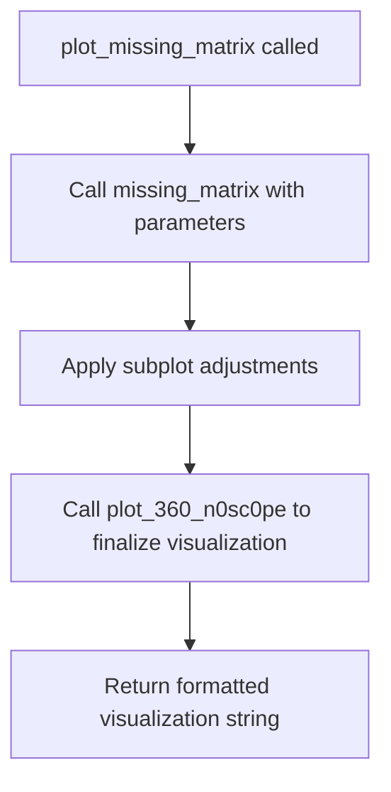
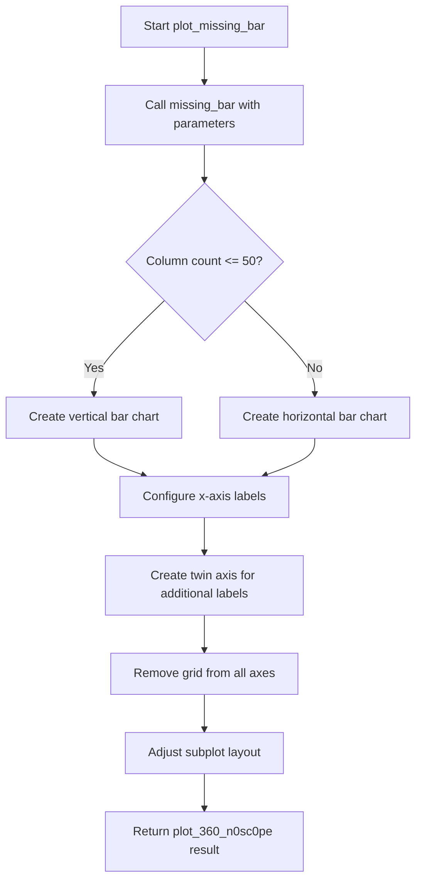

# `missing.py`

## `src.ydata_profiling.visualisation.missing.get_font_size` · *function*

## Summary:
Calculates an appropriate font size for visualization labels based on column count and label length.

## Description:
This function determines optimal font sizing for display elements in missing data visualizations. It adjusts font size based on the number of columns being displayed and the maximum length of column labels to ensure readability and proper layout.

## Args:
    columns (List[str]): A list of column names/labels that will be displayed in the visualization

## Returns:
    float: The calculated font size value that ensures proper visualization rendering

## Raises:
    None explicitly raised

## Constraints:
    Preconditions:
    - Input must be a non-empty list of strings
    - Each string in the list must be non-null
    
    Postconditions:
    - Returns a positive float value representing font size
    - Font size is adjusted to prevent overcrowding in visualizations

## Side Effects:
    None

## Control Flow:
```mermaid
flowchart TD
    A[Start get_font_size] --> B{len(columns) < 20?}
    B -- Yes --> C[font_size = 13.0]
    B -- No --> D{20 <= len(columns) < 40?}
    D -- Yes --> E[font_size = 12.0]
    D -- No --> F{40 <= len(columns) < 60?}
    F -- Yes --> G[font_size = 10.0]
    F -- No --> H[font_size = 8.0]
    C --> I[Adjust by label length]
    E --> I
    G --> I
    H --> I
    I --> J[font_size *= min(1.0, 20.0 / max_label_length)]
    J --> K[Return font_size]
```

## Examples:
    Example 1: get_font_size(['col1', 'col2', 'col3']) 
    Returns: 13.0 (fewer than 20 columns, short labels)
    
    Example 2: get_font_size(['very_long_column_name'] * 25)
    Returns: 12.0 * min(1.0, 20.0 / 20) = 12.0 (25 columns, long labels)
    
    Example 3: get_font_size(['col'] * 60)
    Returns: 8.0 * min(1.0, 20.0 / 3) ≈ 8.0 * 0.67 = 5.33 (60 columns, short labels)

## `src.ydata_profiling.visualisation.missing.plot_missing_matrix` · *function*

## Summary
Generates and returns a missing data matrix visualization for a dataset's missing value patterns.

## Description
Creates a matrix-style visualization that displays the presence or absence of missing values for each variable in the input dataset. This function is part of the missing data visualization pipeline and produces a grid-based representation where each cell indicates whether a value is present or missing for a specific variable and observation.

The function is called during data profiling when the "matrix" visualization option is selected for missing data analysis. It leverages the underlying `missing_matrix` plotting function from the visualization module to generate the visualization, applies appropriate styling based on configuration settings, and formats the result for embedding in profiling reports.

## Args
- config (Settings): Configuration object containing profiling settings including visualization preferences, styling options, and rendering parameters for the missing data matrix
- notnull (Any): Data structure containing boolean values indicating presence (True) or absence (False) of values for each data point and variable combination
- columns (List[str]): List of column names/labels that will be displayed in the visualization, used for labeling and sizing calculations
- nrows (int): Total number of rows in the dataset, used to calculate proportions and scale the visualization appropriately

## Returns
- str: String representation of the missing data matrix visualization, typically formatted as HTML or other visualization-ready format that can be embedded in profiling reports

## Raises
- ValueError: Raised by `plot_360_n0sc0pe` when an unsupported image format is specified in the configuration

## Constraints
- Preconditions:
  - config must be a valid Settings instance with proper initialization
  - notnull must be a valid data structure that can be processed by the underlying plotting function
  - columns must be a non-empty list of strings
  - nrows must be a positive integer
- Postconditions:
  - Function returns a properly formatted string representation of the visualization
  - The returned visualization maintains proper aspect ratio and styling according to configuration

## Side Effects
- Creates matplotlib figure and axes objects internally
- May modify global matplotlib state through subplot adjustments
- Generates or saves visualization files if html.inline is False (depending on configuration)

## Control Flow


## Examples
```python
from src.ydata_profiling.config import Settings
from src.ydata_profiling.visualisation.missing import plot_missing_matrix

# Example usage in a data profiling context
config = Settings()
notnull_data = df.notnull()  # Boolean DataFrame indicating presence of values
columns_list = ['column1', 'column2', 'column3']
num_rows = len(df)

# Generate missing matrix visualization
visualization_result = plot_missing_matrix(config, notnull_data, columns_list, num_rows)
print(visualization_result)  # HTML or image string representation
```

## `src.ydata_profiling.visualisation.missing.plot_missing_bar` · *function*

## Summary
Creates a bar chart visualization showing the distribution of non-missing values across DataFrame columns for missing data analysis.

## Description
Generates a matplotlib-based bar chart that displays the proportion of non-missing values for each column in a dataset. This function is part of the missing data visualization suite and provides a quick visual assessment of data completeness patterns. The visualization helps identify columns with high missing value rates and understand overall data quality.

The function orchestrates the creation of a bar chart by:
1. Calling the underlying `missing_bar` plotting function with appropriate parameters
2. Configuring axis properties and layout adjustments
3. Returning a formatted string representation suitable for HTML embedding

This function is typically called as part of automated data profiling workflows to visualize missing value patterns in datasets.

## Args
    config (Settings): Configuration object containing visualization settings including HTML styling, plot formatting, and missing data visualization preferences
    notnull_counts (list): A list or array containing the count of non-missing values for each column in the dataset
    nrows (int): Total number of rows in the DataFrame being analyzed
    columns (List[str]): List of column names that will be displayed on the x-axis of the visualization

## Returns
    str: A string representation of the generated matplotlib figure, either as inline base64-encoded image data or as a file path reference, depending on the configuration settings in the config object

## Raises
    None explicitly raised by this function, though underlying matplotlib operations may raise exceptions

## Constraints
    Preconditions:
    - config must be a valid Settings object with appropriate configuration
    - notnull_counts must contain numeric values representing non-missing counts per column
    - nrows must be a positive integer representing total row count
    - columns must be a non-empty list of strings representing column names

    Postconditions:
    - A matplotlib figure is created and configured with appropriate labels and styling
    - The returned string contains valid image data or file path reference
    - All matplotlib resources are properly closed after generation

## Side Effects
    - Creates and manipulates matplotlib figures and axes
    - May generate temporary files if html.inline is False and assets_path is configured
    - Modifies global matplotlib state through plt.subplots_adjust and plt.gca() operations

## Control Flow


## Examples
    Example usage in a data profiling context:
    ```python
    # Assuming config, notnull_counts, nrows, and columns are defined
    bar_chart_html = plot_missing_bar(config, notnull_counts, nrows, columns)
    # bar_chart_html contains the rendered visualization ready for HTML display
    ```

## `src.ydata_profiling.visualisation.missing.plot_missing_heatmap` · *function*

## Summary
Creates and displays a heatmap visualization of missing data patterns with adaptive sizing and formatting based on the number of columns.

## Description
Generates a correlation heatmap showing relationships between missing values across columns in a dataset. This function dynamically adjusts visualization parameters such as figure height, font size, and subplot positioning based on the number of columns to ensure optimal display readability. The function integrates with matplotlib for plotting and follows the ydata-profiling configuration system for styling.

## Args
    config (Settings): Configuration object containing visualization settings including color map preferences and image format options
    corr_mat (Any): Correlation matrix representing relationships between missing value patterns across columns
    mask (Any): Mask array for hiding specific cells in the heatmap visualization
    columns (List[str]): List of column names that will be displayed on the axes of the heatmap

## Returns
    str: Path or encoded representation of the generated heatmap image, formatted according to the configuration settings (PNG or SVG)

## Raises
    ValueError: When the configured image format is not supported (only 'png' or 'svg' are accepted)

## Constraints
    Preconditions:
    - config must be a valid Settings object with proper plot configuration
    - corr_mat and mask must be compatible data structures for heatmap plotting
    - columns must be a non-empty list of strings representing column names
    
    Postconditions:
    - A matplotlib figure is created and properly configured
    - The figure is saved or encoded according to configuration settings
    - The matplotlib figure is closed to prevent memory leaks

## Side Effects
    - Creates and modifies matplotlib figures and axes
    - Saves image files to disk when html.inline is False (depending on configuration)
    - Closes matplotlib figures to prevent memory leaks
    - May write to filesystem when html.assets_path is configured

## Control Flow
```mermaid
flowchart TD
    A[Start plot_missing_heatmap] --> B{len(columns) > 10?}
    B -- Yes --> C[height += int((len(columns) - 10) / 5)]
    B -- No --> D[height = 4]
    C --> E[height = min(height, 10)]
    D --> E
    E --> F[font_size = get_font_size(columns)]
    F --> G{len(columns) > 40?}
    G -- Yes --> H[font_size /= 1.4]
    G -- No --> I[Continue with original font_size]
    H --> I
    I --> J[Call missing_heatmap with computed parameters]
    J --> K{len(columns) > 40?}
    K -- Yes --> L[plt.subplots_adjust with tight margins]
    K -- No --> M[plt.subplots_adjust with standard margins]
    L --> N[Return plot_360_n0sc0pe(config)]
    M --> N
```

## Examples
    Example 1: Basic usage with few columns
    ```python
    config = Settings()
    corr_mat = np.random.rand(5, 5)
    mask = np.zeros((5, 5))
    columns = ['col1', 'col2', 'col3', 'col4', 'col5']
    result = plot_missing_heatmap(config, corr_mat, mask, columns)
    # Returns path/encoded string for 5-column heatmap
    ```

    Example 2: Usage with many columns requiring font adjustment
    ```python
    config = Settings()
    corr_mat = np.random.rand(50, 50)
    mask = np.zeros((50, 50))
    columns = [f'column_{i}' for i in range(50)]
    result = plot_missing_heatmap(config, corr_mat, mask, columns)
    # Returns path/encoded string for 50-column heatmap with adjusted font and margins
    ```

