# `plot.py`

## `src.ydata_profiling.visualisation.plot.format_fn` · *function*

## Summary:
Formats Unix timestamp values into human-readable date-time strings for matplotlib axis tick labels.

## Description:
This function serves as a matplotlib tick formatter that converts Unix timestamps (integer values) into readable date-time strings in the format "%Y-%m-%d %H:%M:%S". It is designed to be used with matplotlib's FuncFormatter interface where it receives tick values representing Unix timestamps and converts them to human-readable strings.

The function leverages the `convert_timestamp_to_datetime` utility to handle the timestamp conversion, properly managing both positive and negative timestamp values according to Unix epoch conventions.

## Args:
    tick_val (int): The numeric tick value representing a Unix timestamp in seconds since the Unix epoch (January 1, 1970). This is typically passed by matplotlib's FuncFormatter when rendering axis ticks.
    tick_pos (Any): The position of the tick on the axis (not used in the implementation, but required by matplotlib's FuncFormatter interface contract).

## Returns:
    str: A formatted date-time string in the format "%Y-%m-%d %H:%M:%S" representing the converted timestamp value.

## Raises:
    ValueError: May propagate exceptions from `convert_timestamp_to_datetime` if the timestamp value is invalid for datetime conversion.

## Constraints:
    Precondition: The tick_val parameter must be a valid integer representing a Unix timestamp.
    Postcondition: The returned string will always be in the format "%Y-%m-%d %H:%M:%S" regardless of the input timestamp value.

## Side Effects:
    None

## Control Flow:
```mermaid
flowchart TD
    A[format_fn called with tick_val, tick_pos] --> B[Convert tick_val to datetime using convert_timestamp_to_datetime]
    B --> C[Format datetime as "%Y-%m-%d %H:%M:%S"]
    C --> D[Return formatted string]
```

## Examples:
    # Typical usage with matplotlib
    import matplotlib.pyplot as plt
    from matplotlib.ticker import FuncFormatter
    
    # Create a plot with datetime x-axis
    fig, ax = plt.subplots()
    ax.xaxis.set_major_formatter(FuncFormatter(format_fn))
    
    # When matplotlib renders ticks, it will call format_fn with timestamp values
    # e.g., tick_val = 1609459200 would become "2021-01-01 00:00:00"
    
    # Example with sample timestamp data
    timestamps = [1609459200, 1609545600, 1609632000]  # Three days apart
    # When plotted with format_fn, these would display as:
    # "2021-01-01 00:00:00", "2021-01-02 00:00:00", "2021-01-03 00:00:00"
```

## `src.ydata_profiling.visualisation.plot._plot_word_cloud` · *function*

## Summary:
Creates a matplotlib figure containing one or more word clouds from pandas Series data representing word frequencies.

## Description:
Generates visual word cloud representations from frequency data contained in pandas Series objects. The function accepts either a single Series or a list of Series, creating individual word clouds for each. This extraction into a dedicated function allows for consistent visualization of textual frequency data while maintaining clean separation between data processing and visualization logic.

## Args:
    series (Union[pd.Series, List[pd.Series]]): A single pandas Series or list of pandas Series containing word-frequency pairs as key-value pairs.
    figsize (tuple): Figure size as (width, height) in inches. Defaults to (6, 4).

## Returns:
    plt.Figure: A matplotlib Figure object containing one or more subplots with word cloud visualizations.

## Raises:
    None explicitly raised in the function body.

## Constraints:
    Preconditions:
    - Input series must be pandas Series objects with string keys and numeric values representing word frequencies
    - If a list is provided, all elements must be pandas Series objects
    - The figsize parameter must be a tuple of two numeric values
    
    Postconditions:
    - Returns a matplotlib Figure object with appropriate subplot layout
    - Each subplot displays a word cloud visualization with axes turned off

## Side Effects:
    - Creates a matplotlib figure using plt.figure()
    - Adds subplots to the matplotlib figure
    - Displays word cloud images on the subplots
    - May modify global matplotlib state through figure creation

## Control Flow:
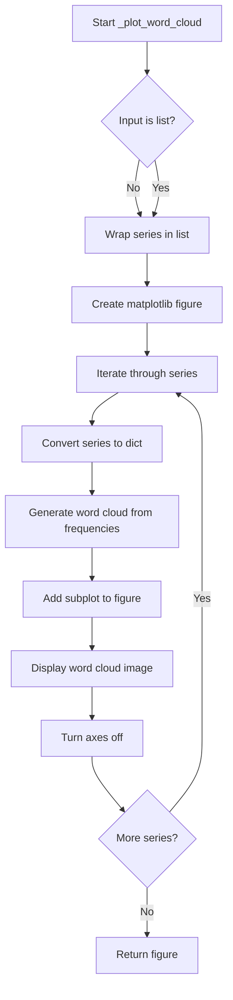

## Examples:
```python
import pandas as pd
from matplotlib import pyplot as plt

# Single series example
word_freq_series = pd.Series({'python': 10, 'data': 8, 'analysis': 5})
fig = _plot_word_cloud(word_freq_series)

# Multiple series example  
word_freq_series1 = pd.Series({'python': 10, 'data': 8})
word_freq_series2 = pd.Series({'machine': 7, 'learning': 6})
fig = _plot_word_cloud([word_freq_series1, word_freq_series2])
```

## `src.ydata_profiling.visualisation.plot._plot_histogram` · *function*

## Summary:
Creates a matplotlib histogram plot with configurable styling and formatting options for both single and multi-series data.

## Description:
This private function generates histogram visualizations using matplotlib's bar chart functionality. It handles both single-series and multi-series histograms with appropriate styling based on configuration settings. The function supports date formatting for timestamp data and provides flexible axis visibility controls.

The function is designed to be a reusable component for creating histogram visualizations throughout the ydata-profiling library, abstracting away the complexity of matplotlib plotting while maintaining configurability through the Settings object.

## Args:
    config (Settings): Configuration object containing styling and plotting preferences including color schemes and label settings.
    series (np.ndarray): Array of histogram bin heights, either for a single series or multiple series (when bins is a list).
    bins (Union[int, np.ndarray]): Either the number of bins (int) or array of bin edges (np.ndarray) for the histogram.
    figsize (tuple, optional): Figure size as (width, height) in inches. Defaults to (6, 4).
    date (bool, optional): Flag indicating whether the x-axis contains date/timestamp data requiring special formatting. Defaults to False.
    hide_yaxis (bool, optional): Flag to hide the y-axis. Defaults to False.

## Returns:
    matplotlib.axes.Axes: The matplotlib axes object containing the histogram plot.

## Raises:
    None explicitly raised in the function body.

## Constraints:
    Precondition: The config parameter must be a valid Settings object with proper html.style configuration.
    Precondition: The series parameter must be compatible with the bins parameter dimensions.
    Precondition: If date=True, the x-axis data should contain valid timestamp values.
    Postcondition: The returned axes object will contain a properly formatted histogram plot.

## Side Effects:
    None

## Control Flow:
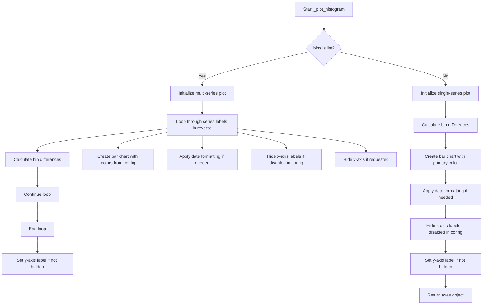

## Examples:
    # Single series histogram
    import numpy as np
    from ydata_profiling.config import Settings
    
    config = Settings()
    series = np.array([10, 25, 30, 15, 5])
    bins = np.array([0, 1, 2, 3, 4, 5])
    
    axes = _plot_histogram(config, series, bins)
    
    # Multi-series histogram with date formatting
    series_multi = [np.array([10, 25, 30]), np.array([15, 20, 25])]
    bins_multi = [np.array([0, 1, 2, 3]), np.array([0, 1, 2, 3])]
    
    axes = _plot_histogram(config, series_multi, bins_multi, date=True)
```

## `src.ydata_profiling.visualisation.plot.plot_word_cloud` · *function*

## Summary:
Generates a word cloud visualization from text frequency data and returns it as a formatted string representation.

## Description:
Creates a word cloud visualization from a pandas Series containing word frequencies and returns it as a formatted string representation. This function orchestrates the creation of word cloud visualizations by leveraging internal plotting utilities. The word cloud is generated using matplotlib and then formatted according to the provided configuration settings.

## Args:
    config (Settings): Configuration settings object that determines output format and storage options for the visualization.
    word_counts (pd.Series): A pandas Series containing word-frequency pairs where keys are words and values are their respective frequencies.

## Returns:
    str: A string representation of the word cloud visualization, formatted according to the configuration settings (either inline base64-encoded PNG/SVG or file path reference).

## Raises:
    ValueError: When the image format specified in config is not supported (only "png" or "svg" are accepted).

## Constraints:
    Preconditions:
    - The word_counts parameter must be a pandas Series with string keys and numeric values
    - The config parameter must be a valid Settings object with proper HTML and plot configurations
    - The config.plot.image_format must be set to either "png" or "svg"
    
    Postconditions:
    - A matplotlib figure containing word cloud visualization is created and saved
    - The returned string contains either base64-encoded image data or a file path reference
    - Global matplotlib state is properly managed and cleaned up

## Side Effects:
    - Creates and manages matplotlib figures internally
    - May generate temporary files or inline base64-encoded image data
    - Modifies global matplotlib state through figure creation and cleanup
    - May write files to disk if html.inline is False and assets_path is configured

## Control Flow:
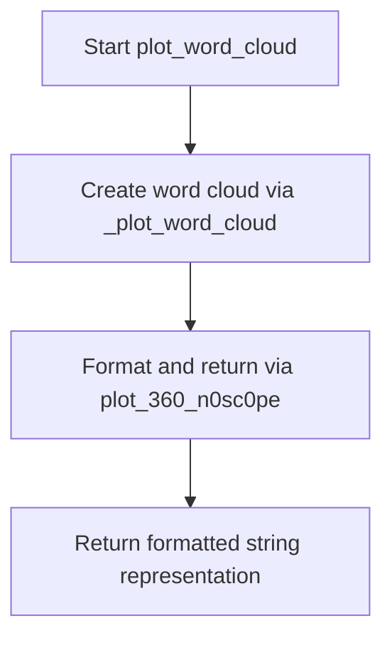

## Examples:
```python
import pandas as pd
from ydata_profiling.config import Settings

# Create sample word frequency data
word_freq_series = pd.Series({'python': 10, 'data': 8, 'analysis': 5})

# Configure settings for PNG output
config = Settings()
config.plot.image_format = "png"

# Generate word cloud
result = plot_word_cloud(config, word_freq_series)
# Returns base64-encoded PNG string or file path reference
```

## `src.ydata_profiling.visualisation.plot.histogram` · *function*

## Summary:
Generates a histogram visualization from numerical data and returns it as a formatted string representation suitable for HTML embedding.

## Description:
Creates a histogram plot using matplotlib with configurable styling and formatting options. This function serves as a convenience wrapper that orchestrates the creation of a histogram visualization by calling the internal `_plot_histogram` function and then processing the resulting plot through the `plot_360_n0sc0pe` utility to generate a standardized output format.

The function automatically adjusts tick rotation based on whether the data represents dates and ensures proper layout spacing. It is designed to be part of the ydata-profiling visualization toolkit for generating statistical distribution plots, particularly for data profiling reports.

## Args:
    config (Settings): Configuration object containing styling and plotting preferences including color schemes, figure sizing, and HTML output settings.
    series (np.ndarray): Array of histogram bin heights representing the frequency counts for each bin.
    bins (Union[int, np.ndarray]): Either the number of bins (int) or array of bin edges (np.ndarray) defining the histogram bins.
    date (bool, optional): Flag indicating whether the x-axis contains date/timestamp data requiring special formatting. Defaults to False.

## Returns:
    str: A string representation of the histogram plot, formatted according to the configuration settings (either inline base64-encoded PNG/SVG or file path reference). The returned string can be directly embedded in HTML documents.

## Raises:
    ValueError: If the image format specified in config is not supported (only "png" or "svg" are accepted by the underlying plot_360_n0sc0pe function).

## Constraints:
    Precondition: The config parameter must be a valid Settings object with proper HTML and plotting configurations.
    Precondition: The series and bins parameters must be compatible in terms of data structure and dimensionality.
    Postcondition: The returned string represents a valid formatted plot that can be embedded in HTML or saved as an image file.

## Side Effects:
    - Creates and manipulates matplotlib figures and axes objects internally
    - May generate temporary files or base64 encoded strings depending on config.html.inline setting
    - Closes matplotlib figures after processing to prevent memory leaks

## Control Flow:
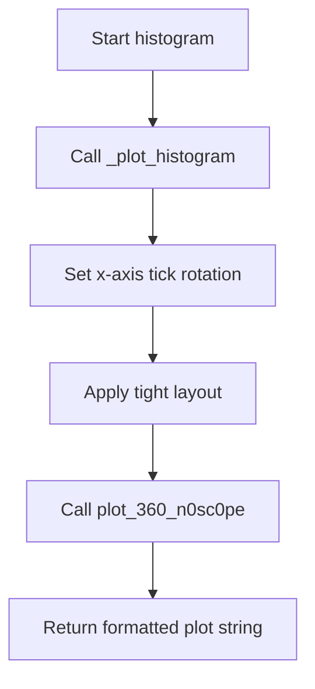

## Examples:
    # Basic histogram with integer bins
    import numpy as np
    from ydata_profiling.config import Settings
    
    config = Settings()
    data = np.array([1, 2, 2, 3, 3, 3, 4, 4, 5])
    bins = 5
    
    plot_string = histogram(config, data, bins)
    
    # Histogram with date formatting
    date_data = np.array([1609459200, 1609545600, 1609632000])  # Unix timestamps
    plot_string = histogram(config, date_data, 3, date=True)
```

## `src.ydata_profiling.visualisation.plot.mini_histogram` · *function*

## Summary:
Creates a compact histogram visualization with customized formatting suitable for embedding in reports or dashboards.

## Description:
Generates a miniature histogram plot optimized for space-constrained displays. This function builds upon the standard histogram plotting functionality by applying specific styling adjustments such as reduced figure size, modified tick formatting, and optimized layout. The resulting plot is designed for efficient display in profiling reports where multiple small visualizations are needed.

The function serves as a specialized wrapper around the core histogram plotting logic, providing consistent formatting for miniaturized histogram representations while maintaining the flexibility to handle both regular and date-formatted data.

## Args:
    config (Settings): Configuration object containing styling preferences and HTML rendering settings for the visualization.
    series (np.ndarray): Array of histogram bin heights representing the frequency distribution data.
    bins (Union[int, np.ndarray]): Number of bins or array of bin edges defining the histogram structure.
    date (bool, optional): Flag indicating whether the x-axis contains date/timestamp data requiring special formatting. Defaults to False.

## Returns:
    str: A string representation of the histogram plot, typically encoded as base64 for inline HTML display or saved as a file path when not in inline mode.

## Raises:
    None explicitly defined in the function body.

## Constraints:
    Precondition: The config parameter must be a valid Settings object with proper HTML and plotting configurations.
    Precondition: The series and bins parameters must be compatible for histogram generation.
    Precondition: When date=True, the underlying data should contain valid timestamp values.

## Side Effects:
    None directly observable from this function's interface.

## Control Flow:
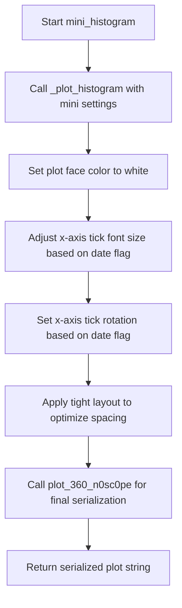

## Examples:
    # Create a mini histogram for regular numeric data
    import numpy as np
    from ydata_profiling.config import Settings
    
    config = Settings()
    data = np.array([1, 2, 2, 3, 3, 3, 4, 4, 5])
    bins = 5
    
    plot_string = mini_histogram(config, data, bins)
    
    # Create a mini histogram for date data
    date_data = np.array([1609459200, 1609545600, 1609632000])  # Unix timestamps
    plot_string = mini_histogram(config, date_data, bins, date=True)
```

## `src.ydata_profiling.visualisation.plot.get_cmap_half` · *function*

## Summary
Creates a new colormap from the upper half of colors in the input colormap.

## Description
This function extracts the upper half of colors from a given colormap and constructs a new LinearSegmentedColormap from those colors. It's primarily used in visualization contexts where a subset of colormap colors is needed, particularly for emphasizing higher-value ranges or creating contrast in plots.

The function is typically called when preparing colormaps for specific visualization requirements, such as heatmaps or color-coded visualizations where only the brighter or more saturated colors are desired. It effectively maps the input colormap's color range [0, 1] to the upper half [0.5, 1], preserving the relative color relationships.

## Args
    cmap (Union[Colormap, LinearSegmentedColormap, ListedColormap]): Input colormap from which to extract colors. Must have an attribute N representing the number of discrete colors in the colormap.

## Returns
    LinearSegmentedColormap: A new colormap containing only the upper half of colors from the input colormap. The returned colormap will have approximately cmap.N // 2 colors, spanning the color range [0.5, 1] of the original colormap's color space.

## Raises
    AttributeError: If the input cmap does not have an N attribute.
    TypeError: If the input cmap is not a valid matplotlib colormap type.
    ValueError: If the input cmap cannot be indexed with numpy arrays.

## Constraints
    Preconditions:
    - Input cmap must be a valid matplotlib colormap object with an N attribute
    - Input cmap must support numpy array indexing with float values between 0 and 1
    - Input cmap.N must be a positive integer
    
    Postconditions:
    - The returned colormap will be a LinearSegmentedColormap instance
    - The returned colormap will contain approximately cmap.N // 2 colors
    - The color range of the returned colormap will span from 0.5 to 1.0 of the input colormap's range
    - The color interpolation properties of the original colormap are preserved in the new colormap

## Side Effects
    None

## Control Flow
```mermaid
flowchart TD
    A[get_cmap_half called with cmap] --> B{Input validation}
    B --> C[cmap.N // 2 calculates number of colors]
    C --> D[np.linspace(0.5, 1, cmap.N // 2) generates color positions]
    D --> E[cmap() samples colors from upper half]
    E --> F[LinearSegmentedColormap.from_list("cmap_half", colors)]
    F --> G[Return new colormap]
```

## Examples
```python
import matplotlib.pyplot as plt
from matplotlib.colors import viridis

# Create a half version of the viridis colormap
half_viridis = get_cmap_half(viridis)
print(f"Original colormap has {viridis.N} colors")
print(f"Half colormap has {half_viridis.N} colors")

# Use in a visualization
fig, (ax1, ax2) = plt.subplots(1, 2, figsize=(10, 4))
x = [[0, 1], [0.5, 0.7]]
ax1.imshow(x, cmap=viridis)
ax1.set_title('Full Viridis')
ax2.imshow(x, cmap=half_viridis)
ax2.set_title('Half Viridis')
plt.show()
```

## `src.ydata_profiling.visualisation.plot.get_correlation_font_size` · *function*

## Summary:
Determines appropriate font size for correlation matrix labels based on the number of labels.

## Description:
This function calculates the optimal font size for displaying labels in correlation plots. It returns a decreasing font size as the number of labels increases, ensuring readability for large correlation matrices. The function is designed to prevent label overcrowding in correlation visualizations.

## Args:
    n_labels (int): The number of labels in the correlation matrix. Must be a non-negative integer.

## Returns:
    Optional[int]: Font size value (4, 5, 6, or 8) if n_labels exceeds the threshold, None otherwise. Returns None when n_labels <= 40.

## Raises:
    None

## Constraints:
    Preconditions:
        - n_labels must be an integer
        - n_labels should be non-negative
    
    Postconditions:
        - Returns None when n_labels <= 40
        - Returns one of {4, 5, 6, 8} when n_labels > 40

## Side Effects:
    None

## Control Flow:
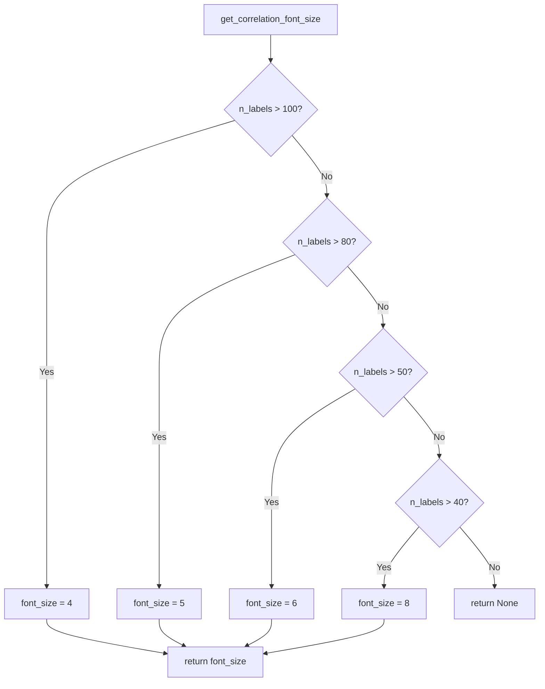

## Examples:
    >>> get_correlation_font_size(30)
    None
    >>> get_correlation_font_size(45)
    8
    >>> get_correlation_font_size(55)
    6
    >>> get_correlation_font_size(85)
    5
    >>> get_correlation_font_size(105)
    4

## `src.ydata_profiling.visualisation.plot.correlation_matrix` · *function*

## Summary
Creates a heatmap visualization of a correlation matrix with customizable color mapping and label formatting.

## Description
Generates a correlation matrix heatmap using matplotlib, displaying the relationships between variables in a DataFrame. The function supports custom color schemes, handles missing values with appropriate legends, and automatically adjusts font sizes for better readability based on the number of variables.

## Args
    config (Settings): Configuration object containing plotting settings including correlation colormap and bad color values.
    data (pd.DataFrame): DataFrame containing the correlation coefficients to visualize. Should contain numeric values between -1 and 1.
    vmin (int, optional): Minimum value for color scaling. Defaults to -1. When set to 0, uses a half colormap to emphasize positive correlations.

## Returns
    str: Path or encoded string representation of the generated correlation matrix plot, depending on configuration settings.

## Raises
    None explicitly raised in this function, though underlying matplotlib operations may raise exceptions.

## Constraints
    Preconditions:
        - config must be a valid Settings object with proper correlation configuration
        - data must be a pandas DataFrame with numeric correlation values
        - data should contain correlation coefficients in the range [-1, 1]
        - vmin must be either -1 or 0 for proper colormap handling
    
    Postconditions:
        - A matplotlib figure is created and displayed
        - The returned string represents a valid image path or encoded image data
        - All matplotlib resources are properly closed

## Side Effects
    - Creates and modifies matplotlib figures and axes
    - May generate and save image files to disk based on configuration
    - Uses matplotlib's global state for figure creation and management

## Control Flow
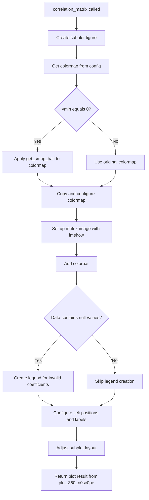

## Examples
```python
import pandas as pd
from ydata_profiling.config import Settings

# Create sample correlation data
data = pd.DataFrame({
    'A': [1.0, 0.5, -0.3],
    'B': [0.5, 1.0, 0.2],
    'C': [-0.3, 0.2, 1.0]
})

# Configure settings
config = Settings()

# Generate correlation matrix plot
plot_result = correlation_matrix(config, data, vmin=-1)
print(f"Plot saved to: {plot_result}")
```

## `src.ydata_profiling.visualisation.plot.scatter_complex` · *function*

## Summary
Creates a complex scatter plot visualization for complex number data series, switching between hexbin and scatter plot rendering based on data size thresholds.

## Description
Generates a 2D scatter plot visualization for complex number data where the real component is plotted on the x-axis and the imaginary component on the y-axis. The function automatically chooses between hexagonal binning and point-based scatter plots depending on the size of the input data series relative to a configurable threshold. This approach optimizes performance and visual clarity for both small and large datasets.

This function encapsulates the logic for creating complex number visualizations in the ydata-profiling library, separating the visualization decision logic (based on data size) from the actual plotting and export mechanisms. It is typically invoked during HTML report generation when visualizing complex number distributions or relationships in data profiling workflows.

## Args
    config (Settings): Configuration object containing visualization settings including plot thresholds, styling parameters, and output formats
    series (pd.Series): Pandas Series containing complex numbers to visualize, where each element has .real and .imag attributes

## Returns
    str: Path or base64-encoded string representation of the generated plot image, formatted according to the configuration's image format setting

## Raises
    None explicitly raised by this function, though underlying matplotlib operations may raise exceptions

## Constraints
    Preconditions:
    - Input series must contain complex numbers with real and imaginary components
    - Config must contain valid plot configuration with scatter_threshold attribute
    - Config must contain valid HTML styling configuration with primary_colors
    
    Postconditions:
    - Axis labels are set to "Real" and "Imaginary"
    - Plot is rendered using matplotlib with appropriate visualization method
    - Original matplotlib context is properly managed

## Side Effects
    - Modifies global matplotlib state temporarily through plt.* calls
    - May create temporary files or base64 encoded strings depending on HTML inline configuration
    - Calls matplotlib's close() function to clean up figure resources

## Control Flow
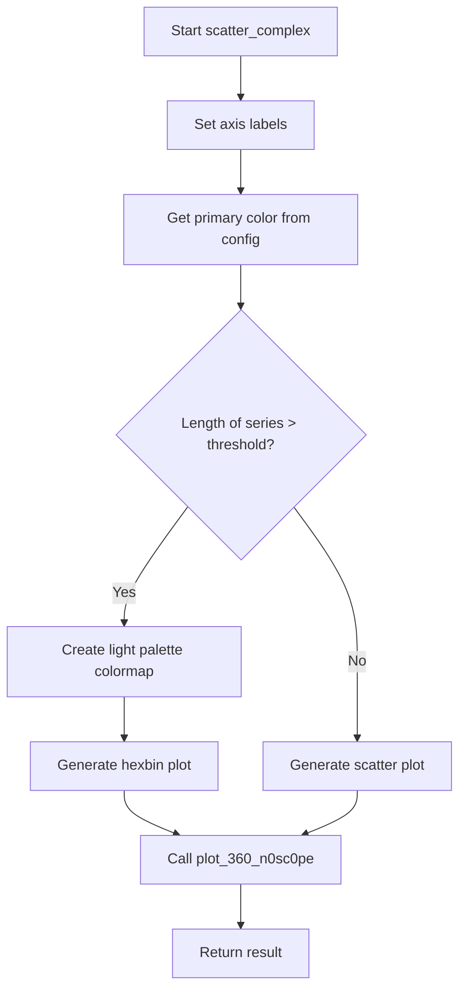

## Examples
```python
# Basic usage in profiling context
from src.ydata_profiling.config import Settings
import pandas as pd

# Create sample complex data
complex_series = pd.Series([1+2j, 3+4j, 5+6j])

# Configure settings
config = Settings()

# Generate scatter plot
plot_result = scatter_complex(config, complex_series)

# With larger dataset that triggers hexbin rendering
large_complex_series = pd.Series([complex(i, i*2) for i in range(1500)])
plot_result_large = scatter_complex(config, large_complex_series)
```

## `src.ydata_profiling.visualisation.plot.scatter_series` · *function*

## Summary
Creates a scatter plot or hexbin plot for bivariate data series based on the dataset size threshold.

## Description
Generates a two-dimensional visualization of a pandas Series containing coordinate pairs. The function automatically chooses between a scatter plot and a hexbin plot depending on the number of data points, using the scatter_threshold configuration parameter to make this decision. This approach optimizes visualization performance and clarity for both small and large datasets.

The function is typically called during the generation of data profiling reports to visualize relationships between two variables in a dataset. It's extracted into its own function to encapsulate the logic for choosing appropriate visualization methods based on data characteristics.

## Args
- config (Settings): Configuration object containing plotting settings including scatter_threshold and color preferences
- series (pd.Series): Pandas Series containing coordinate pairs (x,y) to be plotted
- x_label (str, optional): Label for the x-axis. Defaults to "Width"
- y_label (str, optional): Label for the y-axis. Defaults to "Height"

## Returns
- str: The result of the plot_360_n0sc0pe function, which handles the actual image generation and saving

## Raises
- ValueError: When plot_360_n0sc0pe is called with an unsupported image format

## Constraints
- Preconditions: 
  - The series parameter must contain valid coordinate pairs (tuples/lists of two numeric values)
  - Config must be a valid Settings object with proper plot configuration
- Postconditions:
  - The matplotlib figure is closed after plotting to prevent memory leaks
  - A valid image string is returned regardless of plot type

## Side Effects
- Modifies matplotlib state by setting axis labels and creating plots
- Calls plot_360_n0sc0pe which may save files to disk or return base64 encoded strings depending on configuration
- Closes matplotlib figures to prevent resource leaks

## Control Flow
```mermaid
flowchart TD
    A[Start scatter_series] --> B{len(series) > scatter_threshold?}
    B -- Yes --> C[Generate hexbin plot]
    B -- No --> D[Generate scatter plot]
    C --> E[Set color palette]
    D --> E
    E --> F[Call plot_360_n0sc0pe]
    F --> G[Return result]
```

## Examples
```python
import pandas as pd
from src.ydata_profiling.config import Settings
from src.ydata_profiling.visualisation.plot import scatter_series

# Create sample data
data = pd.Series([(1, 2), (3, 4), (5, 6), (7, 8)])
config = Settings()

# Generate scatter plot
result = scatter_series(config, data, "X Values", "Y Values")
```

## `src.ydata_profiling.visualisation.plot.scatter_pairwise` · *function*

## Summary
Creates a pairwise scatter plot (either hexbin or scatter) between two numeric series for visualization in data profiling reports.

## Description
This function generates a scatter plot visualization between two data series, automatically choosing between a hexagonal binning plot and a regular scatter plot based on the size of the dataset relative to the configured threshold. It's used in the ydata-profiling library to visualize relationships between pairs of variables in datasets.

The function sets appropriate axis labels, filters out missing values, and uses the configured primary color for visualization. It leverages matplotlib for plotting and integrates with the ydata-profiling's visualization framework through the plot_360_n0sc0pe utility function.

## Args
- config (Settings): Configuration object containing report settings including plot thresholds and styling options
- series1 (pd.Series): First data series to plot on x-axis
- series2 (pd.Series): Second data series to plot on y-axis  
- x_label (str): Label for the x-axis
- y_label (str): Label for the y-axis

## Returns
- str: Path or base64 encoded string representing the generated plot image, depending on HTML configuration settings in the config object

## Raises
- ValueError: When an unsupported image format is requested by the plot_360_n0sc0pe function

## Constraints
- Preconditions: Both series must be pandas Series objects with compatible data types for numeric comparison. The config object must have valid plot configuration including scatter_threshold and primary_colors.
- Postconditions: The matplotlib figure is closed after saving to prevent memory leaks

## Side Effects
- Modifies global matplotlib state by setting axis labels and creating plots
- Calls matplotlib.pyplot functions that may affect the current figure state
- May write files to disk or return base64 encoded strings depending on HTML configuration (inline vs assets_path)

## Control Flow
```mermaid
flowchart TD
    A[Start scatter_pairwise] --> B{len(series1) > config.plot.scatter_threshold?}
    B -->|Yes| C[Create hexbin plot with light_palette colormap]
    B -->|No| D[Create scatter plot]
    C --> E[Set color palette using sns.light_palette]
    D --> E
    E --> F[Filter out NaN values from both series]
    F --> G[Save plot via plot_360_n0sc0pe]
    G --> H[Return result]
```

## Examples
```python
# Basic usage in profiling context
from ydata_profiling.config import Settings
import pandas as pd

config = Settings()
series1 = pd.Series([1, 2, 3, 4, 5])
series2 = pd.Series([2, 4, 6, 8, 10])
x_label = "Variable 1"
y_label = "Variable 2"

result = scatter_pairwise(config, series1, series2, x_label, y_label)
# Returns path/base64 string of generated plot
```

## `src.ydata_profiling.visualisation.plot._plot_stacked_barh` · *function*

## Summary:
Creates a horizontal stacked bar chart visualization with percentage labels and automatic text color adjustment.

## Description:
This function generates a horizontal stacked bar chart from categorical data, displaying percentages and counts on bars when they exceed 8% of the total. The function automatically adjusts text color for better readability based on bar background brightness and optionally displays a legend. It is designed for creating compact, informative visualizations of categorical distributions.

## Args:
    data (pandas.Series): A pandas Series containing the categorical data values to plot, where index represents labels and values represent bar widths.
    colors (List[str]): A list of color specifications (hex codes, named colors, etc.) matching the length of the data series.
    hide_legend (bool, optional): Flag to control whether the legend should be displayed. Defaults to False.

## Returns:
    Tuple[matplotlib.axes.Axes, matplotlib.legend.Legend or None]: A tuple containing the matplotlib Axes object and the legend object (or None if legend is hidden).

## Raises:
    None explicitly raised - however, underlying matplotlib operations may raise exceptions if invalid parameters are passed.

## Constraints:
    Preconditions:
    - The data parameter must be a pandas Series with numeric values
    - The colors list must have the same length as the data series
    - All color specifications in the colors list must be valid matplotlib color formats
    
    Postconditions:
    - Returns a matplotlib Axes object with the plotted chart
    - Returns a legend object or None based on hide_legend parameter
    - Chart is properly scaled to show all data values
    - Axes is configured with off-axis display (no ticks, labels, or frame)

## Side Effects:
    - Creates a matplotlib figure and axes
    - May modify global matplotlib state through plt.subplots()
    - Displays the chart on the current matplotlib backend
    - Sets axis limits and configuration

## Control Flow:
```mermaid
flowchart TD
    A[Start _plot_stacked_barh] --> B[Extract string labels from data index]
    B --> C[Create matplotlib figure and axes with figsize=(7, 2)]
    C --> D[Turn off axes display (axis("off"))]
    D --> E[Set x-axis limits to total sum of data]
    E --> F[Set y-axis limits to fixed range (0.4, 1.6)]
    F --> G[Initialize starting position at 0]
    G --> H{Loop through data, labels, colors}
    H --> I[Plot horizontal bar at y=1 with specified width, height, and left position]
    I --> J[Get RGB values from bar face color]
    J --> K[Determine text color (white if dark background, darkgrey if light background)]
    K --> L[Calculate percentage of total value]
    L --> M{Percentage > 8% AND bar_label method available?}
    M -->|Yes| N[Add percentage label to bar with formatted text]
    M -->|No| O[Continue to next iteration]
    N --> O
    O --> P[Increment starting position by current bar width]
    P --> Q{More data points?}
    Q -->|Yes| H
    Q -->|No| R[Create legend if not hidden]
    R --> S[Return axes and legend tuple]
```

## Examples:
```python
import pandas as pd
import matplotlib.pyplot as plt

# Basic usage
data = pd.Series([30, 20, 50], index=['Category A', 'Category B', 'Category C'])
colors = ['#FF6B6B', '#4ECDC4', '#45B7D1']
ax, legend = _plot_stacked_barh(data, colors)

# Usage with hidden legend
ax, legend = _plot_stacked_barh(data, colors, hide_legend=True)

# Edge case with small values
small_data = pd.Series([1, 2, 3], index=['A', 'B', 'C'])
small_colors = ['red', 'green', 'blue']
ax, legend = _plot_stacked_barh(small_data, small_colors)
```

## `src.ydata_profiling.visualisation.plot._plot_pie_chart` · *function*

## Summary:
Creates a customized pie chart visualization with percentage labels showing both percentages and raw counts.

## Description:
Generates a matplotlib pie chart from categorical data with custom formatted percentage labels that display both the percentage value and the absolute count. The function provides optional legend generation and is designed for consistent visual presentation in profiling reports.

## Args:
    data (pd.Series): Categorical data represented as a pandas Series where index values are labels and values are proportions/counts for each slice. Must contain numeric values.
    colors (List[str]): List of color codes or names to be used for coloring the pie chart slices. Should have at least as many elements as there are unique categories in data.
    hide_legend (bool): Flag to control whether the legend should be displayed. Defaults to False.

## Returns:
    Tuple[matplotlib.axes.Axes, Optional[matplotlib.legend.Legend]]: A tuple containing the matplotlib Axes object and the Legend object (or None if legend is hidden).

## Raises:
    None explicitly raised by this function.

## Constraints:
    Preconditions:
    - data must be a pandas Series with numeric values
    - colors list must have at least as many elements as there are unique categories in data
    - data should not contain negative values for proper pie chart rendering
    
    Postconditions:
    - A matplotlib figure with a pie chart is created with size (4, 4)
    - The returned axes object contains the pie chart visualization
    - The legend object (if created) contains properly labeled entries

## Side Effects:
    - Creates a matplotlib figure with size (4, 4)
    - Modifies global matplotlib state through plt.subplots() and plt.pie()
    - May modify global matplotlib legend state if legend is created

## Control Flow:
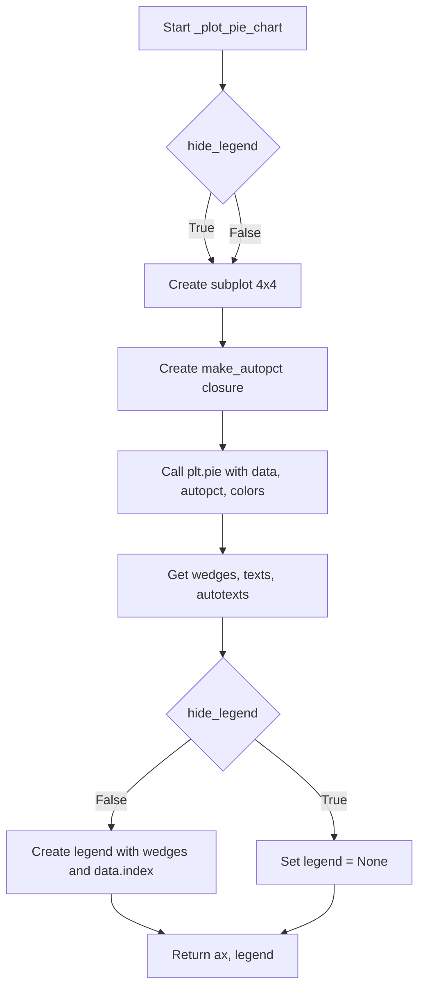

## Examples:
```python
import pandas as pd
import matplotlib.pyplot as plt

# Basic usage
data = pd.Series([30, 25, 45], index=['A', 'B', 'C'])
colors = ['#FF6B6B', '#4ECDC4', '#45B7D1']
ax, legend = _plot_pie_chart(data, colors)

# Usage with hidden legend
ax, legend = _plot_pie_chart(data, colors, hide_legend=True)

# With different data structure
category_counts = pd.Series([100, 75, 50, 25], index=['Category 1', 'Category 2', 'Category 3', 'Category 4'])
colors = ['red', 'blue', 'green', 'orange']
ax, legend = _plot_pie_chart(category_counts, colors)
```

## `src.ydata_profiling.visualisation.plot.cat_frequency_plot` · *function*

## Summary
Generates a categorical frequency plot (either bar or pie chart) for categorical data visualization in profiling reports.

## Description
Creates either a horizontal stacked bar chart or pie chart visualization representing the distribution of categorical data values. This function serves as the main entry point for generating categorical frequency plots in data profiling reports, supporting both bar and pie chart visualizations with configurable colors and display options.

The function extracts color configurations from the Settings object, ensures adequate color availability for all categories, and delegates to specialized plotting functions based on the configured plot type. It handles both single categorical series and lists of categorical data for stacked visualization.

## Args
    config (Settings): Configuration object containing plot settings including color schemes, plot type, and display preferences
    data (pd.Series): Categorical data represented as a pandas Series where index values are labels and values are frequencies/counts

## Returns
    str: A string representation of the generated plot, either as base64-encoded image data or file path depending on HTML configuration settings

## Raises
    ValueError: When an invalid plot type is specified (only 'bar' or 'pie' are supported)

## Constraints
    Preconditions:
    - config must be a valid Settings object with properly initialized plot configuration
    - data must be a pandas Series with numeric values representing category frequencies
    - config.plot.cat_freq.type must be either 'bar' or 'pie'
    
    Postconditions:
    - Returns a valid string representation of the plot image
    - The returned string follows the expected format for HTML report integration
    - Color handling ensures sufficient colors for all data categories

## Side Effects
    - Creates matplotlib figures and axes for plot generation
    - May modify global matplotlib state through plt.subplots() and plt.savefig()
    - Calls helper functions that generate actual visualizations
    - Uses plot_360_n0sc0pe utility for final image formatting and storage

## Control Flow
```mermaid
flowchart TD
    A[Start cat_frequency_plot] --> B[Extract colors from config]
    B --> C{Colors provided?}
    C -- No --> D[Use matplotlib default color cycle]
    C -- Yes --> D[Use provided colors]
    D --> E{Color count < data length?}
    E -- Yes --> F[Repeat colors as needed]
    E -- No --> G[Proceed with existing colors]
    G --> H[Get plot type from config]
    H --> I{Plot type is "bar"?}
    I -- Yes --> J[Call _plot_stacked_barh]
    I -- No --> K{Plot type is "pie"?}
    K -- Yes --> L[Call _plot_pie_chart]
    K -- No --> M[Raise ValueError]
    J --> N[Get plot and legend]
    L --> N
    M --> O[End with error]
    N --> P[Prepare bbox_extra_artists]
    P --> Q[Call plot_360_n0sc0pe]
    Q --> R[Return formatted plot string]
```

## Examples
```python
import pandas as pd
from src.ydata_profiling.config import Settings

# Basic usage with default settings
data = pd.Series([30, 25, 45], index=['Category A', 'Category B', 'Category C'])
config = Settings()
plot_string = cat_frequency_plot(config, data)

# Using pie chart configuration
config.plot.cat_freq.type = "pie"
plot_string = cat_frequency_plot(config, data)

# With custom colors
config.plot.cat_freq.colors = ["#FF6B6B", "#4ECDC4", "#45B7D1"]
plot_string = cat_frequency_plot(config, data)
```

## `src.ydata_profiling.visualisation.plot.create_comparison_color_list` · *function*

## Summary
Generates a list of color hex codes for comparison visualizations based on configuration settings, creating interpolated colors when needed.

## Description
Creates a color list suitable for visualizing comparisons between different groups or categories in profiling reports. When the configured primary colors are insufficient for the required number of labels (i.e., when the length of primary_colors is less than the length of _labels), it generates interpolated colors using matplotlib's colormap functionality. This function ensures consistent color schemes across different visualization components that require comparison-based coloring.

The function is extracted from inline logic to provide a reusable utility for generating appropriate color palettes for comparison plots, separating the color generation concern from visualization rendering code.

## Args
- config (Settings): Configuration object containing HTML styling settings including primary_colors and label definitions

## Returns
- List[str]: A list of color hex codes, where each color corresponds to a label in the comparison visualization. The list will contain at least as many colors as there are labels.

## Raises
- None explicitly raised by this function

## Constraints
- Preconditions: The config parameter must be a valid Settings object with properly initialized html.style attributes
- Postconditions: The returned list will contain at least as many colors as there are labels, with colors either taken directly from primary_colors or interpolated when needed

## Side Effects
- None

## Control Flow
```mermaid
flowchart TD
    A[Start create_comparison_color_list] --> B{len(colors) < len(labels)?}
    B -- Yes --> C[Get init color from colors[0]]
    C --> D{len(colors) >= 2?}
    D -- Yes --> E[Set end color from colors[1]]
    D -- No --> F[Set end color to "#000000"]
    E --> G[Create LinearSegmentedColormap]
    G --> H[Generate interpolated colors]
    H --> I[Return interpolated colors]
    B -- No --> J[Return original colors]
    J --> K[End]
    I --> K
```

## Examples
```python
from src.ydata_profiling.config import Settings

# Example with insufficient colors - will interpolate
config = Settings()
config.html.style.primary_colors = ["#FF0000", "#00FF00"]  # 2 colors
config.html.style._labels = ["A", "B", "C", "D"]           # 4 labels

# Since 2 < 4, it interpolates to 4 colors
color_list = create_comparison_color_list(config)
# Result: ['#ff0000', '#55aa00', '#0055aa', '#000000']

# Example with sufficient colors - returns original colors
config2 = Settings()
config2.html.style.primary_colors = ["#FF0000", "#00FF00", "#0000FF"]  # 3 colors
config2.html.style._labels = ["A", "B", "C"]                           # 3 labels

# Since 3 >= 3, it returns original colors
color_list2 = create_comparison_color_list(config2)
# Result: ['#ff0000', '#00ff00', '#0000ff']
```

## `src.ydata_profiling.visualisation.plot._format_ts_date_axis` · *function*

## Summary:
Formats the x-axis of a matplotlib plot for time series data by applying appropriate date locators and formatters when the series index is a DatetimeIndex.

## Description:
This utility function applies date-specific formatting to matplotlib axes when working with time series data. It detects if the input Series has a DatetimeIndex and, if so, configures the x-axis with an AutoDateLocator and ConciseDateFormatter to display dates in an appropriate, readable format. This function is designed to be used internally by time series visualization functions to ensure proper date axis formatting.

## Args:
    series (pd.Series): A pandas Series whose index may be a DatetimeIndex. The function checks the type of the index to determine if date formatting is needed.
    axis (matplotlib.axis.Axis): The matplotlib axis object to be formatted. This axis's x-axis will be modified if the series has a DatetimeIndex.

## Returns:
    matplotlib.axis.Axis: The same axis object that was passed in, but potentially modified with date formatting applied.

## Raises:
    None explicitly raised by this function.

## Constraints:
    Preconditions:
    - The series parameter must be a valid pandas Series object
    - The axis parameter must be a valid matplotlib axis object
    
    Postconditions:
    - If series.index is a DatetimeIndex, the axis x-axis will have date formatting applied
    - If series.index is not a DatetimeIndex, the axis remains unchanged
    - The returned axis is the same object reference as the input axis

## Side Effects:
    None

## Control Flow:
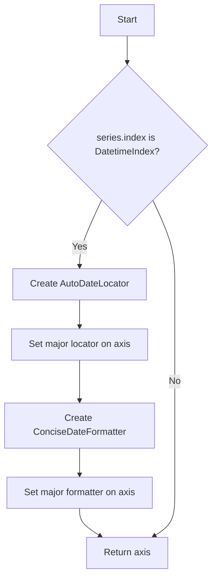

## Examples:
```python
import pandas as pd
import matplotlib.pyplot as plt
from src.ydata_profiling.visualisation.plot import _format_ts_date_axis

# Create sample time series data
dates = pd.date_range('2023-01-01', periods=100, freq='D')
series = pd.Series(range(100), index=dates)

# Create plot and axis
fig, ax = plt.subplots()
ax.plot(series.index, series.values)

# Format the date axis
_formatted_axis = _format_ts_date_axis(series, ax)
```

## `src.ydata_profiling.visualisation.plot.plot_timeseries_gap_analysis` · *function*

## Summary
Creates a time series visualization highlighting data gaps with filled regions to indicate missing values or intervals.

## Description
Plots time series data with optional gap highlighting, where missing intervals are visually represented as colored shaded regions. The function supports both single series and multiple series plotting, with appropriate color coding and axis formatting for time series data. This function is designed to visualize temporal data patterns while clearly indicating data gaps that may affect analysis.

The function is extracted from inline logic to separate the visualization rendering concerns from the color generation and axis formatting logic, making it reusable for various time series gap analysis scenarios in the profiling report generation pipeline.

## Args
- config (Settings): Configuration object containing HTML styling settings and plot preferences
- series (Union[pd.Series, List[pd.Series]]): Single pandas Series or list of pandas Series to plot
- gaps (Union[pd.Series, List[pd.Series]]): Single pandas Series or list of pandas Series representing gap intervals to highlight. Each gap should be a time interval (start and end timestamps) to be filled with a colored region
- figsize (tuple): Figure size as (width, height) in inches. Defaults to (6, 3)

## Returns
- str: The result of the plot_360_n0sc0pe function, which is typically a file path or base64-encoded image string depending on configuration settings

## Raises
- None explicitly raised by this function

## Constraints
- Preconditions:
  - The config parameter must be a valid Settings object with properly initialized html.style attributes
  - The series parameter must be a valid pandas Series or list of pandas Series
  - The gaps parameter must be a valid pandas Series or list of pandas Series matching the structure of series
  - If series is a list, gaps must also be a list of equal length
- Postconditions:
  - A matplotlib figure is created with appropriate time series formatting
  - Gap regions are filled with semi-transparent colored regions
  - The returned value represents the processed plot according to configuration settings

## Side Effects
- Creates and modifies matplotlib figure and axes objects
- May close matplotlib figures depending on configuration settings
- Uses matplotlib's plotting backend for rendering

## Control Flow
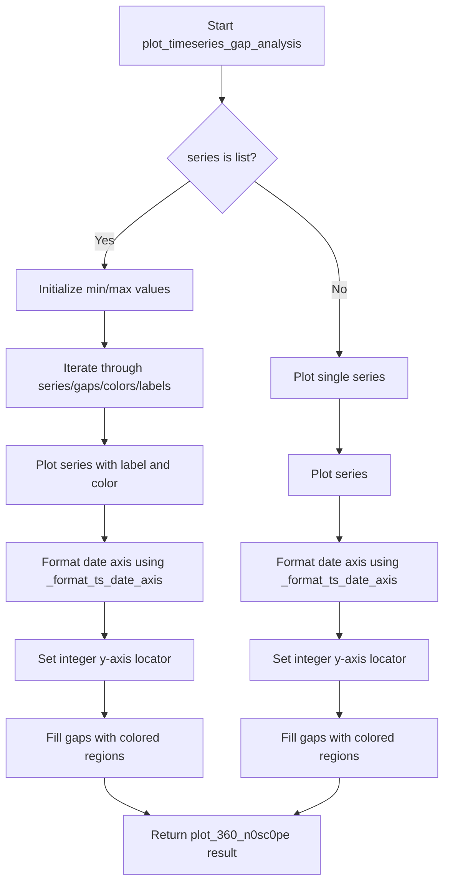

## Examples
```python
import pandas as pd
from ydata_profiling.config import Settings

# Example with single series
config = Settings()
series = pd.Series([1, 2, 3, 4, 5], index=pd.date_range('2023-01-01', periods=5))
gaps = [pd.Timestamp('2023-01-03'), pd.Timestamp('2023-01-04')]

# Create the plot
result = plot_timeseries_gap_analysis(config, series, gaps)

# Example with multiple series
config = Settings()
series_list = [
    pd.Series([1, 2, 3, 4, 5], index=pd.date_range('2023-01-01', periods=5)),
    pd.Series([2, 3, 4, 5, 6], index=pd.date_range('2023-01-01', periods=5))
]
gaps_list = [
    [pd.Timestamp('2023-01-03'), pd.Timestamp('2023-01-04')],
    [pd.Timestamp('2023-01-02'), pd.Timestamp('2023-01-05')]
]

# Create the plot
result = plot_timeseries_gap_analysis(config, series_list, gaps_list)
```

## `src.ydata_profiling.visualisation.plot.plot_overview_timeseries` · *function*

## Summary
Creates a time series overview plot for multiple time series variables with optional scaling and comparison visualization capabilities, returning a string representation of the plot.

## Description
Generates a matplotlib figure displaying one or more time series variables from profiling data. The function handles two distinct data structures for variables: when variables contain lists of types (indicating multiple series per variable) and when variables contain single type entries. It applies appropriate styling including color schemes, line styles, and optional normalization for visualization clarity.

This function is extracted to separate the concerns of time series plotting logic from the broader visualization pipeline, allowing for consistent time series representation across different profiling contexts while maintaining flexibility for various data structures and display options.

## Args
- config (Settings): Configuration object containing HTML and plotting settings including style configurations and image format preferences
- variables (Any): Dictionary-like structure containing time series data with keys representing column names and values containing metadata including 'type' and 'series' fields
- figsize (tuple, optional): Figure size as (width, height) in inches. Defaults to (6, 4)
- scale (bool, optional): Whether to normalize time series data to [0,1] range. Defaults to False

## Returns
- str: String representation of the plotted time series visualization, either as base64-encoded image data or file path depending on configuration settings

## Raises
- None explicitly raised by this function

## Constraints
- Preconditions: The variables parameter must contain valid time series data with proper 'type' and 'series' fields; config must be a valid Settings object
- Postconditions: Returns a string containing the plot representation with properly formatted time series plots, legends, and adjusted subplot layout

## Side Effects
- Creates and modifies matplotlib figures and axes
- May modify global matplotlib state through plt.subplots_adjust and plt.legend calls
- Calls plot_360_n0sc0pe which may save files or return encoded strings depending on config settings

## Control Flow
```mermaid
flowchart TD
    A[Start plot_overview_timeseries] --> B[Initialize figure and axis]
    B --> C[Get first column key from variables]
    C --> D{variables[col]["type"] is list?}
    D -- Yes --> E[Create color list and line styles]
    E --> F[Iterate over variables items]
    F --> G{All types are "TimeSeries"?}
    G -- Yes --> H[Iterate over series in data]
    H --> I{scale enabled?}
    I -- Yes --> J[Normalize series to [0,1]]
    J --> K[Plot series with color and linestyle]
    I -- No --> K
    K --> L[Continue to next series]
    G -- No --> M[Skip to next variable]
    D -- No --> N[Iterate over variables items]
    N --> O{data["type"] == "TimeSeries"?}
    O -- Yes --> P{scale enabled?}
    P -- Yes --> Q[Normalize series to [0,1]]
    Q --> R[Plot series with label]
    P -- No --> R
    O -- No --> S[Skip to next variable]
    R --> T[Continue to next variable]
    S --> T
    T --> U[Add legend and adjust subplot]
    U --> V[Return plot_360_n0sc0pe result]
```

## Examples
```python
# Basic usage with single time series
config = Settings()
variables = {
    "date_column": {
        "type": "TimeSeries",
        "series": pd.Series([1, 2, 3, 4], index=pd.date_range("2020-01-01", periods=4))
    }
}
plot_result = plot_overview_timeseries(config, variables)

# Usage with multiple time series and scaling
config = Settings()
variables = {
    "date_column": {
        "type": "TimeSeries",
        "series": pd.Series([10, 20, 30, 40], index=pd.date_range("2020-01-01", periods=4))
    },
    "value_column": {
        "type": "TimeSeries", 
        "series": pd.Series([100, 200, 300, 400], index=pd.date_range("2020-01-01", periods=4))
    }
}
plot_result = plot_overview_timeseries(config, variables, scale=True)
```

## `src.ydata_profiling.visualisation.plot._plot_timeseries` · *function*

## Summary
Creates a matplotlib figure with a time series plot for either a single pandas Series or a list of pandas Series with appropriate date formatting.

## Description
This function generates a time series visualization for profiling data. It handles two distinct cases: plotting a single pandas Series or multiple Series from a list. For single Series, it uses the primary color from the configuration. For lists of Series, it applies different colors and labels for each series using comparison color generation. The function automatically formats the x-axis for datetime data using internal date formatting utilities.

The function is extracted from inline logic to provide a reusable component for time series visualization in profiling reports, separating the plotting concerns from the data processing logic.

## Args
- config (Settings): Configuration object containing HTML styling settings including primary colors and label definitions for comparison plots
- series (Union[list, pd.Series]): Either a single pandas Series or a list of pandas Series to be plotted
- figsize (tuple, optional): Figure size as (width, height) in inches. Defaults to (6, 4)

## Returns
- matplotlib.figure.Figure: A matplotlib figure object containing the time series plot

## Raises
- None explicitly raised by this function

## Constraints
- Preconditions:
  - The config parameter must be a valid Settings object with properly initialized html.style attributes
  - The series parameter must be either a pandas Series or a list of pandas Series
  - If series is a list, all elements must be pandas Series objects
- Postconditions:
  - A matplotlib figure is created with appropriate time series formatting
  - The x-axis is formatted appropriately for datetime data when applicable
  - The returned figure contains a subplot with the time series data

## Side Effects
- Creates a matplotlib figure and subplot
- Modifies the x-axis formatting of the plot when dealing with datetime data
- Uses matplotlib's pyplot interface for figure creation

## Control Flow
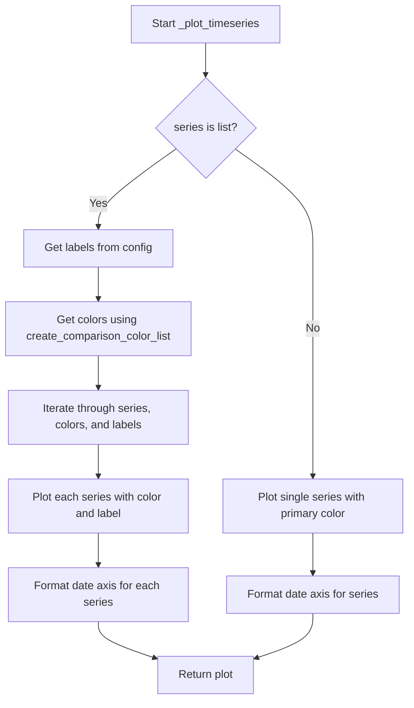

## Examples
```python
import pandas as pd
from src.ydata_profiling.config import Settings
from src.ydata_profiling.visualisation.plot import _plot_timeseries

# Example 1: Single Series
dates = pd.date_range('2023-01-01', periods=100, freq='D')
series = pd.Series(range(100), index=dates)
config = Settings()

fig = _plot_timeseries(config, series)
# Returns a matplotlib figure with single time series plot

# Example 2: Multiple Series
series_list = [
    pd.Series(range(50), index=pd.date_range('2023-01-01', periods=50, freq='D')),
    pd.Series(range(50, 100), index=pd.date_range('2023-01-01', periods=50, freq='D'))
]
config = Settings()
config.html.style._labels = ["Series 1", "Series 2"]

fig = _plot_timeseries(config, series_list)
# Returns a matplotlib figure with multiple time series plots
```

## `src.ydata_profiling.visualisation.plot.mini_ts_plot` · *function*

## Summary
Creates a compact time series plot with customized formatting for profiling reports.

## Description
Generates a miniature time series visualization with specific formatting adjustments for optimal display in profiling reports. This function serves as a specialized wrapper around the general time series plotting functionality, applying compact sizing and tailored visual formatting to ensure efficient space usage while maintaining readability.

The function extracts the plotting logic from inline code to provide a reusable component for creating small, well-formatted time series plots in profiling dashboards. It specifically handles compact figure sizing, tick rotation, and font sizing adjustments for better presentation in constrained spaces.

## Args
- config (Settings): Configuration object containing HTML styling settings and plot preferences
- series (Union[list, pandas.Series]): Either a single pandas Series or a list of pandas Series to be plotted
- figsize (Tuple[float, float], optional): Figure size as (width, height) in inches. Defaults to (3, 2.25)

## Returns
- str: A string representation of the plot, either as base64-encoded image data (when inline HTML is enabled) or as a file path reference (when assets are saved externally). The string contains the encoded image data or file path that can be embedded directly in HTML.

## Raises
- ValueError: When the image format specified in config.plot.image_format is not supported ("png" or "svg")

## Constraints
- Preconditions:
  - The config parameter must be a valid Settings object with properly initialized attributes
  - The series parameter must be either a pandas Series or a list of pandas Series
  - If series is a list, all elements must be pandas Series objects
- Postconditions:
  - A matplotlib figure is created with appropriate time series formatting
  - The figure has compact dimensions as specified by figsize
  - Tick labels are rotated and sized appropriately for the compact view
  - The figure layout is optimized with tight spacing

## Side Effects
- Creates and manipulates matplotlib figures and axes
- Modifies matplotlib rcParams for tick label sizing
- May save plot files to disk or encode images as base64 strings depending on configuration
- Closes matplotlib figures after processing to prevent memory leaks

## Control Flow
```mermaid
flowchart TD
    A[Start mini_ts_plot] --> B[Call _plot_timeseries with config and series]
    B --> C[Set x-axis tick rotation to 45 degrees]
    C --> D[Set y-tick label size to 3]
    D --> E[Iterate through x-axis major ticks]
    E --> F{Is series index DatetimeIndex?}
    F -- Yes --> G[Set tick label fontsize to 6]
    F -- No --> H[Set tick label fontsize to 8]
    G --> I[Apply tight layout to figure]
    H --> I
    I --> J[Call plot_360_n0sc0pe with config]
    J --> K[Return plot string representation]
```

## Examples
```python
import pandas as pd
from src.ydata_profiling.config import Settings
from src.ydata_profiling.visualisation.plot import mini_ts_plot

# Example 1: Single Series
dates = pd.date_range('2023-01-01', periods=100, freq='D')
series = pd.Series(range(100), index=dates)
config = Settings()

plot_string = mini_ts_plot(config, series)
# Returns a string representation of the compact time series plot
# This can be embedded directly in HTML for display

# Example 2: Multiple Series
series_list = [
    pd.Series(range(50), index=pd.date_range('2023-01-01', periods=50, freq='D')),
    pd.Series(range(50, 100), index=pd.date_range('2023-01-01', periods=50, freq='D'))
]
config = Settings()
config.html.style._labels = ["Series 1", "Series 2"]

plot_string = mini_ts_plot(config, series_list)
# Returns a string representation of the compact multi-series time series plot
```

## `src.ydata_profiling.visualisation.plot._get_ts_lag` · *function*

## Summary:
Calculates the appropriate maximum lag size for time series autocorrelation analysis based on configuration and data length.

## Description:
This function determines the optimal lag size for partial autocorrelation (PACF) and autocorrelation (ACF) plots in time series analysis. It considers both user-configured maximum lag limits and data-driven constraints to ensure meaningful analysis while avoiding computational inefficiencies or invalid operations.

The function is primarily used internally by time series visualization components to determine appropriate lag parameters for plotting autocorrelation functions. It ensures that the lag size doesn't exceed half the series length minus one, preventing mathematical issues with small datasets.

## Args:
    config (Settings): Configuration object containing time series analysis settings, specifically `config.vars.timeseries.pacf_acf_lag`
    series (pd.Series): Time series data for which to calculate the appropriate lag size

## Returns:
    int: The calculated maximum lag size, which is the minimum of:
        - User-specified maximum lag from configuration (`config.vars.timeseries.pacf_acf_lag`)
        - Half the series length minus one (`(len(series) // 2) - 1`)

## Raises:
    None explicitly raised by this function

## Constraints:
    Preconditions:
        - `config` must be a valid Settings object with proper configuration hierarchy
        - `series` must be a valid pandas Series object
        - `config.vars.timeseries.pacf_acf_lag` must be a positive integer
        - `len(series)` must be a positive integer

    Postconditions:
        - Returned value is always a non-negative integer
        - Returned value is never greater than `(len(series) // 2) - 1`
        - Returned value is never greater than `config.vars.timeseries.pacf_acf_lag`
        - Returned value is at least 0 (when series length is less than 3)

## Side Effects:
    None

## Control Flow:
```mermaid
flowchart TD
    A[Start _get_ts_lag] --> B[Get config lag setting]
    B --> C[Calculate max lag size]
    C --> D[Compare lag values]
    D --> E{lag > max_lag_size?}
    E -->|Yes| F[Return max_lag_size]
    E -->|No| G[Return lag]
    F --> H[End]
    G --> H
```

## Examples:
```python
# Example 1: Normal case with sufficient data
config = Settings()
config.vars.timeseries.pacf_acf_lag = 50
series = pd.Series(range(100))  # 100 data points
result = _get_ts_lag(config, series)  # Returns 50 (config limit)

# Example 2: Limited data case
config = Settings()
config.vars.timeseries.pacf_acf_lag = 100
series = pd.Series(range(20))  # 20 data points
result = _get_ts_lag(config, series)  # Returns 9 (half of 20 minus 1)

# Example 3: Small dataset
config = Settings()
config.vars.timeseries.pacf_acf_lag = 10
series = pd.Series(range(5))  # 5 data points
result = _get_ts_lag(config, series)  # Returns 1 (half of 5 minus 1)

# Example 4: Edge case with minimal data
config = Settings()
config.vars.timeseries.pacf_acf_lag = 100
series = pd.Series(range(2))  # 2 data points
result = _get_ts_lag(config, series)  # Returns 0 (half of 2 minus 1 = 0)
```

## `src.ydata_profiling.visualisation.plot._plot_acf_pacf` · *function*

## Summary:
Generates and returns a combined autocorrelation (ACF) and partial autocorrelation (PACF) plot for time series data.

## Description:
Creates a side-by-side visualization displaying both the Autocorrelation Function (ACF) and Partial Autocorrelation Function (PACF) plots for time series analysis. This function is used internally by the profiling system to visualize temporal dependencies in time series data. The ACF plot shows correlation between observations at different lags, while the PACF plot shows the partial correlation between observations at different lags, controlling for intermediate lags.

This function extracts the plotting logic into a separate component to maintain clean separation of concerns, allowing the visualization pipeline to reuse this common time series analysis plotting pattern without duplicating code.

## Args:
    config (Settings): Configuration object containing HTML styling and plotting settings, including primary colors and image format preferences
    series (pd.Series): Time series data to analyze and plot
    figsize (tuple, optional): Figure size as (width, height) in inches. Defaults to (15, 5)

## Returns:
    str: The path or encoded representation of the generated plot image, depending on configuration settings (inline vs assets)

## Raises:
    None explicitly raised by this function

## Constraints:
    Preconditions:
        - config must be a valid Settings object with proper configuration hierarchy
        - series must be a valid pandas Series object
        - config.html.style.primary_colors must contain at least one color value
        - config.vars.timeseries.pacf_acf_lag must be a positive integer

    Postconditions:
        - Returns a string representing either an inline base64-encoded image or a file path
        - Both ACF and PACF plots are displayed side-by-side in a single figure
        - The plots use the configured primary color for visual consistency

## Side Effects:
    - Creates matplotlib figures and axes
    - May save files to disk if config.html.inline is False
    - Closes matplotlib figures after processing
    - Modifies plot collections to apply the configured color scheme

## Control Flow:
```mermaid
flowchart TD
    A[Start _plot_acf_pacf] --> B[Get primary color from config]
    B --> C[Calculate optimal lag size]
    C --> D[Create subplot grid (1x2)]
    D --> E[Plot ACF on left axis]
    E --> F[Plot PACF on right axis]
    F --> G[Apply color to plot collections]
    G --> H[Return plot result]
```

## Examples:
```python
# Basic usage with default settings
config = Settings()
series = pd.Series([1, 2, 3, 4, 5, 6, 7, 8, 9, 10])
result = _plot_acf_pacf(config, series)

# Usage with custom figure size
config = Settings()
series = pd.Series([1, 2, 3, 4, 5, 6, 7, 8, 9, 10])
result = _plot_acf_pacf(config, series, figsize=(20, 8))
```

## `src.ydata_profiling.visualisation.plot._plot_acf_pacf_comparison` · *function*

## Summary
Creates a comparative visualization of Autocorrelation Function (ACF) and Partial Autocorrelation Function (PACF) plots for time series data.

## Description
Generates side-by-side ACF and PACF plots for multiple time series, allowing for comparison of autocorrelation patterns across different series. This function is used in time series analysis to identify potential ARIMA model orders by examining the decay patterns in autocorrelations.

The function creates a grid of subplots (one row per time series) with two columns (ACF on left, PACF on right) and populates them with statistical plots showing correlation structures at various lags. It handles color assignment for multiple series and applies consistent styling to the visualization elements.

This logic is extracted into its own function to separate the concerns of creating the ACF/PACF comparison visualization from the underlying statistical computation and rendering logic, making the code more modular and testable.

## Args
- config (Settings): Configuration object containing HTML styling settings and plot preferences
- series (List[pd.Series]): List of time series data to analyze and plot
- figsize (tuple, optional): Figure size as (width, height) in inches. Defaults to (15, 5)

## Returns
- str: The rendered visualization as a string, typically in SVG or PNG format depending on configuration settings

## Raises
- None explicitly raised by this function

## Constraints
- Preconditions:
  - `config` must be a valid Settings object with properly initialized HTML styling attributes
  - `series` must be a list of valid pandas Series objects
  - Each series in `series` should contain numeric time series data
  - `figsize` must be a tuple of two positive numbers

- Postconditions:
  - Returns a string representation of the visualization
  - All matplotlib figures are properly closed to prevent memory leaks
  - Color assignments are consistent across all plotted elements

## Side Effects
- Creates matplotlib subplots and renders visualizations
- Calls matplotlib's `savefig` and `close` functions
- May write files to disk if `config.html.inline` is False and `config.html.assets_path` is set
- Modifies matplotlib figure properties such as face colors of polygon collections

## Control Flow
```mermaid
flowchart TD
    A[Start _plot_acf_pacf_comparison] --> B[Get color list from config]
    B --> C[Create subplot grid with nrows=n_labels, ncols=2]
    C --> D{For each series, axis pair, color}
    D --> E[Get lag size for series]
    E --> F[Plot ACF on left axis]
    F --> G[Plot PACF on right axis]
    G --> H[Set face colors for polygon collections]
    H --> I[Return plot_360_n0sc0pe result]
```

## Examples
```python
from src.ydata_profiling.config import Settings
import pandas as pd

# Create sample time series data
series1 = pd.Series([1, 2, 3, 4, 5, 6, 7, 8, 9, 10])
series2 = pd.Series([2, 4, 6, 8, 10, 12, 14, 16, 18, 20])

# Configure settings
config = Settings()
config.html.style.primary_colors = ["#FF0000", "#0000FF"]
config.html.style._labels = ["Series1", "Series2"]

# Generate ACF/PACF comparison plot
result = _plot_acf_pacf_comparison(config, [series1, series2])

# The result contains the rendered visualization as a string
print(type(result))  # <class 'str'>
```

## `src.ydata_profiling.visualisation.plot.plot_acf_pacf` · *function*

## Summary:
Dispatches to appropriate ACF/PACF plotting functions based on input data type.

## Description:
Routes input data to either single-series or multi-series ACF/PACF plotting functions. When the input series is a list, it calls `_plot_acf_pacf_comparison` to generate comparative plots for multiple time series. When the input is a single pandas Series, it calls `_plot_acf_pacf` to generate side-by-side ACF and PACF plots for that series. This dispatcher pattern allows the visualization system to handle both individual time series analysis and comparative analysis seamlessly.

This function is extracted to provide a unified interface for ACF/PACF visualization regardless of whether analyzing one or multiple time series, maintaining clean separation between the routing logic and the actual plotting implementations.

## Args:
    config (Settings): Configuration object containing HTML styling and plotting settings
    series (Union[list, pd.Series]): Either a single pandas Series or a list of pandas Series for time series analysis
    figsize (tuple, optional): Figure size as (width, height) in inches. Defaults to (15, 5)

## Returns:
    str: Path or encoded representation of the generated plot image, depending on configuration settings

## Raises:
    None explicitly raised by this function

## Constraints:
    Preconditions:
        - config must be a valid Settings object with proper configuration hierarchy
        - series must be either a pandas Series or a list of pandas Series
        - When series is a list, all elements must be valid pandas Series objects

    Postconditions:
        - Returns a string representing either an inline base64-encoded image or a file path
        - The appropriate plotting function is called based on input type

## Side Effects:
    - Delegates to either `_plot_acf_pacf` or `_plot_acf_pacf_comparison` which may create matplotlib figures and save files
    - May close matplotlib figures after processing
    - May write files to disk if config.html.inline is False

## Control Flow:
```mermaid
flowchart TD
    A[Start plot_acf_pacf] --> B{Is series a list?}
    B -->|Yes| C[_plot_acf_pacf_comparison]
    B -->|No| D[_plot_acf_pacf]
    C --> E[Return result]
    D --> E
```

## Examples:
```python
# Single series analysis
import pandas as pd
from src.ydata_profiling.config import Settings

config = Settings()
series = pd.Series([1, 2, 3, 4, 5, 6, 7, 8, 9, 10])
result = plot_acf_pacf(config, series)

# Multiple series comparison
series_list = [
    pd.Series([1, 2, 3, 4, 5, 6, 7, 8, 9, 10]),
    pd.Series([2, 4, 6, 8, 10, 12, 14, 16, 18, 20])
]
result = plot_acf_pacf(config, series_list)
```

## `src.ydata_profiling.visualisation.plot._prepare_heatmap_data` · *function*

## Summary:
Transforms a DataFrame into a pivoted format suitable for heatmap visualization by grouping entities into time-based bins.

## Description:
This function processes a DataFrame to prepare data for heatmap visualization. It groups data by an entity column and bins another column (typically time-based) into discrete intervals, then pivots the data to create a matrix suitable for heatmap plotting. The function supports sorting by a specified column and allows filtering of entities.

## Args:
    dataframe (pd.DataFrame): Input DataFrame containing the data to process
    entity_column (str): Name of the column to group by for entities in the heatmap
    sortby (Optional[Union[str, list]], optional): Column(s) to sort by. If None, sorts by index. Defaults to None.
    max_entities (int, optional): Maximum number of entities to include in the result when selected_entities is None. Defaults to 5.
    selected_entities (Optional[List[str]], optional): Specific entities to include in the result. If provided, overrides max_entities. Defaults to None.

## Returns:
    pd.DataFrame: Pivoted DataFrame ready for heatmap visualization with entities as rows and time bins as columns

## Raises:
    ValueError: When a column specified in sortby has object dtype that cannot be converted to datetime

## Constraints:
    Preconditions:
    - dataframe must be a valid pandas DataFrame
    - entity_column must exist in dataframe
    - sortby column(s) must exist in dataframe if specified
    - If sortby is provided as a string, it must be a valid column name
    
    Postconditions:
    - Returned DataFrame has entities as row indices and time bins as column names
    - All values in returned DataFrame represent counts of entities per time bin
    - If selected_entities is provided, only those entities are included in result
    - If selected_entities is None, at most max_entities are included in result

## Side Effects:
    None

## Control Flow:
```mermaid
flowchart TD
    A[Start] --> B{sortby is None?}
    B -- Yes --> C[Create sortbykey="_index"]
    B -- No --> D[Convert sortby to list if string]
    C --> E[Copy entity_column and reset index]
    D --> F[Copy specified columns]
    E --> G[Set df columns]
    F --> G
    G --> H{sortbykey dtype == "O"?}
    H -- Yes --> I[Attempt to convert to datetime]
    I --> J{Conversion successful?}
    J -- No --> K[Raise ValueError]
    J -- Yes --> L[Continue]
    H -- No --> L
    L --> M[Calculate nbins = min(50, unique_values)]
    M --> N[Create bins using pd.cut]
    N --> O[Group by entity_column and bins]
    O --> P[Count occurrences]
    P --> Q[Reset index and pivot table]
    Q --> R{selected_entities provided?}
    R -- Yes --> S[Filter to selected entities]
    R -- No --> T[Take first max_entities]
    S --> U[Return result]
    T --> U
```

## Examples:
```python
# Basic usage with default parameters
result = _prepare_heatmap_data(df, "category")

# With custom sorting and limited entities
result = _prepare_heatmap_data(df, "category", sortby="date", max_entities=10)

# With specific entity selection
result = _prepare_heatmap_data(df, "category", sortby="timestamp", selected_entities=["A", "B", "C"])
```

## `src.ydata_profiling.visualisation.plot._create_timeseries_heatmap` · *function*

## Summary
Creates a time series heatmap visualization from a DataFrame with customizable color scheme and figure size.

## Description
Generates a heatmap representation of time series data where rows correspond to different time series and columns represent time points. The function creates a matplotlib subplot with a custom colormap that maps data values to colors, with white representing low values and the specified color representing high values.

This function is extracted to provide a reusable visualization component for time series data in profiling reports, separating the visualization logic from the data processing logic to improve modularity and testability.

## Args
- df (pd.DataFrame): Input DataFrame containing time series data where rows represent different time series and columns represent time points
- figsize (Tuple[int, int], optional): Figure size as (width, height) in inches. Defaults to (12, 5)
- color (str, optional): Hex color code for the high-value end of the colormap. Defaults to "#337ab7"

## Returns
- plt.Axes: The matplotlib axes object containing the heatmap visualization

## Raises
- None explicitly raised

## Constraints
- Preconditions: 
  - df must be a valid pandas DataFrame
  - df should contain numeric data suitable for heatmap visualization
- Postconditions:
  - Returns a matplotlib Axes object with properly configured heatmap
  - The y-axis is inverted to show time series in descending order
  - Y-axis tick labels are set to match DataFrame index values

## Side Effects
- Creates a new matplotlib figure and axes
- Modifies the matplotlib state by setting figure properties and axis configurations

## Control Flow
```mermaid
flowchart TD
    A[Start _create_timeseries_heatmap] --> B[Create matplotlib figure and axes]
    B --> C[Generate LinearSegmentedColormap]
    C --> D[Create pcolormesh with DataFrame data]
    D --> E[Set color limits to max value in DataFrame]
    E --> F[Configure y-axis ticks and labels]
    F --> G[Hide x-axis ticks]
    G --> H[Set x-axis label to "Time"]
    H --> I[Invert y-axis]
    I --> J[Return axes object]
```

## Examples
```python
import pandas as pd
import matplotlib.pyplot as plt
import numpy as np

# Create sample time series data
dates = pd.date_range('2023-01-01', periods=10, freq='D')
series = ['A', 'B', 'C']
df = pd.DataFrame(np.random.rand(3, 10), index=series, columns=dates)

# Create heatmap
ax = _create_timeseries_heatmap(df, figsize=(10, 4), color="#e74c3c")
plt.show()
```

## `src.ydata_profiling.visualisation.plot.timeseries_heatmap` · *function*

## Summary
Creates a time series heatmap visualization showing temporal patterns across multiple entities.

## Description
Generates a heatmap representation of time series data where entities are displayed as rows and time bins as columns. This function processes time series data by preparing it for visualization and then creating the actual heatmap plot using matplotlib.

The function internally calls `_prepare_heatmap_data` to transform the input DataFrame into a pivoted format suitable for heatmap visualization, and `_create_timeseries_heatmap` to render the actual visualization.

## Args
- dataframe (pd.DataFrame): Input DataFrame containing the time series data to visualize
- entity_column (str): Name of the column to group by for entities in the heatmap
- sortby (Optional[Union[str, list]], optional): Column(s) to sort entities by. If None, sorts by index. Defaults to None
- max_entities (int, optional): Maximum number of entities to include in the result when selected_entities is None. Defaults to 5
- selected_entities (Optional[List[str]], optional): Specific entities to include in the result. If provided, overrides max_entities. Defaults to None
- figsize (Tuple[int, int], optional): Figure size as (width, height) in inches. Defaults to (12, 5)
- color (str, optional): Hex color code for the high-value end of the colormap. Defaults to "#337ab7"

## Returns
- plt.Axes: The matplotlib axes object containing the completed heatmap visualization

## Raises
- ValueError: When a column specified in sortby has object dtype that cannot be converted to datetime (raised by _prepare_heatmap_data)

## Constraints
- Preconditions:
  - dataframe must be a valid pandas DataFrame
  - entity_column must exist in dataframe
  - sortby column(s) must exist in dataframe if specified
  - If sortby is provided as a string, it must be a valid column name
  - color must be a valid hex color code
- Postconditions:
  - Returns a matplotlib Axes object with properly configured heatmap
  - The returned axes has aspect ratio set to 1 for proper visualization scaling

## Side Effects
- Creates a new matplotlib figure and axes
- Modifies matplotlib state by setting figure properties and axis configurations
- May modify global matplotlib settings through the context management

## Control Flow
```mermaid
flowchart TD
    A[Start timeseries_heatmap] --> B[Call _prepare_heatmap_data]
    B --> C[Process and pivot DataFrame for heatmap]
    C --> D[Call _create_timeseries_heatmap]
    D --> E[Create matplotlib visualization]
    E --> F[Set aspect ratio to 1]
    F --> G[Return axes object]
```

## Examples
```python
import pandas as pd
import matplotlib.pyplot as plt

# Basic usage with default parameters
df = pd.DataFrame({
    'entity': ['A', 'A', 'B', 'B', 'C', 'C'],
    'timestamp': pd.date_range('2023-01-01', periods=6, freq='D'),
    'value': [1, 2, 3, 4, 5, 6]
})

# Create basic heatmap
ax = timeseries_heatmap(df, 'entity', sortby='timestamp')

# Create heatmap with custom parameters
ax = timeseries_heatmap(
    df, 
    'entity', 
    sortby='timestamp', 
    max_entities=3, 
    figsize=(15, 6), 
    color="#e74c3c"
)
plt.show()
```

## `src.ydata_profiling.visualisation.plot._set_visibility` · *function*

## Summary:
Hides all axis spines and configures tick mark visibility for clean chart presentation.

## Description:
Configures a matplotlib axis by hiding all four spines (top, right, bottom, left) and setting the tick mark position to minimize visual clutter. This utility function is commonly used to create minimalist chart designs where the focus should be on data visualization rather than chart borders.

## Args:
    axis (matplotlib.axis.Axis): The matplotlib axis object to configure
    tick_mark (str, optional): Position for tick marks. Defaults to "none".
        Valid values are typically "none", "top", "bottom", "left", "right"

## Returns:
    matplotlib.axis.Axis: The same axis object with updated visibility settings

## Raises:
    None explicitly raised

## Constraints:
    Preconditions:
        - The axis parameter must be a valid matplotlib axis object
        - The tick_mark parameter must be a string with valid tick position values
    
    Postconditions:
        - All four spines of the axis are set to invisible
        - X and Y axis tick positions are configured according to tick_mark parameter

## Side Effects:
    - Modifies the matplotlib axis object in-place
    - No external I/O operations or state mutations

## Control Flow:
```mermaid
flowchart TD
    A[Start _set_visibility] --> B[Iterate over spines: top, right, bottom, left]
    B --> C[Set each spine visible=False]
    C --> D[Set x-axis ticks position to tick_mark]
    D --> E[Set y-axis ticks position to tick_mark]
    E --> F[Return axis]
```

## Examples:
```python
import matplotlib.pyplot as plt
import matplotlib.axis

# Create a simple plot
fig, ax = plt.subplots()
ax.plot([1, 2, 3], [1, 4, 9])

# Apply minimal styling
ax = _set_visibility(ax, tick_mark="none")

# The resulting plot will have no border spines and no tick marks
```

## `src.ydata_profiling.visualisation.plot.missing_bar` · *function*

## Summary:
Creates a bar chart visualization showing the percentage of non-null values for each column in a dataset, with dual axes displaying both percentage and count values.

## Description:
Generates a matplotlib bar chart that displays the proportion of non-null values for each column in a dataset. The chart features dual axes to simultaneously show both percentage values (on the primary axis) and raw count values (on the secondary axis). When the number of columns is 50 or fewer, it creates a vertical bar chart; for more columns, it generates a horizontal bar chart for better readability.

## Args:
    notnull_counts (pd.Series): A pandas Series containing the count of non-null values for each column in the dataset
    nrows (int): Total number of rows in the dataset, used to calculate percentages
    figsize (Tuple[float, float], optional): Figure size as (width, height) in inches. Defaults to (25, 10)
    fontsize (float, optional): Font size for axis labels and tick labels. Defaults to 16
    labels (bool, optional): Whether to display y-axis labels. Defaults to True
    color (Tuple[float, ...], optional): RGB color tuple for the bars. Defaults to (0.41, 0.41, 0.41)
    label_rotation (int, optional): Rotation angle for x-axis labels. Defaults to 45

## Returns:
    matplotlib.axis.Axis: The primary matplotlib axis object containing the bar chart (either the primary or secondary axis depending on orientation)

## Raises:
    None explicitly raised

## Constraints:
    Preconditions:
        - notnull_counts must be a pandas Series with numeric values
        - nrows must be a positive integer
        - All values in notnull_counts must be less than or equal to nrows
    
    Postconditions:
        - Returns a matplotlib axis object with properly formatted bar chart
        - Both primary and secondary axes have appropriate tick labels and formatting
        - Chart is styled with hidden spines for clean presentation

## Side Effects:
    - Creates matplotlib figure and axis objects
    - Modifies matplotlib axis properties in-place through _set_visibility function
    - No external I/O operations or state mutations

## Control Flow:
```mermaid
flowchart TD
    A[Start missing_bar] --> B[Calculate percentage = notnull_counts / nrows]
    B --> C{Number of columns <= 50?}
    C -->|Yes| D[Create vertical bar chart]
    C -->|No| E[Create horizontal bar chart]
    D --> F[Set x-axis tick labels with rotation]
    E --> G[Set y-axis tick labels conditionally]
    F --> H[Create twin x-axis for counts]
    G --> H
    H --> I[Set twin axis tick labels with counts]
    I --> J[Apply _set_visibility to both axes]
    J --> K[Return primary axis]
```

## Examples:
```python
import pandas as pd
import matplotlib.pyplot as plt
from ydata_profiling.visualisation.plot import missing_bar

# Sample data
data = {'A': [1, 2, None, 4], 'B': [None, 2, 3, 4], 'C': [1, None, None, 4]}
df = pd.DataFrame(data)
notnull_counts = df.count()
nrows = len(df)

# Create missing data bar chart
ax = missing_bar(notnull_counts, nrows, figsize=(15, 8), fontsize=12)
plt.show()
```

## `src.ydata_profiling.visualisation.plot.missing_matrix` · *function*

## Summary:
Creates a visual matrix representation showing missing data patterns across columns and rows.

## Description:
Generates a heatmap-like visualization displaying missing data patterns where filled cells represent non-missing values and white cells represent missing values. This function is used to quickly identify patterns in missing data across different variables in a dataset.

## Args:
    notnull (numpy.ndarray): Boolean array or mask indicating which values are not null. Shape should match (height, width) where width equals len(columns).
    columns (List[str]): List of column names to display as x-axis labels.
    height (int): Number of rows in the visualization grid.
    figsize (Tuple[float, float], optional): Figure size as (width, height) in inches. Defaults to (25, 10).
    color (Tuple[float, ...], optional): RGB color tuple for representing non-missing values. Defaults to (0.41, 0.41, 0.41).
    fontsize (float, optional): Font size for axis labels. Defaults to 16.
    labels (bool, optional): Whether to display x-axis column labels. Defaults to True.
    label_rotation (int, optional): Rotation angle for x-axis labels in degrees. Defaults to 45.

## Returns:
    matplotlib.axis.Axis: The matplotlib axis object containing the rendered missing data matrix visualization.

## Raises:
    None explicitly raised

## Constraints:
    Preconditions:
        - The `notnull` parameter must be a boolean numpy array with shape matching (height, width) where width equals len(columns)
        - The `columns` list must contain exactly `width` elements matching the width dimension of `notnull`
        - The `height` parameter must be a positive integer
        - The `color` parameter must be a valid RGB tuple with values between 0 and 1
        - All values in `notnull` must be either True or False

    Postconditions:
        - Returns a matplotlib axis object with the missing data matrix visualization
        - The visualization displays a grid where non-missing values appear in the specified color and missing values appear white
        - Axis labels and formatting are properly configured
        - The returned axis has minimal styling applied via _set_visibility

## Side Effects:
    - Creates a new matplotlib figure and axis using pyplot.subplots()
    - Configures matplotlib axis properties including aspect ratio, grid settings, and tick positions
    - May modify global matplotlib state through pyplot operations

## Control Flow:
```mermaid
flowchart TD
    A[Start missing_matrix] --> B[Calculate width from columns length]
    B --> C[Initialize missing_grid with zeros (dtype=float32)]
    C --> D[Set non-null positions to color]
    D --> E[Set null positions to white]
    E --> F[Create matplotlib figure and axis with specified figsize]
    F --> G[Display missing_grid as image with no interpolation]
    G --> H[Configure axis appearance: aspect auto, no grid, x-axis on top]
    H --> I[Set x-axis ticks and labels with rotation]
    I --> J[Set y-axis ticks and labels]
    J --> K[Add vertical white separators between columns]
    K --> L[Handle label visibility conditions (hide labels for wide plots)]
    L --> M[Apply _set_visibility for minimal styling]
    M --> N[Return axis]
```

## Examples:
```python
import numpy as np
import matplotlib.pyplot as plt
from ydata_profiling.visualisation.plot import missing_matrix

# Sample data
notnull = np.array([[True, False, True], [False, True, True], [True, True, False]])
columns = ['A', 'B', 'C']
height = 3

# Create missing matrix visualization
ax = missing_matrix(notnull, columns, height, figsize=(15, 5))
plt.show()

# Example with custom color and no labels
ax = missing_matrix(notnull, columns, height, color=(0.8, 0.2, 0.2), labels=False)
plt.show()
```

## `src.ydata_profiling.visualisation.plot.missing_heatmap` · *function*

## Summary:
Creates a heatmap visualization for missing data correlation patterns with customizable formatting and labeling options.

## Description:
Generates a correlation heatmap showing relationships between missing data patterns in a dataset. This function is specifically designed for visualizing missing data correlations and provides extensive customization options for appearance and labeling. The function internally creates a matplotlib figure and axis, applies seaborn's heatmap functionality, and enhances the visualization with custom formatting for better readability.

## Args:
    corr_mat (Any): Correlation matrix containing missing data patterns. Should be a 2D array-like structure representing pairwise correlations between variables.
    mask (Any): Mask array for excluding certain cells from display. Typically a boolean array of the same shape as corr_mat.
    figsize (Tuple[float, float], optional): Figure size in inches as (width, height). Defaults to (20, 12).
    fontsize (float, optional): Base font size for axis labels and annotations. Defaults to 16.
    labels (bool, optional): Whether to display cell annotations with correlation values. Defaults to True.
    label_rotation (int, optional): Rotation angle for x-axis labels in degrees. Defaults to 45.
    cmap (str, optional): Colormap name for the heatmap. Defaults to "RdBu".
    normalized_cmap (bool, optional): Whether to normalize the colormap to [-1, 1] range. Defaults to True.
    cbar (bool, optional): Whether to display a color bar. Defaults to True.
    ax (matplotlib.axis.Axis, optional): Existing matplotlib axis to draw on. If None, a new figure is created. Defaults to None.

## Returns:
    matplotlib.axis.Axis: The matplotlib axis object containing the heatmap visualization.

## Raises:
    None explicitly raised in the function body.

## Constraints:
    Preconditions:
        - corr_mat and mask should be compatible shapes for heatmap rendering
        - If ax is provided, it must be a valid matplotlib axis object
        - All parameters should be of the expected types (numeric for figsize elements, boolean for flags, etc.)
        - The function assumes that matplotlib and seaborn are properly imported as plt and sns respectively

    Postconditions:
        - A heatmap visualization is displayed with proper formatting
        - Axis labels are rotated and formatted according to parameters
        - Text annotations are formatted with special handling for edge cases (values near -1, 1, and near-zero)
        - The returned axis object contains the complete visualization with enhanced formatting

## Side Effects:
    - Creates a new matplotlib figure and axis if none is provided (via plt.subplots)
    - Modifies the matplotlib axis object in-place for formatting and styling
    - May generate matplotlib figure output depending on backend configuration

## Control Flow:
```mermaid
flowchart TD
    A[Start missing_heatmap] --> B{ax provided?}
    B -->|No| C[Create figure and axis with plt.subplots]
    B -->|Yes| D[Use existing axis]
    C --> E[Prepare normalization arguments]
    D --> E
    E --> F{Labels enabled?}
    F -->|Yes| G[Call sns.heatmap with annotations]
    F -->|No| H[Call sns.heatmap without annotations]
    G --> I[Format x-axis labels]
    H --> I
    I --> J[Format y-axis labels]
    J --> K[Apply visibility settings via _set_visibility]
    K --> L[Process text annotations for special formatting]
    L --> M[Return axis]
```

## Examples:
```python
import numpy as np
import pandas as pd
import seaborn as sns
from matplotlib import pyplot as plt

# Example usage with sample data
data = pd.DataFrame({
    'A': [1, 2, np.nan, 4],
    'B': [np.nan, 2, 3, 4],
    'C': [1, np.nan, 3, np.nan]
})

# Calculate missing data correlation matrix
corr_matrix = data.isnull().corr()

# Create mask for upper triangle
mask = np.triu(np.ones_like(corr_matrix, dtype=bool))

# Generate heatmap
ax = missing_heatmap(corr_matrix, mask, figsize=(10, 8), fontsize=12)
plt.show()
```

