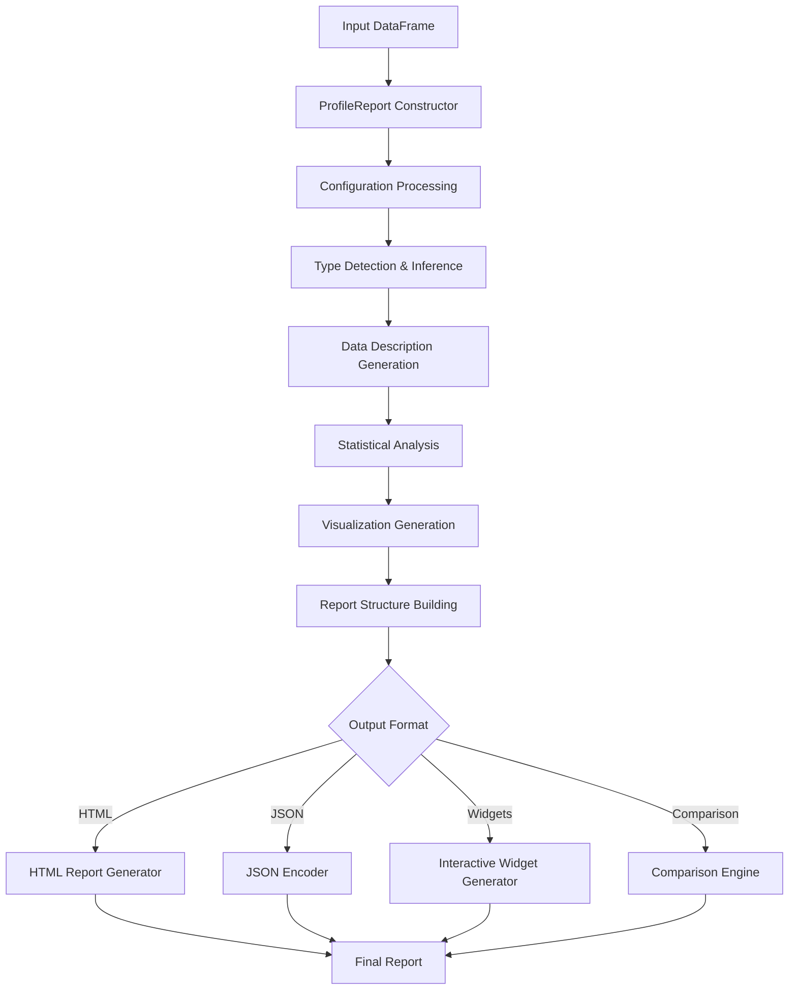

# `ydata-profiling`

## Repository Overview

### Tree Structure
```
ydata-profiling/
├── controller/           # Controller components coordinating report generation workflows
├── model/                # Data models and structures used in profiling
├── report/               # Report generation and presentation logic
├── utils/                # Utility functions and helpers
├── visualisation/        # Visualization components and rendering
├── compare_reports.py    # Module for comparing multiple datasets
├── config.py             # Module containing configuration classes and utilities
├── expectations_report.py # Class for converting profiling results into data validation frameworks
├── profile_report.py     # Main class for creating and managing data profiling reports
└── serialize_report.py   # Utility for persisting and loading profiling reports
```

### Purpose
The ydata-profiling repository provides comprehensive data profiling capabilities for pandas and Spark DataFrames, generating detailed statistical summaries, visualizations, and quality assessments. It serves as a complete solution for understanding dataset characteristics, identifying data quality issues, and generating actionable insights.

This system is designed to be the primary entry point for data profiling workflows, integrating with various subsystems including type inference, statistical summarization, visualization rendering, and data validation. It supports both lazy and eager evaluation modes, caching mechanisms, and extensive customization through configuration options.

### Target Users and Scenarios
- **Data Scientists**: For exploratory data analysis and understanding dataset characteristics
- **Data Engineers**: For data quality assessment and validation
- **ML Practitioners**: For preprocessing and feature engineering workflows
- **Business Analysts**: For quick data insights and anomaly detection

Common use cases include:
- Initial data exploration and understanding
- Data quality assessment and validation
- Feature engineering and selection
- Dataset comparison and monitoring
- Automated data validation pipelines

### Position in Ecosystem
ydata-profiling is a standalone data analysis library that operates independently but integrates well with the broader Python data science ecosystem. It can be used as:
- A standalone command-line tool
- A library within data science workflows
- A component in automated data validation systems
- A foundation for building custom data analysis applications

## Architecture

### End-to-End Data Flow


### Key Abstractions and Patterns
1. **Configuration Pattern**: Centralized Settings class using Pydantic for validation and serialization
2. **Lazy Evaluation**: Heavy computations deferred until properties are accessed
3. **Caching Mechanism**: Internal caching of expensive operations to improve performance
4. **Modular Design**: Separation of concerns across controller, model, report, and visualization layers
5. **Plugin Architecture**: Extensible through configuration and custom components
6. **Factory Pattern**: ProfileReport acts as a factory for different report formats

## Entry Points

### CLI Commands
- `ydata-profiling` command-line interface for generating reports from CSV files
- Supports various output formats and configuration options

### Importable APIs
- **`ProfileReport`**: Main interface for creating data profiling reports
  - Parameters: DataFrame, configuration settings, lazy evaluation options
  - Target audience: All users needing data profiling capabilities
  
- **`Settings`**: Configuration class for customizing profiling behavior
  - Parameters: Various configuration options for report generation
  - Target audience: Advanced users requiring fine-grained control

- **`ExpectationsReport`**: Interface for generating data validation suites
  - Parameters: Configuration, optional DataFrame
  - Target audience: Users wanting to integrate with Great Expectations

- **`SerializeReport`**: Utility for serializing/deserializing reports
  - Parameters: ProfileReport objects
  - Target audience: Users needing persistent storage of profiling results

- **`compare_reports.compare`**: Function for comparing multiple datasets
  - Parameters: List of reports or descriptions, configuration, compute flag
  - Target audience: Users needing dataset comparison capabilities

## Core Features

1. **Comprehensive Statistical Analysis**
   - Variable-level statistics (mean, median, mode, std, etc.)
   - Distribution analysis and visualization
   - Missing data pattern identification
   - Outlier detection and analysis
   - Correlation analysis between variables

2. **Rich Visualization Capabilities**
   - Histograms and density plots
   - Scatter plots and pair plots
   - Missing data heatmaps and matrices
   - Correlation heatmaps
   - Time series visualizations (when applicable)

3. **Data Quality Assessment**
   - Duplicate detection and reporting
   - Data type inference and validation
   - Variable description and metadata
   - Alert generation for data quality issues

4. **Multiple Output Formats**
   - Interactive HTML reports with embedded visualizations
   - JSON representations for programmatic consumption
   - Interactive widgets for Jupyter notebooks
   - Text-based summaries

5. **Advanced Features**
   - Dataset comparison capabilities
   - Data validation suite generation (Great Expectations integration)
   - Serialization and persistence of profiling results
   - Parallel processing support
   - Customizable reporting and styling

## Dependencies

### External Dependencies
- **pandas**, **numpy**: Core data manipulation and mathematical operations
- **matplotlib**, **seaborn**: Data visualization capabilities
- **pydantic**: Configuration validation and serialization
- **visions**: Data type detection and inference
- **tqdm**: Progress indicators for long-running operations
- **IPython**: Notebook integration and interactive features
- **great_expectations**: Data validation framework integration

### Internal Dependencies
- **controller/**: Components coordinating report generation workflows
- **model/**: Data models and structures used in profiling
- **report/**: Report generation and presentation logic
- **utils/**: Utility functions and helpers
- **visualisation/**: Visualization components and rendering
- **compare_reports**: For dataset comparison functionality
- **config**: For configuration management

## Configuration

### Configuration Files and Environment Variables
The Settings class supports configuration loading from:
- YAML files using `Settings.from_file()`
- Environment variables with prefix "PROFILE_"
- Direct instantiation with keyword arguments

### Runtime Parameters
Key configuration options include:
- Report title and metadata
- Parallel processing settings
- Visualization parameters
- Data quality thresholds
- Output format preferences
- Memory optimization settings

## Extension Points

### Plugin System
The system supports extension through:
- Custom configuration objects
- Additional visualization components
- New data type detection methods
- Custom report generators

### Subclassing
Users can extend functionality by:
- Subclassing ProfileReport for custom behaviors
- Extending Settings for domain-specific configurations
- Implementing custom summarizers or analyzers

### Configuration-Driven Behavior
Many aspects of the profiling process are controlled through configuration:
- Analysis parameters (correlations, missing data handling)
- Visualization settings (plot sizes, color schemes)
- Report structure and content
- Performance tuning options

---

## Modules

- [`src`](src.md)
- [`src/ydata_profiling`](src/ydata_profiling.md)
- [`src/ydata_profiling/controller`](src/ydata_profiling/controller.md)
- [`src/ydata_profiling/model`](src/ydata_profiling/model.md)
- [`src/ydata_profiling/model/pandas`](src/ydata_profiling/model/pandas.md)
- [`src/ydata_profiling/model/spark`](src/ydata_profiling/model/spark.md)
- [`src/ydata_profiling/report`](src/ydata_profiling/report.md)
- [`src/ydata_profiling/report/presentation`](src/ydata_profiling/report/presentation.md)
- [`src/ydata_profiling/report/presentation/core`](src/ydata_profiling/report/presentation/core.md)
- [`src/ydata_profiling/report/presentation/flavours`](src/ydata_profiling/report/presentation/flavours.md)
- [`src/ydata_profiling/report/presentation/flavours/html`](src/ydata_profiling/report/presentation/flavours/html.md)
- [`src/ydata_profiling/report/presentation/flavours/widget`](src/ydata_profiling/report/presentation/flavours/widget.md)
- [`src/ydata_profiling/report/structure`](src/ydata_profiling/report/structure.md)
- [`src/ydata_profiling/report/structure/variables`](src/ydata_profiling/report/structure/variables.md)
- [`src/ydata_profiling/utils`](src/ydata_profiling/utils.md)
- [`src/ydata_profiling/visualisation`](src/ydata_profiling/visualisation.md)

