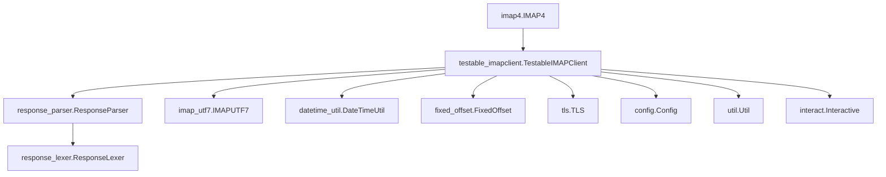

# `imapclient`

## Tree:
```
imapclient/
├── config.py
├── datetime_util.py
├── fixed_offset.py
├── imap4.py
├── imap_utf7.py
├── interact.py
├── response_lexer.py
├── response_parser.py
├── response_types.py
├── testable_imapclient.py
├── tls.py
├── util.py
└── version.py
```

## Role:
Provides a robust, secure IMAP client implementation for email server communication.

## Description:
This module implements a comprehensive IMAP client library that enables secure communication with IMAP email servers. It handles the full IMAP protocol stack including connection management, authentication, command execution, and response parsing. The library supports both plaintext and TLS-encrypted connections, UTF-7 encoding for internationalized mailbox names, and comprehensive error handling for robust email server interactions.

The module serves as the core foundation for all email processing workflows in the application, providing reliable access to email accounts for operations such as message retrieval, folder management, and email synchronization.

## Components:
*   **imap4.IMAP4**: Core IMAP protocol implementation providing fundamental connection and command handling capabilities
*   **testable_imapclient.TestableIMAPClient**: Enhanced IMAP client with testability features, extending base IMAP functionality with mocking capabilities for unit testing
*   **response_parser.ResponseParser**: Parses raw IMAP server responses into structured Python data types including lists, dictionaries, and specialized objects
*   **response_lexer.ResponseLexer**: Lexical analyzer that tokenizes IMAP protocol responses into discrete tokens for parsing
*   **imap_utf7.IMAPUTF7**: Implements UTF-7 encoding/decoding for internationalized mailbox names in compliance with RFC 1642
*   **datetime_util.DateTimeUtil**: Utility functions for converting between IMAP date formats and Python datetime objects with timezone awareness
*   **fixed_offset.FixedOffset**: Implements timezone offset handling for email timestamp parsing with proper UTC conversion
*   **tls.TLS**: Manages TLS/SSL encryption for secure IMAP connections with certificate validation and secure socket handling
*   **config.Config**: Configuration management for IMAP client settings including connection parameters, timeouts, and authentication preferences
*   **util.Util**: General utility functions supporting various IMAP operations such as message ID handling, string normalization, and data chunking
*   **interact.Interactive**: Interactive debugging utilities for inspecting IMAP sessions and protocol exchanges



## Public API:
*   **IMAP4**: Core IMAP protocol implementation class for establishing connections and executing IMAP commands with full protocol compliance
*   **TestableIMAPClient**: Extended client with enhanced testing capabilities, including mockable methods for unit testing and integration testing
*   **ResponseParser**: Parses raw IMAP server responses into structured Python objects (lists, dictionaries, specialized types) with comprehensive error handling
*   **ResponseLexer**: Tokenizes raw IMAP responses into tokens for subsequent parsing, handling quoted strings, literals, and special IMAP syntax
*   **IMAPUTF7**: Encodes and decodes UTF-7 strings for mailbox names containing non-ASCII characters, supporting internationalized email folder names
*   **DateTimeUtil**: Converts between IMAP date/time formats and Python datetime objects with timezone awareness and proper UTC handling
*   **FixedOffset**: Handles timezone offset calculations for email timestamps with proper UTC conversion and timezone-aware datetime objects
*   **TLS**: Manages TLS/SSL encryption for secure IMAP connections with certificate validation, secure socket creation, and proper connection lifecycle management
*   **Config**: Configuration manager for IMAP client settings including host, port, timeout, SSL settings, and authentication parameters
*   **Util**: General utility functions for IMAP operations such as message ID handling, string normalization, data chunking, and protocol validation
*   **Interactive**: Interactive debugging utilities for inspecting IMAP sessions and protocol exchanges, providing development-time debugging capabilities

## Dependencies:
*   **Internal**: None (this is a standalone module)
*   **External**: 
    *   `socket` - For TCP/IP network communication with IMAP servers
    *   `ssl` - For TLS/SSL encryption and secure connections
    *   `email` - For email message parsing and handling
    *   `logging` - For diagnostic logging and error reporting
    *   `typing` - For type hints and annotations
    *   `time` - For timeout handling and timing operations
    *   `re` - For regular expression operations in parsing and validation
    *   `io` - For buffered I/O operations in connection handling

## Constraints:
*   All IMAP operations must be performed within an authenticated session (after login)
*   Connection must be established before executing any commands
*   Thread safety: The client is not thread-safe by default; concurrent access requires proper synchronization
*   IMAP commands must be sent in proper sequence according to the IMAP protocol specification (RFC 3501)
*   TLS connections require valid certificates when enabled (unless configured otherwise)
*   Message IDs and folder names must be properly encoded/decoded when containing special characters
*   Response parsing assumes valid IMAP protocol responses; malformed responses may cause parsing errors
*   Timezone handling requires proper offset configuration for accurate timestamp conversion
*   Memory usage scales with the size of email messages being processed
*   Network timeouts must be configured appropriately for reliable operation over slow connections

---

## Files

- [`config.py`](imapclient/config.md)
- [`datetime_util.py`](imapclient/datetime_util.md)
- [`fixed_offset.py`](imapclient/fixed_offset.md)
- [`imap4.py`](imapclient/imap4.md)
- [`imap_utf7.py`](imapclient/imap_utf7.md)
- [`interact.py`](imapclient/interact.md)
- [`response_lexer.py`](imapclient/response_lexer.md)
- [`response_parser.py`](imapclient/response_parser.md)
- [`response_types.py`](imapclient/response_types.md)
- [`testable_imapclient.py`](imapclient/testable_imapclient.md)
- [`tls.py`](imapclient/tls.md)
- [`util.py`](imapclient/util.md)
- [`version.py`](imapclient/version.md)

