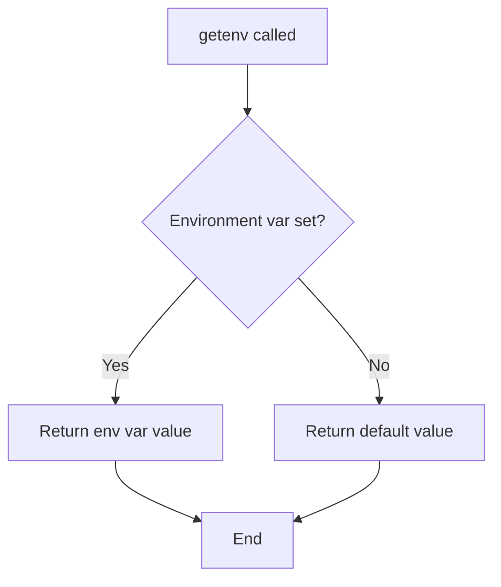
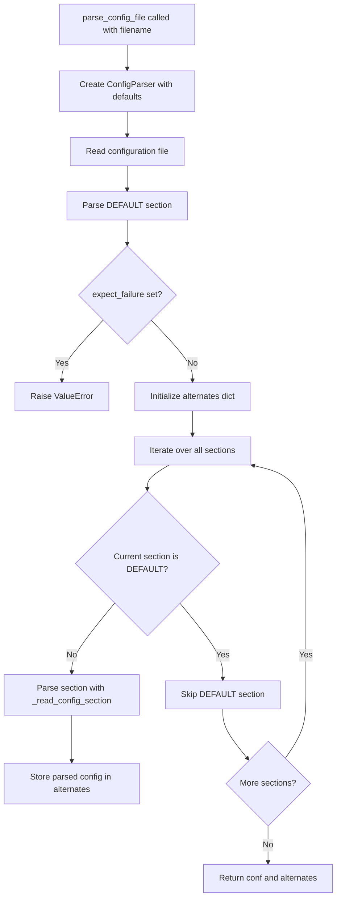
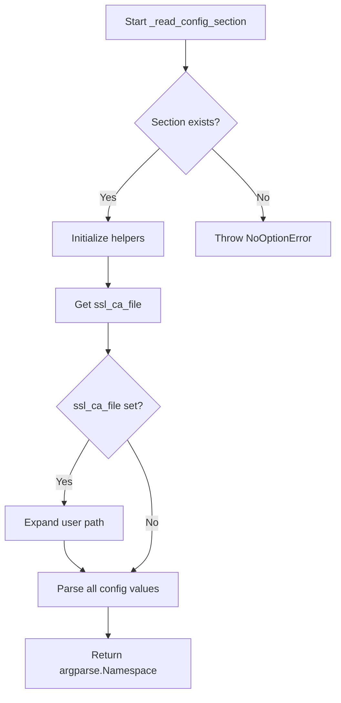
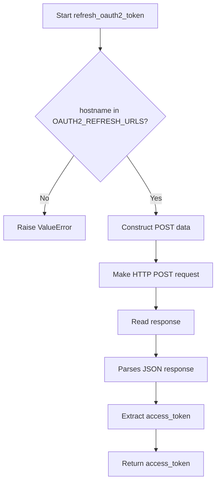
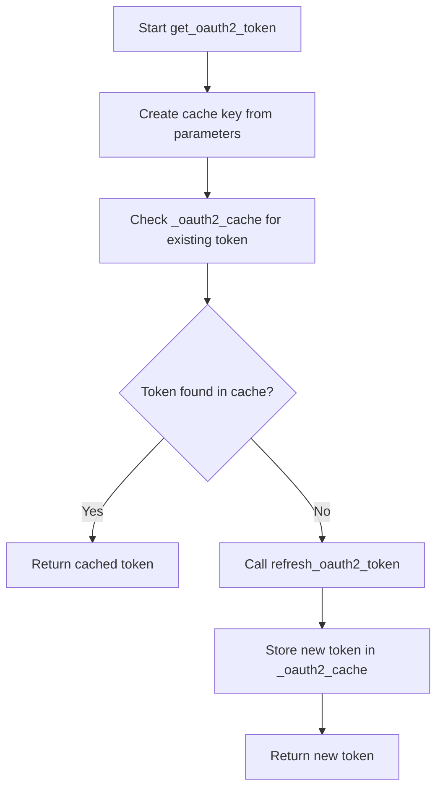

# `config.py`

## `imapclient.config.getenv` · *function*

## Summary:
Retrieves environment variables with a standardized "imapclient_" prefix.

## Description:
Fetches environment variable values with automatic prefixing to avoid naming conflicts. This function provides a consistent interface for accessing configuration values from environment variables while maintaining backward compatibility with existing configurations.

## Args:
    name (str): The base name of the environment variable to retrieve, which will be prefixed with "imapclient_".
    default (Optional[str]): The fallback value to return if the environment variable is not set.

## Returns:
    Optional[str]: The value of the environment variable if it exists, otherwise the provided default value.

## Raises:
    None: This function does not raise any exceptions.

## Constraints:
    Preconditions: 
    - The `name` parameter must be a string
    - The `default` parameter can be None or a string
    
    Postconditions:
    - Returns either the environment variable value or the default value
    - Never raises exceptions

## Side Effects:
    None: This function only reads from environment variables and does not modify any state.

## Control Flow:


## Examples:
    # Get IMAP server host with default
    host = getenv("host", "localhost")
    
    # Get port number with default
    port = getenv("port", "993")
    
    # Get optional setting that may not be defined
    debug = getenv("debug", None)
``

## `imapclient.config.get_config_defaults` · *function*

## Summary:
Returns a dictionary of default configuration values for an IMAP client connection, with environment variable overrides for sensitive credentials.

## Description:
Provides a standardized set of default configuration parameters for connecting to IMAP servers. This function centralizes default configuration values and allows for environment-based customization of sensitive settings like usernames and passwords. The function extracts configuration values from environment variables using a custom `getenv` function that applies a "imapclient_" prefix to avoid naming conflicts.

This function exists to provide a clean separation between default configuration values and environment-specific overrides, making it easier to configure IMAP clients in different environments without hardcoding sensitive information.

## Args:
    None: This function takes no arguments.

## Returns:
    Dict[str, Any]: A dictionary containing default configuration values with the following keys:
        - "username": Environment variable value for "imapclient_username" or None
        - "password": Environment variable value for "imapclient_password" or None
        - "ssl": Boolean indicating SSL/TLS encryption should be used (always True)
        - "ssl_check_hostname": Boolean indicating hostname verification should occur (always True)
        - "ssl_verify_cert": Boolean indicating certificate verification should occur (always True)
        - "ssl_ca_file": Path to CA certificate file or None
        - "timeout": Connection timeout value or None
        - "starttls": Boolean indicating STARTTLS should be used (always False)
        - "stream": Boolean indicating streaming mode should be used (always False)
        - "oauth2": Boolean indicating OAuth2 authentication should be used (always False)
        - "oauth2_client_id": Environment variable value for "imapclient_oauth2_client_id" or None
        - "oauth2_client_secret": Environment variable value for "imapclient_oauth2_client_secret" or None
        - "oauth2_refresh_token": Environment variable value for "imapclient_oauth2_refresh_token" or None
        - "expect_failure": Expected failure indicator or None

## Raises:
    None: This function does not raise any exceptions.

## Constraints:
    Preconditions:
    - The `getenv` function must be available in scope
    - Environment variables should be accessible
    
    Postconditions:
    - Always returns a dictionary with all expected keys
    - All returned values are of appropriate types (strings, booleans, None)

## Side Effects:
    None: This function only reads environment variables and does not modify any state.

## Control Flow:
```mermaid
flowchart TD
    A[get_config_defaults called] --> B[Initialize result dict]
    B --> C[Set username from getenv("username", None)]
    C --> D[Set password from getenv("password", None)]
    D --> E[Set ssl=True]
    E --> F[Set ssl_check_hostname=True]
    F --> G[Set ssl_verify_cert=True]
    G --> H[Set ssl_ca_file=None]
    H --> I[Set timeout=None]
    I --> J[Set starttls=False]
    J --> K[Set stream=False]
    K --> L[Set oauth2=False]
    L --> M[Set oauth2_client_id from getenv("oauth2_client_id", None)]
    M --> N[Set oauth2_client_secret from getenv("oauth2_client_secret", None)]
    N --> O[Set oauth2_refresh_token from getenv("oauth2_refresh_token", None)]
    O --> P[Set expect_failure=None]
    P --> Q[Return result dictionary]
```

## `imapclient.config.parse_config_file` · *function*

## Summary:
Parses an INI-style configuration file and returns structured configuration data for IMAP client connections, including default settings and alternate section configurations.

## Description:
Reads a configuration file in INI format and transforms it into a structured namespace object containing IMAP client connection parameters. The function processes the DEFAULT section first, validates it doesn't contain invalid settings, then collects all other sections as alternative configurations. This enables flexible configuration management where users can define multiple connection profiles in a single file.

The function is designed to work with standard INI configuration files and leverages existing helper functions for default value handling and section parsing. It enforces that the DEFAULT section cannot specify expect_failure, ensuring proper configuration structure.

## Args:
    filename (str): Path to the configuration file to parse. Must be readable and in valid INI format.

## Returns:
    argparse.Namespace: A namespace object containing:
        - conf (argparse.Namespace): Configuration from the DEFAULT section
        - alternates (Dict[str, argparse.Namespace]): Dictionary mapping section names to their parsed configurations
        
    The returned namespace's conf attribute contains all parsed configuration values from the DEFAULT section, while the alternates attribute maps section names to their respective parsed configurations.

## Raises:
    ValueError: When the DEFAULT section contains an expect_failure setting, which is not allowed.
    FileNotFoundError: When the specified configuration file cannot be found or read.
    configparser.Error: When the configuration file contains invalid INI syntax.

## Constraints:
    Preconditions:
        - The filename parameter must be a valid path to an existing file
        - The configuration file must be in valid INI format
        - The DEFAULT section must not contain an expect_failure setting
        
    Postconditions:
        - Returns a properly structured argparse.Namespace with conf and alternates attributes
        - All configuration sections are parsed and validated
        - The alternates dictionary contains entries for all sections except DEFAULT

## Side Effects:
    - Reads configuration file from disk
    - May expand user paths in ssl_ca_file values (through _read_config_section)
    - Does not modify any external state beyond reading the file

## Control Flow:


## Examples:
```python
# Basic usage with a configuration file
# File content:
# [DEFAULT]
# host = imap.example.com
# port = 993
# ssl = true
# username = user@example.com
# password = secret123
#
# [work]
# host = imap.work.com
# port = 993
# ssl = true
# username = work@example.com
# password = worksecret
#
# [personal]
# host = imap.personal.com
# port = 993
# ssl = true
# username = personal@example.com
# password = personalsecret

import argparse
from imapclient.config import parse_config_file

config = parse_config_file("imap_config.ini")
print(config.conf.host)           # Output: imap.example.com
print(config.conf.username)       # Output: user@example.com
print(config.alternates["work"].host)  # Output: imap.work.com
print(config.alternates["personal"].host)  # Output: imap.personal.com

# Error handling example
try:
    config = parse_config_file("invalid_config.ini")
except FileNotFoundError:
    print("Configuration file not found")
except ValueError as e:
    if "expect_failure should not be set" in str(e):
        print("Invalid configuration: DEFAULT section cannot have expect_failure")
```

## `imapclient.config.get_string_config_defaults` · *function*

## Summary:
Converts configuration default values to string representations for consistent handling in string-based configuration contexts.

## Description:
Transforms the dictionary of configuration defaults returned by `get_config_defaults()` into a string-only dictionary. This function ensures that all configuration values are represented as strings, converting boolean values to lowercase "true"/"false" and falsy values to empty strings. This standardization is useful when configuration needs to be processed in string-based contexts such as command-line argument parsing or environment variable handling.

The function exists to provide a consistent string representation of configuration values while preserving the semantic meaning of boolean and falsy values through appropriate string conversions.

## Args:
    None: This function takes no arguments.

## Returns:
    Dict[str, str]: A dictionary where all values from `get_config_defaults()` have been converted to strings:
        - Boolean True values become "true"
        - Boolean False values become "false" 
        - Falsy values (None, empty strings, zero) become empty strings ""
        - Non-falsy values are converted to their string representation

## Raises:
    None: This function does not raise any exceptions.

## Constraints:
    Preconditions:
    - The `get_config_defaults()` function must be available and return a dictionary
    - All values in the dictionary returned by `get_config_defaults()` must be convertible to strings
    
    Postconditions:
    - Always returns a dictionary with the same keys as `get_config_defaults()`
    - All returned values are strings

## Side Effects:
    None: This function only performs in-memory transformations and does not cause any I/O or external state changes.

## Control Flow:
```mermaid
flowchart TD
    A[get_string_config_defaults called] --> B[Call get_config_defaults()]
    B --> C[Initialize empty output dictionary]
    C --> D[Iterate over key-value pairs]
    D --> E{Value is True?}
    E -->|Yes| F[Set value to "true"]
    E -->|No| G{Value is False?}
    G -->|Yes| H[Set value to "false"]
    G -->|No| I{Value is falsy?}
    I -->|Yes| J[Set value to ""]
    I -->|No| K[Convert value to string]
    K --> L[Store key-value pair in output]
    L --> M{More items?}
    M -->|Yes| D
    M -->|No| N[Return output dictionary]
```

## Examples:
```python
# Basic usage
defaults = get_string_config_defaults()
print(defaults["ssl"])  # Output: "true"
print(defaults["timeout"])  # Output: ""

# When get_config_defaults() returns:
# {"username": None, "password": "secret", "ssl": True, "timeout": 30}
# get_string_config_defaults() returns:
# {"username": "", "password": "secret", "ssl": "true", "timeout": "30"}
```

## `imapclient.config._read_config_section` · *function*

## Summary:
Parses an IMAP client configuration section from a ConfigParser and returns typed configuration values as an argparse.Namespace.

## Description:
Extracts and converts configuration values from a specified section of a configparser object into a structured namespace suitable for IMAP client initialization. This function handles type conversion for various configuration parameters including strings, booleans, integers, floats, and optional values with proper error handling.

The function is designed to be reusable across different configuration sources and provides a consistent interface for accessing IMAP client settings regardless of how the configuration was loaded.

## Args:
    parser (configparser.ConfigParser): Configuration parser containing the target section
    section (str): Name of the configuration section to parse

## Returns:
    argparse.Namespace: Namespace containing all parsed configuration values with appropriate types:
        - host (str): IMAP server hostname
        - port (Optional[int]): IMAP server port number
        - ssl (bool): Whether to use SSL/TLS
        - starttls (bool): Whether to use STARTTLS
        - ssl_check_hostname (bool): Whether to verify SSL hostname
        - ssl_verify_cert (bool): Whether to verify SSL certificates
        - ssl_ca_file (Optional[str]): Path to CA certificate file
        - timeout (Optional[float]): Connection timeout in seconds
        - stream (bool): Whether to use streaming mode
        - username (str): Authentication username
        - password (str): Authentication password
        - oauth2 (bool): Whether to use OAuth2 authentication
        - oauth2_client_id (str): OAuth2 client ID
        - oauth2_client_secret (str): OAuth2 client secret
        - oauth2_refresh_token (str): OAuth2 refresh token
        - expect_failure (str): Expected failure behavior

## Raises:
    configparser.NoOptionError: When a required configuration option is missing from the section
    ValueError: When a configuration value cannot be converted to the expected type (e.g., invalid integer or float)

## Constraints:
    Preconditions:
        - The parser must contain the specified section
        - All required configuration options must be present in the section
    Postconditions:
        - Returns a properly typed argparse.Namespace with all configuration values
        - Optional values that are missing or empty return None
        - ssl_ca_file paths are expanded using os.path.expanduser()

## Side Effects:
    - Expands user home directory in ssl_ca_file path using os.path.expanduser()
    - Reads configuration values from the provided ConfigParser instance

## Control Flow:


## Examples:
```python
# Basic usage with configparser
import configparser
import argparse

config = configparser.ConfigParser()
config.read_string('''
[imap]
host = imap.example.com
port = 993
ssl = true
username = test@example.com
password = secret123
''')

parsed_config = _read_config_section(config, 'imap')
print(parsed_config.host)  # Output: imap.example.com
print(parsed_config.ssl)   # Output: True
```

## `imapclient.config.refresh_oauth2_token` · *function*

## Summary:
Refreshes an OAuth2 access token for a given IMAP server hostname using a refresh token.

## Description:
This function performs an OAuth2 token refresh operation by making an HTTP POST request to the appropriate token endpoint for the specified IMAP server hostname. It is used to obtain a new access token when the existing one has expired, enabling continued authentication with IMAP services that use OAuth2 authentication.

The function extracts the refresh URL for the given hostname from a global configuration mapping, constructs the required POST parameters including client credentials and refresh token, makes the HTTP request, and parses the JSON response to return the new access token.

## Args:
    hostname (str): The IMAP server hostname for which to refresh the OAuth2 token. This is used as a key to look up the appropriate token refresh endpoint URL.
    client_id (str): The OAuth2 client identifier used for authentication with the token endpoint.
    client_secret (str): The OAuth2 client secret used for authentication with the token endpoint.
    refresh_token (str): The refresh token that will be exchanged for a new access token.

## Returns:
    str: The newly refreshed OAuth2 access token as a string.

## Raises:
    ValueError: When the hostname is not found in the OAUTH2_REFRESH_URLS mapping, indicating that token refresh is not supported for that IMAP server.

## Constraints:
    Preconditions:
        - The hostname must be a valid key in the OAUTH2_REFRESH_URLS global dictionary
        - All string parameters must be valid and non-empty
        - The refresh token must be valid and not expired
    Postconditions:
        - Returns a valid OAuth2 access token string
        - The returned token is ready for immediate use with IMAP operations

## Side Effects:
    - Makes an outbound HTTPS network request to the OAuth2 token refresh endpoint
    - Performs HTTP I/O operations including request construction and response parsing
    - May trigger network timeouts or connection errors if the token endpoint is unavailable

## Control Flow:


## Examples:
```python
# Refresh token for Gmail IMAP
access_token = refresh_oauth2_token(
    hostname="imap.gmail.com",
    client_id="my_client_id",
    client_secret="my_client_secret",
    refresh_token="my_refresh_token"
)
```

## `imapclient.config.get_oauth2_token` · *function*

## Summary:
Retrieves an OAuth2 access token for an IMAP server, using cached tokens when available to avoid unnecessary refresh operations.

## Description:
This function serves as a caching layer for OAuth2 token management in IMAP client operations. It first checks if a valid access token is already cached for the given combination of hostname, client ID, client secret, and refresh token. If a cached token exists, it is returned immediately without making network requests. Otherwise, it triggers a token refresh operation and caches the result for future use.

The function is designed to reduce redundant network calls to OAuth2 token endpoints while ensuring that applications always have a valid access token for IMAP operations.

## Args:
    hostname (str): The IMAP server hostname for which to retrieve an OAuth2 token
    client_id (str): The OAuth2 client identifier used for authentication with the token endpoint
    client_secret (str): The OAuth2 client secret used for authentication with the token endpoint
    refresh_token (str): The refresh token that will be exchanged for a new access token

## Returns:
    str: The OAuth2 access token for the specified IMAP server

## Raises:
    ValueError: When the underlying refresh_oauth2_token function raises a ValueError (typically when hostname is not supported)

## Constraints:
    Preconditions:
        - All string parameters must be valid and non-empty
        - The refresh token must be valid and not expired
        - The hostname must be supported by the OAUTH2_REFRESH_URLS mapping
    Postconditions:
        - Returns a valid OAuth2 access token string
        - The returned token is cached for subsequent calls with identical parameters

## Side Effects:
    - Makes an outbound HTTPS network request to the OAuth2 token refresh endpoint (when cache miss occurs)
    - Performs HTTP I/O operations including request construction and response parsing
    - May trigger network timeouts or connection errors if the token endpoint is unavailable
    - Updates the internal _oauth2_cache with the newly acquired token

## Control Flow:


## Examples:
```python
# Retrieve OAuth2 token for Gmail IMAP
token = get_oauth2_token(
    hostname="imap.gmail.com",
    client_id="my_client_id",
    client_secret="my_client_secret",
    refresh_token="my_refresh_token"
)

# Subsequent calls with same parameters will return cached token
cached_token = get_oauth2_token(
    hostname="imap.gmail.com",
    client_id="my_client_id",
    client_secret="my_client_secret",
    refresh_token="my_refresh_token"
)
```

## `imapclient.config.create_client_from_config` · *function*

## Summary:
Creates and configures an IMAP client instance based on provided configuration parameters, with optional authentication.

## Description:
This function serves as a factory for creating IMAP client instances with proper SSL configuration and authentication. It centralizes the logic for setting up IMAP connections, handling different authentication mechanisms (OAuth2, standard login, or no login), and managing SSL/TLS settings. The function is designed to be reusable across different parts of an application that need to establish IMAP connections.

The function is extracted from inline logic to provide a clean separation of concerns, allowing the connection setup and authentication process to be tested independently and reused throughout the application.

## Args:
    conf (argparse.Namespace): Configuration namespace containing IMAP connection parameters with the following attributes:
        - host (str): The IMAP server hostname (required)
        - port (int): The IMAP server port (default: 993 for SSL, 143 otherwise)
        - ssl (bool): Whether to use SSL/TLS encryption
        - ssl_check_hostname (bool): Whether to verify SSL certificate hostname
        - ssl_verify_cert (bool): Whether to verify SSL certificates
        - ssl_ca_file (str): Path to CA certificate file for SSL verification
        - stream (bool): Whether to use streaming mode
        - timeout (int): Connection timeout in seconds
        - starttls (bool): Whether to upgrade connection with STARTTLS
        - oauth2 (bool): Whether to use OAuth2 authentication
        - username (str): Username for standard authentication
        - password (str): Password for standard authentication
        - oauth2_client_id (str): OAuth2 client ID for OAuth2 authentication
        - oauth2_client_secret (str): OAuth2 client secret for OAuth2 authentication
        - oauth2_refresh_token (str): OAuth2 refresh token for OAuth2 authentication
    login (bool, optional): Whether to perform authentication after creating the client. Defaults to True.

## Returns:
    imapclient.IMAPClient: Configured IMAP client instance. If login=False, returns the client without authentication.

## Raises:
    AssertionError: When required configuration parameters are missing (host, oauth2 credentials, username, password)
    Exception: Propagates any exceptions that occur during authentication or connection setup (with cleanup via shutdown())

## Constraints:
    Preconditions:
        - conf.host must be provided and non-empty
        - For OAuth2 authentication, all oauth2_* parameters must be provided
        - For standard authentication, both username and password must be provided
    Postconditions:
        - Returns a properly configured IMAP client instance
        - If login=True, the client is authenticated
        - If login=False, the client is created but not authenticated

## Side Effects:
    - Creates an SSL context when SSL is enabled
    - Makes network connections to the IMAP server
    - May make HTTP requests to OAuth2 token endpoints (when using OAuth2)
    - Calls client.shutdown() on authentication failure to clean up resources

## Control Flow:
```mermaid
flowchart TD
    A[Start create_client_from_config] --> B{conf.host provided?}
    B -- No --> C[Assertion Error]
    B -- Yes --> D[Setup SSL context]
    D --> E[Create IMAPClient instance]
    E --> F{login=False?}
    F -- Yes --> G[Return client]
    F -- No --> H{conf.starttls?}
    H -- Yes --> I[client.starttls()]
    I --> J{conf.oauth2?}
    J -- Yes --> K[Get OAuth2 token]
    K --> L[client.oauth2_login()]
    J -- No --> M{conf.stream?}
    M -- No --> N[client.login()]
    N --> O[Return client]
    M -- Yes --> O
    H -- No --> P[Check OAuth2]
    P --> J
```

## Examples:
```python
# Basic usage with authentication
import argparse
conf = argparse.Namespace(
    host="imap.gmail.com",
    port=993,
    ssl=True,
    ssl_check_hostname=True,
    ssl_verify_cert=True,
    username="user@gmail.com",
    password="password"
)
client = create_client_from_config(conf)

# Usage without authentication
client = create_client_from_config(conf, login=False)

# OAuth2 usage
conf.oauth2 = True
conf.oauth2_client_id = "client_id"
conf.oauth2_client_secret = "client_secret"
conf.oauth2_refresh_token = "refresh_token"
client = create_client_from_config(conf)
```

