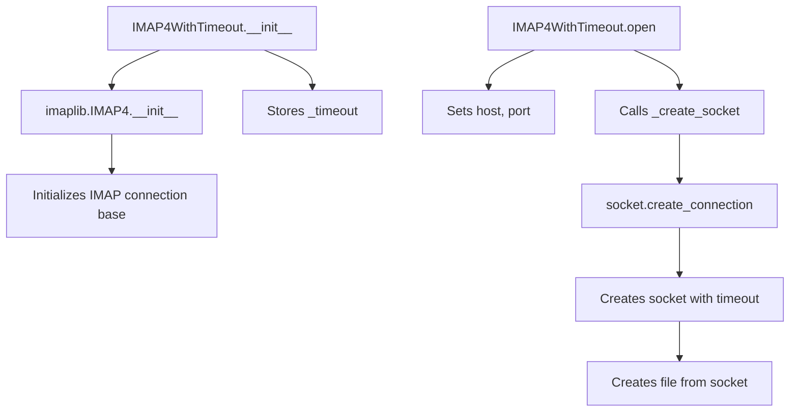

# `imap4.py`

## `imapclient.imap4.IMAP4WithTimeout` · *class*

## Summary:
IMAP4WithTimeout is an extension of imaplib.IMAP4 that adds configurable timeout support for IMAP connections.

## Description:
This class extends the standard imaplib.IMAP4 class to provide enhanced timeout control for IMAP network operations. It allows setting a default timeout for connections and overriding timeouts on a per-connection basis. The class serves as a drop-in replacement for imaplib.IMAP4 with improved timeout handling capabilities, making it suitable for applications requiring reliable network operation timing in potentially unstable network conditions.

## State:
- `_timeout`: Optional[float] - The default timeout value for socket connections, set during initialization
- `host`: str - Set during open() method execution to specify the IMAP server hostname
- `port`: int - Set during open() method execution to specify the IMAP server port  
- `sock`: socket.socket - Created during open() method execution for the underlying socket connection
- `file`: BufferedReader - Created during open() method execution for reading from the socket

Note: `host`, `port`, `sock`, and `file` are only initialized when the open() method is called, not during object construction.

## Lifecycle:
- Creation: Instantiate with address (str), port (int), and timeout (Optional[float])
- Usage: Call open() method to establish connection, then use standard IMAP methods inherited from imaplib.IMAP4
- Destruction: Cleanup occurs automatically when the object is garbage collected or when using context managers

## Method Map:


## Raises:
- socket.timeout: When socket connection attempts exceed the specified timeout
- socket.gaierror: When DNS resolution fails during socket creation
- ConnectionRefusedError: When the IMAP server refuses the connection
- OSError: For various other socket-related errors

## Example:
```python
# Create IMAP client with 30-second timeout
imap_client = IMAP4WithTimeout('imap.example.com', 993, timeout=30.0)

# Connect with custom timeout
imap_client.open('imap.example.com', 993, timeout=60.0)

# Use standard IMAP operations
imap_client.login('user', 'password')
imap_client.select('INBOX')
typ, data = imap_client.search(None, 'ALL')

# Close connection
imap_client.close()
imap_client.logout()
```

### `imapclient.imap4.IMAP4WithTimeout.__init__` · *method*

## Summary:
Initializes an IMAP4WithTimeout instance with connection parameters and timeout configuration.

## Description:
Configures the IMAP4WithTimeout object with server address, port, and timeout settings. This method serves as the constructor that establishes the basic connection parameters and initializes the underlying IMAP4 protocol handling.

## Args:
    address (str): The hostname or IP address of the IMAP server.
    port (int): The port number to connect to on the IMAP server.
    timeout (Optional[float]): Connection timeout in seconds, or None for no timeout.

## Returns:
    None: This method initializes the object and does not return a value.

## Raises:
    Exception: May raise exceptions during parent class initialization.

## State Changes:
    Attributes READ: None
    Attributes WRITTEN: 
        - self._timeout: Stores the provided timeout value

## Constraints:
    Preconditions:
        - address must be a valid string representing a network address
        - port must be a valid integer representing a network port
        - timeout must be either a positive float or None
    Postconditions:
        - self._timeout is set to the provided timeout value
        - The object is initialized with connection parameters for IMAP communication

## Side Effects:
    None: This method performs initialization only and does not cause external I/O or service calls.

### `imapclient.imap4.IMAP4WithTimeout.open` · *method*

## Summary:
Establishes a network connection to an IMAP server with configurable host, port, and timeout settings.

## Description:
Configures the IMAP client to connect to a specified IMAP server by setting up network connection parameters and creating the underlying socket connection. This method prepares the client for subsequent IMAP operations by establishing the network communication channel.

## Args:
    host (str): The hostname or IP address of the IMAP server. Defaults to empty string.
    port (int): The port number to connect to. Defaults to 143 (standard IMAP port).
    timeout (Optional[float]): Connection timeout in seconds. If None, uses the instance's default timeout.

## Returns:
    None: This method does not return a value.

## Raises:
    socket.error: When the socket connection fails due to network issues or invalid host/port.
    OSError: When there are OS-level errors during socket creation or connection.

## State Changes:
    Attributes READ: None
    Attributes WRITTEN: self.host, self.port, self.sock, self.file

## Constraints:
    Preconditions: The method can be called at any time to reconfigure the connection parameters.
    Postconditions: The instance will have updated host, port, socket, and file attributes ready for IMAP communication.

## Side Effects:
    I/O: Creates a network socket connection to the specified IMAP server.
    External service calls: Connects to the remote IMAP server.
    Mutations: Modifies instance attributes self.host, self.port, self.sock, and self.file.

### `imapclient.imap4.IMAP4WithTimeout._create_socket` · *method*

## Summary:
Creates a socket connection to the configured host and port with specified timeout settings.

## Description:
This method establishes a network socket connection to the IMAP server using the host and port configured on the instance. It provides flexibility in timeout configuration by accepting an optional timeout parameter that overrides the instance's default timeout when provided.

## Args:
    timeout (Optional[float]): Connection timeout in seconds. If None, uses the instance's default timeout (_timeout attribute).

## Returns:
    socket.socket: A connected socket object ready for IMAP communication.

## Raises:
    socket.error: When the socket connection fails due to network issues, invalid host/port, or timeout.

## State Changes:
    Attributes READ: self.host, self.port, self._timeout
    Attributes WRITTEN: None

## Constraints:
    Preconditions: 
    - self.host and self.port must be set (typically done by the open() method)
    - The instance must have a valid _timeout attribute
    - Network connectivity must be available
    
    Postconditions:
    - Returns a connected socket object that can be used for IMAP operations
    - The returned socket is not closed by this method

## Side Effects:
    I/O: Creates a network connection to the remote IMAP server
    External service call: Connects to the configured host and port over TCP

