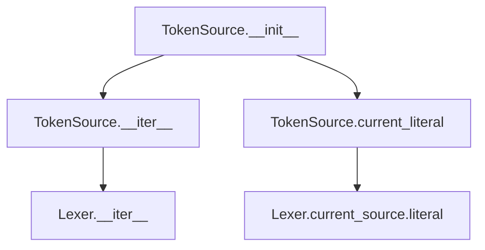
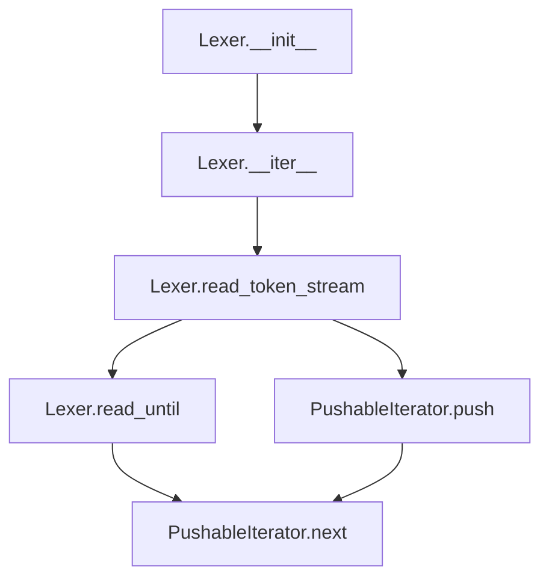
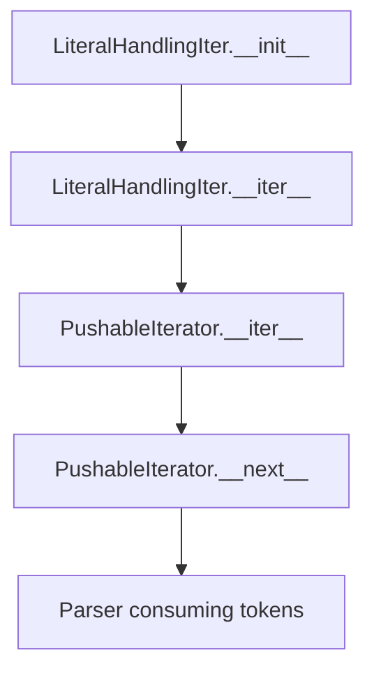
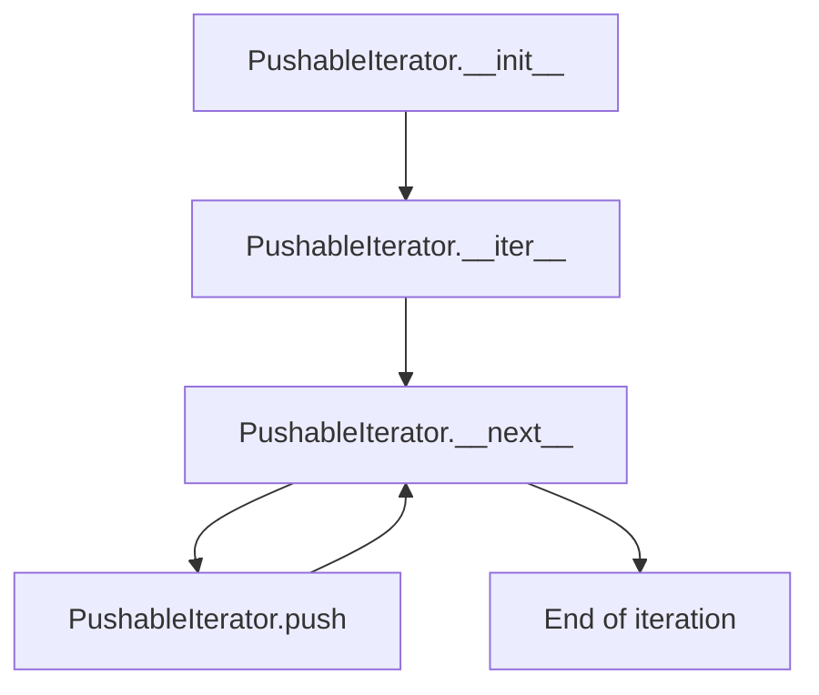

# `response_lexer.py`

## `imapclient.response_lexer.TokenSource` · *class*

## Summary:
A wrapper class that provides iteration access to a tokenized IMAP response stream.

## Description:
TokenSource serves as a convenient interface for consuming tokens from an IMAP protocol response lexer. It encapsulates a Lexer instance and provides iterator functionality to traverse the tokenized response. The class is designed to offer a clean abstraction for accessing parsed IMAP tokens while maintaining the underlying lexer's tokenization capabilities.

This class is typically instantiated by IMAP client components that need to process server responses token by token, particularly in parsing contexts where sequential access to response elements is required.

## State:
- `lex`: Lexer instance that performs the actual tokenization of input byte sequences
- `src`: Iterator over the lexer's token stream, enabling sequential consumption of tokens

## Lifecycle:
- Creation: Instantiate with a List[bytes] representing IMAP response chunks
- Usage: Iterate over the TokenSource instance to consume tokens sequentially, or access the current_literal property to inspect the current token source
- Destruction: Automatic cleanup via Python garbage collection

## Method Map:


## Raises:
- `ValueError`: May be raised by the underlying Lexer during initialization if input contains malformed IMAP protocol constructs
- `ProtocolError`: May be raised by assert_imap_protocol during lexer initialization if IMAP protocol violations are detected

## Example:
```python
# Create a TokenSource with IMAP response chunks
response_chunks = [b'* 1 FETCH (RFC822 {12}\r\n', b'Hello World!)']
token_source = TokenSource(response_chunks)

# Iterate through tokens
for token in token_source:
    print(token)

# Access current literal (useful for tracking position)
current = token_source.current_literal
```

### `imapclient.response_lexer.TokenSource.__init__` · *method*

## Summary:
Initializes a TokenSource object with a list of IMAP response byte chunks for tokenized iteration.

## Description:
Creates a TokenSource instance that wraps a Lexer to provide sequential access to tokens from IMAP protocol response data. This method prepares the internal lexer and iterator components needed for token traversal, making the TokenSource ready for consumption by IMAP client parsing logic.

The TokenSource.__init__ method is separated from inline initialization to provide a clean abstraction layer between the raw IMAP response data and the token processing pipeline. This design allows for proper encapsulation of the lexer's tokenization logic while exposing a simple iterator interface to consumers.

## Args:
    text (List[bytes]): A list of byte sequences representing IMAP protocol response chunks to be tokenized and iterated over.

## Returns:
    None: This method initializes the object's internal state and does not return a value.

## Raises:
    ValueError: May be raised by the underlying Lexer during initialization if input contains malformed IMAP protocol constructs.
    ProtocolError: May be raised by assert_imap_protocol during lexer initialization if IMAP protocol violations are detected.

## State Changes:
    Attributes READ: None
    Attributes WRITTEN: 
    - self.lex: Assigned a new Lexer instance initialized with the provided text
    - self.src: Assigned an iterator over the newly created lexer instance

## Constraints:
    Preconditions: The text parameter must be a list of bytes representing valid IMAP protocol response chunks.
    Postconditions: The TokenSource instance is properly initialized with internal lexer and iterator components ready for token consumption.

## Side Effects:
    None: This method performs no I/O operations or external service calls. It only initializes internal state.

### `imapclient.response_lexer.TokenSource.current_literal` · *method*

## Summary:
Returns the literal data associated with the currently active source in the lexer, or None if no literal data is present.

## Description:
This property provides access to the literal data portion of the currently processed IMAP response source. It is primarily used during parsing operations to retrieve embedded literal data that follows IMAP protocol specifications (such as `{size}\r\n` followed by binary content). The method safely handles cases where no literal data is associated with the current source by returning None.

The property is accessed during tokenization when the lexer needs to inspect the literal component of a response record. It's part of the TokenSource abstraction that separates the concerns of source management from token processing. This method is typically called during parsing phases when the system needs to extract literal data portions from IMAP protocol responses.

This logic is implemented as a property rather than being inlined because it provides a clean abstraction layer between the lexer's internal state management and the parsing logic that consumes this information. It ensures consistent access to literal data regardless of the current parsing state.

## Args:
    None

## Returns:
    Optional[bytes]: The literal data associated with the current source, or None if no literal data is present.

## Raises:
    None

## State Changes:
    Attributes READ: self.lex.current_source.literal
    Attributes WRITTEN: None

## Constraints:
    Preconditions: The TokenSource instance must be properly initialized and the lexer must have processed at least one source.
    Postconditions: The method returns the literal data without modifying any state.

## Side Effects:
    None

### `imapclient.response_lexer.TokenSource.__iter__` · *method*

*No documentation generated.*

## `imapclient.response_lexer.Lexer` · *class*

## Summary:
An IMAP protocol response lexer that tokenizes server responses into structured byte tokens.

## Description:
The Lexer class implements a specialized tokenizer for IMAP protocol responses, converting raw byte sequences into discrete tokens suitable for further parsing. It handles IMAP-specific constructs such as quoted strings, literal data specifications (like `{12}\r\n`), and escape sequences according to RFC 3501 specifications.

This lexer is a core component in IMAP client implementations, providing the foundational tokenization layer that enables higher-level parsing of server responses. It processes input as a sequence of byte chunks and yields tokens one at a time during iteration.

## State:
- `sources`: Generator producing LiteralHandlingIter instances for each input byte chunk
- `current_source`: Currently active LiteralHandlingIter being processed, or None if inactive

## Lifecycle:
- Creation: Initialize with List[bytes] representing IMAP response chunks
- Usage: Iterate over the Lexer instance to consume tokens as bytes
- Destruction: Automatic cleanup via Python garbage collection

## Method Map:


## Raises:
- `ValueError`: Raised when encountering unclosed delimiters (quotes, brackets) during tokenization
- `ProtocolError`: Raised by assert_imap_protocol when IMAP protocol violations are detected

## Example:
```python
# Create a lexer with IMAP response chunks
response_chunks = [b'* 1 FETCH (RFC822 {12}\r\n', b'Hello World!)']
lexer = Lexer(response_chunks)

# Iterate through tokens
tokens = list(lexer)
# Resulting tokens: [b'*', b'1', b'FETCH', b'(RFC822', b'{12}\\r\\nHello World!)', b')']
```

### `imapclient.response_lexer.Lexer.__init__` · *method*

## Summary:
Initializes a Lexer instance with a list of IMAP response chunks, setting up iterators for parsing.

## Description:
The `__init__` method prepares a Lexer object for parsing IMAP protocol responses by creating iterable sources from the provided response chunks. Each chunk is wrapped in a `LiteralHandlingIter` to properly handle IMAP literal data, while maintaining a reference to the current source during parsing operations.

## Args:
    text (List[bytes]): A list of IMAP response chunks, where each chunk is either raw response text or a tuple containing response text and associated literal data.

## Returns:
    None: This method initializes the object's state and does not return a value.

## Raises:
    None explicitly raised by this method.

## State Changes:
    Attributes READ: None
    Attributes WRITTEN: 
    - self.sources: Set to a generator expression producing `LiteralHandlingIter` instances from the input text chunks
    - self.current_source: Initialized to None, will be updated during parsing to reference the currently processed source

## Constraints:
    Preconditions:
    - The `text` parameter must be a list of bytes or tuples containing bytes
    - Each element in the list should represent a valid IMAP response chunk
    
    Postconditions:
    - The `self.sources` attribute contains a generator of `LiteralHandlingIter` objects
    - The `self.current_source` attribute is initialized to None
    - All input text chunks are properly wrapped for subsequent parsing

## Side Effects:
    None: This method performs no I/O operations or external service calls. It only sets up internal state for future parsing operations.

### `imapclient.response_lexer.Lexer.read_until` · *method*

## Summary:
Extracts a token from a character stream up to and including a specified delimiter character.

## Description:
This method reads characters from an input stream iterator until it encounters a specified end character. It supports optional escape sequence processing for handling backslash-escaped characters. This utility is commonly used in IMAP protocol parsing for extracting quoted strings, literals, or other delimited content.

## Args:
    stream_i (PushableIterator): An iterator that yields integer character codes from the input stream
    end_char (int): ASCII code of the character that terminates the parsing operation
    escape (bool): When True, processes backslash escape sequences. Defaults to True

## Returns:
    bytearray: Contains all characters read from the stream including the terminating end character

## Raises:
    ValueError: Raised when the end character cannot be found in the input stream

## State Changes:
    Attributes READ: None
    Attributes WRITTEN: None

## Constraints:
    Preconditions:
    - The stream_i must be a valid iterator yielding integer character codes
    - The end_char parameter must represent a valid ASCII character
    - When escape=True, the stream_i should support lookahead operations
    
    Postconditions:
    - The returned bytearray includes the end character at the end
    - The stream position advances to the character immediately following the end character
    - Escape sequences are handled according to IMAP protocol specifications when enabled

## Side Effects:
    I/O: Reads from the provided stream iterator, potentially involving network or file I/O operations
    External service calls: None
    Mutations to objects outside self: None

### `imapclient.response_lexer.Lexer.read_token_stream` · *method*

## Summary:
Extracts tokens from a character stream, handling whitespace, quoted strings, and bracketed expressions according to IMAP protocol parsing rules.

## Description:
Processes an input stream of characters to identify and yield individual tokens. This method implements IMAP protocol-specific tokenization logic that handles various special cases including whitespace separation, quoted string literals enclosed in double quotes, and bracketed expressions starting with '['. The method maintains state through the PushableIterator interface to allow pushing characters back when needed.

This logic is separated into its own method because tokenization is a distinct parsing concern that needs to be reusable and testable independently. The method encapsulates complex parsing rules for IMAP protocol tokens while maintaining clean separation of concerns from higher-level parsing logic.

## Args:
    stream_i (PushableIterator): An iterator that supports pushing characters back onto the stream for lookahead operations.

## Returns:
    Iterator[bytearray]: An iterator yielding individual tokens as bytearrays, where each token represents a parsed unit from the input stream.

## Raises:
    AssertionError: When encountering a double quote character while a token is already being built (via assert_imap_protocol call).

## State Changes:
    Attributes READ: self.read_until - accesses the read_until method for processing bracketed expressions
    Attributes WRITTEN: None - this method doesn't modify instance state

## Constraints:
    Preconditions: 
    - The PushableIterator must support the push() method for lookahead operations
    - Input stream should contain valid IMAP protocol characters
    
    Postconditions:
    - All tokens are yielded as bytearrays
    - The method properly handles nested structures like quoted strings and bracketed expressions
    - Whitespace is used as token separators

## Side Effects:
    None - this method is pure and doesn't perform I/O or mutate external state beyond the iterator interface.

### `imapclient.response_lexer.Lexer.__iter__` · *method*

## Summary:
Returns an iterator that processes input sources and yields byte tokens.

## Description:
Implements the iterator protocol for the Lexer class, processing each source in sequence and yielding individual byte tokens. This method enables the Lexer to be used in for-loops and other iteration contexts.

## Args:
    None

## Returns:
    Iterator[bytes]: An iterator that yields byte representations of tokens from all input sources.

## Raises:
    None explicitly raised

## State Changes:
    Attributes READ: self.sources, self.current_source
    Attributes WRITTEN: self.current_source (updated for each source)

## Constraints:
    Preconditions: self.sources must be iterable and contain iterable sources
    Postconditions: The iterator processes all sources in order and yields tokens in sequence

## Side Effects:
    None

## `imapclient.response_lexer.LiteralHandlingIter` · *class*

## Summary:
A wrapper class that handles IMAP response records containing literal data, providing an iterator interface for parsing the response text.

## Description:
The `LiteralHandlingIter` class is designed to process IMAP protocol response records that may contain literal data. It accepts either a single bytes object representing raw response text or a tuple containing both the response text and associated literal data. When a tuple is provided, it validates that the response text conforms to IMAP protocol requirements (ending with "}") and stores both the text and literal data for later processing. The class provides an iterator interface that returns a `PushableIterator` for parsing the response text.

This class serves as an abstraction layer that separates the concerns of response record parsing from the actual tokenization and parsing logic, allowing the parser to handle both regular response text and literal data appropriately.

## State:
- `src_text`: bytes - Contains the raw IMAP response text to be parsed
- `literal`: Optional[bytes] - Contains literal data associated with the response, or None if no literal data is present

## Lifecycle:
- Creation: Instantiate with either a bytes object or a tuple of (bytes, bytes) representing the response record
- Usage: Call `__iter__()` to obtain a `PushableIterator` for parsing the response text
- Destruction: No explicit cleanup required, relies on Python's garbage collection

## Method Map:


## Raises:
- `ProtocolError`: Raised by `assert_imap_protocol` when a tuple response record's text does not end with "}" character, violating IMAP protocol requirements

## Example:
```python
# Creating with a tuple (response text + literal data)
response_tuple = (b'* 1 FETCH (RFC822 {12}\r\n', b'Hello World!')
handler = LiteralHandlingIter(response_tuple)

# Creating with a single bytes object
simple_response = b'* 1 FETCH (RFC822 {12}\r\nHello World!)'
handler2 = LiteralHandlingIter(simple_response)

# Using the iterator for parsing
iterator = iter(handler)
# Process the response text using the pushable iterator
for token in iterator:
    # Handle tokens...
    pass
```

### `imapclient.response_lexer.LiteralHandlingIter.__init__` · *method*

## Summary:
Initializes a LiteralHandlingIter object by parsing an IMAP response record and setting up source text and literal data handling.

## Description:
This method configures the iterator to process IMAP protocol responses that may contain literal data. It handles two formats of response records: either a tuple containing source text and literal data, or a single bytes object representing just the source text. The method validates IMAP protocol compliance by ensuring source text ends with the literal delimiter "}".

## Args:
    resp_record (Union[Tuple[bytes, bytes], bytes]): IMAP response record which can be either:
        - A tuple of (source_text, literal_data) where source_text ends with b"}" 
        - A single bytes object representing source_text only

## Returns:
    None: This method initializes instance attributes and does not return a value.

## Raises:
    exceptions.ProtocolError: When resp_record is a tuple and source_text does not end with b"}" (protocol violation)

## State Changes:
    Attributes READ: None
    Attributes WRITTEN: 
        - self.src_text: Set to resp_record[0] if resp_record is tuple, otherwise set to resp_record
        - self.literal: Set to resp_record[1] if resp_record is tuple, otherwise set to None

## Constraints:
    Preconditions:
        - If resp_record is a tuple, the first element must end with b"}" to comply with IMAP literal syntax
        - The resp_record parameter must be either a tuple of bytes or bytes
    
    Postconditions:
        - self.src_text is always set to a bytes object
        - self.literal is always set to either bytes or None

## Side Effects:
    None: This method performs no I/O operations or external service calls. It only sets internal attributes.

### `imapclient.response_lexer.LiteralHandlingIter.__iter__` · *method*

## Summary:
Returns a pushable iterator over the source text for token-by-token processing with backtracking capability.

## Description:
This method transforms the stored source text into a pushable iterator, enabling sequential token consumption while allowing previously consumed tokens to be pushed back for reprocessing. This is essential for implementing recursive descent parsers or other parsing strategies that require backtracking capabilities.

The method is called during iteration protocols when the LiteralHandlingIter instance is used in a for-loop or when iter() is called on it. It creates a PushableIterator instance from the stored source text, which maintains the state of consumed tokens and allows for efficient backtracking.

## Args:
    None

## Returns:
    PushableIterator: An iterator over integer byte values from the source text that supports pushing items back onto the iteration stream.

## Raises:
    None

## State Changes:
    Attributes READ: self.src_text
    Attributes WRITTEN: None

## Constraints:
    Preconditions: The LiteralHandlingIter instance must have been properly initialized with valid source text in self.src_text
    Postconditions: The returned PushableIterator is ready for immediate consumption and maintains the original source text's byte sequence

## Side Effects:
    None

## `imapclient.response_lexer.PushableIterator` · *class*

## Summary:
A pushable iterator that allows items to be pushed back onto the iteration stream for reprocessing.

## Description:
This class wraps an existing iterator and provides the ability to push items back onto the iteration stream, making them available for the next iteration cycle. It is commonly used in parsing scenarios where tokens need to be "unread" or returned to the stream for reprocessing. The class implements Python's iterator protocol and adds a push mechanism to support backtracking in parsing operations.

## State:
- it: Iterator[int] - The underlying iterator being wrapped (produces integer byte values)
- pushed: List[int] - Stack of integers that have been pushed back for reprocessing  
- NO_MORE: object - Sentinel value defined at class level (not actively used in core functionality)

## Lifecycle:
- Creation: Instantiate with a bytes object which gets converted to an iterator of integer byte values
- Usage: Call next() or __next__() to get values, use push() to return items to the stream
- Destruction: No explicit cleanup required, relies on Python's garbage collection

## Method Map:


## Raises:
- None explicitly raised by __init__
- StopIteration is raised by __next__ when iteration is exhausted

## Example:
```python
# Create a pushable iterator from bytes
data = b'abc'
it = PushableIterator(data)

# Get items sequentially (these are ASCII integer values)
first = next(it)  # Returns 97 (ASCII 'a')
second = next(it)  # Returns 98 (ASCII 'b')

# Push an item back
it.push(second)  # Pushes 98 back

# Next call will return the pushed item
third = next(it)  # Returns 98 (the pushed item)
fourth = next(it)  # Returns 99 (ASCII 'c')

# Continue with remaining items
try:
    fifth = next(it)  # Raises StopIteration
except StopIteration:
    print("End of iteration")
```

### `imapclient.response_lexer.PushableIterator.__init__` · *method*

## Summary:
Initializes a PushableIterator with a bytes source, setting up internal state for iteration and pushback operations.

## Description:
Constructs a PushableIterator instance by converting the provided bytes into an iterator of integer byte values and initializing an empty list for tracking pushed-back values. This method establishes the foundational state required for the iterator to function, enabling subsequent operations like `next()` and `push()` to work correctly.

## Args:
    it (bytes): A bytes object that will be converted to an iterator of integer byte values for sequential access.

## Returns:
    None: This method initializes the object's internal state but does not return a value.

## Raises:
    None: This method does not explicitly raise exceptions under normal circumstances.

## State Changes:
    Attributes READ: None
    Attributes WRITTEN: 
    - self.it: Set to an iterator over the provided bytes
    - self.pushed: Initialized as an empty list to store pushed-back integer values

## Constraints:
    Preconditions: The input `it` parameter must be a valid bytes object that can be converted to an iterator.
    Postconditions: The PushableIterator instance is ready for iteration with an empty pushed-back buffer.

## Side Effects:
    None: This method only initializes internal object state without performing I/O or external operations.

### `imapclient.response_lexer.PushableIterator.__iter__` · *method*

## Summary:
Makes the PushableIterator object iterable by returning itself as the iterator instance.

## Description:
This method implements Python's iterator protocol by returning the PushableIterator instance itself, allowing instances of this class to be used in for-loops and other iteration contexts. The method is essential for making the class conform to Python's iterator interface.

## Args:
    None

## Returns:
    PushableIterator: The PushableIterator instance itself, enabling iteration over its elements.

## Raises:
    None

## State Changes:
    Attributes READ: None
    Attributes WRITTEN: None

## Constraints:
    Preconditions: The PushableIterator instance must be properly initialized with an iterable source.
    Postconditions: The returned instance maintains the same internal state as the original, with the same pushed items and iteration position.

## Side Effects:
    None

### `imapclient.response_lexer.PushableIterator.__next__` · *method*

## Summary:
Returns the next integer value from the iterator, prioritizing pushed-back values over the underlying iterator.

## Description:
Implements Python's iterator protocol's `__next__` method for the PushableIterator class. This method serves as the core mechanism for retrieving values during iteration, with priority given to values that have been pushed back onto the iterator via the `push` method. When no pushed values exist, it delegates to the underlying iterator to retrieve the next value.

## Args:
    None

## Returns:
    int: The next integer value from either the pushed-back values or the underlying iterator.

## Raises:
    StopIteration: When the underlying iterator is exhausted and no pushed values remain.

## State Changes:
    Attributes READ: self.pushed, self.it
    Attributes WRITTEN: self.pushed (when popping pushed values)

## Constraints:
    Preconditions: The PushableIterator instance must be properly initialized with an iterable source.
    Postconditions: If pushed values exist, the most recently pushed value is returned and removed from the pushed list. If no pushed values exist, the next value from the underlying iterator is returned.

## Side Effects:
    None

### `imapclient.response_lexer.PushableIterator.push` · *method*

## Summary:
Appends an integer value to the internal pushed-back values list, making it available for immediate retrieval during iteration.

## Description:
The push method adds an integer value to the internal `pushed` list of the PushableIterator instance. This allows values to be temporarily "pushed back" onto the iterator, making them available for immediate retrieval during the next iteration cycle. When the iterator's `__next__` method is called, it will prioritize values from the pushed list before delegating to the underlying iterator.

This method is part of the PushableIterator class, which implements a custom iterator that supports pushing values back onto the iteration stream. It enables protocol parsing scenarios where tokens need to be "unread" or reprocessed.

## Args:
    item (int): The integer value to be pushed back onto the iterator for immediate retrieval.

## Returns:
    None: This method does not return any value.

## Raises:
    None: This method does not raise any exceptions under normal operation.

## State Changes:
    Attributes READ: None
    Attributes WRITTEN: self.pushed (appends the item to the list)

## Constraints:
    Preconditions: The PushableIterator instance must be properly initialized with an iterable source.
    Postconditions: The specified item is appended to the `pushed` list, making it available for retrieval during the next iteration cycle.

## Side Effects:
    None: This method only modifies the internal state of the PushableIterator instance.

