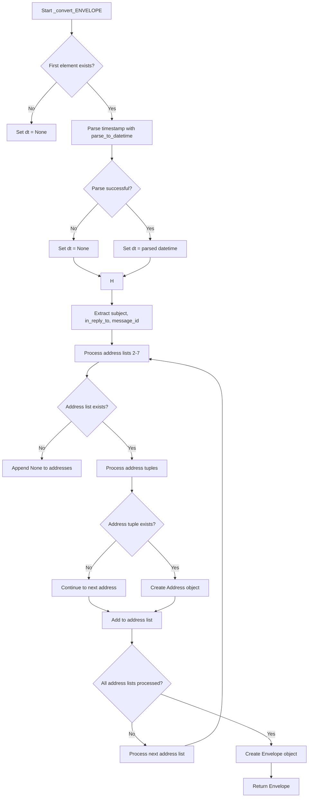
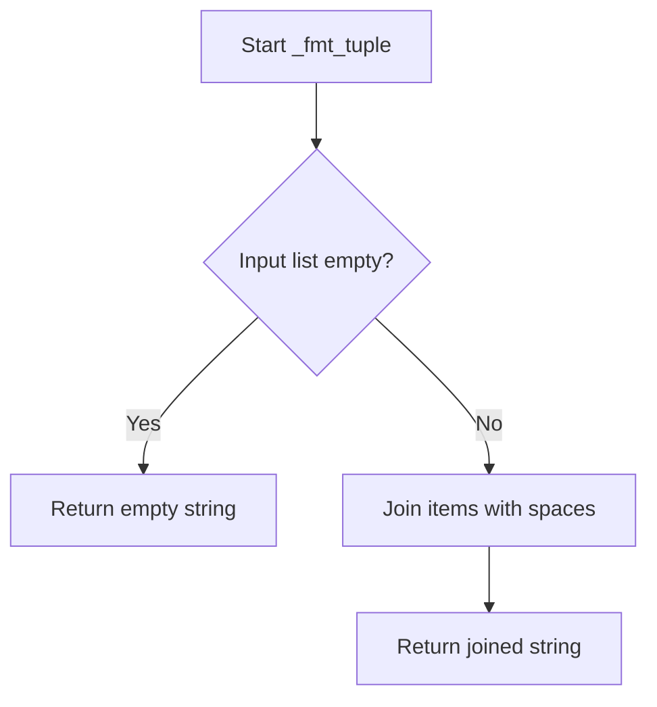

# `response_parser.py`

## `imapclient.response_parser.parse_response` · *function*

## Summary:
Converts IMAP protocol response byte chunks into a tuple of parsed Python objects.

## Description:
Processes a list of IMAP protocol response chunks and converts them into a tuple of parsed Python objects. This function serves as a convenience wrapper around the core parsing logic, handling the special case of empty responses and providing a consistent tuple-based return format.

The function is extracted into its own component to provide a clean interface for parsing IMAP responses while separating the concerns of handling special cases from the core parsing logic implemented in `gen_parsed_response`.

## Args:
    data (List[bytes]): A list of byte sequences representing IMAP protocol response chunks to be parsed.

## Returns:
    Tuple[_Atom, ...]: A tuple containing parsed Python objects representing the IMAP protocol tokens. The tuple can contain:
        - None: For NIL tokens
        - bytes: For unquoted tokens or literal text
        - str: For quoted string tokens (with quotes removed)
        - int: For numeric tokens that don't start with '0' (except for '0' itself)
        - tuple: For parenthesized tuple structures
    Returns an empty tuple when input data is [None].

## Raises:
    ProtocolError: When protocol violations are encountered during token parsing by the underlying `gen_parsed_response` function, including:
        - Malformed literal tokens that don't correspond to available literal data
        - Literal size mismatches between declared and actual literal lengths
        - Other IMAP protocol violations detected during token conversion

## Constraints:
    Preconditions:
    - Input data must be a valid list of byte sequences representing IMAP protocol responses
    - Each byte sequence should represent a complete or partial IMAP protocol chunk
    
    Postconditions:
    - Returns a tuple containing properly typed Python objects matching IMAP token semantics
    - All protocol errors are wrapped in ProtocolError exceptions

## Side Effects:
    None

## Control Flow:
```mermaid
flowchart TD
    A[Start parse_response] --> B{data == [None]?}
    B -- Yes --> C[Return empty tuple]
    B -- No --> D[Call gen_parsed_response(data)]
    D --> E[Convert iterator to tuple]
    E --> F[Return parsed tuple]
```

## Examples:
    >>> # Basic usage with simple response
    >>> response = [b'* 1 FETCH (UID 123)']
    >>> parse_response(response)
    (b'*', b'1', b'FETCH', b'(', b'UID', 123, b')')
    
    >>> # Handling NIL values
    >>> response = [b'* 1 FETCH (FLAGS NIL)']
    >>> parse_response(response)
    (b'*', b'1', b'FETCH', b'(', b'FLAGS', None, b')')
    
    >>> # Empty response case
    >>> parse_response([None])
    ()
```

## `imapclient.response_parser.parse_message_list` · *function*

## Summary:
Parses IMAP message identifier lists from protocol response data and extracts optional modseq values.

## Description:
Processes IMAP protocol response data containing message identifiers and optional metadata. This function handles the parsing of message ID sequences returned by IMAP SEARCH and FETCH commands, extracting the primary message IDs and any additional metadata such as modseq values.

The function is extracted into its own component to encapsulate the specific logic for parsing message ID lists from IMAP responses, separating this concern from general response parsing logic handled by `parse_response`. This allows for cleaner separation of concerns and makes the message ID parsing reusable across different IMAP operations.

## Args:
    data (List[Union[bytes, str]]): A list containing exactly one element representing the IMAP protocol response data. The element can be either bytes or string type containing the message ID list.

## Returns:
    SearchIds: An instance of SearchIds containing:
        - Primary message identifiers as integers in the list portion
        - Optional modseq value stored in the modseq attribute if present in the response

## Raises:
    ValueError: When the input data contains zero or multiple elements, or when the message data doesn't match the expected message ID format.

## Constraints:
    Preconditions:
    - Input data must be a list with exactly one element
    - The single element must be either bytes or string containing valid IMAP message ID data
    - Message ID data must conform to the expected format matched by _msg_id_pattern (a regex pattern that captures space-separated integers)
    
    Postconditions:
    - Returns a SearchIds object with parsed message IDs
    - If modseq information is present in the response, it's stored in the returned object's modseq attribute
    - Empty input returns an empty SearchIds object

## Side Effects:
    None

## Control Flow:
```mermaid
flowchart TD
    A[Start parse_message_list] --> B{len(data) != 1?}
    B -- Yes --> C[raise ValueError]
    B -- No --> D{message_data is empty?}
    D -- Yes --> E[return empty SearchIds]
    D -- No --> F{message_data is bytes?}
    F -- Yes --> G[decode to ascii string]
    F -- No --> H[continue with string]
    H --> I[match _msg_id_pattern against message_data]
    I -- No match --> J[raise ValueError]
    I -- Match --> K[create SearchIds from matched IDs]
    K --> L{extra data exists?}
    L -- Yes --> M[parse extra data with parse_response]
    M --> N{parsed item is modseq tuple?}
    N -- Yes --> O[set ids.modseq = item[1]]
    N -- No --> P{parsed item is int?}
    P -- Yes --> Q[ids.append(item)]
    L -- No --> R[return ids]
```

## Examples:
    >>> # Basic usage with message IDs
    >>> data = [b'1 2 3 4']
    >>> result = parse_message_list(data)
    >>> print(result)  # SearchIds([1, 2, 3, 4])
    
    >>> # Usage with modseq information
    >>> data = [b'1 2 3 MODSEQ 12345']
    >>> result = parse_message_list(data)
    >>> print(result)  # SearchIds([1, 2, 3])
    >>> print(result.modseq)  # 12345
    
    >>> # Empty response handling
    >>> data = [b'']
    >>> result = parse_message_list(data)
    >>> print(result)  # SearchIds([])
```

## `imapclient.response_parser.gen_parsed_response` · *function*

## Summary:
Generates parsed Python objects from IMAP protocol response tokens by converting raw byte tokens into appropriate Python data types.

## Description:
Processes a list of IMAP protocol response chunks and yields parsed Python objects by tokenizing the input and converting each token into its corresponding Python representation. This function serves as the entry point for IMAP response parsing, orchestrating the tokenization and conversion process for subsequent processing.

The function is extracted into its own component to separate the concerns of tokenization from token conversion, allowing for cleaner architecture where the tokenization logic is handled by TokenSource and the conversion logic by the atom() function. This modular approach enables better testability and maintainability of the parsing pipeline.

## Args:
    text (List[bytes]): A list of byte sequences representing IMAP protocol response chunks to be parsed.

## Returns:
    Iterator[_Atom]: An iterator yielding Python objects representing the parsed IMAP protocol tokens, where each item can be:
        - None: For NIL tokens
        - bytes: For unquoted tokens or literal text
        - str: For quoted string tokens (with quotes removed)
        - int: For numeric tokens that don't start with '0' (except for '0' itself)
        - tuple: For parenthesized tuple structures

## Raises:
    ProtocolError: When protocol violations are encountered during token parsing, including:
        - Malformed literal tokens that don't correspond to available literal data
        - Literal size mismatches between declared and actual literal lengths
        - Other IMAP protocol violations detected during token conversion

## Constraints:
    Preconditions:
    - Input text must be a valid list of byte sequences representing IMAP protocol responses
    - Each byte sequence should represent a complete or partial IMAP protocol chunk
    
    Postconditions:
    - Returns an iterator that produces properly typed Python objects matching IMAP token semantics
    - All protocol errors are wrapped in ProtocolError exceptions

## Side Effects:
    None

## Control Flow:
```mermaid
flowchart TD
    A[Start gen_parsed_response] --> B{text is empty?}
    B -- Yes --> C[Return empty iterator]
    B -- No --> D[Create TokenSource from text]
    D --> E[Iterate through tokens in TokenSource]
    E --> F[Call atom(src, token) for each token]
    F --> G[Yield parsed atom result]
    G --> H{Exception raised?}
    H -- Yes --> I{ProtocolError?}
    I -- Yes --> J[Raise as-is]
    I -- No --> K[Wrap ValueError in ProtocolError]
    H -- No --> L[Continue to next token]
    L --> E
```

## Examples:
    >>> # Basic usage with simple response
    >>> response = [b'* 1 FETCH (UID 123)']
    >>> list(gen_parsed_response(response))
    [b'*', b'1', b'FETCH', b'(', b'UID', 123, b')']
    
    >>> # Handling NIL values
    >>> response = [b'* 1 FETCH (FLAGS NIL)']
    >>> list(gen_parsed_response(response))
    [b'*', b'1', b'FETCH', b'(', b'FLAGS', None, b')']
    
    >>> # Processing quoted strings
    >>> response = [b'* 1 FETCH (SUBJECT "Hello World")']
    >>> list(gen_parsed_response(response))
    [b'*', b'1', b'FETCH', b'(', b'SUBJECT', 'Hello World', b')']
```

## `imapclient.response_parser.parse_fetch_response` · *function*

## Summary:
Parses IMAP FETCH command responses into structured data organized by message identifiers.

## Description:
Processes raw IMAP protocol response data from FETCH commands and converts it into a structured dictionary format. The function organizes parsed message data by message identifier (either sequence number or UID depending on configuration), making it easy to access specific message attributes.

This function is extracted into its own component to encapsulate the complex parsing logic for IMAP FETCH responses, separating the concerns of response parsing from the higher-level IMAP client operations. It handles various IMAP data types including timestamps, envelopes, body structures, and metadata, while providing flexible configuration options for UID handling and time normalization.

## Args:
    text (List[bytes]): Raw IMAP protocol response data as a list of byte sequences representing FETCH command results
    normalise_times (bool): When True (default), converts timezone-aware datetimes to local system timezone. When False, preserves original timezone information for date fields
    uid_is_key (bool): When True (default), uses the UID value as the key for organizing messages in the returned dictionary. When False, uses the sequence number as the key

## Returns:
    defaultdict[int, Dict[bytes, Union[bytes, int, datetime.datetime, Address, Envelope, BodyData]]]: A dictionary-like structure where keys are message identifiers (sequence numbers or UIDs) and values are dictionaries containing parsed message attributes. Each message data dictionary contains:
        - SEQ: Sequence number of the message
        - UID: Message UID (when present)
        - INTERNALDATE: Message internal date as datetime object
        - ENVELOPE: Parsed envelope information as Envelope object
        - BODY: Message body structure as BodyData object
        - BODYSTRUCTURE: Message body structure as BodyData object
        - Other message attributes as bytes or appropriate Python types

## Raises:
    ProtocolError: When encountering malformed IMAP protocol responses, including:
        - Invalid message IDs that cannot be converted to integers
        - Invalid UID values that cannot be converted to integers
        - Unexpected end-of-file conditions during parsing
        - Bad response types that are not tuples
        - Uneven number of response items in message data

## Constraints:
    Preconditions:
        - Input text must be a valid list of byte sequences representing IMAP protocol responses
        - Each byte sequence should represent a complete or partial IMAP protocol chunk
        - Response data should follow standard IMAP FETCH response format
        
    Postconditions:
        - Returns a defaultdict with integer keys representing message identifiers
        - All parsed dates are timezone-aware datetime objects when available
        - All parsed envelopes are properly structured Envelope objects
        - All parsed body structures are BodyData objects
        - When uid_is_key=True, message identifiers in the outer dictionary are UIDs
        - When uid_is_key=False, message identifiers in the outer dictionary are sequence numbers

## Side Effects:
    None

## Control Flow:
```mermaid
flowchart TD
    A[Start parse_fetch_response] --> B{text == [None]?}
    B -- Yes --> C[Return empty defaultdict]
    B -- No --> D[Call gen_parsed_response(text)]
    D --> E[Initialize parsed_response defaultdict]
    E --> F{More response data?}
    F -- No --> G[Return parsed_response]
    F -- Yes --> H[Get next message ID]
    H --> I{StopIteration?}
    I -- Yes --> G
    I -- No --> J[Get next message response tuple]
    J --> K{StopIteration?}
    K -- Yes --> L[Throw ProtocolError: unexpected EOF]
    K -- No --> M{Is message response tuple?}
    M -- No --> N[Throw ProtocolError: bad response type]
    M -- Yes --> O{Even number of items?}
    O -- No --> P[Throw ProtocolError: uneven number of response items]
    O -- Yes --> Q[Initialize msg_data with SEQ]
    Q --> R{Process message attributes}
    R --> S{Attribute is UID?}
    S -- Yes --> T{uid_is_key?}
    T -- Yes --> U[Update msg_id to UID]
    T -- No --> V[Store UID in msg_data]
    S -- No --> W{Attribute is INTERNALDATE?}
    W -- Yes --> X[Convert with _convert_INTERNALDATE]
    W -- No --> Y{Attribute is ENVELOPE?}
    Y -- Yes --> Z[Convert with _convert_ENVELOPE]
    Y -- No --> AA{Attribute is BODY/BODYSTRUCTURE?}
    AA -- Yes --> AB[Create BodyData with BodyData.create]
    AA -- No --> AC[Store as-is]
    AC --> AD[Update parsed_response[msg_id] with msg_data]
    AD --> AE{More messages?}
    AE -- Yes --> F
    AE -- No --> G
```

## Examples:
    >>> # Basic usage with sequence numbers
    >>> response = [b'* 1 FETCH (UID 123 INTERNALDATE "Mon, 01 Jan 2024 12:00:00 +0100" SUBJECT "Test")']
    >>> result = parse_fetch_response(response)
    >>> print(result[1]["UID"])
    123
    >>> print(result[1]["INTERNALDATE"])
    datetime.datetime(2024, 1, 1, 12, 0, 0, tzinfo=FixedOffset(60))
    
    >>> # Usage with UID keys
    >>> response = [b'* 1 FETCH (UID 123 INTERNALDATE "Mon, 01 Jan 2024 12:00:00 +0100" SUBJECT "Test")']
    >>> result = parse_fetch_response(response, uid_is_key=True)
    >>> print(result[123]["SEQ"])  # UID used as key
    1

## `imapclient.response_parser._int_or_error` · *function*

## Summary:
Converts an atom value to an integer, raising a protocol error with descriptive context if conversion fails.

## Description:
This utility function safely converts IMAP protocol response values (represented as _Atom type) to integers. It is designed to handle the common pattern of parsing numeric values from IMAP server responses where malformed data should result in a descriptive protocol error rather than a generic exception.

The function extracts parsing logic into a reusable component to avoid code duplication throughout the response parser module, enforcing a consistent error handling approach for numeric conversions.

## Args:
    value (_Atom): The value to convert to an integer, typically representing an IMAP protocol atom
    error_text (str): Contextual error message prefix to include in the ProtocolError if conversion fails

## Returns:
    int: The converted integer value from the input

## Raises:
    ProtocolError: When the value cannot be converted to an integer, with error_text and the repr() of the failing value included in the error message

## Constraints:
    Preconditions:
        - The value parameter must be convertible to an integer or raise TypeError or ValueError
        - The error_text parameter must be a string describing the expected value type
    
    Postconditions:
        - If successful, returns an integer representation of the input value
        - If unsuccessful, raises ProtocolError with formatted error message

## Side Effects:
    None

## Control Flow:
```mermaid
flowchart TD
    A[Start _int_or_error] --> B{Try int(value)}
    B -->|Success| C[Return int(value)]
    B -->|Failure| D[Catch TypeError/ValueError]
    D --> E[Format ProtocolError]
    E --> F[Raise ProtocolError]
```

## Examples:
    # Successful conversion
    result = _int_or_error("123", "Expected message ID")
    # Returns: 123
    
    # Failed conversion
    try:
        _int_or_error("invalid", "Expected sequence number")
    except ProtocolError as e:
        print(str(e))
        # Output: "Expected sequence number: 'invalid'"
```

## `imapclient.response_parser._convert_INTERNALDATE` · *function*

## Summary:
Converts an IMAP INTERNALDATE string into a timezone-aware Python datetime object, with optional time normalization.

## Description:
Parses an IMAP INTERNALDATE timestamp and converts it into a Python datetime object. This function serves as a wrapper around the core `parse_to_datetime` utility, providing a standardized interface for handling IMAP date parsing with graceful error recovery.

The function is designed to handle IMAP server responses containing date information, particularly INTERNALDATE fields that appear in various IMAP protocol responses. It provides robust error handling by returning None when parsing fails, making it safe for use in contexts where date data might be malformed or missing.

## Args:
    date_string (_Atom): The IMAP INTERNALDATE string to parse, typically provided as bytes. Can be None.
    normalise_times (bool): When True (default), converts timezone-aware datetimes to local system timezone. When False, preserves original timezone information.

## Returns:
    Optional[datetime.datetime]: A timezone-aware datetime object representing the parsed timestamp, or None if the input is None or parsing fails.

## Raises:
    None: This function catches ValueError exceptions from the underlying parser and returns None instead.

## Constraints:
    Preconditions:
        - Input date_string must be either None or a valid _Atom type (typically bytes)
        - If date_string is not None, it must represent a valid IMAP timestamp format
        
    Postconditions:
        - Returns None when input is None
        - Returns None when parsing fails due to invalid timestamp format
        - Returns a properly parsed datetime object when successful

## Side Effects:
    None

## Control Flow:
```mermaid
flowchart TD
    A[Input date_string] --> B{Is None?}
    B -- Yes --> C[Return None]
    B -- No --> D[Call parse_to_datetime()]
    D --> E{ValueError raised?}
    E -- Yes --> F[Return None]
    E -- No --> G[Return parsed datetime]
```

## Examples:
    >>> _convert_INTERNALDATE(b"Mon, 01 Jan 2024 12:00:00 +0100")
    datetime.datetime(2024, 1, 1, 12, 0, 0, tzinfo=FixedOffset(60))
    
    >>> _convert_INTERNALDATE(None)
    None
    
    >>> _convert_INTERNALDATE(b"Invalid timestamp")
    None
```

## `imapclient.response_parser._convert_ENVELOPE` · *function*

## Summary:
Converts raw IMAP envelope response data into a structured Envelope object with parsed datetime and address information.

## Description:
Processes a raw IMAP ENVELOPE response tuple and transforms it into a structured Envelope object containing parsed date/time information, subject, and various email address fields. This function extracts and converts timestamp data, subject text, and address lists from the IMAP response format into appropriate Python objects.

The function is extracted into its own component to encapsulate the complex parsing logic for IMAP envelope responses, separating concerns from the main parsing logic and making the envelope conversion reusable across different IMAP operations.

## Args:
    envelope_response (_Atom): Raw IMAP envelope response data as a tuple containing:
        - Index 0: Timestamp bytes or None
        - Index 1: Subject bytes  
        - Indices 2-7: Address list tuples or None for each address type
        - Index 8: In-reply-to bytes
        - Index 9: Message ID bytes
    normalise_times (bool): When True (default), normalizes timezone-aware datetimes to local system timezone. When False, preserves original timezone information

## Returns:
    Envelope: Structured envelope object with parsed date, subject, and address information

## Raises:
    None explicitly raised - ValueError from parse_to_datetime is caught and ignored

## Constraints:
    Preconditions:
        - envelope_response must be a tuple-like object with at least 10 elements
        - First element (timestamp) should be bytes or None
        - Second element (subject) should be bytes
        - Elements 2-7 should be tuples of address data or None
        - Eighth element (in_reply_to) should be bytes
        - Ninth element (message_id) should be bytes
    
    Postconditions:
        - Returns an Envelope object with properly parsed fields
        - Date field will be None if timestamp parsing fails or is None
        - Address fields will be None if no addresses are present in the response

## Side Effects:
    None

## Control Flow:


## Examples:
    >>> envelope_data = (
    ...     b"Mon, 01 Jan 2024 12:00:00 +0100",
    ...     b"Test Subject",
    ...     ((b"John Doe", b"", b"john", b"example.com"),),
    ...     None,
    ...     None,
    ...     None,
    ...     None,
    ...     None,
    ...     b"<reply@example.com>",
    ...     b"<msg123@example.com>"
    ... )
    >>> result = _convert_ENVELOPE(envelope_data)
    >>> print(result.subject)
    b'Test Subject'
    >>> print(result.date)
    datetime.datetime(2024, 1, 1, 12, 0, 0, tzinfo=FixedOffset(60))  # or naive datetime if normalise=True
    >>> print(result.from_)
    (Address(name=b'John Doe', route=b'', mailbox=b'john', host=b'example.com'),)

## `imapclient.response_parser.atom` · *function*

## Summary:
Converts IMAP protocol tokens into appropriate Python data types, handling atoms, literals, integers, and NIL values.

## Description:
Parses IMAP protocol tokens and converts them into their corresponding Python representations. This function serves as the core token-to-type converter in the IMAP response parser, handling various token formats including quoted strings, numeric values, NIL indicators, and literal data blocks.

The function is extracted into its own component to encapsulate the logic for interpreting IMAP protocol tokens into Python-native types, separating this parsing concern from higher-level response processing logic. This modular design enables clean handling of different token types while maintaining a consistent interface for downstream parsers.

## Args:
    src (TokenSource): Source of IMAP protocol tokens providing access to the current literal data when needed for literal token processing.
    token (bytes): Raw IMAP protocol token to be parsed and converted into a Python type.

## Returns:
    _Atom: A Python representation of the IMAP token, which can be:
        - None: For NIL tokens
        - bytes: For unquoted tokens or literal text
        - str: For quoted string tokens (with quotes removed)
        - int: For numeric tokens that don't start with '0' (except for '0' itself)
        - tuple: For parenthesized tuple structures (via parse_tuple call)

## Raises:
    ProtocolError: When literal tokens don't correspond to available literal data or when literal sizes don't match expected lengths.

## Constraints:
    Preconditions:
    - The token parameter must be a valid IMAP protocol token
    - For literal tokens (starting with '{'), src.current_literal must be set to the corresponding literal data
    - src must be a properly initialized TokenSource with valid token stream
    
    Postconditions:
    - Returns a properly typed Python object matching the IMAP token semantics
    - Raises ProtocolError for malformed literal tokens or mismatched literal sizes

## Side Effects:
    None

## Control Flow:
```mermaid
flowchart TD
    A[Start atom()] --> B{token == b"("}
    B -- Yes --> C[Call parse_tuple(src)]
    B -- No --> D{token == b"NIL"}
    D -- Yes --> E[Return None]
    D -- No --> F{token starts with b"{")
    F -- Yes --> G[Extract literal length]
    G --> H{src.current_literal is None?}
    H -- Yes --> I[Raise ProtocolError]
    H -- No --> J{literal length matches?}
    J -- No --> K[Raise ProtocolError]
    J -- Yes --> L[Return literal_text]
    F -- No --> M{token is quoted string?}
    M -- Yes --> N[Return token without quotes]
    M -- No --> O{token is digit?}
    O -- Yes --> P{token starts with b"0" and len > 1?}
    P -- Yes --> Q[Return token as-is]
    P -- No --> R[Return token as int]
    O -- No --> S[Return token as-is]
```

## Examples:
    >>> # Parsing a NIL value
    >>> atom(src, b"NIL")
    None
    
    >>> # Parsing a quoted string
    >>> atom(src, b'"Hello World"')
    'Hello World'
    
    >>> # Parsing an integer (valid numeric token)
    >>> atom(src, b"123")
    123
    
    >>> # Parsing zero (special case)
    >>> atom(src, b"0")
    0
    
    >>> # Parsing a literal
    >>> src.current_literal = b"Hello world"
    >>> atom(src, b"{11}")
    b"Hello world"
    
    >>> # Parsing a regular token
    >>> atom(src, b"INBOX")
    b"INBOX"

## `imapclient.response_parser.parse_tuple` · *function*

## Summary:
Parses a sequence of IMAP protocol tokens into a tuple structure, handling nested structures and various token types.

## Description:
Processes tokens from a TokenSource until encountering a closing parenthesis, converting each token into appropriate Python types using the atom parser. This function enables recursive parsing of nested IMAP protocol structures where tuples can contain other tuples, making it essential for parsing complex IMAP response elements like envelope structures and body data.

The function is extracted into its own component to handle the recursive nature of IMAP protocol parsing, separating the tuple parsing logic from the atom conversion logic. This modular approach allows for clean handling of nested structures and maintains separation of concerns in the IMAP response parser.

## Args:
    src (TokenSource): An iterator over IMAP protocol tokens that provides sequential access to parsed response elements. The source must contain properly formatted IMAP tokens including opening and closing parentheses for tuple structures.

## Returns:
    _Atom: A tuple containing parsed elements from the token stream. Each element is converted to its appropriate Python type (string, integer, None, or nested tuple) by the atom() function.

## Raises:
    ProtocolError: When the tuple structure is incomplete (no closing parenthesis found) or when literal size mismatches occur during parsing.

## Constraints:
    Preconditions:
    - Input TokenSource must be properly initialized with valid IMAP protocol tokens
    - The token stream must begin with an opening parenthesis (though this is implicitly handled by the caller)
    - All tokens in the stream must conform to IMAP protocol specifications
    
    Postconditions:
    - Returns a properly formed tuple with all elements converted to appropriate Python types
    - Raises ProtocolError if the tuple structure is malformed or incomplete

## Side Effects:
    None

## Control Flow:
```mermaid
flowchart TD
    A[Start parse_tuple] --> B[Initialize empty list]
    B --> C[Iterate through tokens from src]
    C --> D{Token equals b")"?}
    D -- Yes --> E[Return tuple of collected elements]
    D -- No --> F[Process token with atom()]
    F --> G[Append result to output list]
    G --> C
    C --> H{End of token stream?}
    H -- Yes --> I[Raise ProtocolError]
```

## Examples:
    >>> # Parsing a simple tuple
    >>> tokens = TokenSource([b'(INBOX UNSEEN)'])
    >>> parse_tuple(tokens)
    ('INBOX', 'UNSEEN')
    
    >>> # Parsing nested tuples
    >>> tokens = TokenSource([b'((FROM "test@example.com") SUBJECT "Test")'])
    >>> parse_tuple(tokens)
    (('FROM', 'test@example.com'), 'SUBJECT', 'Test')
    
    >>> # Handling incomplete tuple (raises ProtocolError)
    >>> tokens = TokenSource([b'(INBOX UNSEEN'])
    >>> parse_tuple(tokens)
    # Raises ProtocolError: Tuple incomplete before "(INBOX UNSEEN"
```

## `imapclient.response_parser._fmt_tuple` · *function*

## Summary:
Converts a list of IMAP protocol tokens into a space-delimited string representation.

## Description:
This utility function transforms a list of IMAP protocol tokens (represented as _Atom objects) into a single string by joining them with spaces. It serves as a formatting helper for IMAP response parsing operations, commonly used when reconstructing command arguments or response elements from parsed token sequences.

## Args:
    t (List[_Atom]): A list of IMAP protocol tokens that can be converted to strings. These typically represent parsed elements from IMAP protocol responses such as mailbox names, flags, or search criteria.

## Returns:
    str: A space-delimited string containing all elements from the input list. Empty list returns empty string.

## Raises:
    None

## Constraints:
    Preconditions:
    - Input list must be iterable
    - Each item in the list must be convertible to a string via str() function
    
    Postconditions:
    - Output string contains all elements from input list joined by single spaces
    - Empty list returns empty string

## Side Effects:
    None

## Control Flow:


## Examples:
    >>> _fmt_tuple(['INBOX', 'UNSEEN'])
    'INBOX UNSEEN'
    
    >>> _fmt_tuple([])
    ''
    
    >>> _fmt_tuple(['FLAGGED', 'NOT', 'DELETED'])
    'FLAGGED NOT DELETED'
    
    >>> _fmt_tuple(['test@example.com'])
    'test@example.com'
```

