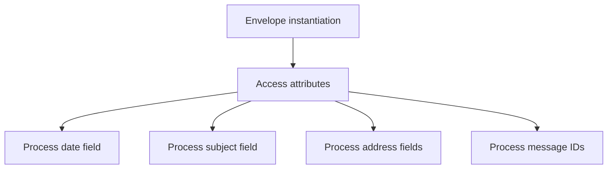
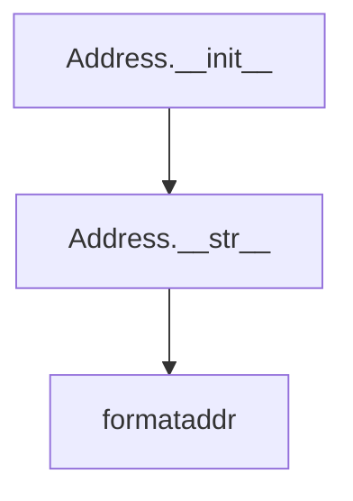
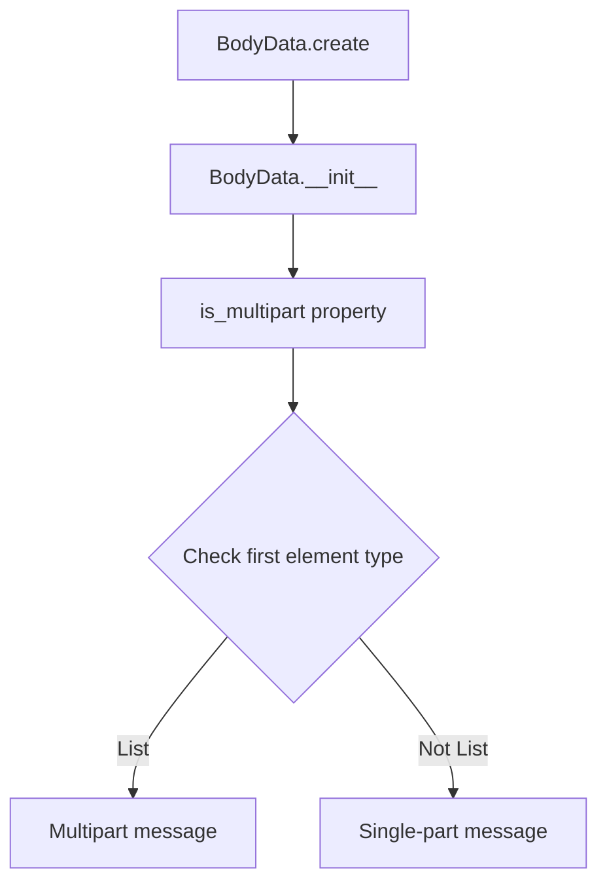

# `response_types.py`

## `imapclient.response_types.Envelope` · *class*

## Summary:
Represents an email message envelope containing metadata for IMAP protocol processing, defined as a data structure with typed attributes.

## Description:
The Envelope class is a data structure that holds email envelope information extracted from IMAP server responses. It contains standard email header fields including date, subject, sender information, and message identifiers. This class is defined with typed attributes only, suggesting it's intended to function as a dataclass (likely via automatic generation or explicit dataclass decoration not shown in the provided code).

## State:
- date: Optional[datetime.datetime] - The date and time the message was sent, or None if not available
- subject: bytes - The raw subject line of the email message as bytes
- from_: Optional[Tuple["Address", ...]] - Sender address information, or None if not available
- sender: Optional[Tuple["Address", ...]] - Explicit sender address information, or None if not available  
- reply_to: Optional[Tuple["Address", ...]] - Reply-to address information, or None if not available
- to: Optional[Tuple["Address", ...]] - Primary recipient addresses, or None if not available
- cc: Optional[Tuple["Address", ...]] - Carbon copy recipient addresses, or None if not available
- bcc: Optional[Tuple["Address", ...]] - Blind carbon copy recipient addresses, or None if not available
- in_reply_to: bytes - Reference to the message ID this message is replying to, as bytes
- message_id: bytes - Unique identifier for the email message, as bytes

All attributes are typed according to their expected values and are designed to store email envelope metadata.

## Lifecycle:
- Creation: Instantiated by IMAP response parsers with appropriate field values. As a dataclass-like structure, it likely supports automatic generation of initialization, representation, and comparison methods.
- Usage: Access attributes directly to retrieve email envelope information
- Destruction: Uses standard Python garbage collection; no special cleanup required

## Method Map:


## Raises:
No exceptions are explicitly raised by the __init__ method as it's a simple data class with no validation.

## Example:
```python
# Typical usage in IMAP response processing
# This represents how the class would be used once instantiated
envelope = Envelope(
    date=datetime.datetime(2023, 1, 15, 10, 30, 0),
    subject=b"Meeting Tomorrow",
    from_=(Address(name=b"John Doe", route=b"", mailbox=b"john", host=b"company.com"),),
    sender=None,
    reply_to=None,
    to=None,
    cc=None,
    bcc=None,
    in_reply_to=b"<original-message-id@company.com>",
    message_id=b"<unique-message-id@company.com>"
)

# Accessing envelope information
print(envelope.subject.decode('utf-8'))  # "Meeting Tomorrow"
print(envelope.date)  # datetime object
```

## `imapclient.response_types.Address` · *class*

## Summary:
Represents an email address with name, route, mailbox, and host components for IMAP protocol processing.

## Description:
The Address class encapsulates the components of an email address as byte strings, providing proper string formatting for display purposes. It is designed to handle email addresses received from IMAP servers and convert them into human-readable format using standard email formatting conventions.

## State:
- name: bytes - The display name portion of the email address
- route: bytes - The routing information for the email address (typically empty for basic addresses)
- mailbox: bytes - The mailbox/local part of the email address
- host: bytes - The domain/host portion of the email address

All attributes are initialized as byte strings and are expected to be processed through the to_unicode utility function for proper string representation.

## Lifecycle:
- Creation: Instantiate with any combination of the four byte attributes
- Usage: Typically used in IMAP response parsing where email addresses are returned from server operations
- Destruction: No special cleanup required; uses standard Python garbage collection

## Method Map:


## Raises:
No exceptions are explicitly raised by the __init__ method as it's a simple data class with no validation.

## Example:
```python
# Create an address instance
addr = Address(
    name=b"John Doe",
    route=b"",
    mailbox=b"john.doe",
    host=b"example.com"
)

# Convert to readable string format
print(str(addr))  # Output: "John Doe <john.doe@example.com>"
```

### `imapclient.response_types.Address.__str__` · *method*

## Summary:
Converts an Address object to a properly formatted email address string representation.

## Description:
This method transforms an Address object into a formatted email address string suitable for use in email headers. It handles two cases: when both mailbox and host are present (constructing "mailbox@host"), and when only one address component is available (using "mailbox_or_host"). The final result follows standard email address formatting conventions using the email.utils.formataddr function.

## Args:
    None

## Returns:
    str: A formatted email address string in the format:
         - "Name <mailbox@host>" when both mailbox and host are present
         - "Name <mailbox_or_host>" when only one address component is present  
         - "mailbox_or_host" when name is empty/None
         The exact format depends on the email.utils.formataddr behavior with the given name and address components.

## Raises:
    None explicitly raised

## State Changes:
    Attributes READ: self.name, self.mailbox, self.host
    Attributes WRITTEN: None

## Constraints:
    Preconditions: The Address object must have valid bytes or string attributes (name, mailbox, host)
    Postconditions: Returns a properly formatted email address string that can be used in email headers

## Side Effects:
    None

## `imapclient.response_types.SearchIds` · *class*

## Summary:
A specialized list type for IMAP search results that includes a modification sequence number tracking capability.

## Description:
The SearchIds class extends Python's built-in List[int] to represent IMAP search results, which are typically sequences of message identifiers. Beyond storing the message IDs, this class also maintains a modification sequence number (modseq) that tracks changes to the mailbox. This is commonly used in IMAP protocols to efficiently track mailbox modifications and implement conditional operations.

The class is typically instantiated by IMAP client methods that execute search commands and return matching message identifiers along with associated metadata.

## State:
- `modseq: Optional[int]` - Tracks the modification sequence number for the mailbox state. When None, indicates no sequence number has been set or the operation doesn't support sequence tracking. When set to an integer, represents the sequence number that can be used for conditional IMAP operations.

## Lifecycle:
- Creation: Instantiated by passing message IDs to the constructor, typically by IMAP client search operations
- Usage: Message IDs can be accessed via standard list operations, modseq can be checked or updated as needed
- Destruction: Inherits standard Python list cleanup behavior

## Method Map:
```mermaid
graph TD
    A[SearchIds Constructor] --> B[List[int] Operations]
    B --> C[modseq Access/Update]
```

## Raises:
- No explicit exceptions raised by __init__
- Standard List[int] constructor exceptions may be raised if invalid arguments are passed

## Example:
```python
# Creating a SearchIds instance with message IDs
search_results = SearchIds([1, 5, 10, 15])

# Accessing message IDs (standard list operations)
print(search_results[0])  # Output: 1
print(len(search_results))  # Output: 4

# Setting modification sequence number
search_results.modseq = 12345

# Checking modification sequence
if search_results.modseq is not None:
    print(f"Modification sequence: {search_results.modseq}")
```

### `imapclient.response_types.SearchIds.__init__` · *method*

## Summary:
Initializes a SearchIds instance with optional message IDs and sets the modification sequence number to None.

## Description:
The SearchIds.__init__ method serves as the constructor for the SearchIds class, which extends Python's built-in List[int] to represent IMAP search results. This method delegates initialization to the parent List class while initializing the modseq attribute to None. The modseq attribute is used to track mailbox modifications in IMAP protocols and is typically set later by IMAP client operations.

This method is called during the instantiation of SearchIds objects, typically by IMAP client search operations that return matching message identifiers. It ensures proper initialization of the underlying list structure and prepares the object for subsequent modification sequence tracking.

## Args:
    *args (Any): Variable length argument list passed to the parent List[int] constructor. These arguments are typically message IDs that will be stored in the list.

## Returns:
    None: This method does not return a value.

## Raises:
    No explicit exceptions are raised by this method.
    However, the parent List[int] constructor may raise exceptions if invalid arguments are provided (e.g., TypeError if arguments are not iterable).

## State Changes:
    Attributes READ: None
    Attributes WRITTEN: 
    - self.modseq: Set to None to initialize the modification sequence tracking

## Constraints:
    Preconditions:
    - The arguments passed to *args must be compatible with the List[int] constructor
    - The SearchIds class must be properly imported and available in scope
    
    Postconditions:
    - The object is initialized as a List[int] containing the provided message IDs
    - The modseq attribute is initialized to None
    - All standard List[int] operations are available on the instance

## Side Effects:
    None: This method performs no I/O operations, external service calls, or mutations to objects outside self.

## `imapclient.response_types.BodyData` · *class*

## Summary:
Represents structured email message data from IMAP responses, supporting both single-part and multipart email content through tuple-based hierarchical parsing.

## Description:
The BodyData class provides a structured representation of email message content received from IMAP servers. It parses raw IMAP response tuples into hierarchical data structures that can represent both simple (single-part) and complex (multipart) email messages. This class is designed to be instantiated exclusively through the `create` classmethod, which processes IMAP response data according to IMAP protocol specifications.

The class enables efficient navigation and processing of email content by distinguishing between different message structures through the `is_multipart` property. It supports nested message structures where multipart messages contain lists of subparts, while single-part messages contain flat metadata tuples.

## State:
- Inherits from `_BodyDataType` (likely a tuple-like dataclass or namedtuple structure)
- Stores parsed IMAP response data as a tuple that can represent:
  - Single-part messages: flat tuple structure containing message metadata
  - Multipart messages: nested structure where the first element is a list of subparts
- The first element serves as a structural indicator:
  - If it's a list, the instance represents a multipart message with nested parts
  - If it's not a list, it represents a single-part message
- Implements tuple-like indexing behavior through inherited methods (supports `self[0]`, etc.)

## Lifecycle:
- Creation: Instances must be created using the `create` classmethod with IMAP response tuples
- Usage: Access the `is_multipart` property to determine structure type, then navigate nested data using standard tuple indexing
- Destruction: No explicit cleanup required; relies on Python's garbage collection

## Method Map:


## Raises:
- No explicit exceptions are documented in the source code
- The `create` method assumes proper IMAP response structure
- Invalid response formats could potentially cause runtime errors during parsing
- IndexError may occur if accessing elements beyond the tuple length
- TypeError may occur if response contains unexpected data types

## Example:
```python
# Creating a BodyData instance from IMAP response
response_tuple = (
    ('text', 'plain', ('charset', 'us-ascii'), None, None, '7bit', 13, 1),
    ('text', 'html', ('charset', 'us-ascii'), None, None, '7bit', 25, 2)
)
body_data = BodyData.create(response_tuple)

# Checking if it's multipart
if body_data.is_multipart:
    print("This is a multipart message")
    # Access nested parts
    for part in body_data[0]:
        print(f"Part: {part}")
else:
    print("This is a single-part message")
    # Access single part data
    print(f"Content type: {body_data[0][0]}")

# For multipart messages, you can access subparts recursively
if body_data.is_multipart:
    subparts = body_data[0]  # This is a list of subparts
    for i, subpart in enumerate(subparts):
        print(f"Subpart {i}: {subpart}")
```

### `imapclient.response_types.BodyData.create` · *method*

## Summary:
Creates a BodyData instance from an IMAP response tuple, recursively processing multipart message structures by converting tuple parts into nested BodyData objects.

## Description:
This class method serves as a factory for creating BodyData instances from raw IMAP response tuples. When the first element of the response is a tuple (indicating a multipart message), it identifies and recursively processes all consecutive tuple elements until encountering bytes data. The resulting structure maintains the hierarchical nature of IMAP multipart responses by creating a list of nested BodyData objects as the first element, followed by the remaining response elements.

## Args:
    cls: The BodyData class itself (used for classmethod)
    response (Tuple[_Atom, ...]): IMAP response tuple containing body data, where:
        - First element being a tuple indicates multipart structure
        - Consecutive tuple elements represent message parts
        - Bytes elements indicate end of part definitions

## Returns:
    BodyData: A new BodyData instance with structure:
        - For multipart: (list[BodyData], *remaining_response_elements)
        - For simple: (response_elements...)

## Raises:
    None explicitly raised - relies on underlying class constructor behavior

## State Changes:
    None - this is a factory method that creates and returns a new instance

## Constraints:
    Preconditions:
    - response must be a tuple of _Atom elements
    - response[0] must be either a tuple (indicating multipart) or other _Atom type
    - When response[0] is a tuple, subsequent elements should follow IMAP multipart conventions
    
    Postconditions:
    - Returns a BodyData instance with proper structure matching the input response
    - For multipart responses, nested BodyData instances are created recursively for each tuple part
    - The returned instance maintains the hierarchical structure of the original IMAP response

## Side Effects:
    None - pure factory method with no external I/O or state mutation

### `imapclient.response_types.BodyData.is_multipart` · *method*

## Summary:
Determines whether the body data represents a multipart message structure by checking if the first element is a list.

## Description:
This property examines the internal structure of IMAP body data to identify whether it represents a multipart message. In IMAP responses, multipart messages are structured with the first element being a list containing the individual message parts, while single-part messages have the first element as a different data type. This property is used during IMAP message parsing to distinguish between multipart and single-part message structures.

## Args:
    None

## Returns:
    bool: True if the body data represents a multipart message (first element is a list), False otherwise.

## Raises:
    None

## State Changes:
    Attributes READ: self[0] - accesses the first element of the body data structure
    Attributes WRITTEN: None

## Constraints:
    Preconditions:
    - The object must be initialized with valid IMAP body data
    - The first element of the data structure must be accessible via indexing
    
    Postconditions:
    - Returns a boolean value indicating multipart status
    - Does not modify the object's state

## Side Effects:
    None - pure property with no external I/O or state mutation

