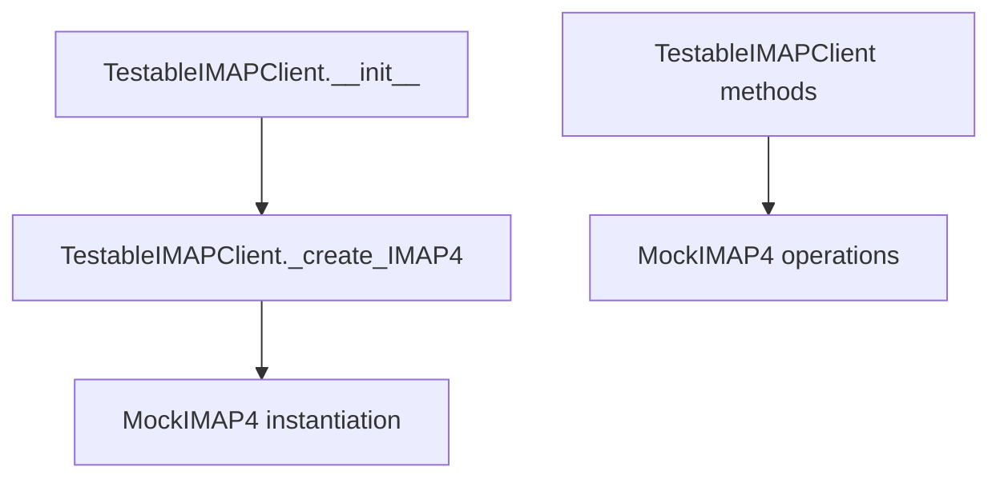

# `testable_imapclient.py`

## `imapclient.testable_imapclient.TestableIMAPClient` · *class*

## Summary:
TestableIMAPClient is a test utility class that extends IMAPClient to provide mock IMAP functionality for unit testing scenarios.

## Description:
This class serves as a specialized test fixture that enables unit testing of IMAP-related code without requiring actual network connections or real IMAP server interactions. It inherits from IMAPClient but overrides the internal IMAP4 creation mechanism to return a MockIMAP4 instance instead of establishing a real connection. This allows developers to test IMAP operations while capturing command interactions and verifying expected behaviors without external dependencies.

## State:
- host (inherited from IMAPClient): str, set to "somehost" by default in constructor
- _create_IMAP4 method: overridden to return MockIMAP4 instances instead of real IMAP4 connections
- All other IMAPClient state attributes remain unchanged

## Lifecycle:
- Creation: Instantiated without arguments, automatically initializes with hardcoded "somehost" server
- Usage: Methods inherited from IMAPClient can be called normally, but all IMAP operations are mocked
- Destruction: Inherits standard object cleanup behavior; no special cleanup required

## Method Map:


## Raises:
- No explicit exceptions raised by __init__
- All exceptions would be inherited from IMAPClient parent class behavior

## Example:
```python
# Create testable IMAP client
test_client = TestableIMAPClient()

# Use it like a normal IMAP client (but with mocked behavior)
# All operations will be mocked and tracked by MockIMAP4
test_client.login("user", "password")
test_client.select_folder("INBOX")

# The underlying MockIMAP4 instance handles all operations
# and can be inspected for command tracking and state
```

### `imapclient.testable_imapclient.TestableIMAPClient.__init__` · *method*

## Summary:
Initializes a TestableIMAPClient instance with a fixed hostname for testing purposes.

## Description:
This constructor sets up the TestableIMAPClient with a predefined hostname "somehost" and prepares it for mock IMAP operations. It is specifically designed for unit testing scenarios where real IMAP server connections are undesirable or impossible. The method overrides the normal IMAP connection establishment process by replacing it with mock functionality through the _create_IMAP4 method.

## Args:
    None

## Returns:
    None

## Raises:
    None

## State Changes:
    Attributes READ: None
    Attributes WRITTEN: 
    - self.host: Set to "somehost" (inherited from IMAPClient)
    - All other IMAPClient state attributes initialized through parent constructor

## Constraints:
    Preconditions: None
    Postconditions: 
    - The instance is properly initialized with host="somehost"
    - The _create_IMAP4 method is overridden to return MockIMAP4 instances
    - All IMAPClient initialization logic is executed through parent constructor

## Side Effects:
    None

### `imapclient.testable_imapclient.TestableIMAPClient._create_IMAP4` · *method*

## Summary:
Creates and returns a new MockIMAP4 instance for testing purposes.

## Description:
Factory method that instantiates and returns a MockIMAP4 object. This method serves as a hook point in the TestableIMAPClient class to allow for easy mocking of IMAP4 connections during unit testing. Instead of creating a real IMAP4 connection, this method provides a mock implementation that simulates IMAP server interactions without requiring network connectivity.

The method is called during the initialization of TestableIMAPClient instances and enables testability by allowing developers to substitute the real IMAP4 connection with a mock implementation that tracks commands and maintains state for verification.

## Args:
    None

## Returns:
    MockIMAP4: A new instance of the MockIMAP4 mock class that implements the IMAP4 interface for testing.

## Raises:
    None

## State Changes:
    Attributes READ: None
    Attributes WRITTEN: None

## Constraints:
    Preconditions: None
    Postconditions: Always returns a new MockIMAP4 instance with default configuration.

## Side Effects:
    None

## `imapclient.testable_imapclient.MockIMAP4` · *class*

## Summary:
MockIMAP4 is a test utility class that provides a mock implementation of an IMAP4 client interface for unit testing purposes.

## Description:
This class extends unittest.mock.Mock to create a mock IMAP4 client that can be used in unit tests to simulate IMAP server interactions without requiring actual network connections. It tracks sent commands and maintains state variables that would normally be managed by a real IMAP client. The class is specifically designed to support testing scenarios where IMAP operations need to be mocked while preserving the interface compatibility with real IMAP clients.

## State:
- use_uid: bool, always set to True, indicating UID-based operations are enabled
- sent: bytes, accumulates all data sent through the send() method for testing verification
- tagged_commands: dict, stores command-tag mappings for tracking IMAP protocol commands
- _starttls_done: bool, tracks whether STARTTLS has been completed (initially False)

## Lifecycle:
- Creation: Instantiated like any standard Mock object, accepting arbitrary arguments and keyword arguments
- Usage: Typically used in test contexts where IMAP operations are mocked; methods like send() are called to simulate communication
- Destruction: Inherits standard Mock cleanup behavior; no special cleanup required

## Method Map:
```mermaid
graph TD
    A[MockIMAP4.__init__] --> B[MockIMAP4.send]
    A --> C[MockIMAP4._new_tag]
    B --> D[MockIMAP4.sent accumulation]
    C --> E[Returns fixed "tag" string]
```

## Raises:
- No explicit exceptions raised by __init__
- All exceptions would come from the parent Mock class behavior

## Example:
```python
# Create mock IMAP client
mock_client = MockIMAP4()

# Send data (accumulated in sent attribute)
mock_client.send(b"LOGIN user password\r\n")

# Verify what was sent
assert mock_client.sent == b"LOGIN user password\r\n"

# Get new tag
tag = mock_client._new_tag()
assert tag == "tag"
```

### `imapclient.testable_imapclient.MockIMAP4.__init__` · *method*

## Summary:
Initializes a mock IMAP client instance with test-friendly state tracking capabilities.

## Description:
Sets up a MockIMAP4 instance that extends unittest.mock.Mock to simulate IMAP client behavior for testing purposes. This initialization configures default IMAP settings and establishes tracking mechanisms for monitoring client-server interactions during tests.

## Args:
    *args (Any): Variable length argument list passed to the parent Mock constructor
    **kwargs (Any): Arbitrary keyword arguments passed to the parent Mock constructor

## Returns:
    None: This method initializes the object in-place and returns nothing

## Raises:
    None: This method does not raise any exceptions explicitly

## State Changes:
    Attributes READ: None
    Attributes WRITTEN: 
        - self.use_uid: Set to True to enable UID-based operations
        - self.sent: Initialized as empty bytes to accumulate sent data
        - self.tagged_commands: Initialized as empty dictionary to track commands
        - self._starttls_done: Initialized as False to track TLS state

## Constraints:
    Preconditions: None
    Postconditions: 
        - The instance is properly initialized as a Mock subclass
        - All tracking attributes are initialized with appropriate default values
        - The use_uid attribute is set to True for IMAP compatibility

## Side Effects:
    None: This method performs only local state initialization and has no external side effects

### `imapclient.testable_imapclient.MockIMAP4.send` · *method*

## Summary:
Accumulates outgoing data bytes into the internal sent buffer for testing purposes.

## Description:
This method is used in test environments to capture and track data being sent over the IMAP connection. It appends the provided bytes to the internal `sent` buffer, allowing tests to verify what data was transmitted without requiring actual network communication.

## Args:
    data (bytes): The byte string to append to the internal sent buffer

## Returns:
    None: This method does not return any value

## Raises:
    None: This method does not raise any exceptions

## State Changes:
    Attributes READ: None
    Attributes WRITTEN: self.sent

## Constraints:
    Preconditions: The object must be properly initialized with a `sent` attribute
    Postconditions: The `sent` attribute will contain the concatenation of all previously sent data plus the new data

## Side Effects:
    Mutates the internal `sent` attribute of the MockIMAP4 instance

### `imapclient.testable_imapclient.MockIMAP4._new_tag` · *method*

## Summary:
Generates and returns a constant tag string for use in IMAP command identification during testing.

## Description:
This method serves as a mock implementation of IMAP tag generation, returning a fixed "tag" string instead of generating unique tags. It is used exclusively in test environments to simplify IMAP command tracking and verification without requiring complex tag management.

## Args:
    self: The MockIMAP4 instance

## Returns:
    str: Always returns the string "tag"

## Raises:
    None

## State Changes:
    Attributes READ: None
    Attributes WRITTEN: None

## Constraints:
    Preconditions: None
    Postconditions: Always returns "tag" string

## Side Effects:
    None

