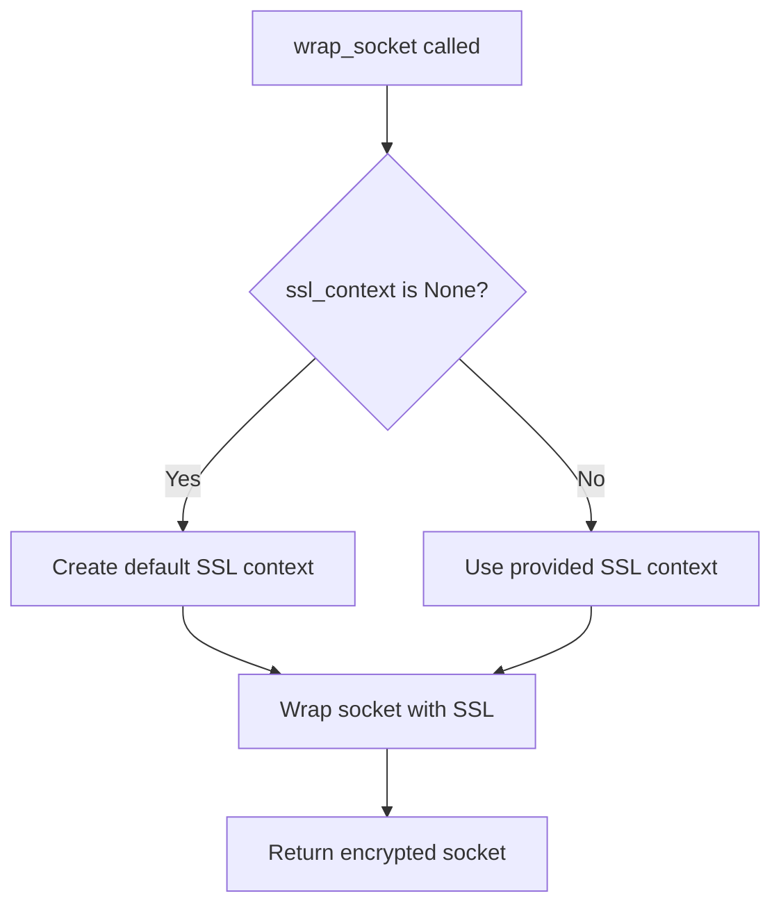

# `tls.py`

## `imapclient.tls.wrap_socket` · *function*

## Summary:
Establishes a secure SSL/TLS connection on a given socket using the specified SSL context and hostname.

## Description:
Wraps a plain socket with SSL/TLS encryption for secure communication. This function provides a standardized way to enable TLS encryption on network connections, particularly useful for email protocols like IMAP that support secure connections.

## Args:
    sock (socket.socket): The underlying socket to be wrapped with SSL/TLS encryption
    ssl_context (Optional[ssl.SSLContext]): SSL context configuration for the secure connection. If None, a default context is created with SERVER_AUTH purpose
    host (str): The hostname of the server for certificate validation and SNI (Server Name Indication)

## Returns:
    socket.socket: A new socket object wrapped with SSL/TLS encryption that can be used for secure communication

## Raises:
    ssl.SSLError: When SSL/TLS handshake fails or certificate validation encounters issues
    OSError: When underlying socket operations fail (network errors, etc.)

## Constraints:
    Preconditions:
        - The socket must be connected to a remote server before calling this function
        - The host parameter should match the hostname used for certificate validation
        - The ssl_context parameter, if provided, should be properly configured
    
    Postconditions:
        - Returns a socket object that behaves like the original but with encrypted communication
        - The returned socket maintains the same interface as the input socket

## Side Effects:
    - Establishes a secure TLS connection with the remote server
    - May perform certificate validation and handshake operations
    - Network I/O operations during the TLS handshake process

## Control Flow:


## Examples:
```python
import socket
import ssl
from imapclient.tls import wrap_socket

# Basic usage with automatic context creation
sock = socket.socket(socket.AF_INET, socket.SOCK_STREAM)
sock.connect(('imap.example.com', 993))
secure_sock = wrap_socket(sock, None, 'imap.example.com')

# Usage with custom SSL context
context = ssl.create_default_context()
context.check_hostname = True
context.verify_mode = ssl.CERT_REQUIRED
secure_sock = wrap_socket(sock, context, 'imap.example.com')
```

## `imapclient.tls.IMAP4_TLS` · *class*

## Summary:
IMAP4_TLS is a secure IMAP client that extends the standard IMAP4 class to provide SSL/TLS encrypted communication with IMAP servers.

## Description:
This class implements a TLS-enabled IMAP client that securely connects to IMAP servers using SSL/TLS encryption. It extends the standard imaplib.IMAP4 class to add secure communication capabilities while maintaining compatibility with existing IMAP operations. The class is designed for secure email access over networks where plaintext communication would be insecure.

## State:
- ssl_context: Optional[ssl.SSLContext] - SSL context configuration for secure connections. If None, a default context is created.
- _timeout: Optional[float] - Default timeout value for socket operations, used when no explicit timeout is provided to methods.
- host: str - Hostname of the IMAP server (set during open() method execution)
- port: int - Port number for the IMAP server connection (set during open() method execution)
- sock: socket.socket - Underlying socket object for secure communication (set during open() method execution)
- file: io.BufferedReader - Buffered reader for reading responses from the IMAP server (initialized during open() method execution)

## Lifecycle:
- Creation: Instantiate with host, port, ssl_context, and optional timeout parameters
- Usage: Call open() to establish secure connection, then use standard IMAP commands
- Destruction: Call shutdown() or use context manager to close the connection

## Method Map:
```mermaid
flowchart TD
    A[IMAP4_TLS.__init__] --> B[IMAP4.__init__]
    A --> C[Set ssl_context and _timeout]
    B --> D[IMAP4_TLS.open]
    D --> E[socket.create_connection]
    E --> F[wrap_socket]
    F --> G[sock.makefile("rb")]
    G --> H[IMAP4_TLS.send]
    H --> I[sock.sendall]
    I --> J[IMAP4_TLS.read]
    J --> K[file.read]
    K --> L[IMAP4_TLS.readline]
    L --> M[file.readline]
    M --> N[IMAP4_TLS.shutdown]
    N --> O[IMAP4.shutdown]
```

## Raises:
- TypeError: If invalid arguments are passed to __init__
- OSError: When socket connection fails during open()
- ssl.SSLError: When SSL/TLS handshake or certificate validation fails
- ValueError: If invalid timeout values are provided

## Example:
```python
import ssl
from imapclient.tls import IMAP4_TLS

# Create secure IMAP client with default SSL context
imap = IMAP4_TLS('imap.example.com', 993, ssl.create_default_context())

# Connect to server
imap.open()

# Perform IMAP operations
imap.login('username', 'password')
imap.select_folder('INBOX')
messages = imap.search(['UNSEEN'])

# Close connection
imap.logout()
imap.shutdown()
```

### `imapclient.tls.IMAP4_TLS.__init__` · *method*

## Summary:
Initializes an IMAP4_TLS connection with SSL context and timeout settings.

## Description:
Configures an IMAP4_TLS client instance by setting up SSL security parameters and establishing a connection to an IMAP server. This method prepares the object for secure email communication by initializing the underlying IMAP protocol connection with SSL encryption support.

## Args:
    host (str): The hostname or IP address of the IMAP server to connect to.
    port (int): The port number on which the IMAP server is listening.
    ssl_context (ssl.SSLContext or None): SSL context configuration for secure connections, or None to use default SSL settings.
    timeout (float or None): Connection timeout in seconds, or None for no timeout.

## Returns:
    None: This method initializes the object in-place and does not return a value.

## Raises:
    None explicitly documented: The method relies on the parent class implementation which may raise exceptions related to network connectivity or invalid parameters.

## State Changes:
    Attributes READ: None
    Attributes WRITTEN: 
        - self.ssl_context: Set to the provided SSL context parameter
        - self._timeout: Set to the provided timeout parameter
        - self.file: Declared as io.BufferedReader type (initialization deferred to parent class or later operations)

## Constraints:
    Preconditions:
        - host must be a valid string representing a network address
        - port must be a positive integer representing a valid network port
        - ssl_context must be either an ssl.SSLContext object or None
        - timeout must be a positive float or None
    Postconditions:
        - The object is initialized with SSL context and timeout settings
        - The underlying IMAP connection is established with the provided host and port

## Side Effects:
    Network I/O: Establishes a connection to the specified IMAP server
    Resource allocation: Creates SSL context and file handles for communication

### `imapclient.tls.IMAP4_TLS.open` · *method*

## Summary:
Establishes a secure TLS connection to an IMAP server and prepares the client for communication.

## Description:
Initializes a secure connection to an IMAP server using TLS encryption. This method creates a socket connection to the specified host and port, wraps it with SSL/TLS encryption, and sets up a file-like object for reading server responses. The method is designed to be called once during the client's initialization phase before any IMAP commands are sent.

## Args:
    host (str): The hostname or IP address of the IMAP server. Defaults to empty string.
    port (int): The port number to connect to. Defaults to 993 (standard IMAPS port).
    timeout (Optional[float]): Connection timeout in seconds. If None, falls back to the instance's _timeout attribute.

## Returns:
    None: This method does not return a value.

## Raises:
    OSError: When socket connection fails due to network issues, invalid host/port, or connection timeouts.
    ssl.SSLError: When SSL/TLS handshake fails or certificate validation encounters issues.

## State Changes:
    Attributes READ: self._timeout, self.ssl_context
    Attributes WRITTEN: self.host, self.port, self.sock, self.file

## Constraints:
    Preconditions:
        - The instance must have a properly initialized ssl_context attribute
        - The host parameter must be a valid hostname or IP address
        - The port parameter must be a valid port number
        - The timeout value, if provided, must be a positive number or None
        
    Postconditions:
        - self.host is set to the provided host parameter
        - self.port is set to the provided port parameter
        - self.sock contains a secure SSL-wrapped socket connection
        - self.file contains a file-like object for reading server responses

## Side Effects:
    - Establishes a network connection to the IMAP server
    - Performs SSL/TLS handshake with the server
    - May perform DNS resolution and certificate validation
    - Creates socket and file objects that consume system resources

### `imapclient.tls.IMAP4_TLS.read` · *method*

## Summary:
Reads a specified number of bytes from the underlying TLS connection file buffer.

## Description:
This method provides a direct interface to read data from the TLS-encrypted IMAP connection's file buffer. It delegates the actual reading operation to the underlying file object (`self.file`) and is typically used during IMAP protocol communication to retrieve server responses.

## Args:
    size (int): The maximum number of bytes to read from the file buffer.

## Returns:
    bytes: The data read from the file buffer, or fewer bytes if EOF is reached.

## Raises:
    None explicitly raised by this method.

## State Changes:
    Attributes READ: self.file
    Attributes WRITTEN: None

## Constraints:
    Preconditions: The IMAP connection must be established and `self.file` must be initialized (typically via the `open()` method).
    Postconditions: The file position is advanced by the number of bytes read, or to EOF if fewer bytes are available.

## Side Effects:
    I/O operations on the underlying TLS socket connection through the file buffer.

### `imapclient.tls.IMAP4_TLS.readline` · *method*

## Summary:
Reads a single line from the IMAP server response stream and returns it as bytes.

## Description:
Retrieves a complete line (up to and including the newline character) from the underlying IMAP server response stream. This method is part of the IMAP protocol communication layer and is used to parse server responses line by line. The method delegates directly to the buffered reader object that was created during the TLS connection setup.

This method is commonly used during IMAP command-response cycles where server responses are parsed line-by-line according to the IMAP protocol specification. It's typically called after sending IMAP commands to read the server's response.

## Args:
    None: This method takes no arguments.

## Returns:
    bytes: A single line from the server response, including the trailing newline character. Returns empty bytes when end-of-file is reached, indicating the server connection has been closed.

## Raises:
    IOError: When underlying I/O operations fail during reading from the network connection.
    OSError: When network-related errors occur during reading from the server.

## State Changes:
    Attributes READ: self.file
    Attributes WRITTEN: None

## Constraints:
    Preconditions:
        - The IMAP client must be properly connected to an IMAP server via the `open()` method
        - The `self.file` attribute must be initialized (typically by `self.sock.makefile("rb")`)
        
    Postconditions:
        - The file pointer advances to the beginning of the next line in the response stream
        - The returned bytes contain the complete line including the newline character
        - If end-of-file is reached, returns empty bytes

## Side Effects:
    - Performs I/O operation on the underlying network connection
    - Reads data from the IMAP server response stream
    - May block until data is available from the network
    - May raise I/O related exceptions if the connection is disrupted

### `imapclient.tls.IMAP4_TLS.send` · *method*

## Summary:
Sends raw data over the secure TLS connection to the IMAP server.

## Description:
Transmits binary data through the established TLS-encrypted socket connection to the remote IMAP server. This method serves as a low-level communication primitive that wraps the underlying socket's sendall() method, ensuring all data is transmitted reliably over the secure connection.

The method is typically invoked by higher-level IMAP command methods in the parent class to send formatted IMAP commands to the server. It's part of the core communication infrastructure that enables secure email protocol operations.

## Args:
    data (Buffer): A buffer-like object containing the raw bytes to be sent to the IMAP server. This can be bytes, bytearray, memoryview, or other buffer-compatible types.

## Returns:
    None: This method does not return a value.

## Raises:
    OSError: When socket transmission fails due to network disconnection, connection reset, or other I/O errors during data transmission. This includes subclasses such as ConnectionResetError and BrokenPipeError.

## State Changes:
    Attributes READ: self.sock
    Attributes WRITTEN: None

## Constraints:
    Preconditions:
        - The IMAP client must be properly connected to an IMAP server via the `open()` method
        - The `self.sock` attribute must be initialized with a valid SSL-wrapped socket connection
        - The data parameter must be a valid buffer-like object containing bytes to transmit
        
    Postconditions:
        - All bytes in the data buffer are sent to the IMAP server
        - The socket connection remains open and usable for subsequent communications

## Side Effects:
    - Performs network I/O operation over the TLS-encrypted socket connection
    - May block until data is transmitted to the network buffer
    - Can raise network-related exceptions if the connection is disrupted

### `imapclient.tls.IMAP4_TLS.shutdown` · *method*

## Summary:
Closes the IMAP connection and releases associated resources.

## Description:
This method terminates the IMAP session by closing the underlying network connection and cleaning up any allocated resources. It delegates the actual shutdown operation to the parent `imaplib.IMAP4.shutdown()` method, ensuring proper cleanup of the IMAP connection state.

## Args:
    None

## Returns:
    None

## Raises:
    None explicitly raised

## State Changes:
    Attributes READ: None
    Attributes WRITTEN: None

## Constraints:
    Preconditions: The IMAP connection must be established and in a valid state
    Postconditions: The connection is closed and all associated resources are released

## Side Effects:
    Network I/O: Closes the underlying socket connection to the IMAP server
    Resource cleanup: Releases any buffered data or connection-related resources

