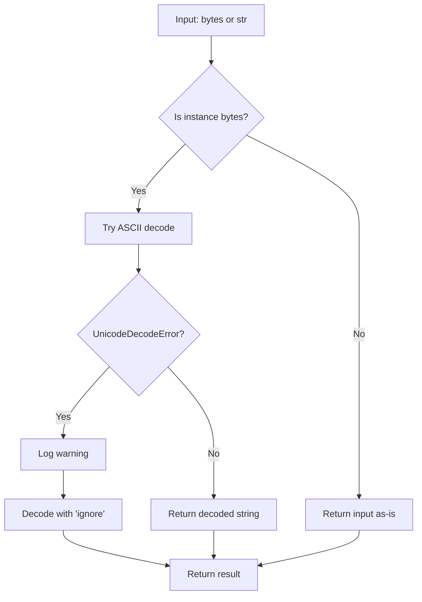

# `util.py`

## `imapclient.util.to_unicode` · *function*

## Summary:
Converts bytes or string input to a Unicode string using ASCII decoding with graceful fallback handling.

## Description:
This utility function safely converts input that may be either bytes or string into a Unicode string. It attempts ASCII decoding first, and if that fails due to a UnicodeDecodeError, it falls back to ignoring problematic characters while logging a warning. This prevents crashes when dealing with mixed encoding data while preserving as much information as possible.

## Args:
    s (Union[bytes, str]): Input that can be either bytes or string to be converted to Unicode string

## Returns:
    str: Unicode string representation of the input

## Raises:
    None explicitly raised, but UnicodeDecodeError may occur internally during bytes decoding

## Constraints:
    Preconditions:
    - Input must be either bytes or str type
    - If bytes, they must be decodable as ASCII or contain characters that can be ignored
    
    Postconditions:
    - Return value is always a string
    - Non-ASCII characters in bytes input are either preserved or stripped based on error handling mode

## Side Effects:
    - Writes warning message to logger when falling back to 'ignore' error handling mode
    - No other external state mutations

## Control Flow:


## Examples:
    # Convert bytes to string
    result = to_unicode(b"hello")  # Returns "hello"
    
    # Convert string to string (no change)
    result = to_unicode("hello")  # Returns "hello"
    
    # Handle non-ASCII bytes with fallback
    result = to_unicode(b"hello\xff")  # Logs warning and returns "hello"
```

## `imapclient.util.to_bytes` · *function*

## Summary:
Converts a string or bytes object to bytes using the specified character encoding.

## Description:
This utility function ensures consistent conversion of string inputs to bytes format. When a string is provided, it is encoded using the specified character set. When bytes are provided, they are returned unchanged. This normalization helps maintain consistent data types in APIs that may accept either strings or bytes.

## Args:
    s (Union[bytes, str]): Input value to convert to bytes. Can be either a string or bytes object.
    charset (str): Character encoding to use when encoding strings. Defaults to "ascii".

## Returns:
    bytes: The input converted to bytes format. If input was already bytes, returns unchanged.

## Raises:
    UnicodeEncodeError: When the string contains characters that cannot be encoded with the specified charset.

## Constraints:
    Preconditions:
        - The charset parameter must be a valid encoding name recognized by Python's encode() method
        - Input s must be either a string or bytes object
    
    Postconditions:
        - Always returns a bytes object
        - If input was bytes, output equals input
        - If input was string, output equals s.encode(charset)

## Side Effects:
    None

## Control Flow:
```mermaid
flowchart TD
    A[Input s: Union[bytes,str]] --> B{isinstance(s, str)?}
    B -- Yes --> C[s.encode(charset)]
    B -- No --> D[s]
    C --> E[Return bytes]
    D --> E
```

## Examples:
    # Convert string to bytes
    result = to_bytes("hello")  # Returns b'hello'
    
    # Convert string with custom encoding
    result = to_bytes("café", "utf-8")  # Returns b'caf\xc3\xa9'
    
    # Pass bytes unchanged
    result = to_bytes(b"hello")  # Returns b'hello'
```

## `imapclient.util.assert_imap_protocol` · *function*

## Summary:
Validates IMAP protocol compliance and raises a protocol error when violations are detected.

## Description:
This utility function serves as a protocol validation checkpoint for IMAP server responses. It ensures that server replies conform to expected IMAP protocol standards. When a protocol violation is detected, it raises a dedicated ProtocolError with contextual information about the violation.

The function is extracted into its own utility to centralize protocol validation logic and enforce clear responsibility boundaries between protocol parsing and error handling.

## Args:
    condition (bool): The boolean expression that must evaluate to True for protocol compliance
    message (Optional[bytes]): Optional raw bytes message from server containing additional protocol violation details

## Returns:
    None: This function does not return any value when validation passes

## Raises:
    exceptions.ProtocolError: Raised when the condition parameter evaluates to False, indicating an IMAP protocol violation

## Constraints:
    Preconditions:
        - The condition parameter must be a boolean value
        - If message is provided, it must be valid bytes that can be decoded with ASCII encoding
    Postconditions:
        - Function execution terminates with ProtocolError when condition is False
        - Function completes normally when condition is True

## Side Effects:
    - Raises an exception (exceptions.ProtocolError) when protocol violation is detected
    - No other side effects (no I/O, state changes, or external service calls)

## Control Flow:
```mermaid
flowchart TD
    A[assert_imap_protocol called] --> B{condition == True?}
    B -- Yes --> C[Return normally]
    B -- No --> D[Build error message]
    D --> E{message provided?}
    E -- Yes --> F[Append message to error (with formatting bug)]
    E -- No --> G[Use base error message]
    F --> H[Raise ProtocolError]
    G --> H
```

## Examples:
```python
# Valid protocol case - no exception raised
assert_imap_protocol(True)

# Invalid protocol case with message
server_response = b"BAD command not recognized"
assert_imap_protocol(False, server_response)

# Invalid protocol case without message  
assert_imap_protocol(False)
```

## `imapclient.util.chunk` · *function*

## Summary:
Splits a sequence into fixed-size chunks for batch processing.

## Description:
Generates successive chunks of a specified size from the input sequence. This utility function is commonly used to process large datasets in manageable batches or to comply with API limitations that restrict the number of items processed at once.

## Args:
    lst (Sequence): The input sequence to be chunked, typically a tuple or list-like object that supports slicing.
    size (int): The maximum number of elements in each chunk. Must be a positive integer greater than 0.

## Returns:
    Iterator[Sequence]: An iterator yielding sub-sequences (chunks) of the original sequence, each of length at most `size`.

## Raises:
    None explicitly raised by this function.

## Constraints:
    Preconditions:
    - The `size` parameter must be a positive integer (size > 0)
    - The `lst` parameter should be a sequence type that supports slicing operations
    
    Postconditions:
    - Each yielded chunk will have at most `size` elements
    - The concatenation of all yielded chunks will equal the original sequence
    - Empty sequences will yield no chunks

## Side Effects:
    None.

## Control Flow:
```mermaid
flowchart TD
    A[chunk() called] --> B{size > 0?}
    B -- No --> C[Behavior depends on size value]
    B -- Yes --> D{len(lst) > 0?}
    D -- No --> E[Yield nothing]
    D -- Yes --> F[Loop from 0 to len(lst) by size]
    F --> G{More elements available?}
    G -- No --> H[End iteration]
    G -- Yes --> I[Yield lst[i:i+size]]
    I --> J[Next iteration]
    J --> G
```

## Examples:
    # Basic usage with a list
    data = [1, 2, 3, 4, 5, 6, 7, 8]
    for chunk in chunk(data, 3):
        print(chunk)
    # Output: [1, 2, 3], [4, 5, 6], [7, 8]

    # Usage with a tuple
    data = ('a', 'b', 'c', 'd', 'e')
    chunks = list(chunk(data, 2))
    # Result: [('a', 'b'), ('c', 'd'), ('e',)]

