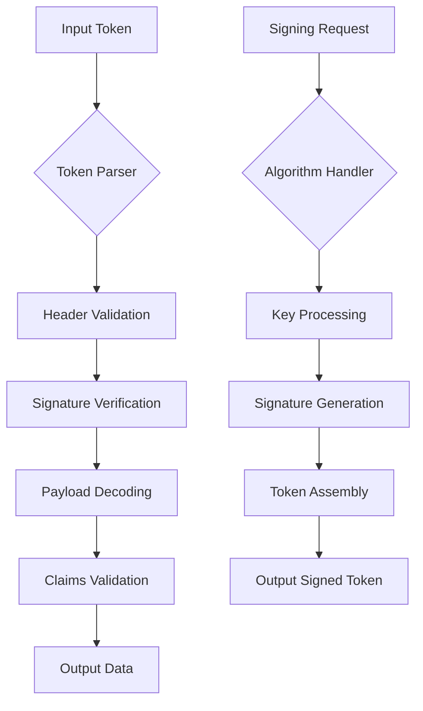

# `PyJWT`

## Repository Overview

### Tree Structure
```
PyJWT/
├── docs/          # Documentation and user guides
└── jwt/           # Core JWT implementation modules
    ├── __init__.py     # Main module interface
    ├── api.py          # Core encode/decode functions
    ├── algorithms.py   # Cryptographic algorithm implementations
    ├── exceptions.py   # Custom exception classes
    ├── utils.py        # Utility functions
    └── compat.py       # Python version compatibility helpers
```

### Purpose
PyJWT is a Python library for encoding and decoding JSON Web Tokens (JWTs) as defined in RFC 7519. It provides secure token-based authentication and information exchange capabilities for web applications and APIs. The library supports various cryptographic algorithms for signing tokens and handles the parsing and validation of JWT payloads.

This repository addresses the need for secure, standards-compliant JWT handling in Python applications, enabling developers to implement token-based authentication systems, authorization flows, and secure data transmission between parties.

### Target Users
- Backend developers building REST APIs and web services
- Security engineers implementing authentication systems
- Full-stack developers integrating token-based authentication
- DevOps teams managing secure API gateways

### Position in Ecosystem
PyJWT serves as a foundational library for JWT implementations in Python applications. It operates as a standalone cryptographic utility that integrates with web frameworks (Django, Flask, FastAPI) and authentication systems. It's commonly used alongside authentication middleware and API gateway solutions.

### Architecture


The architecture follows a pipeline pattern where tokens flow through validation and processing stages. Core abstractions include:
- Token parser/encoder components
- Algorithm handlers for different signing methods
- Signature verification mechanisms
- Claims validation framework

### Entry Points
1. **Importable API**: `from jwt import encode, decode, register_algorithm`
   - `encode(payload, key, algorithm, **options)` - Creates a JWT token
   - `decode(token, key, algorithms, **options)` - Validates and decodes a JWT token
   - `register_algorithm(algorithm)` - Registers custom signing algorithms
   - Target audience: Application developers integrating JWT functionality

2. **CLI Interface**: Not typically part of standard PyJWT distribution
   - May be available through extensions or wrapper tools
   - Target audience: System administrators and DevOps engineers

### Core Features
1. **JWT Encoding**: Create signed JWT tokens from payload data
   - Implemented in: `jwt.api.encode()` function
2. **JWT Decoding**: Parse and validate JWT tokens
   - Implemented in: `jwt.api.decode()` function  
3. **Algorithm Support**: Multiple cryptographic signing methods (HS256, RS256, ES256, etc.)
   - Implemented in: `jwt.algorithms` module
4. **Claims Validation**: Built-in validation of standard JWT claims (iss, exp, aud, etc.)
   - Implemented in: `jwt.api` and `jwt.utils` modules
5. **Exception Handling**: Comprehensive error reporting for invalid tokens
   - Implemented in: `jwt.exceptions` module

### Dependencies
- **Python 3.7+**: Required runtime environment
- **cryptography**: Optional dependency for advanced cryptographic operations
- **ecdsa**: Optional dependency for ECDSA algorithm support
- **rsa**: Optional dependency for RSA algorithm support

### Configuration
No configuration files or environment variables are required for basic operation. Runtime parameters are passed through function arguments.

### Extension Points
1. **Custom Algorithms**: Register new signing algorithms via `register_algorithm()`
2. **Custom Validators**: Extend claims validation with custom validators
3. **Middleware Integration**: Hook into existing web frameworks for automatic token handling

---

## Modules

- [`docs`](docs.md)
- [`jwt`](jwt.md)

