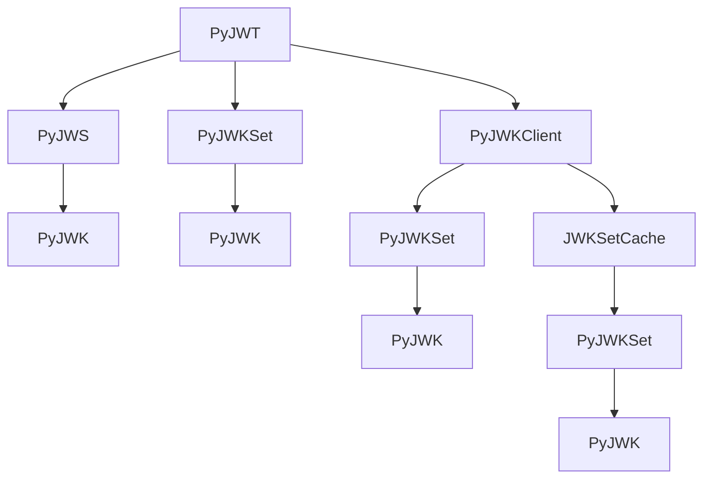

# `jwt`

## Tree:
jwt/
├── api_jwk.py
├── api_jws.py
├── api_jwt.py
├── exceptions.py
├── help.py
├── jwk_set_cache.py
├── jwks_client.py
└── warnings.py

## Role:
Provides comprehensive JSON Web Token (JWT) functionality with support for encoding, decoding, signing, and verification operations, including integration with JSON Web Key Sets (JWKS) for secure asymmetric key management.

## Description:
The jwt module serves as the core implementation for JSON Web Token (JWT) operations in the PyJWT library. It provides complete support for creating and validating JWT tokens with various cryptographic algorithms, managing JSON Web Key Sets for asymmetric key operations, and handling JWT-specific exceptions and warnings.

This module is organized around three primary layers:
1. Core JWT functionality (api_jwt.py) - Handles payload encoding/decoding with claim validation
2. JSON Web Signature (JWS) operations (api_jws.py) - Manages signing and verification of JWT tokens
3. Key management and retrieval (api_jwk.py, jwks_client.py) - Provides support for JSON Web Keys and JWKS endpoints

The module is designed to be used by authentication systems, API gateways, and any application requiring secure token-based authentication or authorization. It supports both symmetric and asymmetric cryptographic operations, with built-in caching and connection management for JWKS endpoints.

Primary consumers include:
- Authentication services that validate JWT tokens
- API gateways that process JWT-based authentication
- Web applications that issue and consume JWT tokens
- Security libraries that require JWT validation capabilities

## Components:
*   `PyJWT` - Main interface for JWT encoding and decoding with claim validation
*   `PyJWS` - Implementation for JSON Web Signature operations (signing/verification)
*   `PyJWK` - Representation and management of JSON Web Keys
*   `PyJWKSet` - Collection and management of multiple JSON Web Keys
*   `PyJWKClient` - Client for fetching and caching JWKS from remote endpoints
*   `JWKSetCache` - Caching mechanism for JWKS data
*   `PyJWTError` - Base exception class for all JWT-related errors
*   `PyJWKClientError` - Base exception for JWK client operations
*   `info()` - Utility function for collecting system/environment information
*   `main()` - Command-line interface for displaying environment information

## Public API:
*   `jwt.encode(payload, key, algorithm='HS256', headers=None, json_encoder=None)` - Encodes a payload into a JWT token
*   `jwt.decode(jwt, key, algorithms, options=None, audience=None, issuer=None, leeway=0)` - Decodes and validates a JWT token
*   `jwt.decode_complete(jwt, key, algorithms, options=None, audience=None, issuer=None, leeway=0)` - Decodes JWT with complete information including header and signature
*   `jwt.PyJWT(options=None)` - Constructor for the main JWT interface
*   `jwt.PyJWS(algorithms=None, options=None)` - Constructor for JWS signing/verification
*   `jwt.PyJWK.from_dict(key_dict)` - Creates a PyJWK instance from a dictionary
*   `jwt.PyJWKSet.from_dict(jwk_set_dict)` - Creates a PyJWKSet instance from a dictionary
*   `jwt.PyJWKClient(uri, cache_keys=False, max_cached_keys=16, cache_jwk_set=True, lifespan=300, headers=None, timeout=30, ssl_context=None)` - Constructor for JWK client
*   `jwt.help.info()` - Returns system/environment information
*   `jwt.help.main()` - Prints system/environment information to stdout

## Dependencies:
*   Internal: 
    *   `api_jwk` - Provides JWK and JWKSet functionality
    *   `api_jws` - Provides JWS signing/verification operations
    *   `api_jwt` - Provides core JWT encoding/decoding with claim validation
    *   `exceptions` - Contains all JWT-related exception classes
    *   `jwk_set_cache` - Provides caching mechanism for JWKS data
    *   `jwks_client` - Implements client for fetching JWKS from remote endpoints
    *   `warnings` - Provides deprecation warning classes
*   External: 
    *   `base64` - For base64url encoding/decoding operations
    *   `collections` - For OrderedDict and namedtuple usage
    *   `datetime` - For timestamp handling and validation
    *   `json` - For JSON serialization/deserialization
    *   `time` - For time-related operations and leeway calculations
    *   `urllib` - For HTTP requests in JWK client operations
    *   `warnings` - For issuing deprecation warnings

## Constraints:
*   All JWT operations require proper cryptographic key management - keys must be compatible with the specified algorithms
*   When using asymmetric algorithms (RS256, ES256, etc.), appropriate private/public key pairs must be provided
*   JWK client operations require network connectivity to fetch JWKS from remote endpoints
*   Caching mechanisms have configurable lifespans that must be respected for cache validity
*   Thread safety: The module is generally thread-safe for read operations, but concurrent writes to shared caches should be synchronized
*   Initialization prerequisites: PyJWT and PyJWS instances should be configured with appropriate algorithms and options before use

## Component Interaction Diagram:

---

## Files

- [`api_jwk.py`](jwt/api_jwk.md)
- [`api_jws.py`](jwt/api_jws.md)
- [`api_jwt.py`](jwt/api_jwt.md)
- [`exceptions.py`](jwt/exceptions.md)
- [`help.py`](jwt/help.md)
- [`jwk_set_cache.py`](jwt/jwk_set_cache.md)
- [`jwks_client.py`](jwt/jwks_client.md)
- [`warnings.py`](jwt/warnings.md)

