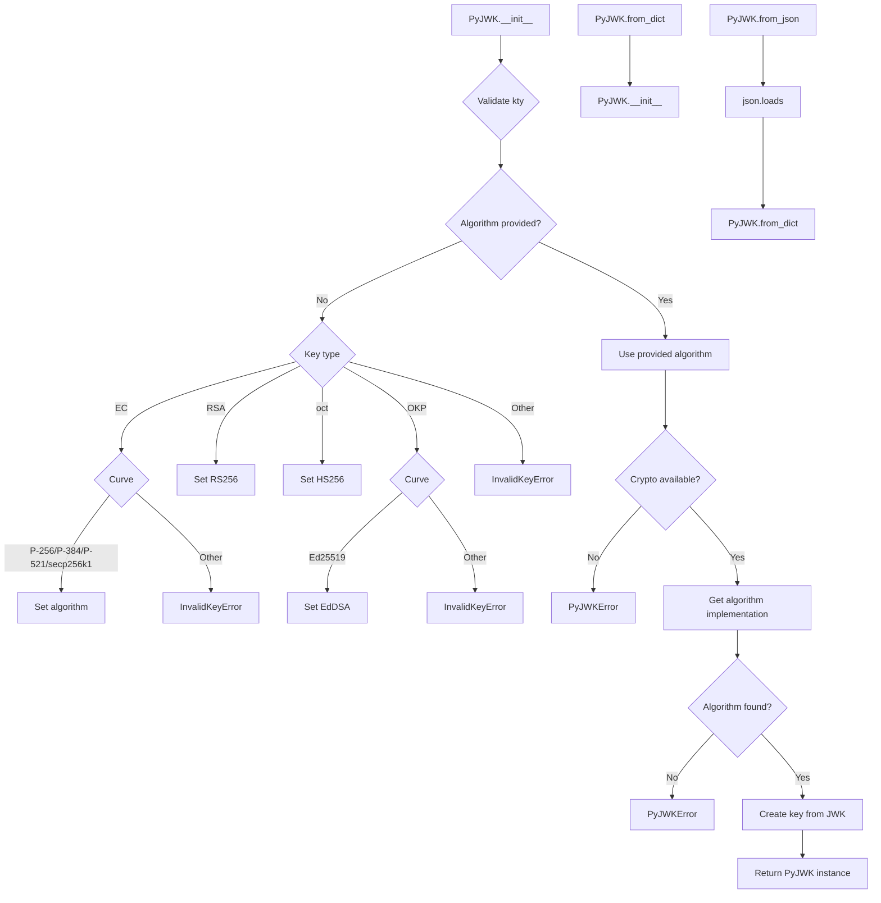
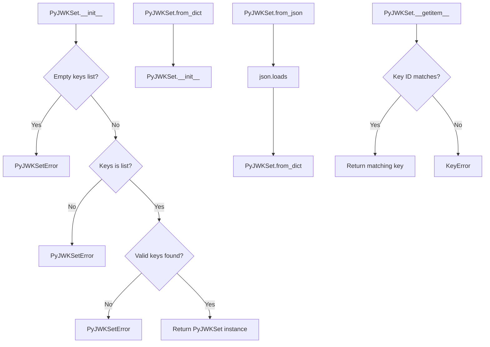

# `api_jwk.py`

## `jwt.api_jwk.PyJWK` · *class*

## Summary:
Represents a JSON Web Key (JWK) with associated cryptographic algorithm and key material.

## Description:
The PyJWK class encapsulates a JSON Web Key and provides methods to create instances from various data formats. It automatically determines the appropriate cryptographic algorithm based on the key type and parameters, and validates that required dependencies are available. This class serves as a bridge between raw JWK data and the actual cryptographic key objects used for signing and verification operations.

## State:
- _algorithms: Dictionary mapping algorithm names to their implementations (populated by get_default_algorithms())
- _jwk_data: Dictionary containing the raw JWK data (type JWKDict)
- Algorithm: Class reference to the cryptographic algorithm implementation for this key
- key: The actual cryptographic key object created from JWK data

## Lifecycle:
- Creation: Instances are created via constructor with JWK data and optional algorithm, or via static factory methods from_dict() or from_json()
- Usage: Access properties like key_type, key_id, and public_key_use; use the key for cryptographic operations
- Destruction: No explicit cleanup required; relies on Python's garbage collection

## Method Map:


## Raises:
- InvalidKeyError: When kty is missing, unsupported key type is provided, or unsupported curve is specified
- PyJWKError: When algorithm cannot be found or cryptography dependency is missing for required algorithms

## Example:
```python
# Create from dictionary
jwk_dict = {
    "kty": "RSA",
    "n": "0vx7agoebGcQSuuPiLJXZptN9nndrQmbXEps2aiAFbWhM78LhWx4cbbfAAtVT86zwu1RK7aPFFxuhDR1L6tSoc_BJECPebWKRXjBZCiFV4n3oknjhMstn64vk/2Vl4fN2n9QOHe2oZ6Ofv8Xw7mR236y1JFvD0d53Q==",
    "e": "AQAB",
    "alg": "RS256",
    "kid": "my-key-id"
}
key = PyJWK.from_dict(jwk_dict)

# Access properties
print(key.key_type)  # RSA
print(key.key_id)    # my-key-id
print(key.public_key_use)  # None

# Create from JSON string
jwk_json = '{"kty": "EC", "crv": "P-256", "x": "MKBCTNIcKUSDii11ySs3526iDZ8AiTo7Tu6KPAqv7D4", "y": "4Etl6SRW2YiLUrN5vfvVH2p3b8tV50W9Q00O8915390"}'
key2 = PyJWK.from_json(jwk_json)
```

### `jwt.api_jwk.PyJWK.__init__` · *method*

## Summary:
Initializes a PyJWK object by processing JWK data and determining the appropriate cryptographic algorithm.

## Description:
This method serves as the constructor for PyJWK objects, responsible for validating JWK data structure, inferring the appropriate cryptographic algorithm based on key type and parameters, and preparing the object for cryptographic operations. It handles automatic algorithm detection for various key types (EC, RSA, oct, OKP) and validates that required cryptographic libraries are available.

## Args:
    jwk_data (JWKDict): Dictionary containing JSON Web Key data with required fields like 'kty'
    algorithm (str | None): Optional cryptographic algorithm name. If not provided, will be inferred from JWK data

## Returns:
    None: This method initializes instance attributes and does not return a value

## Raises:
    InvalidKeyError: When required key parameters are missing (kty, crv) or unsupported key types/curves are encountered
    PyJWKError: When cryptographic requirements are not met or when an algorithm cannot be found for the key

## State Changes:
    Attributes READ: self._jwk_data
    Attributes WRITTEN: self._algorithms, self._jwk_data, self.Algorithm, self.key

## Constraints:
    Preconditions: 
    - jwk_data must be a dictionary-like object containing at least 'kty' field
    - If algorithm is not provided, jwk_data must contain sufficient information to infer the algorithm
    - Required cryptographic libraries must be installed for algorithms requiring them
    
    Postconditions:
    - self.Algorithm will reference a valid algorithm class for cryptographic operations
    - self.key will contain the properly parsed key data ready for cryptographic use

## Side Effects:
    None: This method performs no I/O operations or external service calls. It only manipulates internal object state.

### `jwt.api_jwk.PyJWK.from_dict` · *method*

## Summary:
Creates a PyJWK instance from a dictionary representation of a JSON Web Key.

## Description:
This static method serves as a factory function to instantiate a PyJWK object from a dictionary containing JSON Web Key parameters. It provides a clean interface for creating JWK objects when the key material is already available as a Python dictionary rather than requiring JSON parsing.

The method delegates to the PyJWK constructor, which handles validation of key parameters such as key type (kty), algorithm identification, and cryptographic algorithm selection based on key characteristics.

## Args:
    obj (JWKDict): A dictionary containing the JSON Web Key parameters. Must include at minimum a "kty" field indicating the key type (e.g., "RSA", "EC", "oct").
    algorithm (str | None): Optional algorithm identifier. If not provided, the method attempts to infer the algorithm from the key data (e.g., from "alg" field or by key type defaults).

## Returns:
    PyJWK: A newly created PyJWK instance configured with the provided key data and algorithm.

## Raises:
    InvalidKeyError: When the key data is missing required fields such as "kty" or contains unsupported key types/crv values.
    PyJWKError: When the specified or inferred algorithm is not supported or when cryptographic libraries are missing for required algorithms.

## State Changes:
    Attributes READ: None
    Attributes WRITTEN: None (the returned instance has its own state)

## Constraints:
    Preconditions: 
    - The `obj` parameter must be a dictionary-like object containing valid JWK parameters
    - The dictionary must contain at least a "kty" field identifying the key type
    - If an algorithm is specified, it must be a recognized JWT algorithm identifier
    
    Postconditions:
    - Returns a valid PyJWK instance with properly initialized cryptographic components
    - The returned instance's Algorithm attribute is set to a valid cryptographic algorithm handler

## Side Effects:
    None

### `jwt.api_jwk.PyJWK.from_json` · *method*

## Summary:
Creates a PyJWK instance from a JSON string representation of a JSON Web Key.

## Description:
This static method serves as a factory function to instantiate a PyJWK object from a JSON string containing JSON Web Key parameters. It provides a convenient interface for creating JWK objects when the key material is provided as a JSON-formatted string rather than a Python dictionary.

The method first parses the JSON string into a Python dictionary using standard JSON parsing, then delegates to the PyJWK.from_dict static method to handle the actual instantiation process. This approach allows for seamless conversion from JSON string format to a fully configured PyJWK object.

This method is particularly useful in scenarios where JWK data is received as raw JSON text (such as from HTTP responses, configuration files, or API endpoints) and needs to be converted into a usable PyJWK object for cryptographic operations.

## Args:
    data (str): A JSON string containing the complete JSON Web Key parameters. Must represent a valid JSON object with required JWK fields such as "kty".
    algorithm (None): Optional algorithm identifier. If not provided, the method attempts to infer the algorithm from the parsed key data (e.g., from "alg" field or by key type defaults). Defaults to None.

## Returns:
    PyJWK: A newly created PyJWK instance configured with the key data parsed from the JSON string and the specified or inferred algorithm.

## Raises:
    json.JSONDecodeError: When the input data string is not valid JSON.
    InvalidKeyError: When the parsed key data is missing required fields such as "kty" or contains unsupported key types/crv values.
    PyJWKError: When the specified or inferred algorithm is not supported or when cryptographic libraries are missing for required algorithms.

## State Changes:
    Attributes READ: None
    Attributes WRITTEN: None (the returned instance has its own state)

## Constraints:
    Preconditions:
    - The `data` parameter must be a valid JSON string representing a JWK object
    - The JSON string must contain at minimum a "kty" field indicating the key type
    - If an algorithm is specified, it must be a recognized JWT algorithm identifier
    
    Postconditions:
    - Returns a valid PyJWK instance with properly initialized cryptographic components
    - The returned instance's Algorithm attribute is set to a valid cryptographic algorithm handler

## Side Effects:
    None

### `jwt.api_jwk.PyJWK.key_type` · *method*

## Summary:
Returns the key type identifier from the JWK data structure.

## Description:
Retrieves the "kty" (key type) field from the internal JWK data dictionary. This property provides access to the cryptographic key type specification as defined in the JSON Web Key standard.

## Args:
    None

## Returns:
    str | None: The key type identifier (such as "RSA", "EC", "oct", "OKP") if present in the JWK data, or None if the "kty" field is missing.

## Raises:
    None

## State Changes:
    Attributes READ: self._jwk_data
    Attributes WRITTEN: None

## Constraints:
    Preconditions: The PyJWK instance must have been properly initialized with valid JWK data
    Postconditions: The returned value is either a string representing a valid JWK key type or None

## Side Effects:
    None

### `jwt.api_jwk.PyJWK.key_id` · *method*

## Summary:
Returns the key identifier (kid) from the JWK data or None if not present.

## Description:
This property provides access to the "kid" (key identifier) field from the JSON Web Key (JWK) data structure. The key identifier is commonly used to match keys with their corresponding certificates or to select specific keys from a key set.

## Args:
    None

## Returns:
    str | None: The key identifier string if present in the JWK data, otherwise None

## Raises:
    None

## State Changes:
    Attributes READ: self._jwk_data
    Attributes WRITTEN: None

## Constraints:
    Preconditions: 
    - self._jwk_data must be a dictionary-like object containing JWK data
    - The method does not validate the format or presence of the "kid" field
    
    Postconditions:
    - The returned value is either a string representing the key ID or None
    - No modifications are made to the object's state

## Side Effects:
    None

### `jwt.api_jwk.PyJWK.public_key_use` · *method*

## Summary:
Returns the intended use of the JSON Web Key as specified by the "use" parameter in the key data.

## Description:
This property retrieves the cryptographic use case for the key, which indicates whether the key is intended for digital signatures ("sig"), encryption ("enc"), or other purposes. This is part of the standard JWK (JSON Web Key) specification and helps determine how the key should be used in cryptographic operations.

## Args:
    None

## Returns:
    str | None: The value of the "use" field from the JWK data, or None if the field is not present. Common values include "sig" for signing operations and "enc" for encryption operations.

## Raises:
    None

## State Changes:
    Attributes READ: self._jwk_data
    Attributes WRITTEN: None

## Constraints:
    Preconditions: The instance must have been initialized with valid JWK data
    Postconditions: The returned value is either a string representing the key use or None

## Side Effects:
    None

## `jwt.api_jwk.PyJWKSet` · *class*

## Summary:
Represents a collection of JSON Web Keys (JWKs) that can be managed and accessed by key ID.

## Description:
The PyJWKSet class encapsulates a set of JSON Web Keys and provides mechanisms for creating instances from various data formats and accessing individual keys by their key ID. It serves as a container for multiple JWKs and handles validation of the key set during initialization, ensuring that at least one usable key is present.

This class is commonly used in JWT (JSON Web Token) operations where multiple keys may be needed for signature verification, particularly in scenarios involving key rotation or when working with JWK Sets as defined in RFC 7517.

## State:
- keys: list[PyJWK] - A list of PyJWK objects representing the individual keys in this set
- Each key in the list is a valid PyJWK instance that was successfully parsed from the input data
- The list is populated during initialization and remains immutable after construction

## Lifecycle:
- Creation: Instances are created via the constructor with a list of JWK dictionaries, or via static factory methods from_dict() or from_json()
- Usage: Keys can be accessed using bracket notation with a key ID string (e.g., jwk_set["key-id"])
- Destruction: No explicit cleanup required; relies on Python's garbage collection

## Method Map:


## Raises:
- PyJWKSetError: Raised when the JWK Set is empty, contains invalid data, or has no usable keys
- KeyError: Raised when attempting to access a key that doesn't exist in the set using __getitem__

## Example:
```python
# Create from a list of JWK dictionaries
jwk_dict_1 = {
    "kty": "RSA",
    "n": "0vx7agoebGcQSuuPiLJXZptN9nndrQmbXEps2aiAFbWhM78LhWx4cbbfAAtVT86zwu1RK7aPFFxuhDR1L6tSoc_BJECPebWKRXjBZCiFV4n3oknjhMstn64vk/2Vl4fN2n9QOHe2oZ6Ofv8Xw7mR236y1JFvD0d53Q==",
    "e": "AQAB",
    "alg": "RS256",
    "kid": "key1"
}

jwk_dict_2 = {
    "kty": "EC",
    "crv": "P-256",
    "x": "MKBCTNIcKUSDii11ySs3526iDZ8AiTo7Tu6KPAqv7D4",
    "y": "4Etl6SRW2YiLUrN5vfvVH2p3b8tV50W9Q00O8915390",
    "alg": "ES256",
    "kid": "key2"
}

key_set = PyJWKSet([jwk_dict_1, jwk_dict_2])

# Access keys by key ID
key = key_set["key1"]  # Returns the RSA key
key2 = key_set["key2"]  # Returns the EC key

# Create from dictionary
data = {"keys": [jwk_dict_1, jwk_dict_2]}
key_set2 = PyJWKSet.from_dict(data)

# Create from JSON
json_data = '{"keys": [{"kty": "RSA", "n": "...", "e": "AQAB", "alg": "RS256", "kid": "key1"}]}'
key_set3 = PyJWKSet.from_json(json_data)
```

### `jwt.api_jwk.PyJWKSet.__init__` · *method*

## Summary:
Initializes a JSON Web Key Set object by processing a list of JWK dictionaries into usable PyJWK objects.

## Description:
Constructs a PyJWKSet instance by validating and converting a list of JSON Web Key dictionaries into PyJWK objects. This method serves as the primary constructor for PyJWKSet, handling validation of input parameters and creation of individual JWK objects while gracefully skipping invalid entries.

The method is typically called indirectly through static factory methods `from_dict()` or `from_json()` which parse JSON data into the required list format before passing it to this constructor.

## Args:
    keys (list[JWKDict]): A list of JSON Web Key dictionaries to be processed into PyJWK objects

## Returns:
    None: This method initializes the object's state and does not return a value

## Raises:
    PyJWKSetError: When the keys parameter is empty, not a list, or contains no usable keys after processing

## State Changes:
    Attributes READ: None
    Attributes WRITTEN: self.keys (initializes to empty list, then populated with valid PyJWK objects)

## Constraints:
    Preconditions: 
    - The keys parameter must be a list-like object
    - Each item in keys must be a valid JWK dictionary that can be processed by PyJWK constructor
    
    Postconditions:
    - self.keys will contain a list of valid PyJWK objects
    - If successful, self.keys will contain at least one valid PyJWK object
    - If unsuccessful, a PyJWKSetError will be raised

## Side Effects:
    None: This method performs no I/O operations or external service calls. It only processes the input data and creates internal PyJWK objects.

### `jwt.api_jwk.PyJWKSet.from_dict` · *method*

## Summary:
Creates a PyJWKSet instance from a dictionary representation containing JWK key data.

## Description:
This static method serves as a factory function to construct a PyJWKSet object from a dictionary that follows the JSON Web Key Set (JWKS) format. It extracts the "keys" array from the input dictionary and passes it to the PyJWKSet constructor, which processes each key into individual PyJWK objects.

The method is typically called during deserialization of JWKS data, such as when loading public key sets from external sources or configuration files. It's part of the standard workflow for creating key sets from JSON-compatible representations.

## Args:
    obj (dict[str, Any]): A dictionary representing a JSON Web Key Set, containing a "keys" key with an array of JWK dictionaries as its value. If the "keys" key is missing, an empty list is used as the default.

## Returns:
    PyJWKSet: A new PyJWKSet instance populated with the keys from the input dictionary.

## Raises:
    PyJWKSetError: When the input dictionary contains invalid data or when no usable keys can be extracted from the key set. This occurs when:
    - The "keys" value is not a list
    - The key set contains no valid keys after processing
    - The key set is empty

## State Changes:
    Attributes READ: None
    Attributes WRITTEN: None (creates new instance)

## Constraints:
    Preconditions: The input dictionary should contain a "keys" key with a list of JWK dictionaries as its value, though the method handles missing keys gracefully.
    Postconditions: The returned PyJWKSet instance will contain valid PyJWK objects derived from the input keys, or will raise an exception if no valid keys are found.

## Side Effects:
    None

### `jwt.api_jwk.PyJWKSet.from_json` · *method*

## Summary:
Creates a PyJWKSet instance from a JSON string representation of a JSON Web Key Set.

## Description:
This static method serves as a factory function to construct a PyJWKSet object from a JSON string that follows the JSON Web Key Set (JWKS) format. It provides a convenient way to deserialize key sets from JSON data, such as those received from external services or loaded from configuration files.

The method first parses the JSON string using `json.loads()` to convert it into a Python dictionary, then delegates to `PyJWKSet.from_dict()` to process the parsed data into a proper PyJWKSet instance. This approach separates the concerns of JSON parsing and key set construction.

## Args:
    data (str): A JSON string containing a valid JSON Web Key Set structure. The string must represent a dictionary with a "keys" key containing an array of JWK dictionaries.

## Returns:
    PyJWKSet: A new PyJWKSet instance populated with the keys parsed from the JSON string.

## Raises:
    PyJWKSetError: When the parsed JSON structure is invalid or contains no usable keys. This can occur when:
    - The JSON string is malformed and cannot be parsed
    - The parsed dictionary lacks a "keys" key or contains invalid key data
    - No valid keys can be extracted from the key set after processing

## State Changes:
    Attributes READ: None
    Attributes WRITTEN: None (creates new instance)

## Constraints:
    Preconditions:
    - The input `data` parameter must be a valid JSON string representing a JWKS structure
    - The JSON string must contain a "keys" key with a list of JWK dictionaries as its value
    
    Postconditions:
    - Returns a valid PyJWKSet instance with properly initialized key objects
    - The returned instance will contain valid PyJWK objects derived from the input keys

## Side Effects:
    None

### `jwt.api_jwk.PyJWKSet.__getitem__` · *method*

## Summary:
Retrieves a JWK from the key set by its key ID (kid).

## Description:
Provides dictionary-like access to JWKs within the key set by searching for a key with a matching key ID. This method enables efficient lookup of specific cryptographic keys within a JSON Web Key Set, which is commonly needed during JWT validation when the token's header contains a 'kid' parameter indicating which key should be used for verification.

The method iterates through all keys in the set and returns the first key whose `key_id` attribute matches the provided `kid` parameter. This follows standard dictionary access patterns and is typically used in JWT validation workflows where the token's kid header parameter needs to be matched against available keys.

## Args:
    kid (str): The key ID to search for among the keys in the set

## Returns:
    PyJWK: The JWK object matching the provided key ID

## Raises:
    KeyError: When no key in the set has a key ID matching the provided `kid` parameter

## State Changes:
    Attributes READ: self.keys
    Attributes WRITTEN: None

## Constraints:
    Preconditions:
    - The PyJWKSet must have been initialized with valid keys
    - The `kid` parameter must be a string
    
    Postconditions:
    - If a matching key exists, it is returned immediately without further iteration
    - If no matching key exists, a KeyError is raised

## Side Effects:
    None: This method performs no I/O operations or external service calls. It only accesses existing object attributes.

## `jwt.api_jwk.PyJWTSetWithTimestamp` · *class*

## Summary:
A wrapper class that pairs a JSON Web Key Set (JWK Set) with a timestamp for tracking when the set was created or last updated.

## Description:
The PyJWTSetWithTimestamp class serves as a container that associates a PyJWKSet object with a timestamp. This pattern is useful for implementing cache invalidation, key rotation tracking, or monitoring when JWK sets were last refreshed. The class provides access to both the underlying JWK set and the timestamp, making it easy to determine the age or freshness of a key set.

This class is typically used internally by JWT libraries to manage cached JWK sets, ensuring that applications can make informed decisions about when to refresh their key sets based on the timestamp information.

## State:
- jwk_set: PyJWKSet - The wrapped JSON Web Key Set object containing cryptographic keys
- timestamp: float - A monotonic timestamp (from time.monotonic()) indicating when this wrapper was created

## Lifecycle:
- Creation: Instantiated with a PyJWKSet object; timestamp is automatically recorded using time.monotonic()
- Usage: Access the wrapped JWK set and timestamp through get_jwk_set() and get_timestamp() methods
- Destruction: No special cleanup required; relies on Python's garbage collection

## Method Map:
```mermaid
graph TD
    A[PyJWTSetWithTimestamp.__init__] --> B[Store JWK set]
    B --> C[Record timestamp with time.monotonic()]
    
    D[PyJWTSetWithTimestamp.get_jwk_set] --> E[Return wrapped JWK set]
    
    F[PyJWTSetWithTimestamp.get_timestamp] --> G[Return stored timestamp]
```

## Raises:
- None explicitly raised by __init__ (though underlying PyJWKSet construction could raise PyJWKSetError)
- The timestamp is always available after successful initialization

## Example:
```python
# Create a JWK set
jwk_dict_1 = {
    "kty": "RSA",
    "n": "0vx7agoebGcQSuuPiLJXZptN9nndrQmbXEps2aiAFbWhM78LhWx4cbbfAAtVT86zwu1RK7aPFFxuhDR1L6tSoc_BJECPebWKRXjBZCiFV4n3oknjhMstn64vk/2Vl4fN2n9QOHe2oZ6Ofv8Xw7mR236y1JFvD0d53Q==",
    "e": "AQAB",
    "alg": "RS256",
    "kid": "key1"
}

# Create a PyJWKSet
key_set = PyJWKSet([jwk_dict_1])

# Wrap it with timestamp
jwt_set_with_timestamp = PyJWTSetWithTimestamp(key_set)

# Access the wrapped JWK set and timestamp
retrieved_key_set = jwt_set_with_timestamp.get_jwk_set()
timestamp = jwt_set_with_timestamp.get_timestamp()

print(f"Key set has {len(retrieved_key_set.keys)} keys")
print(f"Created at timestamp: {timestamp}")
```

### `jwt.api_jwk.PyJWTSetWithTimestamp.__init__` · *method*

## Summary:
Initializes a timestamped wrapper around a JSON Web Key Set for tracking when the key set was created or last updated.

## Description:
Constructs a PyJWTSetWithTimestamp instance by storing the provided JSON Web Key Set and recording the current monotonic timestamp. This wrapper pattern enables tracking of key set freshness and is commonly used for cache invalidation and key rotation monitoring in JWT validation workflows.

The constructor is typically called internally by JWT libraries when caching JWK sets, ensuring that applications can make informed decisions about when to refresh their key sets based on timestamp information.

## Args:
    jwk_set (PyJWKSet): A valid JSON Web Key Set object containing cryptographic keys to be wrapped with timestamp metadata

## Returns:
    None: This method initializes instance attributes and does not return a value

## Raises:
    None: This method itself does not raise exceptions, though the underlying PyJWKSet construction could raise PyJWKSetError

## State Changes:
    Attributes READ: None
    Attributes WRITTEN: self.jwk_set, self.timestamp

## Constraints:
    Preconditions:
    - The jwk_set parameter must be a valid PyJWKSet instance
    - The PyJWKSet instance must have been properly constructed with at least one valid key
    
    Postconditions:
    - self.jwk_set will reference the provided PyJWKSet instance unchanged
    - self.timestamp will contain a monotonic timestamp from time.monotonic() representing when this wrapper was created

## Side Effects:
    None: This method performs no I/O operations or external service calls. It only assigns the input parameters to instance attributes.

### `jwt.api_jwk.PyJWTSetWithTimestamp.get_jwk_set` · *method*

## Summary:
Returns the JSON Web Key Set stored in this timestamped wrapper instance.

## Description:
Provides access to the underlying PyJWKSet object that this wrapper maintains. This method allows external code to retrieve the complete set of JSON Web Keys without exposing the internal storage mechanism directly.

The method is typically called during JWT validation processes where the complete key set is needed for signature verification, particularly in scenarios involving key rotation or when multiple keys are required for validation.

## Args:
    None

## Returns:
    PyJWKSet: The JSON Web Key Set object that was originally provided during initialization of this wrapper instance.

## Raises:
    None

## State Changes:
    Attributes READ: self.jwk_set
    Attributes WRITTEN: None

## Constraints:
    Preconditions: The PyJWTSetWithTimestamp instance must have been properly initialized with a valid PyJWKSet object.
    Postconditions: The returned PyJWKSet object is identical to the one originally stored in self.jwk_set.

## Side Effects:
    None

### `jwt.api_jwk.PyJWTSetWithTimestamp.get_timestamp` · *method*

## Summary:
Returns the timestamp when this JWK set with timestamp was created.

## Description:
Retrieves the monotonic timestamp associated with this PyJWTSetWithTimestamp instance. This timestamp is set during object initialization and represents when the JWK set was created or last refreshed. The method provides access to this cached timestamp value for monitoring or validation purposes.

## Args:
    None

## Returns:
    float: The timestamp value as returned by time.monotonic() when this object was initialized.

## Raises:
    None

## State Changes:
    Attributes READ: self.timestamp
    Attributes WRITTEN: None

## Constraints:
    Preconditions: The PyJWTSetWithTimestamp instance must be properly initialized with a timestamp value.
    Postconditions: The method returns the same timestamp value that was set during initialization.

## Side Effects:
    None

