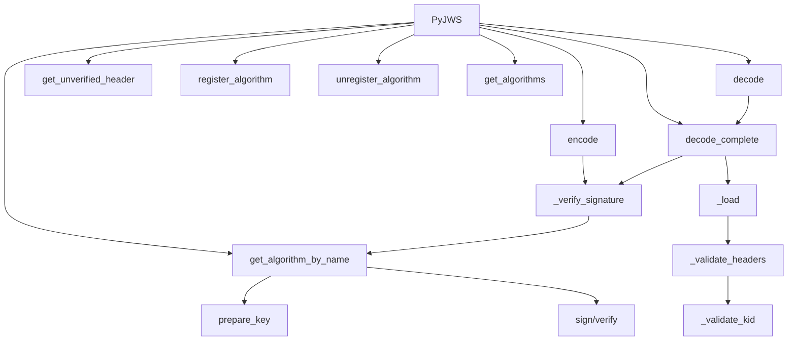

# `api_jws.py`

## `jwt.api_jws.PyJWS` · *class*

## Summary:
A JSON Web Signature (JWS) implementation for encoding and decoding JWT tokens with support for various cryptographic algorithms.

## Description:
The PyJWS class provides a complete implementation for creating and verifying JSON Web Signatures according to RFC 7515. It serves as the primary interface for working with signed JWT tokens, supporting multiple cryptographic algorithms for signing and verification operations. The class manages algorithm registration and provides methods for encoding payloads into signed JWT tokens and decoding them back into their original form.

This class is typically instantiated by the main JWT library interface and used internally for JWS operations. It's designed to be flexible, allowing custom algorithm registration while maintaining security through proper validation of headers and signatures.

## State:
- `_algorithms`: dict[str, Algorithm] - Dictionary mapping algorithm names to their implementations
- `_valid_algs`: set[str] - Set containing names of currently valid/registered algorithms  
- `options`: dict[str, Any] - Configuration options for token processing, including signature verification settings
- `header_typ`: str - Default type value for JWT headers ("JWT")

## Lifecycle:
- Creation: Instantiate with optional algorithms list and options dictionary
- Usage: Call encode() to create signed JWT tokens, decode() or decode_complete() to verify and extract data, or get_unverified_header() to inspect headers without verification
- Destruction: No special cleanup required; uses standard Python garbage collection

## Method Map:


## Raises:
- `ValueError`: When attempting to register an algorithm that already exists
- `TypeError`: When trying to register a non-Algorithm object
- `KeyError`: When attempting to unregister a non-existent algorithm
- `DecodeError`: When JWT token format is invalid or contains malformed segments
- `InvalidAlgorithmError`: When an unsupported or unspecified algorithm is encountered
- `InvalidSignatureError`: When signature verification fails
- `NotImplementedError`: When a cryptographic algorithm is not available due to missing dependencies
- `InvalidTokenError`: When header validation fails (e.g., invalid kid type)

## Example:
```python
import jwt

# Create a PyJWS instance
jws = jwt.PyJWS()

# Encode a token
payload = {"user_id": 123, "exp": 1609459200}
secret = "my_secret_key"
token = jws.encode(payload, secret, algorithm="HS256")

# Decode and verify the token
decoded = jws.decode(token, secret, algorithms=["HS256"])
print(decoded)  # {"user_id": 123, "exp": 1609459200}

# Get unverified header
header = jws.get_unverified_header(token)
print(header)  # {"typ": "JWT", "alg": "HS256"}
```

### `jwt.api_jws.PyJWS.__init__` · *method*

## Summary:
Initializes a PyJWS instance with specified algorithms and configuration options, setting up valid algorithms and default verification settings.

## Description:
Configures the PyJWS instance by initializing supported cryptographic algorithms and merging default verification options with user-provided configurations. This method prepares the instance for JWT encoding and decoding operations by establishing which algorithms are valid and setting up the verification behavior.

## Args:
    algorithms (list[str] | None): Optional list of algorithm names to allow for signing/verification. If None, all default algorithms are enabled. Defaults to None.
    options (dict[str, Any] | None): Optional dictionary of configuration options that override default verification settings. If None, no additional options are applied. Defaults to None.

## Returns:
    None: This method initializes instance attributes and does not return a value.

## Raises:
    None: This method does not explicitly raise exceptions, though underlying operations may raise exceptions from the algorithms module.

## State Changes:
    Attributes READ: 
    - self._algorithms (during filtering process)
    Attributes WRITTEN: 
    - self._algorithms: dict mapping algorithm names to their implementations (filtered to valid algorithms)
    - self._valid_algs: set containing names of currently valid/registered algorithms
    - self.options: dict containing merged default and user-provided verification options

## Constraints:
    Preconditions: None
    Postconditions: 
    - self._algorithms contains only algorithms specified in the algorithms parameter or all default algorithms
    - self._valid_algs contains the set of valid algorithm names
    - self.options contains a merged dictionary of default and provided options

## Side Effects:
    None: This method performs no I/O operations or external service calls.

### `jwt.api_jws.PyJWS._get_default_options` · *method*

## Summary:
Returns the default verification options for JWT signature validation.

## Description:
Provides a dictionary containing default options for JWT verification, specifically enabling signature verification by default. This method centralizes the definition of default verification behavior, allowing the PyJWS class to easily merge these defaults with user-provided options during initialization.

## Args:
    None

## Returns:
    dict[str, bool]: A dictionary containing default verification options with "verify_signature" set to True.

## Raises:
    None

## State Changes:
    Attributes READ: None
    Attributes WRITTEN: None

## Constraints:
    Preconditions: None
    Postconditions: The returned dictionary is immutable and contains exactly one key-value pair.

## Side Effects:
    None

### `jwt.api_jws.PyJWS.register_algorithm` · *method*

## Summary:
Registers a new cryptographic algorithm with the JWS implementation, making it available for signing and verification operations.

## Description:
This method allows extending the JWS (JSON Web Signature) implementation with custom or additional cryptographic algorithms beyond the default set. It validates that the algorithm ID is unique and that the provided algorithm object is of the correct type before storing it in the internal algorithm registry.

## Args:
    alg_id (str): The identifier string for the algorithm (e.g., "RS256", "ES384"). Must be unique within the JWS instance.
    alg_obj (Algorithm): An instance of the Algorithm class that implements the cryptographic operations for the specified algorithm.

## Returns:
    None: This method does not return any value.

## Raises:
    ValueError: Raised when attempting to register an algorithm with an ID that already exists in the registry.
    TypeError: Raised when the provided alg_obj is not an instance of the Algorithm class.

## State Changes:
    Attributes READ: 
        - self._algorithms: Used to check for existing algorithm IDs
        - self._valid_algs: Used to check for existing algorithm IDs
    
    Attributes WRITTEN:
        - self._algorithms: Stores the new algorithm object with the provided ID as key
        - self._valid_algs: Adds the algorithm ID to the set of valid algorithms

## Constraints:
    Preconditions:
        - The alg_id parameter must be a string that is not already registered
        - The alg_obj parameter must be an instance of the Algorithm class
        
    Postconditions:
        - The algorithm is added to both self._algorithms and self._valid_algs
        - The algorithm becomes available for use in JWS signing and verification operations

## Side Effects:
    None: This method performs only local state modifications and has no external side effects.

### `jwt.api_jws.PyJWS.unregister_algorithm` · *method*

## Summary:
Removes a registered algorithm from the available algorithms list, making it unavailable for JWT signing and verification operations.

## Description:
This method removes an algorithm identifier from both the internal `_algorithms` dictionary and the `_valid_algs` set, effectively disabling the algorithm for use in JWT operations. It ensures that the specified algorithm was previously registered before attempting removal.

## Args:
    alg_id (str): The identifier of the algorithm to be unregistered

## Returns:
    None: This method does not return any value

## Raises:
    KeyError: When the specified algorithm identifier is not found in the registered algorithms

## State Changes:
    Attributes READ: self._algorithms, self._valid_algs
    Attributes WRITTEN: self._algorithms, self._valid_algs

## Constraints:
    Preconditions: The algorithm identifier must exist in self._algorithms before calling this method
    Postconditions: The algorithm identifier will be removed from both self._algorithms and self._valid_algs

## Side Effects:
    None: This method only modifies internal state and has no external side effects

### `jwt.api_jws.PyJWS.get_algorithms` · *method*

## Summary:
Returns a list of algorithm names that are currently valid for use with this JWT signing/verification instance.

## Description:
This method provides access to the set of cryptographic algorithms that are currently enabled for signing and verifying JWT tokens within this PyJWS instance. The returned list reflects the intersection of default algorithms and any custom algorithms that have been explicitly registered or restricted during initialization.

## Args:
    None

## Returns:
    list[str]: A list of strings representing the names of valid algorithms. The list is a copy of the internal set of valid algorithms and can be safely modified without affecting the instance's state.

## Raises:
    None

## State Changes:
    Attributes READ: self._valid_algs
    Attributes WRITTEN: None

## Constraints:
    Preconditions: None
    Postconditions: The returned list contains all algorithm names that would be accepted by this instance's signing and verification operations.

## Side Effects:
    None

### `jwt.api_jws.PyJWS.get_algorithm_by_name` · *method*

## Summary:
Retrieves an algorithm instance by its name from the registered algorithms collection.

## Description:
This method provides access to registered cryptographic algorithms used for JWT signing and verification operations. It serves as a lookup mechanism for algorithm objects stored in the internal `_algorithms` dictionary.

The method is called during JWT encoding and decoding operations when a specific algorithm needs to be retrieved for signature generation or verification. It handles special cases where certain algorithms require cryptography libraries to be installed.

## Args:
    self: The PyJWS instance
    alg_name (str): The name of the algorithm to retrieve (e.g., "HS256", "RS256")

## Returns:
    Algorithm: The algorithm instance associated with the given name

## Raises:
    NotImplementedError: When the requested algorithm is not supported or available
        - If the algorithm name is not found in registered algorithms and cryptography is not available for algorithms requiring it (e.g., RS256, ES256)
        - If the algorithm is not supported at all

## State Changes:
    Attributes READ: self._algorithms
    Attributes WRITTEN: None

## Constraints:
    Preconditions: 
    - The algorithm name must be a valid string
    - The algorithm must be registered in the PyJWS instance's `_algorithms` collection
    
    Postconditions:
    - Returns a valid Algorithm instance if found
    - Raises NotImplementedError if algorithm is not available

## Side Effects:
    None

### `jwt.api_jws.PyJWS.encode` · *method*

## Summary:
Encodes a JWT payload into a signed JWS token string using the specified algorithm and key.

## Description:
Creates a JSON Web Signature (JWS) token by combining a header, payload, and signature. The method handles both standard and detached payload scenarios, supports various cryptographic algorithms, and allows custom headers and JSON encoding options. This method is responsible for the core JWT creation process in the PyJWS class.

## Args:
    payload (bytes): The payload data to be encoded in the JWT token
    key (AllowedPrivateKeys | str | bytes): The cryptographic key used for signing the token
    algorithm (str | None, optional): The signing algorithm to use. Defaults to "HS256"
    headers (dict[str, Any] | None, optional): Additional headers to include in the JWT. Defaults to None
    json_encoder (type[json.JSONEncoder] | None, optional): Custom JSON encoder for serializing headers. Defaults to None
    is_payload_detached (bool, optional): Whether to use detached payload mode. Defaults to False
    sort_headers (bool, optional): Whether to sort header keys when serializing. Defaults to True

## Returns:
    str: A complete JWT token string in the format "header.payload.signature"

## Raises:
    NotImplementedError: When the specified algorithm is not supported or cryptography is required but not available
    InvalidAlgorithmError: When the algorithm is not in the list of valid algorithms
    InvalidSignatureError: When signature verification fails (though this is primarily raised during decode operations)

## State Changes:
    Attributes READ: self.header_typ, self._algorithms, self._valid_algs
    Attributes WRITTEN: None

## Constraints:
    Preconditions: 
    - The payload must be bytes
    - The key must be compatible with the specified algorithm
    - If algorithms list is provided during decode, it must contain the algorithm used for signing
    Postconditions:
    - Returns a properly formatted JWT token string
    - The returned token contains valid base64url-encoded segments

## Side Effects:
    None: This method performs no I/O operations or external service calls beyond standard library functions

### `jwt.api_jws.PyJWS.decode_complete` · *method*

## Summary:
Decodes a JWT token and returns its payload, header, and signature components without verifying the signature.

## Description:
This method parses a JSON Web Token (JWT) and extracts its three main components: payload, header, and signature. Unlike the `decode` method, this method does not perform signature verification by default. It provides access to all JWT components for inspection or manual verification. The method handles both standard JWTs with base64url-encoded payload segments and JWTs with detached payloads indicated by a b64 header set to false.

## Args:
    jwt (str | bytes): The JWT token to decode, either as a string or bytes object
    key (AllowedPublicKeys | str | bytes): The key used for signature verification, defaults to empty string
    algorithms (list[str] | None): List of allowed algorithms for signature verification, required when verify_signature option is enabled
    options (dict[str, Any] | None): Dictionary of options that override default behavior, defaults to None
    detached_payload (bytes | None): The detached payload when b64 header is set to false, required in such cases
    **kwargs: Additional keyword arguments (deprecated since version 3.0)

## Returns:
    dict[str, Any]: A dictionary containing:
        - payload (bytes): The decoded payload portion of the JWT
        - header (dict[str, Any]): The parsed header as a dictionary
        - signature (bytes): The decoded signature portion of the JWT

## Raises:
    DecodeError: When the JWT token is malformed or contains invalid segments
        - If the token doesn't contain enough segments
        - If header padding is invalid
        - If header is not valid JSON
        - If payload padding is invalid
        - If signature padding is invalid
        - If the token type is neither string nor bytes
        - If b64 header is false and detached_payload is not provided
        - If verify_signature is enabled but no algorithms are specified
    InvalidAlgorithmError: When the algorithm specified in the header is not allowed or supported
    InvalidSignatureError: When signature verification fails (only raised if verify_signature is enabled)

## State Changes:
    Attributes READ: self.options
    Attributes WRITTEN: None

## Constraints:
    Preconditions:
        - The jwt parameter must be either a string or bytes object
        - The JWT must contain at least three segments separated by periods ('.')
        - All segments must have valid base64url encoding
        - The header segment must decode to valid JSON
        - If verify_signature is enabled and algorithms is None, an error is raised
        - If header.b64 is False, detached_payload must be provided
    Postconditions:
        - Returns exactly three components in a dictionary with keys 'payload', 'header', and 'signature'
        - Header is guaranteed to be a dictionary
        - All returned components are properly decoded

## Side Effects:
    None: This method performs no I/O operations or external service calls. It only processes the provided JWT token and returns its components.

### `jwt.api_jws.PyJWS.decode` · *method*

## Summary:
Extracts and returns the payload from a JSON Web Token without the header or signature information.

## Description:
This method decodes a JSON Web Token (JWT) and returns only the payload portion, making it convenient for users who don't need access to the token's header or signature. It internally calls `decode_complete` to perform all validation and verification steps, then extracts just the payload from the resulting dictionary.

The method is part of the PyJWS class and provides a simplified interface for JWT decoding when only the payload is required.

## Args:
    jwt (str | bytes): The JSON Web Token to decode, either as a string or bytes.
    key (AllowedPublicKeys | str | bytes): The key used for signature verification. Defaults to empty string.
    algorithms (list[str] | None): List of allowed algorithms for signature verification. Required when verify_signature is True.
    options (dict[str, Any] | None): Dictionary of options for decoding behavior. Defaults to None.
    detached_payload (bytes | None): The detached payload when the token has b64 header set to false. Defaults to None.
    **kwargs: Additional keyword arguments (deprecated since v2.0, will be removed in v3.0).

## Returns:
    Any: The decoded payload from the JWT, which can be any JSON-serializable object (dict, list, str, etc.).

## Raises:
    DecodeError: When the JWT format is invalid or when required arguments are missing.
    InvalidAlgorithmError: When the specified algorithm is not supported or allowed.
    InvalidSignatureError: When the signature verification fails.
    InvalidTokenError: When the token contains invalid claims or structure.

## State Changes:
    Attributes READ: None
    Attributes WRITTEN: None

## Constraints:
    Preconditions:
        - The `algorithms` parameter must be provided when signature verification is enabled (default behavior)
        - The JWT must be properly formatted with three dot-separated segments
        - If the token has b64 header set to false, the `detached_payload` must be provided
    Postconditions:
        - Returns the payload portion of the JWT as parsed from the token
        - All validation and verification steps are completed before returning

## Side Effects:
    - Issues a deprecation warning if additional kwargs are passed (will be removed in v3.0)
    - May perform cryptographic operations during signature verification
    - May raise various exceptions during validation and parsing

### `jwt.api_jws.PyJWS.get_unverified_header` · *method*

## Summary:
Extracts and validates the header portion of a JWT without performing signature verification.

## Description:
This method parses a JWT token and returns its header component after validating the Key ID (kid) header parameter if present. Unlike other decoding methods, this method skips signature verification, making it useful for inspecting JWT headers before determining appropriate handling strategies or for debugging purposes.

## Args:
    jwt (str | bytes): The JWT token to parse, either as a string or bytes object

## Returns:
    dict[str, Any]: A dictionary containing the parsed JWT header parameters

## Raises:
    DecodeError: When the JWT token is malformed or contains invalid segments
        - If the token doesn't contain enough segments
        - If header padding is invalid
        - If header is not valid JSON
        - If payload padding is invalid
        - If signature padding is invalid
        - If the token type is neither string nor bytes
    InvalidTokenError: When the "kid" header parameter is present but is not a string

## State Changes:
    Attributes READ: None
    Attributes WRITTEN: None

## Constraints:
    Preconditions:
        - The jwt parameter must be either a string or bytes object
        - The JWT must contain at least three segments separated by periods ('.')
        - All segments must have valid base64url encoding
        - The header segment must decode to valid JSON

    Postconditions:
        - Returns a dictionary representing the JWT header
        - Header validation is performed for the "kid" parameter if present

## Side Effects:
    None

### `jwt.api_jws.PyJWS._load` · *method*

## Summary:
Parses a JWT string or bytes into its constituent components: payload, signing input, header, and signature.

## Description:
This method extracts and decodes the four main components of a JSON Web Token (JWT) for further processing. It handles the basic parsing and validation of JWT structure, ensuring proper segment separation and base64url decoding of the header, payload, and signature portions.

## Args:
    jwt (str | bytes): The JWT token to parse, either as a string or bytes object

## Returns:
    tuple[bytes, bytes, dict[str, Any], bytes]: A tuple containing:
        - payload (bytes): The decoded payload portion of the JWT
        - signing_input (bytes): The raw signing input (header + '.' + payload)
        - header (dict[str, Any]): The parsed header as a dictionary
        - signature (bytes): The decoded signature portion of the JWT

## Raises:
    DecodeError: When the JWT token is malformed or contains invalid segments
        - If the token doesn't contain enough segments
        - If header padding is invalid
        - If header is not valid JSON
        - If payload padding is invalid
        - If signature padding is invalid
        - If the token type is neither string nor bytes

## State Changes:
    Attributes READ: None
    Attributes WRITTEN: None

## Constraints:
    Preconditions:
        - The jwt parameter must be either a string or bytes object
        - The JWT must contain at least three segments separated by periods ('.')
        - All segments must have valid base64url encoding
        - The header segment must decode to valid JSON

    Postconditions:
        - Returns exactly four components in the specified order
        - Header is guaranteed to be a dictionary
        - All returned components are properly decoded

## Side Effects:
    None

### `jwt.api_jws.PyJWS._verify_signature` · *method*

## Summary:
Verifies the cryptographic signature of a JWT token against the provided key and algorithm constraints.

## Description:
Validates the signature of a JSON Web Token by extracting the algorithm from the header, ensuring it's allowed, retrieving the appropriate algorithm handler, preparing the key, and performing signature verification. This method is called internally by the decode_complete method during JWT verification.

## Args:
    signing_input (bytes): The raw bytes of the signing input (header.payload) used for signature verification.
    header (dict[str, Any]): The decoded JWT header containing the algorithm identifier ('alg').
    signature (bytes): The raw bytes of the signature to verify.
    key (AllowedPublicKeys | str | bytes): The key used for signature verification, can be a string, bytes, or public key object. Defaults to empty string.
    algorithms (list[str] | None): Optional list of allowed algorithms for verification. If None, all registered algorithms are considered valid.

## Returns:
    None: This method does not return a value but raises exceptions on verification failure.

## Raises:
    InvalidAlgorithmError: Raised when the algorithm is not specified, not allowed, or not supported.
    InvalidSignatureError: Raised when the signature verification fails.

## State Changes:
    Attributes READ: None
    Attributes WRITTEN: None

## Constraints:
    Preconditions:
        - The header dictionary must contain an 'alg' key
        - The signing_input, header, and signature must be properly formatted bytes
        - The key must be compatible with the specified algorithm
    Postconditions:
        - If successful, the signature is verified to be valid for the given input and key
        - If unsuccessful, an appropriate exception is raised

## Side Effects:
    None: This method performs no I/O operations or external service calls. It only performs cryptographic operations using the provided algorithm implementations.

### `jwt.api_jws.PyJWS._validate_headers` · *method*

## Summary:
Validates the Key ID (kid) header parameter if present in the JWT headers.

## Description:
This method checks if a Key ID ("kid") header is present in the provided headers dictionary. If present, it delegates validation to the `_validate_kid` method which ensures the kid is a string. This validation occurs during JWT decoding and encoding processes to ensure proper header formatting.

## Args:
    headers (dict[str, Any]): A dictionary containing JWT headers to validate

## Returns:
    None: This method does not return any value

## Raises:
    InvalidTokenError: Raised by `_validate_kid` when the kid header is present but is not a string

## State Changes:
    Attributes READ: None
    Attributes WRITTEN: None

## Constraints:
    Preconditions: The headers parameter must be a dictionary
    Postconditions: If "kid" is present in headers, it must be a string

## Side Effects:
    None: This method performs no I/O operations or external service calls

### `jwt.api_jws.PyJWS._validate_kid` · *method*

## Summary:
Validates that the Key ID header parameter is a string type.

## Description:
This method ensures that the Key ID (kid) header parameter in a JWT token is a string type. It is called during header validation to enforce type consistency for the kid parameter. This validation prevents potential security issues or parsing errors that could occur if the kid were not a string.

## Args:
    kid (Any): The Key ID value to validate, which should be a string.

## Returns:
    None: This method does not return any value.

## Raises:
    InvalidTokenError: Raised when the kid parameter is not a string type.

## State Changes:
    Attributes READ: None
    Attributes WRITTEN: None

## Constraints:
    Preconditions: The method expects the kid parameter to be passed, though it can be any type.
    Postconditions: If the method completes successfully, the kid parameter is confirmed to be a string.

## Side Effects:
    None: This method performs no I/O operations or external service calls. It only performs type checking.

