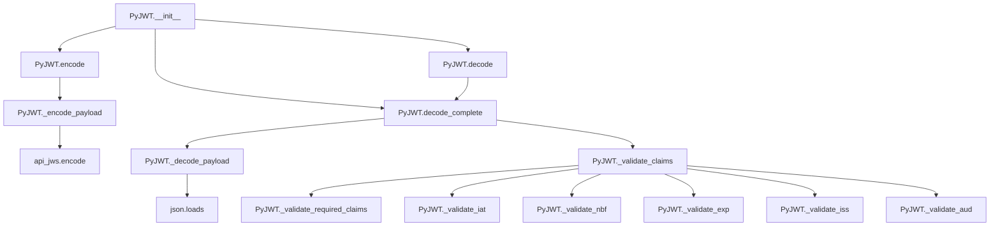

# `api_jwt.py`

## `jwt.api_jwt.PyJWT` · *class*

## Summary:
Provides core JWT encoding and decoding functionality with configurable validation options.

## Description:
The PyJWT class serves as the primary interface for creating and validating JSON Web Tokens. It handles both encoding payloads into JWT format and decoding JWT tokens while applying various security validations. The class allows customization of validation behavior through configurable options, making it flexible for different security requirements. It is typically instantiated once and reused for multiple JWT operations.

## State:
- options: dict[str, Any] - Configuration dictionary containing validation settings with default values:
  - verify_signature: bool - Whether to verify the token signature (default: True)
  - verify_exp: bool - Whether to verify expiration time (default: True)
  - verify_nbf: bool - Whether to verify not-before time (default: True)
  - verify_iat: bool - Whether to verify issued-at time (default: True)
  - verify_aud: bool - Whether to verify audience claim (default: True)
  - verify_iss: bool - Whether to verify issuer claim (default: True)
  - require: list[str] - List of required claims (default: [])

## Lifecycle:
Creation: Instantiate with optional configuration options dictionary that merges with default options provided by `_get_default_options()`
Usage: Call encode() to create JWT tokens or decode() to validate and extract payloads
Destruction: No special cleanup required; uses standard Python garbage collection

## Method Map:


## Raises:
- TypeError: When payload is not a dictionary in encode() method
- DecodeError: When JWT decoding fails due to invalid format or structure
- ExpiredSignatureError: When token expiration time has passed
- ImmatureSignatureError: When token is not yet valid (issued or not-before time in future)
- InvalidAudienceError: When audience validation fails
- InvalidIssuedAtError: When issued-at claim is not an integer
- InvalidIssuerError: When issuer validation fails
- MissingRequiredClaimError: When required claims are missing

## Example:
```python
# Create JWT instance with custom options
jwt = PyJWT({"verify_exp": False})  # Disable expiration verification

# Encode a payload
payload = {"sub": "1234567890", "name": "John Doe", "iat": 1516239022}
token = jwt.encode(payload, "secret-key", algorithm="HS256")

# Decode and validate token
decoded = jwt.decode(token, "secret-key", algorithms=["HS256"])
print(decoded)  # {"sub": "1234567890", "name": "John Doe", "iat": 1516239022}

# Decode with complete information including headers
complete_info = jwt.decode_complete(token, "secret-key", algorithms=["HS256"])
print(complete_info["payload"])  # The decoded payload
print(complete_info["header"])   # The decoded header
```

### `jwt.api_jwt.PyJWT.__init__` · *method*

## Summary:
Initializes a PyJWT instance with configurable verification options, merging default settings with user-provided configurations.

## Description:
Configures the PyJWT instance with verification options that control which JWT claims are validated during decode operations. This method establishes the default verification behavior by combining built-in default options with any custom options provided by the caller.

The initialization process ensures that all verification settings are properly configured before any JWT encoding or decoding operations are performed. This approach centralizes option management and provides a consistent baseline for JWT validation behavior.

Known callers:
- PyJWT.__init__() - Called during object instantiation to configure verification settings
- PyJWT.decode_complete() - Called internally to ensure proper default verification behavior when options are merged

This method exists as a dedicated initialization routine rather than being inlined because it encapsulates the logic for option merging and validation, ensuring consistent setup across all instances and providing a clear separation between object creation and configuration.

## Args:
    options (dict[str, Any] | None): Optional dictionary of verification options to override defaults. When None, uses default options from _get_default_options(). Keys typically include verification flags like 'verify_exp', 'verify_nbf', 'verify_iat', 'verify_aud', 'verify_iss', and 'require' for required claims.

## Returns:
    None: This method does not return a value.

## Raises:
    None: This method does not explicitly raise exceptions.

## State Changes:
    Attributes READ: None
    Attributes WRITTEN: 
        - self.options: dict[str, Any] - Stores the merged configuration dictionary containing both default and user-provided options

## Constraints:
    Preconditions: 
        - The options parameter, if provided, must be a dictionary or None
        - All keys in the options dictionary must be valid configuration keys recognized by the JWT verification system
    
    Postconditions:
        - self.options is always initialized as a dictionary
        - self.options contains all default options merged with any user-provided overrides
        - The resulting dictionary maintains the expected structure for JWT verification

## Side Effects:
    None: This method performs no I/O operations, external service calls, or mutations to objects outside the instance.

### `jwt.api_jwt.PyJWT._get_default_options` · *method*

## Summary:
Returns a dictionary of default verification options for JWT decoding operations.

## Description:
Provides the default configuration for JWT verification settings used by the PyJWT class. This method centralizes the default verification options to ensure consistent behavior across all decoding operations while allowing customization through the options parameter.

The returned dictionary contains boolean flags indicating which JWT claims should be verified (exp, nbf, iat, aud, iss) and a list of required claims that must be present in the token payload.

Known callers:
- `PyJWT.__init__()` - Called to establish default options for the instance
- `PyJWT.decode_complete()` - Called to ensure proper default verification behavior when options are merged

This method exists as a separate utility to avoid code duplication and provide a single source of truth for default JWT verification options.

## Returns:
    dict[str, bool | list[str]]: A dictionary containing:
        - "verify_signature" (bool): Whether to verify the JWT signature, defaults to True
        - "verify_exp" (bool): Whether to verify the expiration time claim (exp), defaults to True
        - "verify_nbf" (bool): Whether to verify the not-before time claim (nbf), defaults to True
        - "verify_iat" (bool): Whether to verify the issued-at time claim (iat), defaults to True
        - "verify_aud" (bool): Whether to verify the audience claim (aud), defaults to True
        - "verify_iss" (bool): Whether to verify the issuer claim (iss), defaults to True
        - "require" (list[str]): List of required claims that must be present in the payload, defaults to empty list

## State Changes:
    Attributes READ: None
    Attributes WRITTEN: None

## Constraints:
    Preconditions: None
    Postconditions: Always returns a dictionary with the exact same structure and default values

## Side Effects:
    None: This method performs no I/O operations, external service calls, or mutations to objects outside its scope.

### `jwt.api_jwt.PyJWT.encode` · *method*

## Summary:
Encodes a JWT payload dictionary into a signed token string using the specified key and algorithm.

## Description:
Converts a dictionary payload into a JWT token string by serializing the payload, converting datetime claims to Unix timestamps, and signing the result with the provided key using the specified algorithm. This method is the primary interface for creating JWT tokens in the PyJWT library.

## Args:
    payload (dict[str, Any]): The payload dictionary containing claims to be encoded into the JWT. Must be a dictionary object.
    key (AllowedPrivateKeys | str | bytes): The secret key or private key used for signing the JWT. Type depends on the selected algorithm.
    algorithm (str | None, optional): The signing algorithm to use. Defaults to "HS256". 
    headers (dict[str, Any] | None, optional): Optional header claims to include in the JWT header. Defaults to None.
    json_encoder (type[json.JSONEncoder] | None, optional): Custom JSON encoder class for handling special object types in the payload. Defaults to None.
    sort_headers (bool, optional): Whether to sort headers alphabetically. Defaults to True.

## Returns:
    str: A JWT token string in the format "header.payload.signature".

## Raises:
    TypeError: If the payload is not a dictionary object.

## State Changes:
    Attributes READ: None
    Attributes WRITTEN: None

## Constraints:
    Preconditions:
    - The payload must be a dictionary object
    - Time claims (exp, iat, nbf) in the payload, if present, must be datetime objects that can be converted to Unix timestamps
    - The key must be compatible with the specified algorithm
    - The algorithm must be supported by the library
    
    Postconditions:
    - Returns a properly formatted JWT token string
    - The payload is safely copied to avoid modification of the original dictionary
    - Time claims are converted to Unix timestamp integers

## Side Effects:
    None

### `jwt.api_jwt.PyJWT._encode_payload` · *method*

## Summary:
Converts a payload dictionary into a compact JSON-encoded byte string for JWT serialization.

## Description:
Serializes the provided payload dictionary into a JSON string with minimal whitespace formatting, then encodes it as UTF-8 bytes. This method is used internally by the JWT encoding process to prepare the payload portion before signing.

## Args:
    payload (dict[str, Any]): The payload dictionary to serialize
    headers (dict[str, Any] | None): Optional headers dictionary (not used in serialization but passed for consistency)
    json_encoder (type[json.JSONEncoder] | None): Optional custom JSON encoder class for handling special object types

## Returns:
    bytes: The JSON-encoded payload as UTF-8 bytes with compact formatting (no extra whitespace)

## Raises:
    None explicitly raised

## State Changes:
    Attributes READ: None
    Attributes WRITTEN: None

## Constraints:
    Preconditions: 
    - payload must be a dictionary
    - headers parameter is accepted but not used in the serialization logic
    - json_encoder, if provided, must be a valid JSONEncoder subclass
    
    Postconditions:
    - Returns bytes representing the compact JSON serialization of the payload
    - The returned bytes are suitable for use in JWT signing operations

## Side Effects:
    None

### `jwt.api_jwt.PyJWT.decode_complete` · *method*

## Summary:
Decodes a JWT token and returns complete decoded information including payload and validated claims.

## Description:
This method performs full decoding of a JWT token, extracting the header, payload, and signature components while applying comprehensive validation to the claims contained in the payload. It serves as the primary interface for JWT decoding with complete validation capabilities.

The method handles deprecation warnings for legacy parameters, manages verification options, and integrates both class-level and method-level validation configurations. It's designed to be called internally by the `decode` method, but can also be used directly when complete decoded information is required.

## Args:
    jwt (str | bytes): The JWT token string or bytes to decode
    key (AllowedPublicKeys | str | bytes): The key used for signature verification, defaults to empty string
    algorithms (list[str] | None): List of allowed algorithms for signature verification, required when verifying signatures
    options (dict[str, Any] | None): Dictionary of verification options, defaults to None
    verify (bool | None): Deprecated parameter for signature verification, defaults to None
    detached_payload (bytes | None): Detached payload for signature verification, defaults to None
    audience (str | Iterable[str] | None): Expected audience value(s) for validation, defaults to None
    issuer (str | None): Expected issuer value for validation, defaults to None
    leeway (float | timedelta): Time tolerance for timestamp comparisons, defaults to 0
    **kwargs (Any): Deprecated keyword arguments that will be removed in version 3

## Returns:
    dict[str, Any]: A dictionary containing all decoded JWT components including:
        - header: The decoded header as a dictionary
        - payload: The decoded payload as a dictionary
        - signature: The signature bytes
        - alg: The algorithm used for signing

## Raises:
    DecodeError: When the JWT token is malformed or signature verification fails
    ExpiredSignatureError: When the token's expiration time has passed
    ImmatureSignatureError: When the token is not yet valid (issued in the future)
    InvalidAudienceError: When the audience claim doesn't match expectations
    InvalidIssuerError: When the issuer claim doesn't match expectations
    MissingRequiredClaimError: When required claims are missing from the payload
    TypeError: When audience parameter is not a string, iterable, or None

## State Changes:
    Attributes READ: self.options
    Attributes WRITTEN: None

## Constraints:
    Preconditions:
        - If signature verification is enabled, algorithms must be provided
        - The jwt parameter must be a valid JWT token string or bytes
        - If audience is provided, it must be a string, iterable, or None
        - leeway must be a float or timedelta object
        
    Postconditions:
        - Returns a dictionary with complete decoded JWT information
        - All claims in the payload are validated according to the provided options
        - The payload is properly parsed as a JSON object

## Side Effects:
    None: This method performs no I/O operations or external service calls

### `jwt.api_jwt.PyJWT._decode_payload` · *method*

## Summary:
Parses and validates the JSON payload from a decoded JWT token.

## Description:
Extracts and deserializes the payload portion of a decoded JWT token, ensuring it is a valid JSON object. This method serves as a utility for processing JWT payloads during decoding operations.

## Args:
    decoded (dict[str, Any]): A dictionary containing the decoded JWT components, specifically with a "payload" key holding the JSON-encoded payload string.

## Returns:
    dict[str, Any]: The parsed JSON payload as a Python dictionary.

## Raises:
    DecodeError: If the payload string is not valid JSON or if the parsed result is not a dictionary object.

## State Changes:
    Attributes READ: None
    Attributes WRITTEN: None

## Constraints:
    Preconditions: The decoded parameter must be a dictionary containing a "payload" key with a string value representing valid JSON.
    Postconditions: The returned value is always a dictionary object representing the parsed JSON payload.

## Side Effects:
    None

### `jwt.api_jwt.PyJWT.decode` · *method*

## Summary:
Decodes a JWT token and returns only the payload portion after performing signature verification and claim validation.

## Description:
This method decodes a JSON Web Token (JWT) and extracts the payload portion after validating the token's signature and claims. It serves as a convenience method that wraps the more comprehensive `decode_complete` method, returning only the payload data while handling all verification steps internally. This method is commonly used in authentication flows where only the token's payload (such as user identity or permissions) is needed.

The method performs signature verification by default and validates standard JWT claims including expiration time, issued-at time, and not-before time. It also validates audience and issuer claims when specified.

## Args:
    jwt (str | bytes): The JWT token to decode, either as a string or bytes object
    key (AllowedPublicKeys | str | bytes): The key used for signature verification, defaults to empty string
    algorithms (list[str] | None): List of allowed algorithms for signature verification, required when verify_signature option is enabled
    options (dict[str, Any] | None): Dictionary of options that override default behavior, defaults to None
    verify (bool | None): Deprecated flag for signature verification, use options instead
    detached_payload (bytes | None): The detached payload when b64 header is set to false, required in such cases
    audience (str | Iterable[str] | None): Expected audience claim for validation
    issuer (str | None): Expected issuer claim for validation
    leeway (float | timedelta): Acceptable time difference in seconds for time-based claims
    **kwargs (Any): Additional keyword arguments (deprecated since version 3.0)

## Returns:
    Any: The decoded payload portion of the JWT token, typically a dictionary containing claims

## Raises:
    DecodeError: When the JWT token is malformed or contains invalid segments
    ExpiredSignatureError: When the token has expired (exp claim)
    ImmatureSignatureError: When the token is not yet valid (nbf/iat claims)
    InvalidAudienceError: When the audience claim doesn't match expectations
    InvalidIssuerError: When the issuer claim doesn't match expectations
    MissingRequiredClaimError: When required claims are missing from the token
    InvalidIssuedAtError: When the issued-at claim is invalid

## State Changes:
    Attributes READ: self.options
    Attributes WRITTEN: None

## Constraints:
    Preconditions:
        - The jwt parameter must be either a string or bytes object
        - If signature verification is enabled, algorithms must be provided
        - If header.b64 is False, detached_payload must be provided
    Postconditions:
        - Returns the payload portion of the JWT as a parsed JSON object
        - All standard JWT claims are validated according to options and parameters

## Side Effects:
    None: This method performs no I/O operations or external service calls. It only processes the provided JWT token and returns its payload.

### `jwt.api_jwt.PyJWT._validate_claims` · *method*

## Summary:
Validates JWT claims including expiration, not-before, issued-at, issuer, and audience against provided options and parameters.

## Description:
This method serves as the primary validation entry point for JWT claims. It processes the leeway parameter, validates audience type, and delegates to specialized validation methods for each claim type. The method ensures that JWT tokens meet their specified security requirements based on the provided validation options.

This method is called during the JWT decoding process to verify that the token's claims are valid according to the specified criteria. It's separated from inline validation logic to provide a clean, modular approach to JWT claim validation.

## Args:
    payload (dict[str, Any]): The decoded JWT payload containing claims to validate
    options (dict[str, Any]): Validation configuration options including verification flags
    audience (str, Iterable, or None): Expected audience value(s) for validation
    issuer (str or None): Expected issuer value for validation
    leeway (float or timedelta): Time tolerance for timestamp comparisons, defaults to 0

## Returns:
    None: This method performs validation checks and raises exceptions on failure

## Raises:
    TypeError: When audience parameter is not a string, iterable, or None

## State Changes:
    Attributes READ: None - this method only reads from parameters
    Attributes WRITTEN: None - this method doesn't modify instance state

## Constraints:
    Preconditions:
        - payload must be a dictionary containing JWT claims
        - options must be a dictionary with verification flags
        - audience, if provided, must be a string, iterable, or None
        - leeway must be a float or timedelta object
    
    Postconditions:
        - All applicable claims in payload are validated according to options
        - Appropriate exceptions are raised for invalid claims by delegated validation methods

## Side Effects:
    None: This method performs no I/O operations or external service calls

### `jwt.api_jwt.PyJWT._validate_required_claims` · *method*

## Summary:
Validates that all required claims specified in the options are present in the JWT payload.

## Description:
This method checks if all claims listed in the `options["require"]` list are present in the JWT payload. It's called during the JWT validation process to ensure that tokens contain all mandatory claims required by the application. This validation occurs as part of the broader claim validation performed by `_validate_claims`.

The method is separated from inline validation logic to provide a clean, modular approach to JWT claim validation, making it easier to extend or modify the validation behavior for required claims independently.

## Args:
    payload (dict[str, Any]): The decoded JWT payload containing claims to validate
    options (dict[str, Any]): Validation configuration options including the "require" key which contains a list of required claim names

## Returns:
    None: This method performs validation checks and raises exceptions on failure

## Raises:
    MissingRequiredClaimError: When any claim listed in options["require"] is missing from the payload

## State Changes:
    Attributes READ: None - this method only reads from parameters
    Attributes WRITTEN: None - this method doesn't modify instance state

## Constraints:
    Preconditions:
        - payload must be a dictionary containing JWT claims
        - options must be a dictionary with a "require" key containing a list of claim names
        - The "require" list should contain valid claim names as strings
    
    Postconditions:
        - All required claims specified in options["require"] are present in the payload
        - Method returns normally if all required claims are present
        - Method raises MissingRequiredClaimError if any required claim is missing

## Side Effects:
    None: This method performs no I/O operations or external service calls

### `jwt.api_jwt.PyJWT._validate_iat` · *method*

## Summary:
Validates that the issued-at timestamp in a JWT payload is not in the future, accounting for clock skew tolerance.

## Description:
This method performs validation on the 'iat' (issued at) claim of a JWT payload to ensure the token was issued at a valid time. It checks that the timestamp is an integer and that it's not later than the current time plus a configurable leeway period, which accounts for potential clock differences between systems.

The method is called during the JWT decoding process as part of the claim validation phase, specifically when the 'verify_iat' option is enabled in the decoding configuration.

## Args:
    payload (dict[str, Any]): The decoded JWT payload containing the 'iat' claim to validate
    now (float): The current Unix timestamp to compare against the iat value
    leeway (float): The number of seconds of clock skew tolerance allowed

## Returns:
    None: This method does not return a value but raises exceptions on validation failure

## Raises:
    InvalidIssuedAtError: When the 'iat' claim cannot be converted to an integer
    ImmatureSignatureError: When the 'iat' timestamp is later than (now + leeway), indicating the token hasn't been issued yet

## State Changes:
    Attributes READ: None - this method only reads from the payload parameter
    Attributes WRITTEN: None - this method does not modify any instance attributes

## Constraints:
    Preconditions:
        - The payload dictionary must contain the 'iat' key
        - The 'iat' value must be convertible to an integer
        - The 'now' parameter must be a valid Unix timestamp
        - The 'leeway' parameter must be a non-negative number
    Postconditions:
        - If validation passes, the method completes normally
        - If validation fails, an appropriate exception is raised

## Side Effects:
    None: This method performs no I/O operations or external service calls. It only performs validation calculations.

### `jwt.api_jwt.PyJWT._validate_nbf` · *method*

## Summary:
Validates the Not Before claim in a JWT payload against the current time with leeway allowance.

## Description:
Checks that the token's Not Before (nbf) timestamp is not in the future, allowing for a configurable leeway period. This method is part of the JWT validation process and is called during token decoding when the verify_nbf option is enabled.

## Args:
    payload (dict[str, Any]): The decoded JWT payload containing the 'nbf' claim
    now (float): Current timestamp for comparison
    leeway (float): Time in seconds to allow for clock skew

## Returns:
    None: This method does not return a value but raises exceptions on validation failure

## Raises:
    DecodeError: When the 'nbf' claim is not an integer
    ImmatureSignatureError: When the token's Not Before timestamp is in the future (beyond current time plus leeway)

## State Changes:
    Attributes READ: None
    Attributes WRITTEN: None

## Constraints:
    Preconditions:
        - The payload dictionary must contain an 'nbf' key
        - The 'nbf' value must be convertible to an integer
        - The 'now' parameter must be a valid timestamp
        - The 'leeway' parameter must be a non-negative number
    
    Postconditions:
        - If validation passes, the token's Not Before claim is valid
        - If validation fails, an appropriate exception is raised

## Side Effects:
    None: This method performs no I/O operations or external service calls

### `jwt.api_jwt.PyJWT._validate_exp` · *method*

## Summary:
Validates that a JWT token has not expired by checking the expiration time claim against the current time with leeway allowance.

## Description:
This method performs expiration time validation for JWT tokens. It extracts the "exp" (expiration time) claim from the payload, verifies it's an integer, and ensures it hasn't passed the current time (accounting for a configurable leeway period). This validation occurs as part of the standard JWT claim validation process during token decoding.

## Args:
    payload (dict[str, Any]): The decoded JWT payload containing claims
    now (float): Current timestamp for comparison
    leeway (float): Time in seconds to allow for clock skew or early expiration

## Returns:
    None: This method does not return a value but raises exceptions on validation failure

## Raises:
    DecodeError: When the "exp" claim is not an integer
    ExpiredSignatureError: When the token's expiration time has passed (within leeway)

## State Changes:
    Attributes READ: None - this method only reads from parameters
    Attributes WRITTEN: None - this method does not modify instance state

## Constraints:
    Preconditions:
        - The payload dictionary must contain an "exp" key
        - The "exp" value must be convertible to an integer
        - The now parameter must be a valid timestamp
        - The leeway parameter must be a non-negative number
    
    Postconditions:
        - If validation passes, the token is considered valid regarding expiration
        - If validation fails, an appropriate exception is raised

## Side Effects:
    None: This method performs no I/O operations or external service calls

### `jwt.api_jwt.PyJWT._validate_aud` · *method*

## Summary:
Validates audience claims in a JWT payload against expected audience values.

## Description:
Performs validation of the 'aud' claim in a JWT payload, ensuring it matches the expected audience value(s). This method supports both strict and non-strict validation modes and handles various edge cases in audience claim formats.

## Args:
    payload (dict[str, Any]): The decoded JWT payload containing the 'aud' claim to validate
    audience (str | Iterable[str] | None): The expected audience value(s) to match against the payload's 'aud' claim
    strict (bool): When True, enforces strict validation rules including exact string matching and format validation

## Returns:
    None: This method does not return a value but raises exceptions on validation failure

## Raises:
    InvalidAudienceError: Raised when audience validation fails in either strict or non-strict mode
    MissingRequiredClaimError: Raised when the 'aud' claim is missing from the payload but audience is required

## State Changes:
    Attributes READ: None - this method only reads from parameters
    Attributes WRITTEN: None - this method does not modify any instance attributes

## Constraints:
    Preconditions:
        - The payload parameter must be a dictionary containing JWT claims
        - The audience parameter must be a string, iterable of strings, or None
        - In strict mode, both audience and audience_claims must be strings
    Postconditions:
        - Method returns successfully if audience validation passes
        - Method raises appropriate exception if validation fails

## Side Effects:
    None: This method performs no I/O operations or external service calls

### `jwt.api_jwt.PyJWT._validate_iss` · *method*

## Summary:
Validates that the issuer claim in a JWT payload matches the expected issuer value.

## Description:
This method performs validation of the 'iss' (issuer) claim in a JWT payload against an expected issuer value. It ensures that the token was issued by the expected party, which is a critical security check in JWT authentication flows. The method is called during the JWT decoding/validation process to verify issuer authenticity.

## Args:
    payload (dict[str, Any]): The decoded JWT payload containing claims
    issuer (Any): The expected issuer value to validate against

## Returns:
    None: This method does not return a value but raises exceptions on validation failure

## Raises:
    MissingRequiredClaimError: Raised when the 'iss' claim is missing from the payload
    InvalidIssuerError: Raised when the 'iss' claim value doesn't match the expected issuer

## State Changes:
    Attributes READ: None - this method only reads from parameters
    Attributes WRITTEN: None - this method doesn't modify any instance attributes

## Constraints:
    Preconditions:
        - The payload parameter must be a dictionary containing JWT claims
        - The issuer parameter can be any hashable type that can be compared with the payload's 'iss' claim
    Postconditions:
        - If validation passes, the method returns normally
        - If validation fails, an appropriate exception is raised

## Side Effects:
    None: This method performs no I/O operations or external service calls

