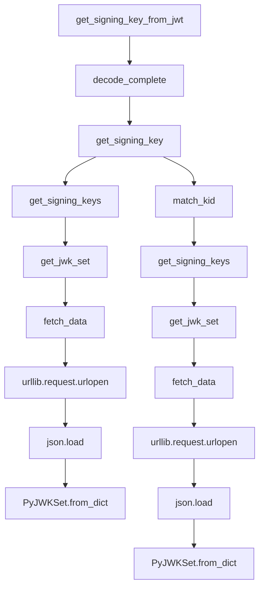

# `jwks_client.py`

## `jwt.jwks_client.PyJWKClient` · *class*

## Summary:
A client for fetching, caching, and managing JSON Web Key Sets (JWKS) used for JWT signature verification.

## Description:
The PyJWKClient class provides functionality to retrieve JSON Web Key Sets from a remote URI, cache them for performance, and extract signing keys for verifying JWT signatures. It handles HTTP communication, JSON parsing, caching strategies, and key matching based on Key IDs (kid) to support secure JWT validation workflows.

This class is designed as a distinct abstraction to encapsulate the complexity of JWKS retrieval and management, providing a clean interface for JWT verification operations while handling caching, error conditions, and key selection logic. It's commonly used in authentication systems that rely on JWT tokens signed with asymmetric keys.

## State:
- uri (str): The URI endpoint from which JWKS data is fetched
- jwk_set_cache (Optional[JWKSetCache]): Cache for storing previously fetched JWKS data, or None if caching is disabled
- headers (Dict[str, Any]): HTTP headers to include in requests to the JWKS endpoint
- timeout (int): HTTP request timeout in seconds (default: 30)
- ssl_context (Optional[SSLContext]): SSL context for secure connections, or None for default behavior
- get_signing_key (Callable): Method for retrieving signing keys, optionally wrapped with LRU cache for performance when cache_keys=True is specified during initialization

## Lifecycle:
- Creation: Instantiate with a URI and optional caching parameters
- Usage: Call methods like get_signing_key() or get_signing_key_from_jwt() to retrieve keys for JWT verification
- Destruction: No explicit cleanup required; relies on Python's garbage collection

## Method Map:


## Raises:
- PyJWKClientError: Raised when:
  - The JWKS endpoint returns invalid data (not a JSON object)
  - The lifespan parameter is not positive when caching is enabled
  - No suitable signing keys are found in the JWKS
- PyJWKClientConnectionError: Raised when HTTP requests fail due to:
  - Network connectivity issues
  - Timeouts
  - Other URL opening errors

## Example:
```python
from jwt.jwks_client import PyJWKClient

# Create client with caching enabled
client = PyJWKClient(
    uri="https://example.com/.well-known/jwks.json",
    cache_keys=True,
    max_cached_keys=32,
    cache_jwk_set=True,
    lifespan=600
)

# Get signing key for JWT verification using token header
token = "eyJhbGciOiJSUzI1NiIsInR5cCI6IkpXVCJ9..."
signing_key = client.get_signing_key_from_jwt(token)

# Or manually specify key ID
key_id = "specific-key-id"
signing_key = client.get_signing_key(key_id)

# Refresh cached data if needed
signing_key = client.get_signing_key(key_id, refresh=True)
```

### `jwt.jwks_client.PyJWKClient.__init__` · *method*

## Summary:
Initializes a PyJWKClient instance with configuration options for fetching and caching JSON Web Key Sets (JWKS) from a remote endpoint.

## Description:
Configures the client with connection parameters and caching strategies for retrieving signing keys from a JWKS endpoint. This method sets up internal state including URI, headers, timeout, SSL context, and caching mechanisms that will be used during subsequent key retrieval operations.

## Args:
    uri (str): The URL of the JWKS endpoint to fetch keys from
    cache_keys (bool): Whether to cache signing key lookups using LRU cache, defaults to False
    max_cached_keys (int): Maximum number of signing keys to cache when cache_keys=True, defaults to 16
    cache_jwk_set (bool): Whether to cache the entire JWKS, defaults to True
    lifespan (int): Cache lifespan in seconds for JWKS caching, defaults to 300 (5 minutes)
    headers (Optional[Dict[str, Any]]): HTTP headers to send with requests, defaults to None
    timeout (int): Request timeout in seconds, defaults to 30
    ssl_context (Optional[SSLContext]): SSL context for secure connections, defaults to None

## Returns:
    None: This method initializes the object's state and returns nothing

## Raises:
    PyJWKClientError: When cache_jwk_set is True and lifespan is less than or equal to zero

## State Changes:
    Attributes READ: None
    Attributes WRITTEN: self.uri, self.jwk_set_cache, self.headers, self.timeout, self.ssl_context

## Constraints:
    Preconditions: 
    - When cache_jwk_set=True, lifespan must be greater than 0
    - uri must be a valid string URL
    - headers, if provided, must be a dictionary-like object
    Postconditions:
    - self.uri is set to the provided uri parameter
    - self.jwk_set_cache is either a JWKSetCache instance or None
    - self.headers is a dictionary (defaulted to empty dict if None)
    - self.timeout is set to the provided timeout value
    - self.ssl_context is set to the provided SSL context or None

## Side Effects:
    None: This method performs no I/O operations or external service calls during initialization

### `jwt.jwks_client.PyJWKClient.fetch_data` · *method*

## Summary:
Fetches and parses JSON data from a configured URI, handling connection errors and optional caching of the result.

## Description:
Retrieves JSON-formatted data from the URI specified during object initialization. This method performs an HTTP GET request using urllib, parses the response as JSON, and returns the parsed data structure. It handles network-related exceptions by raising a PyJWKClientConnectionError and optionally caches the fetched data using the configured JWKSetCache instance.

## Args:
    None

## Returns:
    Any: The parsed JSON data from the URI, typically a dictionary containing JWK set information.

## Raises:
    PyJWKClientConnectionError: When the HTTP request fails due to network issues, timeouts, or URL resolution problems.

## State Changes:
    Attributes READ: self.uri, self.headers, self.timeout, self.ssl_context, self.jwk_set_cache
    Attributes WRITTEN: None

## Constraints:
    Preconditions: 
    - The object must be properly initialized with a valid URI
    - Network connectivity must be available for the HTTP request
    - The URI must return valid JSON data that can be parsed
    
    Postconditions:
    - If caching is enabled, the fetched data is stored in the cache
    - The returned data is a valid JSON object (dictionary)

## Side Effects:
    - Makes an external HTTP request to the configured URI
    - Performs I/O operations to read from the network response
    - May modify the internal JWKSetCache if caching is enabled

### `jwt.jwks_client.PyJWKClient.get_jwk_set` · *method*

## Summary:
Retrieves and returns a PyJWKSet instance containing JSON Web Keys, utilizing cached data when available and refreshing from the JWKS endpoint when requested.

## Description:
Fetches a JSON Web Key Set (JWKS) from the configured URI and converts it into a PyJWKSet object for key management. This method implements a caching strategy to avoid repeated network requests while providing the option to force a refresh from the source. The method ensures the retrieved data is a valid JSON object before constructing the key set.

The method is typically called during JWT verification workflows when public keys are needed to validate signatures. It serves as a central point for obtaining JWK sets and manages the caching layer transparently.

## Args:
    refresh (bool): When True, bypasses any cached data and forces a fresh fetch from the JWKS endpoint. When False (default), attempts to use cached data if available.

## Returns:
    PyJWKSet: A PyJWKSet instance containing the JSON Web Keys retrieved from the configured URI.

## Raises:
    PyJWKClientError: When the JWKS endpoint does not return a valid JSON object (i.e., not a dictionary), or when the key set contains no valid keys.

## State Changes:
    Attributes READ: self.jwk_set_cache, self.uri, self.headers, self.timeout, self.ssl_context
    Attributes WRITTEN: self.jwk_set_cache (when data is cached via fetch_data)

## Constraints:
    Preconditions:
    - The PyJWKClient instance must be properly initialized with a valid URI
    - Network connectivity must be available for HTTP requests when no cached data is available
    - The JWKS endpoint must return valid JSON data that can be parsed as a dictionary
    
    Postconditions:
    - Returns a valid PyJWKSet instance with at least one usable key
    - If caching is enabled, the fetched data is stored in the cache for future use

## Side Effects:
    - Makes an external HTTP request to the configured URI when no cached data is available or refresh is True
    - Performs I/O operations to read from the network response
    - May modify the internal JWKSetCache if caching is enabled

### `jwt.jwks_client.PyJWKClient.get_signing_keys` · *method*

## Summary:
Retrieves a list of signing keys from the JWKS endpoint, filtering for keys suitable for signature verification.

## Description:
Fetches the JSON Web Key Set from the configured JWKS endpoint and filters the keys to return only those that can be used for signature verification. This method ensures that only keys with proper key usage indicators and identifiers are returned for security purposes.

The method calls `get_jwk_set()` internally to retrieve the latest key set, then applies filtering logic to select only keys where `public_key_use` is either "sig" or None, and where `key_id` is present. This filtering ensures that only valid signing keys are returned.

## Args:
    refresh (bool): Whether to force a refresh of the cached JWK set. Defaults to False.

## Returns:
    List[PyJWK]: A list of PyJWK objects that represent valid signing keys from the JWKS endpoint.

## Raises:
    PyJWKClientError: When the JWKS endpoint does not contain any keys suitable for signing operations.

## State Changes:
    Attributes READ: self.get_jwk_set
    Attributes WRITTEN: None

## Constraints:
    Preconditions: The JWKS endpoint must be accessible and return valid JSON Web Key Set data.
    Postconditions: Returns a non-empty list of PyJWK objects with valid key IDs and appropriate key usage indicators.

## Side Effects:
    I/O: Makes HTTP requests to the configured JWKS endpoint when refresh is True or when no cached data exists.
    External service calls: Communicates with the remote JWKS endpoint to fetch key data.

### `jwt.jwks_client.PyJWKClient.get_signing_key` · *method*

## Summary:
Retrieves a signing key from the JWKS endpoint by its key ID, refreshing the key cache if necessary.

## Description:
This method attempts to find a signing key in the cached or fetched JWKS (JSON Web Key Set) that matches the provided key ID. If the key is not found in the initial cache, it will refresh the cache and try again. This method is essential for JWT verification operations where the signing key needs to be retrieved by its identifier.

## Args:
    kid (str): The key ID (kid) of the signing key to retrieve

## Returns:
    PyJWK: The signing key object that matches the provided key ID

## Raises:
    PyJWKClientError: When unable to find a signing key that matches the provided key ID after attempting to refresh the key set

## State Changes:
    Attributes READ: self.uri, self.jwk_set_cache, self.headers, self.timeout, self.ssl_context
    Attributes WRITTEN: None

## Constraints:
    Preconditions: The PyJWKClient instance must be properly initialized with a valid URI and configuration
    Postconditions: Either returns a valid PyJWK object or raises PyJWKClientError

## Side Effects:
    Makes HTTP requests to the configured URI to fetch JWKS data when keys are not cached or when refreshing
    May update internal caches when fetching new key sets

### `jwt.jwks_client.PyJWKClient.get_signing_key_from_jwt` · *method*

## Summary:
Extracts and returns the signing key from a JWT token by identifying the key ID in the token header and retrieving the corresponding key from the key set.

## Description:
This method decodes a JWT token without signature verification to extract the header information, specifically the key ID (kid) field. It then retrieves the corresponding signing key from the client's key set using the identified key ID. This method is typically used in JWT validation workflows where the correct signing key needs to be identified before signature verification can occur.

## Args:
    token (str): A JSON Web Token string to extract the signing key from

## Returns:
    PyJWK: The signing key corresponding to the key ID found in the JWT header

## Raises:
    PyJWKClientError: If the key ID cannot be found in the key set
    PyJWKClientConnectionError: If there are connection issues when retrieving keys from remote endpoints
    Exception: Other exceptions that may arise from token decoding or key retrieval operations

## State Changes:
    Attributes READ: None
    Attributes WRITTEN: None

## Constraints:
    Preconditions: The token must be a valid JWT format with a header containing a kid field
    Postconditions: Returns a valid PyJWK object that can be used for signature verification

## Side Effects:
    I/O: May trigger network requests if keys need to be fetched from remote endpoints
    External service calls: If the key set cache requires refreshing or fetching from remote URLs

### `jwt.jwks_client.PyJWKClient.match_kid` · *method*

## Summary:
Finds and returns a signing key from a list that matches the specified key ID.

## Description:
This static method searches through a collection of PyJWK objects to locate a key with a matching key ID. It's used internally by the PyJWKClient class to efficiently retrieve signing keys by their unique identifier. The method performs a linear search through the provided list and returns the first key whose key_id attribute matches the requested identifier.

## Args:
    signing_keys (List[PyJWK]): A list of PyJWK objects to search through
    kid (str): The key ID to match against the key's key_id attribute

## Returns:
    Optional[PyJWK]: The matching PyJWK object if found, or None if no match is found

## Raises:
    None explicitly raised

## State Changes:
    None - This is a pure function that doesn't modify any object state

## Constraints:
    Preconditions:
    - signing_keys parameter must be a list of PyJWK objects
    - kid parameter must be a string
    - Each PyJWK object in signing_keys must have a valid key_id attribute
    
    Postconditions:
    - Returns either a PyJWK object with matching key_id or None
    - Does not modify the input list or any of the PyJWK objects

## Side Effects:
    None - This method performs no I/O operations or external service calls

